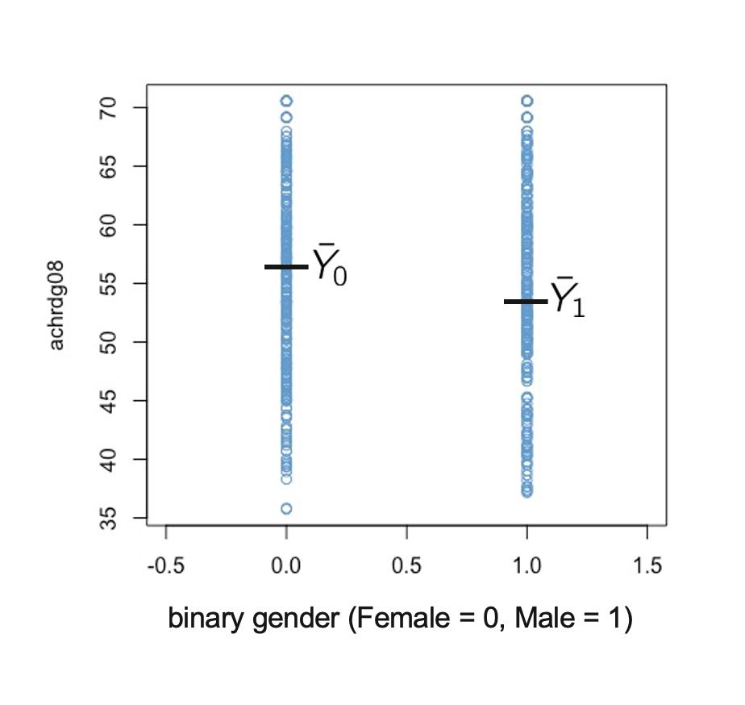

#  Categorical Predictors {#chapter-5}

```{r, echo = F}
button <-  "position: relative; 
            top: -25px; 
            left: 85%;   
            color: white;
            font-weight: bold;
            background: #4B9CD3;
            border: 1px #3079ED solid;
            box-shadow: inset 0 1px 0 #80B0FB"
```


So far we have considered examples in which we regress a continuous outcome variable (e.g., Math Achievement) on one or more continuous predictors (SES, Approaches to Learning). In this chapter we consider how regression can be used with categorical predictors. 

In an experimental context, the canonical example of a categorical predictor is treatment status (e.g.,  1 = treatment group, 0 = control group). Examples of other categorical predictors commonly used in education research include 

* Geographical region / school district  (Orange, CH-C, Wake, …)
* Type of school (public, private, charter, religious)
* Which classroom, teacher, or school a student was assigned to
* Gender (if recorded as categorical)
* Race  / ethnicity (if recorded as categorical) 
* Free / reduced price lunch status 
* ELL status
* ILP status
* ...


This chapter will focus on the topic of "contrast coding" (also called "effect coding" or "dummy coding"). In particular, we will 

* Address the special case of a single binary predictor

* Show some ways that this approach generalizes to categorical predictors with more than 2 categories, specifically
  * reference group coding (called treatment contrasts in R) 
  * deviation coding (called sum contrasts in R). 

The main thing to know about the different approaches to contrast coding is that they each lead to a different interpretation of the coefficients in the regression model. In this chapter we will use a two-step procedure to work out how to interpret the coefficients in models with categorical predictors. we will apply two-step approach to the types of contrast coding listed above, and you can use the same approach to work out the interpretation of other contrasts that you may encounter in your research (there are many different contrasts out there!). 

Along the way we will see that regression includes as special cases the independent samples t-tests of means and one-way ANOVA procedure we discussed last semester. In the next chapter we will address how to combine categorical and continuous predictors in the same model. 

## Focus on interpretation 

```{r, echo=FALSE, results='asis'}
codefolder::bookdown(init = "hide", style = button)
```
Categorical predictors are challenging to understand, because, depending on the contrast coding used, the model results can appear quite different.

For example, the two models below uses the same data and the same variables (Math Achievement regressed on Urbanicity), but their regression coefficients have different values --  Why? Because Urbanicity used different contrast coding. 

The `lm` output doesn’t tell us what kind of coding was used for our categorical variables – we need to know what is going on “under the hood” so that we can interpret the output correctly. 

Notice that nothing has changed with respect to the computation of standard errors, R-squared, t-tests, F-tests, or p-values -- all of this is the same as the previous chapters. The difference between these two models is just how the categorical predictor is interpreted. 


```{r}
load("NELS.RData")
#attach(NELS)

# run model with default contrast (treatment / dummy coding)
egA <- lm(achrdg08 ~ urban)

# change to sum / deviation contrasts and run again
contrasts(urban) <- contr.sum(n = 3)
colnames(contrasts(urban)) <- c("Rural", "Suburban")
egB <- lm(achrdg08 ~ urban)

# print
summary(egA)
summary(egB)
```

## Data and social constructs
Before getting into the math, let's consider some conceptual points. 

First, some terminology. *Binary* means the a variable can take on only two values: 1 and 0. If a variable takes on two values but these are represented with other numbers (e.g., 1 and 2) or with non-numeric values ("male", "female"), it is called *dichotomous* rather than binary. Otherwise stated, a binary variable is a dichotomous variable whose values are 1 and 0. 

Note that encoding a variable as dichotomous does not imply that the underlying social construct is dichotomous. For example, we can encode educational attainment as a dichotomous variable indicating whether a person has graduated high school or not. This does not imply that educational attainment has only two values in real life, or even that educational attainment is best conceptualized in terms of years of formal education. Nonetheless, for many outcomes of interest it can be meaningful to consider whether individuals have completed high school (e.g., https://www.ssa.gov/policy/docs/research-summaries/education-earnings.html)

In general, the way that a variable is encoded in a dataset is not a statement about reality -- it reflects a choice made by researchers about how to represent reality. In particular, we are often we are faced with less-than-ideal encodings of so-called demographic variables in quantitative data. For example, both NELS and ECLS conceptualize gender as dichotomous and use a limited set of categories for race. These representations are not well aligned with current literature on gender and racial identity. 

Nonetheless, I would argue that these categorical variables have utility, *especially* in the study of social inequality. Here is an example of why I think gender qua "male/female" is a flawed but important consideration in global education: https://www.unicef.org/education/girls-education.  

**Please take a moment to write down your thoughts on the tensions that arise when conceptualizing social constructs such as gender or race as categorical, and I will invite you to share you thoughts in class.**

## Binary predictors {#binary-predictors-5}

```{r, echo=FALSE, results='asis'}
codefolder::bookdown(init = "hide", style = button)
```

Let's start our interpretation of categorical predictors with the simplest case: a single binary predictor. 

Figure \@ref(fig:reading-on-gender-5) illustrates the regression of Reading Achievement in Grade 8 (`achrdg08`) on a binary encoding of Gender (female = 0, male = 1) using the NELS data. There isn't a lot going on the plot! However, we can see the conditional distributions of Reading Achievement for each value of Gender, and the means of the two groups are indicated. 

```{r reading-on-gender-5, fig.cap = 'Reading Achievement on Binary Gender.', fig.align = 'center'}

```

In this situation, the simple regression equation from Section \@ref(regression-line) still holds

\[ \widehat Y = b_0 + b_1 X, \]

but $X$ can only take on one of two values: 0 or 1. The question we want to answer is how to interpret the regression coefficients in this context. The general strategy for approaching this kind of problem has two steps: 

* *Step 1.* Plug the values for $X$ into the regression equation.

\begin{align}
\widehat Y (Female) & = b_0 + b_1 (0) = b_0 \\ 
\widehat Y (Male) & = b_0 + b_1 (1) = b_0 + b_1 
\end{align}

* *Step 2.* Solve for the model parameters in terms the predicted values. 

\begin{align}
b_0 & = \widehat Y (Female) (\#eq:binary1-5)\\ 
b_1 & = \widehat Y (Male) - b_0 = \widehat Y (Male) - \widehat Y (Female) (\#eq:binary2-5)
\end{align}

Looking at Equation \@ref(eq:binary1-5) we can conclude that intercept ($b_0$) is equal to the predicted value of Reading Achievement for Females, and Equation \@ref(eq:binary2-5) shows that the regression slope ($b_1$) is equal to the difference between predicted Reading Achievement for Males and Females. 

For a single categorical predictor, the predicted values for each category are just the group means on the $Y$ variable. So, using the notation of Figure \@ref(fig:reading-on-gender-5) we can re-write Equations \@ref(eq:binary1-5) and \@ref(eq:binary2-5) as

\begin{align}
b_0 & = \bar Y_0 (\#eq:binary3-5) \\ 
b_1 & = \bar Y_0 - \bar Y_1 (\#eq:binary4-5)
\end{align}

Note that we will use the equivalence between the predicted values for each category and the mean of the corresponding group throughout this chapter. This equivalence holds when there is only one categorical predictor in the model, and no other predictors. Additional predictors are discussed in the next chapter. 


For the example data, regression coefficients are: 


```{r} 
# convert "Female / Male" coding to binary
gender <- NELS$gender
binary_gender <- (gender == "Male")*1
mod_binary <- lm(achrdg08 ~ binary_gender)
coef(mod_binary)
```

**Please take a moment and write down how these two numbers are related to Figure \@ref(fig:reading-on-gender-5). In particular, what is $\bar Y_0$ equal to, what is $\bar Y_1$ equal to, and what is their difference equal to?**


### Relation with t-tests

Simple regression with a binary predictor is equivalent to conducting an independent samples t-test in which the $X$ variable (Gender) is the grouping variable and the $Y$ variable (Reading Achievement) is the outcome. The following output illustrates this. 


For the regression model: 
```{r}
summary(mod_binary)
```

For the independent samples t-test (with homogeneity of variance assumed): 
```{r}
t.test(achrdg08~binary_gender, var.equal = T)
```

Although the two functions produce different output, we can see that the pattern of values in the two sets of output corresponds to Equations \@ref(eq:binary3-5) and \@ref(eq:binary4-5). In particular, the t-value and p-value for `binary_gender` in the regression output is equivalent to the t-value and p-value in the two sample t-test (other than the sign of the t-value).  

**If you have any questions about the relation between these two sets of output, please note them now and be prepared ask them in class.**

<!-- derive the result that the hats equal the predicted values 
### Some math*
We have -->

### Summary

When doing regression with a binary predictor: 

* The intercept is equal to the mean of the group coded "0"

* The regression coefficient is equal to the mean difference between the groups

* Testing $H_0: b_1 = 0$ is equivalent to testing the mean difference $H_0: \mu_1 – \mu_0 = 0$
  * i.e., regression with a binary variable is the same as a t-test of means for independent groups

## Reference group coding

```{r, echo=FALSE, results='asis'}
codefolder::bookdown(init = "hide", style = button)
```


Now that we know how regression with a binary predictor works, let's consider how to extend this approach to categorical predictors with $C ≥ 2$ categories. There are many ways to do this, and the general topic is variously called "contrast coding", "effect coding", or "dummy coding".

The basic idea is to represent the $C$ categories of a predictor in terms of $C – 1$ dummy variables. Binary coding of a dichotomous predictor is one example of this: We represented a categorical variable with $C = 2$ categories using $1$ binary predictor. 

The most common approach to contrast coding is called *reference group* coding. In R, the approach is called *treatment contrasts* and is the default coding for categorical predictors. 

It is called reference group coding because:

* The researcher chooses a reference group
* The intercept is interpreted as the mean of the reference group 
* The $C – 1$ regression coefficients are interpreted as the mean differences between the $C – 1$ other groups and the reference group

Note that reference group coding is a generalization of binary coding. In the example from Section \@ref(binary-predictors-5):

* Females were the reference group 
* The intercept was equal to the mean Reading Achievement for females
* The regression coefficient was equal to the mean difference between males and females. 

The rest of this section considers how to generalize this approach to greater than 2 groups

### A hypothetical example
 
Figure \@ref(fig:martital-status1) presents a toy data example. The data show the Age and marital status (Mstatus) of 16 hypothetical individuals. Marital status is encoded as 

* Single (never married)
* Married
* Divorced


```{r martital-status1, fig.cap = 'Toy Martital Status Example.', fig.align = 'center'}
knitr::include_graphics("images/marital_status1.png")
```

These 3 categories are represented by two binary variables, denoted $X_1$ and $X_2$. 

* $X_1$ is a binary variable that is equal to 1 when Mstatus is equal to "married" and equal to 0 otherwise. 
* $X_2$ is a binary variable that is equal to 1 when Mstatus is equal to "divorced" and equal to 0 otherwise. 

The binary variables are often called *dummies* or *indicators*. For example, $X_1$ is a dummy or indicator for married respondents. 

In reference group coding, the group that does not have a dummy variable is the reference group. It is also the group that is coded zero on all of the included dummies. 

**What is the is reference group for this example? Please write down your answer and be prepared to share it in class.**

### Interpreting the regression parameters

Regressing Age on the dummies we have: 

\[ \widehat Y = b_0 + b_1 X_1 + b_2 X_2 \]

In order to interpret the regression coefficients we can use the same two steps as in Section \@ref(binary-predictors-5)

* *Step 1.* Plug the values for the $X$-variables into the regression equation.

\begin{align}
\widehat Y (Single) & = b_0 + b_1 (0) + b_2 (0) = b_0 \\
\widehat Y (Married) & = b_0 + b_1 (1) + b_2 (0) = b_0 + b_1 \\ 
\widehat Y (Divorced) & = b_0 + b_1 (0) + b_2 (1) = b_0 + b_2 
\end{align}

* *Step 2.* Solve for the model parameters in terms the predicted values. 

\begin{align}
b_0 & = \widehat Y (Single) \\ 
b_1 & = \widehat Y (Married) - b_0 = \widehat Y (Married) - \widehat Y (Single) \\ 
b_2 & = \widehat Y (Divorced) - b_0 = \widehat Y (Divorced) - \widehat Y (Single)
\end{align}

**Using the above equations, please write down an interpretation of the regression parameters for the hypothetical example. (Note: this question is not asking for a numerical answer, it is just asking you to put the above equations into words.)**

### $> 3$ categories

Figure \@ref(fig:martital-status1) extends the toy data example by adding another category for Mstatus ("widowed"). 

```{r martital-status2, fig.cap = 'Toy Martital Status Example, Part 2.', fig.align = 'center'}
knitr::include_graphics("images/marital_status2.png")
```

**Please work through the following questions and be prepared to share your answers in class**

* **How should $X_3$ be coded so that "single" is the reference group?** 
* **Using the two-step approach illustrated above, write out the interpretation of the model parameters in the following regression equation:**

\[ \widehat Y = b_0 + b_1 X_1 + b_2 X_2 + b_3 X_3  \]

* **Bonus: What would happen if we included dummies for all 4 categories of Mstatus in the model?** 

### Summary 

In reference group coding with a single categorical variable: 

* The reference is group is chosen by the analyst – it is the group that is coded zero on all dummies, or the one that has its dummy left out of the $C-1$ dummies used in the model.  

* The intercept is interpreted as the mean of the reference group.

* The regression coefficients of the dummy variables are interpreted as the difference between the mean of the indicated group and the mean of the reference group.

## Deviation coding

```{r, echo=FALSE, results='asis'}
codefolder::bookdown(init = "hide", style = button)
```

In some cases there is a clear reference group (e.g., in experimental conditions, comparisons are made to the control group). But in other cases, it is not so clear what the reference group should be. In both of the examples we have considered, the choice of reference group was arbitrary. 

In such cases it can be preferable to use different types of contrast coding that do not require a reference group. One approach to getting rid of the reference group is called *deviation coding*. In R this is called *sum-to-zero constrasts*, or sum contrasts for short. )

In deviation coding: 

* The intercept is equal to the mean of the predicted values for each category i.e, 

\begin{equation}
b_0 = \frac{\sum_{c=1}^C \widehat Y_c} {C} 
(\#eq:unweighted-mean)
\end{equation} 

* The regression coefficients compare each group to the intercept. 

The main difference compared to reference group coding is the interpretation of the intercept -- it is no longer an arbitrarily chosen reference group, but instead represents the mean of the predicted values. For a single predictor, this is equal to overall mean on $Y$, when the groups have equal sample size, $n$:

\begin{equation}
b_0 = \frac{\sum_{c=1}^C \widehat Y_c} {C} 
 = \frac{\sum_{c=1}^C \bar Y_c}{C} = \frac{\sum_{c=1}^C \left(\frac{\sum_{i=1}^n Y_{ic}}{n}\right)} {C} =  \frac{\sum_{c=1}^C \sum_{i=1}^n Y_{ic}}{nC} = \bar Y 
\end{equation}

So, when the groups have equal sample sizes, the intercept is equal to the overall mean $\bar Y$, and the regression coefficients are the deviation of each group mean from the overall mean. This is why it is called deviation coding. 

When the groups have unequal sample size, the situation is a bit more complicated. In particular, we have to weight the predicted values in Equation \@ref(eq:unweighted-mean) by the group sample sizes. This is addressed in \@ref(extra1-5) (optional). To clarify that intercept in deviation coding is not always equal to $\bar Y$, we refer to it as an "unweighted mean" of group means / predicted scores. 

Note that there are still only $C-1$ regression coefficients. So one group gets left out of the analysis, and the researcher has to chose which one. This is a shortcoming of deviation coding, which is addressed in the Section \@ref(extra2-5) (optional) 


### A hypothetical example

The International Development and Early Learning Assessment (IDELA) is an assessment designed to measure young children's development in literacy, numeracy, social-emotional, and motor domains, in international settings. Figure \@ref(fig:idela1) shows the countries in which the IDELA had been used as of 2017 (https://www.savethechildren.net/sites/default/files/libraries/GS_0.pdf.)


```{r idela1, fig.cap = 'IDELA Worldwide Usage, 2017.', fig.align = 'center'}
knitr::include_graphics("images/idela_map.png")
```

If our goal was to compare countries' IDELA scores, it would be difficult to agree on which country should serve as the reference group to which the others are compared. Therefore, it would be preferable to avoid the problem of choosing a reference group altogether. In particular, deviation coding let's us compare each country’s mean IDELA score to the (unweighted) mean over all of the countries. 

Figure \@ref(fig:idela2) presents a toy data example along the lines of Section \@ref(reference-group-coding). The data show the IDELA scores and Country for  16 hypothetical individuals. The countries considered in this example are 

* Ethiopia
* Vietnam
* Boliva

These 3 countries are represented by two binary variables, denoted $X_1$ and $X_2$. 

* $X_1$ is a dummy for Ethiopia
* $X_2$ is a dummy for Vietnam


```{r idela2, fig.cap = 'Toy IDELA Example.', fig.align = 'center'}
knitr::include_graphics("images/idela1.png")
```

Note that the dummy variables are different than for the case of reference coding discussed Section \@ref(reference-group-coding). In deviation coding, the dummies always take on values $1, 0, -1$. The same group must receive the code $-1$ for all dummies. The group with the value $-1$ is analogous to the reference group -- but rather than being the reference group, it is the group that gets left out of the analysis. 

### Interpreting the regression parameters

Regressing IDELA on the dummies we have: 

\[ \widehat Y = b_0 + b_1 X_1 + b_2 X_2 \]

In order to interpret the regression coefficients we proceed using the same two steps as in Section \@ref(binary-predictors-5) and Section \@ref(reference-group-coding)

* *Step 1.* Plug the values for the $X$-variables into the regression equation.

\begin{align}
\widehat Y (Ethiopia) & = b_0 + b_1 (1) + b_2 (0) = b_0 + b_1\\
\widehat Y (Vietnam) & = b_0 + b_1 (0) + b_2 (1) = b_0 + b_2 \\ 
\widehat Y (Bolivia) & = b_0 + b_1 (-1) + b_2 (-1) = b_0 - b_1 - b_2 
\end{align}

* *Step 2.* Solve for the model parameters in terms the predicted values. 

\begin{align}
b_1 &= \widehat Y (Ethiopia) - b_0 \\
b_2 &= \widehat Y (Vietnam) - b_0 \\ \\
b_0 & = \widehat Y (Bolivia) + b_1 + b_2 \\  
& = \widehat Y (Bolivia) + \widehat Y (Ethiopia) - b_0 + \widehat Y (Vietnam) - b_0 \\
\implies & \\ 
3b_0 & = \widehat Y (Bolivia) + \widehat Y (Ethiopia) + \widehat Y (Vietnam) \\

\implies & \\ 
b_0 & = \frac{\widehat Y (Bolivia) + \widehat Y (Ethiopia) + \widehat Y (Vietnam)}{3}
\end{align}

**Using the above equations, please write down an interpretation of the regression parameters for the hypothetical example. In particular, what do you think about using the unweighted mean of countries' predicted IDELA scores as the comparison point? Is this meaningful? Would another approach be better?**

### Summary

In deviation coding with a single categorical variable: 

* The intercept is interpreted as the unweighted mean of the groups' means, which is equal to the overall mean on the $Y$ variable when the groups have equal sample sizes. 

* The regression coefficients of the dummy variables are interpreted as the difference between the mean of the indicated group and the unweighted mean of the groups.

* There are still only $C - 1$ regression coefficients, so one group gets left out (see extra material for how to get around this).

### Extra: Deviation coding with unequal sample sizes* {#extra1-5}

When groups have unequal sample size, the unweighted mean of the group means is not the overall mean of the Y variable. This is not always a problem. For example, in the international comparisons example, it is reasonable (i.e., democratic) that each country should receive equal weight, even if the size of their populations differ.

However, if you want to compare each groups' mean to the overall mean on $Y$, deviation coding can be adjusted by replacing the $-1$ with the ratio of indicated group's sample size to the omitted group's sample size. An example for 3 groups is shown below. 

\[ \begin{matrix} & \text{Dummy 1}& \text{Dummy 2}\\ 
                   \text{Group 1} & 1 & 0  \\ 
                   \text{Group 2} & 0 & 1 \\
                  \text{Group 3}  & - n_1 /n_3 & - n_2 / n_3 \\
   \end{matrix} 
\]

You can use the 2-step procedure to show that this coding, called *weighted deviation coding*, results in 

\begin{equation}
b_0 = \frac{n_1 \widehat Y( \text{Group 1}) + n_2 \widehat Y( \text{Group 2}) + n_3 \widehat Y( \text{Group 3})}{n_1 + n_2 + n_3}
\end{equation}

Replacing $\widehat Y( \text{Group }c )$ with $\bar Y_c$ you can also show that $b_0 = \bar Y$, using the rules of summation algebra. Unlike the case for the unweighted mean of the group means, this relationship holds regardless of the sample sizes in the groups. 

### Extra: Deviation coding all groups included* {#extra2-5}

Another issue with deviation coding is that it requires leaving one group out of the model. This is a shortcoming of the approach. As a work around, one can instead use the following approach. Note that this approach will affect the value, statistical significance, and interpretation of R-squared, so you should only use it if you aren't interested in reporting R-squared. 

* Step A: Standardize the $Y$ variable to have M = 0 and SD = 1. 
* Step B: Compute binary dummy variables (reference group coding) for all $C$ groups, $X_1, X_2, \dots, X_C$ 
* Step C: Regress $Y$ on the dummy variables, without the intercept in the model

\[ \hat Y = b_1X_1 +  b_2 X_2 + \dots + b_cX_C. \]

It is easy to show that the regression coefficients are just the means of the indicated group. Since the overall mean of $Y$ is zero (see Step A), the group means can be interpreted as deviations from the overall mean on $Y$. 

Note that to the intercept in R, you can use the formula syntax 

`Y ~ -1 + X1 + ...` 

in the `lm` function. The `-1` removes the intercept from the model. Again, keep in mind that this will make the R-squared uninterpretable. 


## Workbook

## Exercises


