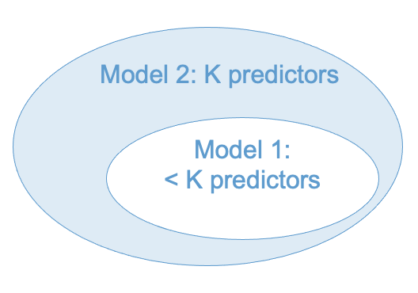
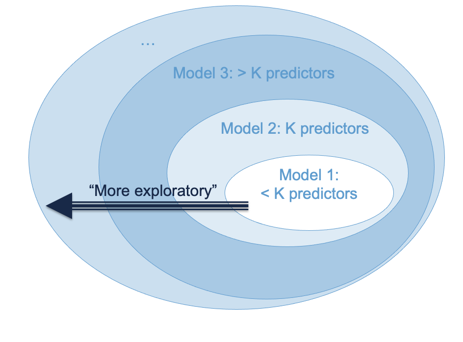

# Model Building {#chapter-7}

```{r, echo = F}
# Clean up check
rm(list = ls())
detach(NELS)

button <-  "position: relative; 
            top: -25px; 
            left: 85%;   
            color: white;
            font-weight: bold;
            background: #4B9CD3;
            border: 1px #3079ED solid;
            box-shadow: inset 0 1px 0 #80B0FB"
```
Up until this point we have considered models with only a handful predictors. This chapter addresses how to scale-up to 'real life' applications in which we may have many predictors. 

There are two basic approaches to model building with many predictors. A *simulataneous* model is one large model that includes all predictors of interest. When there are many predictors, this is sometimes referred to the "kitchen sink" approach -- just put everything in the model (including the kitchen sink). Conceptually, this approach has the advantage that it mitigates  omitted variable bias and therefore helps justify the causal interpretation of regression coefficients. However, in practice it can lead to computational problems, especially when a larger number of highly correlated predictors are included in the model. We discuss this situation in Section \@ref(too-many-predictors-7)

*Hierarchical* model building is an alternative approach in which predictors are added into a model sequentially. A hierarchical approach is most appropriate when the predictors can be partitioned into conceptual "blocks", and the blocks are added into the model one at a time. A block is just a conceptual grouping of one or more predictors, and we will see some examples in Section \@ref(hierarchical-models-7) and \@ref(worked-example-7).
The rationale for adding the blocks of predictors sequentially is to isolate the proportion of variance in the outcome (i.e., R-squared) attributable to each block.  

Let's illustrate the difference between these two approaches with a hypothetical example. In the example, we seek to explain Reading Achievement using predictors that can be conceptually grouped into student and curriculum factors. 

* Student factors
  * age
  * previous achievement
  * parental education
  * SES
* Curriculum factors
  * in-classroom reading (hrs)
  * peer discussion (hrs)
  * reading materials (level)
  * homework (hrs)

  
In a simultaneous model, all predictors would be entered into a regression model at the same time and we would interpret the regression coefficients and R-squared from that one model. 

In a hierarchical model, we could instead proceed as follows.

* First we run a regression model with just the student factors. These variables are known to predict Reading Achievement, but are not malleable from the perspective of educational policy. That is, we know they are important for predicting the outcome, but they aren't the types of factors that can be intervened upon via schooling. These types of predictors are often called "control variables". What counts as a control variable is a largely non-statistical consideration that depends on the research context. 

  * After we run the regression model with this first block of predictors, we record the R-squared statistic. We don't care about the value of the regression coefficients at this point, since we know we have left out the curriculum factors. <br></br>

* Next we run a regression model with student factors *and* the curriculum factors, so that our model now includes all of the predictors. By comparing the the R-squared of the model in this second step (curriculum and student factors) to the R-squared of the model in the first step (only student factors), we can determine how much additional variation in Reading Achievement was explained by the curriculum factors. If there is a substantial amount additional of variation explained by the curriculum factors, we can reason that intervening on the curriculum may be a good way to improve Reading Achievement. 

It is important to note the following points about this example: 

* The second step in the hierarchical model is the same the simultaneous model -- they both include all of the predictors. This is true in general. The final step of a hierarchical model is always the same as the corresponding simultaneous model. 

* So, what does the hierarchical model give us that the simultaneous model doesn't? The change in R-squared attributable to each additional block of predictors, controlling for the previous block(s) of predictors. This "change-in-R-squared" statistic is the main focus of this chapter.

* We usually interpret the regression coefficients in the simultaneous model only (i.e., in the last step of the hierarchical model), because any model that doesn't include all of the relevant predictors is subject to omitted variable bias. 

* It is important to distinguish model building from variable selection. Model building is about research-question-driven strategies for including a fixed set of predictors in a regression model. Variable selection is about "weeding out" predictors that are not useful. So, in model building, the final model should always include all of the potential predictors, but in variable selection, the final model may include only a subset of the potential predictors.

* Variable selection is an important topic that is the focus of a lot current research in machine learning (e.g, LASSO). There was also a large number of "step-wise" regression procedures proposed for variable selection in last century, but they didn't work (i.e., different procedures resulted in different models and there were no good criteria by which to choose amongst them). If you have a research scenario that requires variable selection, this problem is best dealt with through machine learning. If you are interested, check out this resource: https://glmnet.stanford.edu and feel free to ask questions in class. 

* A note on terminology: In some research areas, "hierarchical" is used to refer to multilevel models (e.g., "hierarchical linear models" in sociology). That is not the usage here. It would make sense to refer to the types of models we are calling "hierarchical" as "step-wise", but, as mentioned, the term "step-wise" already refers to a large number flawed techniques for variable selection. So... here we are.   

One last thing -- in general, you should build models that answer your research questions. This chapter illustrates the main statistical techniques in terms of hierarchical regression, but you can use those techniques in other ways as well. 

## Hierarhical models {#hierarchical-models-7}

The key ideas of hierarchical modeling are: 

1. Partition the predictors into conceptual "blocks". Each block contains at least one predictor, but they usually contain more than one (e.g., "control variables"). No predictor can be included in more than one block. 

2. Build a series of regression models in which the blocks are entered into the model sequentially. For this to be *hierarchical* model building it is required that each new model in the series includes the blocks from all previous models. So, with three blocks we would have:

\begin{align}
& \text{Model 1: Block 1} \\
& \text{Model 2: Block 1 + Block 2} \\
& \text{Model 3: Block 1 + Block 2 + Block 3} \\
\end{align}

3. Compare the R-squared's of each subsequent model to determine whether the new block "adds anything" to the model. Denoting the R-squared values of the three models as $R^2_1, R^2_2, R^2_3$, the focal quantities are:
    * Compute $R^2_1$ to evaluate the contribution of Block 1
    * Compute $\Delta R^2_{21} = R^2_2 - R^2_1$ to evaluate contribution of Block 2, controlling for Block 1 
    * Compute $\Delta R^2_{32} = R^2_3 - R^2_2$ to evaluate contribution of Block 3, controlling for Block 1 & 2. 

The symbol $\Delta R^2$ is read "delta R-squared" and the subscripts denote which two models are being compared. 

The main advantage of hierarchical modeling is that we partition the variance explained by all of the variables together ($R^2_3$ in this example) into parts contributed uniquely by each block:

\[ R^2_3 = R^2_1 + \Delta R^2_{21} + \Delta R^2_{32}. \]

Sometimes we write $R^2_1$ as $\Delta R^2_{10}$, since $R^2_1$ is the contribution of the first block of predictors after controlling for a model with no predictors ("Model 0"). This makes the notation a bit more consistent:

\[ R^2_3 = \Delta R^2_{10} + \Delta R^2_{21} + \Delta R^2_{32}.\]

There are many other approaches to model building, but it is the above equation that uniquely defines *hierarhical* modeling building. 
In short, hierarchical modeling is about partitioning the total variance explained by a set of predictors (here denoted $R^2_3$) in to the variance uniquely attributable to different blocks of predictors (the $\Delta R^2$s).  

### Example of blocks

We have already seen some examples of blocks of predictors. 

* Categorical predictors with $C$ categories are represented as blocks of $C-1$ dummy variables. The dummies are conceptually equivalent to a single predictor. 

* Interactions are blocks of predictors. Often interactions are entered into a regression model on separate step, after the "main effects" have been entered. Below is an excerpt that explains this rational (cite: Lu & Wienberg (2016). Public Pre-K and Test Taking for the NYC Gifted-and-Talented Programs: Forging a Path to Equity. Educational Researcher, 45, 36-47):  


```{r, echo = F, fig.align = 'center'}
knitr::include_graphics("images/lu_weinberg_quote.png")
```

More generally, blocks are any subset of predictors about which you want to ask a research question. It can be just one variable, or it can be a collection of conceptually related variables. 

**Please take a moment to write down one or more example of a block of variables from your area of research, and I will invite you to share your examples in class.**

### Nested models

Whatever your blocks are, it is important that they are used to make a sequence of *nested models*. The idea behind nesting is depicted in Figure \@ref(fig:nested1). 

```{r nested1, fig.cap = "Nested Models", echo = F, fig.align = 'center'}

```

In words: Model 1 is nested within Model 2 if Model 1 can be obtained from Model 2 by removing some predictors from Model 2. We can think of this like Matryoshka nesting dolls -- Model 1 is contained within Model 2 in the sense that all of the predictors in Model 1 are also in Model 2. In the Figure, this is indicated by Model 1 being contained within Model 2. 

Not all models that can be made from a set of predictors are nested. The difference between nested and non-nested models is illustrated in Figure \@ref(fig:nested2). (The partially overlapping ovals are intended to indicate that the models share some predictors, but each model also has some unique predictors.) 

```{r nested2, echo = F, fig.cap = "Nested vs Non-Nested Models",  fig.align = 'center'}
knitr::include_graphics("images/nested2.png")
```

A hierarchical model is a series of nested regression models combined with a specific sequence of $\Delta R^2$ statistics. It is important that the models are nested, otherwise we can't compute 
statistical tests for the $\Delta R^2$ statistics (more on this in Section \@ref(delta-rsquared-7)). In short, we can compare Model 1 and Model 2 in the left hand panel of Figure \@ref(fig:nested2), but not in the right hand panel. 

(Side note: In the right hand panel, We could compare Model 1 vs Model 3 and Model 2 vs Model 3,  but this would not be a hierarchical model because the $\Delta R^2$s wouldn't add up to the $R^2$ of Model 3.)

### Some practical advice

Before moving on to the math, it might be helpful to consider some practical advice about hierarchical modeling. The advice offered by the late Jacob Cohen is summarized below. 

* The hierarchical approach provides an effective strategy of inference if variables are entered into the model according to their relevance to the study. 

* The variables that are most central to the study should be entered first, those that are secondarily of interest should be entered second, and those that fall into the category, “I wonder if” or “just in case” should be entered last.

* This principle may be succinctly stated as “least is last.”  That is, “when research factors can be ordered as to their centrality, those of least relevance are appraised last in the hierarchy, and their results taken as indicative rather than conclusive” (Cite:CCWA 5.7.3). 

Figure \@ref(fig:nested3) maps Cohen's strategy onto our diagram for nested models. One addendum to this approach is that "control variables" are usually entered first. These are variables that have been established as important in past research, but are not of central interest to the present study. The rationale for entering them first is that new studies should add something beyond what has been established by past research. 


```{r nested3, fig.cap = "Cohen's 'Least is Last' Principle", echo = F, fig.align = 'center'}

```


## $\Delta R^2$ {#delta-rsquared-7}

We have already seen how to compute $\Delta R^2$ -- by subtracting the R-squared value of a nested model from that of a nesting model. This is a very widely used way of comparing nested regression models. 

When adding predictors into a model one at a time (i.e., blocks with only a single predictor), testing $\Delta R^2$ is equivalent to testing the b-weight of the added predictor. But when adding multiple predictors into a model, $\Delta R^2$ provides important information that is not captured by any of the statistics we have considered so far. 

### Inference for $\Delta R^2$

Let Model 1 be a regression model with $K_1$ predictors that is nested within a second model, Model 2, with $K_2 > K_1$ predictors. Define $\Delta R^2 = R^2_2 - R^2_1$ and $\Delta K = K_2 - K_1$. To test the hypothesis $H_0: \Delta R^2 = 0$ versus $H_A : \Delta R^2 > 0$ we can use the test statistic

\[ F = \frac{\Delta R^2 / \Delta K}{(1 - R^2_2) /(N - K_2 - 1)}  \]

which has an F-distribution on $\Delta K$ and $N - K_2 - 1$ degrees of freedom, when the null hypothesis true. This test assumes that Model 2 satisfies the linear regression population model (see Section \@ref(population-model-2)). 

## A worked example {#worked-example-7}

```{r, echo=FALSE, results='asis'}
codefolder::bookdown(init = "hide", style = button)
```

To illustrate hierarchical modeling, let's use the ECLS data to address whether reading achievement at the beginning of Kindergarten (`c1rrscal`) is related to SES (`wksesl`), parental (mother's and father's) education (`wkmomed` and `wkdaded`, respectively), and attendance in center-based care before K (`p1center`; pre-K status, for short). 

This example is intended to be a realistic illustration of how to use the techniques we have covered up to this point, and also shows how to report results in a regression table. But there are some caveats that should be mentioned before starting: 

* We used some tricks from later chapters to deal with non-linearity, and 
* keep in the mind the subset of ECLS data we are using are not a representative sample. 

### Statement of research questions

We will address the following research questions. 

 * RQ1: Does SES predict Reading Achievement upon entry to K?
 
 * RQ2: Does Parental Education (mother's and father's) predict Reading Achievement, after controlling for SES?
 
 * RQ3: After controlling for both SES and Parental Education, is Pre-K Status associated with better Reading Achievement in K?
 
 * RQ4: Does the relationship of SES or Parental Education to Reading Achievement change as function of Pre-K Status -- in more causal language: does Pre-K participation reduce pre-existing disparities in Reading Achievement upon entry to K?
 
### Modeling building strategy 

The research questions were addressed via hierarchical regression modeling with the following blocks of predictors.

  * Block 1: `wksesl`    
  * Block 2: `wkmomed` and `wkdaded`
  * Block 3: `plcetner`
  * Block 4: Interactions between `p1center` and the other predictors
  
To aid the interpretation of regression coefficients in the presence of interactions, all continuous variables (predictors and outcome) were transformed to z-scores. `plcenter` was coded as binary indicator for pre-K status.

The blocks were entered into the model in the indicated order. The RQs were addressed by examining the R-square change ($\Delta R^2$) for each corresponding block. (In practice, we would also interpret the sign and direction of the significant regression coefficients in the final model, but we will leave that as an exercise.) A significance level of .05 was used for all tests reported in this study.

Preliminary examination of the model residuals indicated violation of the assumption of linearity. To address this, the outcome variable was log-transformed and a quadratic term was added for `wksesl` (`wksesl_sq`). These procedures for checking and addressing non-linearity are discussed in the coming chapters. 

### Results

The following table reports the results of the hierarchical model. The table was produced using the `stargazer` package in R, and is representative of the usual format for reporting regression output from hierarchical regression models. The rows are the variables and the columns are the series of nested models. The values reported for each variable are  the regression coefficients, with the standard errors in parenthesis. **Please take a  moment to look over the table and write down any questions you have about its interpretation** 

```{r, fig.width=10}
load("ECLS2577.RData")
attach(ecls)

# Recode variables
p1center <- 2 - p1center
z_c1rrscal <- scale(c1rrscal)
z_wksesl <- scale(wksesl)
z_wksesl_sq <- z_wksesl^2
z_wkmomed <- scale(wkmomed)
z_wkdaded <- scale(wkdaded)
log_c1rrscal <- log(z_c1rrscal - min(z_c1rrscal) + 1)

# Run models
# models
mod1 <- lm(log_c1rrscal ~  z_wksesl + z_wksesl_sq)
mod2 <- lm(log_c1rrscal ~  z_wksesl + z_wksesl_sq + z_wkmomed + z_wkdaded)
mod3 <- lm(log_c1rrscal ~  z_wksesl + z_wksesl_sq + z_wkmomed + z_wkdaded + p1center)
mod4 <- lm(log_c1rrscal ~  (z_wksesl + z_wksesl_sq + z_wkmomed + z_wkdaded)*p1center)

# Regression Table
#stargazer::stargazer(mod1, mod2, mod3, mod4, type = 'html', omit = "Constant")
detach(ecls)
```

```{r, echo = F, fig.align = 'center'}
knitr::include_graphics("images/stargazer.png")
```

The above table reports the $R^2$ for each model but does not provide the $\Delta R^2$ statistics or the corresponding F-tests. The $\Delta R^2$ statistics were

```{r} 
R2_1 <- summary(mod1)$r.squared
R2_2 <- summary(mod2)$r.squared
R2_3 <- summary(mod3)$r.squared
R2_4 <- summary(mod4)$r.squared

delta_rsquared <- c(R2_1, R2_2 - R2_1, R2_3 - R2_2, R2_4 - R2_3)
Models <- paste0("Model ", 1:4)
names(delta_rsquared) <- Models
delta_rsquared
```

The F-tests of the $\Delta R^2$s for each model are give are reported below. The rows of the table below the report the F-test of $\Delta R^2$ for each model. The test for Model 1 is omitted.  

```{r}
# Tests of R-square change
knitr::kable(cbind(Models, anova(mod1, mod2, mod3, mod4)))
```

**Before moving on, please write down your a conclusions about which blocks had statistically significant values of $\Delta R^2$.**

### Interpretation

The focus of this section is on the interpretation of the $\Delta R^2$ statistics and their significance. In practice, we would also interpret the sign and direction of the significant regression coefficients in the final model. The outcome variable was log transformed but we ignore that detail here. 

  * RQ1: SES had significant linear and quadratic relationships with Reading Achievement. Together, both predictors explained about 17.6% of the variance in log Reading ($R^2 = .176, F(2, 2574) = 275.12, p < .001)$.

  * RQ2: After controlling for SES, Parental Education explained a small but statistically significant proportion of the variance in Reading Achievement ($\Delta R^2 = .003, F(2, 2572) = 4.94, p = .007$), 

  * RQ3: After controlling for SES and Parental Education, Pre-K status explained an additional .5% of the variation in reading achievement ($\Delta R^2 = .005, F(1, 2571) = 16.15, p < .001$). 

  * RQ4: There was mixed evidence about the interactions between Pre-K Status and the other predictors. The F-test of R-squared change indicated that the interaction terms did not explain a significant amount of variation in reading ($\Delta R^2 = .002, F(4, 2567) = 1.68, p = .15$). However, the interaction with paternal education was significant at the .05 level. As shown below, re-running Model 4 with only the paternal education interaction, it was found that this effect was not significant at the .05 level ($t(2570) = -0.856, p = 0.39$). It may be concluded that there were no significant interactions with Pre-K status. 

```{r}
mod4A <- lm(log_c1rrscal ~  z_wksesl + z_wksesl_sq + z_wkmomed + z_wkdaded*p1center)
summary(mod4A)
```
  
In summary, it was found that SES and Parental Education were significant predictors of children's Reading Achievement upon entry to Kindergarten, indicating that pre-existing disparities in reading due to economic factors are apparent at even this very early age. Attendance in Pre-K explained an additional .5% of variance in Reading Achievement and was associated with increased Reading Achievement; however, there was no evidence that participation in Pre-K reduced pre-existing disparities in Reading Achievement associated with the economic factors (i.e., there were no interactions between Pre-K participation and the economic factors).
  

## Too many predictors? {#too-many-predictors-7}

What is better: more predictors or fewer? While there is no definitive answer to this question, there are two points that we should keep in mind when adding variables into a model:

* The ratio of sample size to number of predictors: $N / K$. 

* The correlation among the predictors (AKA multicollinearity). 

In order to understand the effect of these factors on multiple regression we need the formula for the standard error of a regression coefficient, which is presented  below: 

\[ 
s_{b_k} = \frac{s_Y}{s_k} \sqrt{\frac{1 - R^2}{N - K - 1}} \times \sqrt{\frac{1}{1 - R_k^2}} 
\]

Also recall that the standard error is the inverse of the precision, and that $R_k^2$ is the R-squared from the regression of the $k$-th predictor on the remaining $K-1$ predictors. 

### $N/K$

We can see from the equation for $s_{b_k}$ that increasing the number of predictors leads the term $N-K-1$ to get smaller. Consequently, the ratio

\[ {\frac{1 - R^2}{N - K - 1}} \] 

will get larger (and hence the standard error will get larger) if the increase in the number of predictors is not compensated for by an increase in $R^2.$ In other words, predictors that do not add explanatory power to the model (i.e., do not increase R-squared) will lead to reduced precision for all of the regression coefficients. A similar story applies to the adjusted R-squared statistic discussed in Section \@ref(rsquared-4). 

So long as N >> K, the effect of the number of predictors is negligible. But when the number of predictors gets close to the sample size, there is a problem. Many people seek "rules of thumb" for the ratio of observations to predictors. The only hard rule is $K > N - 1$, but if $N/K < 30$-ish you should start worrying about the number of predictors in your model. If you really want to know how large your sample size needs to be, do a power analysis (Section \@ref(power-2)). 

### Multicollinearity 

```{r, echo=FALSE, results='asis'}
codefolder::bookdown(init = "hide", style = button)
```


Regardless of sample size, when a predictor is highly correlated with the other predictors, its precision is negatively affected via the term $R^2_k$. When $R^2_k = 1$ the situation is called multicollinearity. Note that multicollinearity can occur even if none of the pairwise correlations among the predictors is large -- 
it has to do with the relation between predictor $k$ and *all* of the other predictors, which is why it is called *multi*collinearity. 

The term $1 - R_k^2$ is called the *tolerance* and its reciprocal is called the variance inflation factor (VIF).

\[ VIF = \frac{1}{1 - R_k^2} \] 

Note that the $\sqrt{VIF}$ is in the standard error of the regression coefficient. 

There is no exact cut off for $VIF$, but think of it as telling you how many times the variance of a regression coefficient (i.e., its squared standard error) increases due to the predictor's linear association with the other predictors. 

* If VIF = 5, the variance is 5 times larger than it would be without multicollinearity.

* If VIF = 10, the variance is 10 times larger than it would be without multicollinearity.

* If VIF > 10, it is a good idea to reconsider whether the predictor needs to be in the model.

In general, it is a good practice to check VIF as part of model diagnostics, which is the topic of the next chapter. For our example, the VIF statistics for Model 3 and Model 4 are reported below. 

Model 3: 
```{r}
car::vif(mod3)
```

Model 4
```{r}
car::vif(mod4)
```
It is apparent that including the interaction terms led to a high degree of multicollinearity for some regression coefficients in the model. Based on this information, as well as the non-singificant $\Delta R^2$ for the interaction block, it would be advisable to focus our interpretation on Model 3 rather than Model 4. 

## Workbook

```{r, echo=FALSE, results='asis'}
codefolder::bookdown(init = "hide", style = button)
```

This section collects the questions asked in this chapter. We will discuss these questions in class. If you haven't written down / thought about the answers to these questions  before class, the lesson will not be very useful for you! So, please engage with each question by writing down one or more answers, asking clarifying questions, posing follow up questions, etc. 

**Section \@ref(hierarchical-models-7)**

Please take a moment to write down one or more example of a block of variables from your area of research, and I will invite you to share your examples in class.

**Section \@ref(worked-example-7)**


* Look over the table below and write down any questions you have about its interpretation.

```{r, echo = F, fig.align = 'center'}
knitr::include_graphics("images/stargazer.png")
```

* Please write down your a conclusions about which blocks had statistically significant values of $\Delta R^2$.

 ```{r}
# Tests of R-square change
knitr::kable(anova(mod1, mod2, mod3, mod4))
```

## Exercises

The exercises reproduce the worked example in Section \@ref(worked-example-7). For additional details on the interpretation of the output, please see that section. 

 
First we set up the variables

```{r, fig.width=10}
rm(list = ls()) # clean up environment
load("ECLS2577.RData")
attach(ecls)

# Recode variables
p1center <- 2 - p1center
z_c1rrscal <- scale(c1rrscal)
z_wksesl <- scale(wksesl)
z_wksesl_sq <- z_wksesl^2
z_wkmomed <- scale(wkmomed)
z_wkdaded <- scale(wkdaded)
log_c1rrscal <- log(z_c1rrscal - min(z_c1rrscal) + 1)
```

Next, run the models. 

```{r}
# Run models
mod1 <- lm(log_c1rrscal ~  z_wksesl + z_wksesl_sq)
mod2 <- lm(log_c1rrscal ~  z_wksesl + z_wksesl_sq + z_wkmomed + z_wkdaded)
mod3 <- lm(log_c1rrscal ~  z_wksesl + z_wksesl_sq + z_wkmomed + z_wkdaded + p1center)
mod4 <- lm(log_c1rrscal ~  (z_wksesl + z_wksesl_sq + z_wkmomed + z_wkdaded)*p1center)

# Regression Table
#stargazer::stargazer(mod1, mod2, mod3, mod4, type = 'html', omit = "Constant")
detach(ecls)
```

The `stargazer` table doesn't format nicely in markdown, so I attach a screen shot instead. We will go through some different types of output with stargazer in class You must install the `stargazer` package for the function to work. 

```{r, fig.align = 'center'}
knitr::include_graphics("images/stargazer.png")
```

The above table reports the $R^2$ for each model but does not provide the $\Delta R^2$ statistics or the corresponding F-tests. The $\Delta R^2$ statistics were

```{r} 
R2_1 <- summary(mod1)$r.squared
R2_2 <- summary(mod2)$r.squared
R2_3 <- summary(mod3)$r.squared
R2_4 <- summary(mod4)$r.squared

delta_rsquared <- c(R2_1, R2_2 - R2_1, R2_3 - R2_2, R2_4 - R2_3)
Models <- paste0("Model ", 1:4)
names(delta_rsquared) <- Models
delta_rsquared
```

The F-tests of the $\Delta R^2$s for each model are give are reported below. The rows of the table below the report the F-test of $\Delta R^2$ for each model. The test for Model 1 is omitted.  

```{r}
# Tests of R-square change
knitr::kable(cbind(Models, anova(mod1, mod2, mod3, mod4)))
```

The variance inflation factors for Model 3 and Model 4 are obtained use the `vif` function of the `car` package (you must install the package for this code to work)

```{r}
car::vif(mod3)
car::vif(mod4)
```

