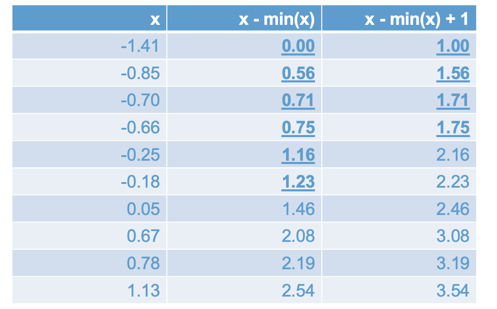
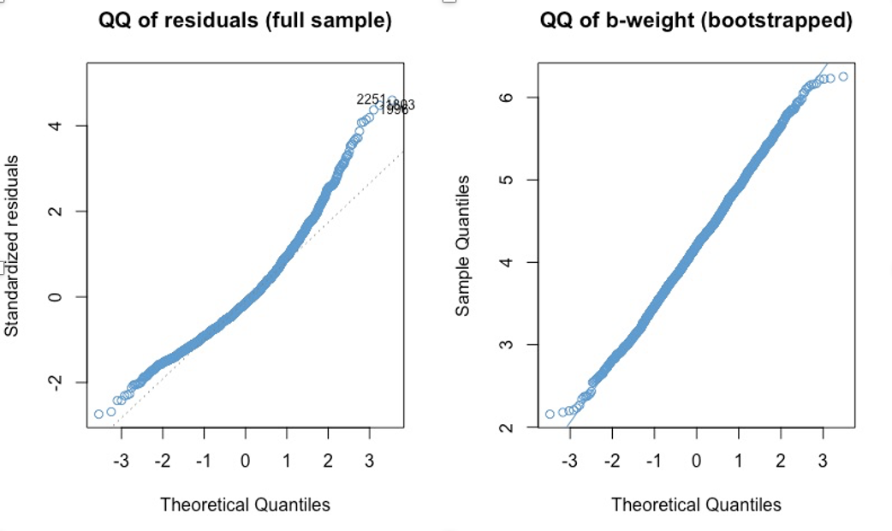

# Log-linear Regression {#chapter-9}

<!-- 9.1 and 9.5  need review! Consider starting with the exact interpretation in 9.5. Make sure to have answers for numerical question prepared. The lesson is short, so also plan to do the worked example in class. --> 

```{r, echo = F}
# Clean up check
rm(list = ls())

button <-  "position: relative; 
            top: -25px; 
            left: 85%;   
            color: white;
            font-weight: bold;
            background: #4B9CD3;
            border: 1px #3079ED solid;
            box-shadow: inset 0 1px 0 #80B0FB"
```

In the previous chapter we considered how to check whether the population assumptions of linear regression are problematic for a given data set. In this chapter we discuss one way to deal with assumption violations --  by "transforming" the $Y$ variable. In general, a transformation is just a function we apply to a variable to change it into another variable that we would rather work with. We have already seen some examples of transformations: the z-transformation (z-scores) and percentiles. 

In this chapter we will focus on the use and interpretation of the log-transform, $\log(Y)$, which results in the log-linear regression model. This serves to illustrate the overall approach to transforming the $Y$ variable, and also leads into a later topic -- logistic regression -- which also involves logarithms. 

Whenever we transform a $Y$ variable in a regression model, it always has three types of consequences. It affects: 

* The distribution of the variable / residuals. 
* The (non-)linearity of its relationship with predictor variables.
* The interpretation of the coefficients the model.  

One big theme of this chapter is that we have to consider all three of these when transforming the $Y$ variable. So, addressing assumption violations using this approach is not always as straightforward as we might hope. In particular, we might find that addressing one problem (e.g., non-normality) can create other  problems (e.g., nonlinearity). 

Another big theme of this chapter is the overall strategy for extending what we have learned about linear regression to other settings. In particular, when we are faced with data that are not compatible with the assumptions of regression modeling, we often proceed using the following 3-step approach: 

1. Transform the data to make them compatible with linear regression (or some other model we know how to use).

2. Run the analysis on the transformed data.

3. "Reverse-transform" the results of the analysis so that they are interpretable in terms of the original variable(s).

We will see this "transform$\rightarrow$analyze$\rightarrow$reverse- transform" strategy in this chapter on log-linear regression, and again when we cover logistic regression in Chapter \@ref(chapter-11). Both of these approaches are exemplars of *generalized linear modeling*, which is an advanced regression topic that formalizes the intuitive idea behind this approach.  

Before getting started, one last note about organization: This chapter addresses transformations of the Y-variable. Another approach for dealing with assumption violations in linear regression is to transform one or more of the $X$ variables instead of (or in addition to) the $Y$ variable. These approaches are discussed in the next chapter. 

## Math review {#math-review-9}

```{r, echo=FALSE, results='asis'}
codefolder::bookdown(init = "hide", style = button)
```

Before we get into transforming our variables, let's review the requisite math -- logs and exponents. This section uses the lowercase symbols $x$ and $y$ for generic mathematical variables. These symbols do not correspond to the uppercase symbols $X$ and $Y$ in regression notation. So, e.g., $x$ is not a predictor, its just a generic variable. 

The function $\log_{10}(x)$ returns the power to which we need to raise 10 to get the value $x$. It answers the question: $10^? = x$. 

Some examples:

* $\log_{10}(10) = 1$, because $10^1 = 10$
* $\log_{10}(100) = 2$, because $10^2 = 100$
* $\log_{10}(1000) = 3$, because $10^3 = 1000$
* ...

In Figure \@ref(fig:logx) we can see that $\log(x)$ grows much more slowly than $x$. The three values computed above are marked by dashed lines. This is telling us that "big differences" on $x$ translate into "small differences" on $\log(x)$. For every order of magnitude that $x$ increases (e.g., from 10 to 100, or from 100 to 1000), its log only increases by one unit.  

```{r, logx, echo = F, fig.cap = "Log base 10", fig.align = 'center'}
knitr::include_graphics("images/logx.png", dpi = 150)
```

This "compression" of large values down to a smaller scale turns out to be useful for dealing with positive skew, as illustrated in Figure \@ref(fig:logdata). This is one reason that the log transform is widely used.

```{r logdata, echo = F, fig.cap = "Log transform and positive skew", fig.align = 'center'}
load("ECLS2577.Rdata")
attach(ecls)

# Plots
par(mfrow = c(1,2))
hist(c1rmscal, col = "#4b9cd3")
hist(log(c1rmscal + 1), col = "#4b9cd3")
```

This section has covered the basic interpretation logs and their utility in addressing skewness of an outcome variable. The following sections add some details. 

### Natural logarithm
The symbol $\log_{10}$ is read "log base 10". In statistics, we usually use a different base -- log base $e$. Here $e = 2.7182...$ is an irrational number called *Euler's number*. We will see later on that using $\log_e$ makes the interpretation of log-linear regression simpler. Note that in this context, $e$ is not the residual from a regression model -- the interpretation should be clear from context, but just ask a question in class if you are unsure. 

Regardless of which base we use, logs have the same overall compression effect, as shown in Figure \@ref(fig:loge). For example, $\log_{10}(1000) = 3$ and $\log_{e}(1000) \approx 7$ -- both numbers are much smaller than $1000$! The same is true when applied to real data -- in fact, the right hand panel in Figure \@ref(fig:logdata) was computed using $\log_e$. 

```{r, loge, echo = F, fig.cap = "Log base 10 vs log base e", fig.align = 'center'}
knitr::include_graphics("images/loge.png", dpi = 150)
```

Log base $e$, or $\log_e$,is called the *natural logarithm* and often denoted "$\ln$". But $\ln$ can be hard to read so we will just stick with $\log$ and omit the base symbol when we mean $\log_e$. This is consistent with what R's `log` function does -- its default base is $e$.

### log and exp

Recall that our overall modeling strategy in log-linear regression is "transform$\rightarrow$analyze$\rightarrow$reverse- transform". In mathematics, the reverse transform is called the *inverse* of the original function, and the inverse of the logarithm is exponentiation. So, if we start by log-transforming our $Y$-variable, we are going to end up doing exponents later on. This section reviews exponents and their relation to logs. 

Exponentiation means raising a base number to a power. As with logs, we will assume that the base is $e$. So, in our context, exponentiation means

$$ e^x $$
where $x$ is the variable and $e$ is the base. 

The mathematical symbol $\exp(x)$ is often used instead of $e^x$ to avoid having to write complicated expressions in the superscript. The idea is that the left-hand side of the following equation is easier to read than the right-hand side

$$ \exp(17 - choclate + banna ) = e^{17 - choclate + banna} $$ 

As mentioned, $\exp$ is the *inverse* of $\log$, and vice versa. The relationship is a bit slippery to grasp, but the overall idea is that we once we log-transform a variable, we can use the inverse transformation ($\exp$) to get back to the original variable. 

For example, if we start with the number $x= 100$, we can take the log (base $e$) of that number as above

\[\log(100) =  4.60517 \]

In this equation, we can think of $100$ as our original value and $4.60517$ as our transformed value. The overall idea of inversion is that we want to get from the transformed value back to the original value. (Why would we do this? Recall our overall strategy: first we transform the variable, then we run the analysis, then we reverse transform (invert) the results.)  

To invert the log-transform, we use exponents. Remember that, by definition, the logarithm tells us what power we have to raise $e$ to, in order to get $100$. In other words, the above equation tells us that 

\[e^{4.60517} = 100. \]

In this equation, we can see that we take our transformed value ($4.60517$) as input and return the original value ($100$) as output. This is what it means for $\exp$ to undo or invert the $\log$ function. 

Putting the two equations together, we can see that

\[ e^{\log(100)} = 100. \]

On the left-hand side we input the our original value (100) and on the right-hand size we get back our original value (100). In general, we can write

\[ \exp(\log(x)) = x. \]


### Pop quiz

I'll ask some questions like the following to start class off.  **Please write down your answers and be prepared to share them in class**. Note: some of these are "trick questions" in the sense that the answer is not defined.

* $\log(2.7182) = ?$
* $\log(1) = ?$
* $\log(0) = ?$ 
* $\log(-1) = ?$ 
* $\exp(1) = ?$
* $\exp(0) = ?$
* $\exp(-1) = ?$
* What is larger, $\log(10)$ or $\exp(10)$? 
* $\log(\exp(x)) = ?$ 


### Rules for log and exp*

There are some rules for working with logs and exponents that we will use later on to derive some results about the interpretation of log-linear regression. You don't need to know these but you might find them useful if you like to follow derivations. 

* Addition with logs:
\[ \log(m) + \log(n) = \log(mn) \] 

* Multiplication with exponents:  
\[\exp(m) \times \exp(n) = \exp(m + n) \] 

## The log-linear model

```{r, echo=FALSE, results='asis'}
codefolder::bookdown(init = "hide", style = button)
```

There are a number of ways to apply logs in regression analysis, which are outlined in the following table and discussed in more detail in (cite:fox). The focus of this section is log-linear models. Note that the term "log-linear" is also the name of a family of models for contingency table data -- that is not what we are talking about here. 

```{r, log-table, echo = F, fig.cap = "Logs in regression analysis", fig.align = 'center'}
knitr::include_graphics("images/log_table.png")
```

In terms of data analysis, the overall approach to each of these models is to apply the log-transformation to the indicated variable(s) and then run the linear regression analysis as usual. So, for log-linear regression in `R`, we use the `log` function to transform the $Y$-variable, then we just do regression as usual (i.e., using the `lm` function). A worked example is provided in Section \@ref(worked-example-9).

As mentioned, whenever we transform the $Y$ variable we are doing three interrelated things: 

* Changing the distribution Y variable / residuals 
* Changing the (non-)linearity of its relationship with other variables
* Changing interpretation of the regression coefficients

Before getting into the worked example, we will review each of these in more detail. 

## Distribution of $\log(Y)$ {#distribution-9}

```{r, echo=FALSE, results='asis'}
codefolder::bookdown(init = "hide", style = button)
```

Below are some examples of the log transform applied to positively skewed data. We can see a range of results, from "wow, that definitely worked" in the first example to, "better but still not great" in the second two examples. These are realistic reflections of how a log transform works to address skew. We will discuss the data used for the third example in more detail in the following subsections, but for now it is sufficient to note that the plots for the third example show the hourly wages of a sample 200 individuals from 1985. 


```{r skew1, echo = F, fig.cap = "Example 1: Log transforming ECLS math", fig.align = 'center', fig.height=8}
par(mfrow = c(2,2))

# histograms 
hist(c1rmscal, col = "#4b9cd3")
hist(log(c1rmscal + 1), col = "#4b9cd3")

# qq plots
qqnorm(c1rmscal, col = "#4b9cd3", main = "qq-plot of c1rmscal" )
qqline(c1rmscal)
qqnorm(log(c1rmscal + 1), col = "#4b9cd3",  main = "qq-plot of log(c1rmscal + 1)" )
qqline(log(c1rmscal + 1))
```

```{r skew2, echo = F, fig.cap = "Example 2: Log transforming ECLS reading", fig.align = 'center', fig.height=8}
par(mfrow = c(2,2))

# histograms
hist(c1rrscal, col = "#4b9cd3")
hist(log(c1rrscal + 1), col = "#4b9cd3")

# qqplots
qqnorm(c1rrscal, col = "#4b9cd3", main = "qq-plot of c1rrscal" )
qqline(c1rrscal)
qqnorm(log(c1rrscal + 1), col = "#4b9cd3",  main = "qq-plot of log(c1rrscal + 1)" )
qqline(log(c1rrscal + 1))
```

```{r skew3, echo = F, fig.cap = "Example 3: Log transforming hourly wages", fig.align = 'center', fig.height=8}
load("Wages.RData")
attach(wages)

# histograms
par(mfrow = c(2,2))
hist(wage, col = "#4b9cd3")
hist(log(wage + 1), col = "#4b9cd3")

# qqplots
qqnorm(wage, col = "#4b9cd3", main = "qq-plot of wage" )
qqline(wage)
qqnorm(log(wage + 1), col = "#4b9cd3",  main = "qq-plot of log(wage + 1)" )
qqline(log(wage + 1))
detach(wages)
```

### Why $\log(x+1)$?
There are a few things to note about this approach to correcting positive skew. First, you might wonder why we are computing $\log(x + 1)$ instead of $\log(x)$. This is because the log function has "weird" behavior for values of $x$ between 0 and 1. These values were not shown in Figures \@ref(fig:logx) and \@ref(fig:loge) where we discussed compression, but they are shown below in Figure \@ref(fig:log0). 

```{r, log0, echo = F, fig.cap = "Logs for small values of X", fig.align = 'center'}
knitr::include_graphics("images/log0.png", dpi = 150)
```

We can see that $\log(1) = 0$, which is true regardless of the base (i.e., $b^0 = 1$ for all choices of the $b$). But for values of $x < 0$, $\log(x)$ goes to negative infinity. This is because of how negative exponents are defined:

\[ b^{-x} = \frac{1}{b^x}. \]

The upshot is that, if your variable takes on values in the range $(0, 1)$, the log transform is going to change those values into large negative numbers. This can result in negative skew, rather fixing your positive skew. 

We can see this in Figure \@ref(fig:skew4) below. The top row of the Figure shows the same variable as Example 1 above (ECLS Math Achievement), and the bottom shows the variable transformed to proportion correct. In the left-hand panels we can see that the distribution of the proportions is qualitatively the same the as the distribution of the original variable. However, the log transform behaves much differently for these two cases. Why? Because logs are "weird" on the range $(0, 1)$. 

```{r skew4, echo = F, fig.cap = "Comparing Log transforms of ECLS math total score versus proportion correct", fig.align = 'center', fig.height=8}
par(mfrow = c(2,2))
prop_c1rmscal <- (c1rmscal - min(c1rmscal))/100
hist(c1rmscal, col = "#4b9cd3")
hist(log(c1rmscal + 1), col = "#4b9cd3")
hist(prop_c1rmscal, col = "#4b9cd3")
hist(log(prop_c1rmscal), col = "#4b9cd3")
```


To avoid this situation we can add 1 to a variable before taking its log. Technically, there is no reason to do this if the variable does not take on values in the range 0 to 1, but I always apply the "add 1" rule just so I don't have to worry about it. 

### What about negative values of $x$?

You may have noted that the "add 1" rule doesn't cover cases where the variable can take on negative values. The problem here is that there is no way to turn a positive base $b$ into a negative number through exponentiation - i.e., $\log(x)$ is undefined whenever $x < 0$. 

To address situations where you want to log transform a variable that can take on negative values, we can use 

\[ \log(x - \text{min}(x) + 1). \]

The following table shows how this transformation works. The first column shows the original data, the second column shows how subtracting the minimum makes all of the negative numbers positive, and the third column shows how adding 1 makes all of the numbers less than 1 equal to or greater than 1. 

```{r, log-min, echo = F, fig.cap = "Dealing with negative values of x in log transforms", fig.align = 'center'}

```

The take home message: If we have negative values of $x$, before we apply the log transform we need to: 

* Step 1. “Add” the minimum value of $x$ to prevent undefined values of log
* Step 2. Add 1 to make sure no values are less than 1

**Can you think of a log transformation that would work to address data that were negatively skewed, rather than positively skewed? Hint: the trick is similar to the one in this section** 

### Skew versus censoring

It is important to distinguish between skew and floor (or ceiling) effects. Floor and ceiling effects are collectively known as "censoring". While transforming you data can help with skew, it isn't going to do anything about censoring, so it is important to be able to tell the difference. 

Censoring can look like extreme skew, but is importantly different from skew because a large proportion of the observations have exactly the same value. An example is shown in Figure \@ref(fig:floor) below, which shows a floor effect in which a large proportion of the cases have a values of 0 ("are censored at zero"). Note that the log transformation does do not anything about the censored data. In general, if you transform a "heap" of values, then the same heap shows up in the transformed data. 

To deal with censored data, we need to consider alternatives to linear regression (e.g., tobit regression). We won't cover regression for censored data in this course. For our purposes, the moral is: don't mistake censoring for skew, because they don't have the same solution. 

```{r, floor, echo = F, fig.cap = "A floor effect is not the same as positive skew", fig.align = 'center'}
knitr::include_graphics("images/floor_effect.png", dpi = 125)
```

### Final comments on dealing with skew

Recall that the assumptions of linear regression are about the residuals, not about the $Y$ variable itself (see Section \@ref(recap-8)). So, a skewed outcome variable is not necessarily a problem. In particular, it is entirely possible that $Y$ is positively skewed but its residuals are not, especially if one of the $X$ variables has a similar distribution to $Y$. So, don't worry about non-normality of $Y$, its non-normality of the residuals that matters. 

Second, even if the residuals are non-normal, this still doesn't matter very much with very large samples. The central limit theorem assures us that, as the sample size gets larger, the sampling distribution of the regression coefficients converges to a normal distribution, regardless of the distribution of the residuals. This is illustrated in Figure \@ref(fig:clt) below. 

The left panel shows the qq-plot of the residuals when Math Achievement (`c1rmscal`) is regressed on SES (`wksesl`) using the ECLS dataset. The right panel shows the bootstrapped sampling distribution of the regression coefficient, with samples of size $N = 100$. It is apparent that the skewness of the $Y$ variable does not affect the normality of the sampling distribution of the b-weight when the sample size is $100$. This is why we can often ignore skew in $Y$ with “large” samples ($N = 100$ in this case).

```{r, clt, echo = F, fig.cap = "The sampling distribution of a regression coefficient when residuals have positive skew", fig.align = 'center'}

```

The moral of this section is that, if you are considering log-transforming an outcome variable due to positive skew, you should keep in mind:

1. The problem may not really need to be fixed: 
    * Check the residuals! 
    * If you have sufficient sample size, mild to moderate violations of normality are not really an issue.

2. The log-transformation has other important implications for you model ... 

## Relationship with $X$ {#relationship-9}

```{r, echo=FALSE, results='asis'}
codefolder::bookdown(init = "hide", style = button)
```


In addition to normality, transformations of the $Y$ variable necessarily affect the linearity of regression. In particular, if $Y$ is linearly related to $X$, then $\log(Y)$ cannot also be linearly related to $X$. 

Stated more formally, if

\[ Y = a + bX + \epsilon \] 

then

\begin{align} 
\log(Y) & = \log(a + bX + \epsilon) \\
 & \neq a + bX + \epsilon. \\
\end{align}

What this means in practice is that addressing positive skew using a log transform can sometimes create more problems than it solves. Figure \@ref(fig:nonlinear1) illustrates this situation. In the top row, we see  the residual versus fitted plot and qqplot of residuals for the regression of Math Achievement (`c1rmscal`) on SES (`wksesl`). The linear regression resulted in a clear violation of normality (positive skew). In the bottom row, we see same output after log transforming Math Achievement -- it fixed the issue with normality, but also made the nonlinearity more apparent.  

```{r nonlinear1, echo = F, fig.cap = "Nonlinear vs non-normality when log transforming Y", fig.align = 'center', fig.height=8}
mod1 <- lm(c1rmscal ~ wksesl)
mod2 <- lm(log(c1rmscal + 1) ~ wksesl)
par(mfrow = c(2,2))
plot(mod1, 1)
plot(mod1, 2)
plot(mod2, 1)
plot(mod2, 2)

```

The take home message is that when we transform $Y$ (or $X$) we necessarily affect the relationship between the variables, as well as their individual distributions. It is often the case that when we try to “fix” the normality of the $Y$ variable, we can inadvertently make its relationship to $X$ more non-linear.

Note that the opposite can also happen -- a log transform can make a non-linear (exponential) relationship more linear. The exact result of the transformation depends on the relationships in the original data. 


As we discuss in the next chapter, we can address non-linearity of regression by transforming the $X$ variable(s). But we should be sure that the problem we are trying to solve (normality) isn’t worse than the the problem we end up with (non-linearity). 

**What do you think about the example given in Figure \@ref(fig:nonlinear1)? Is addressing the normality assumption "worth it"? Why or why not?**

## Interpretation {#interpretation-9}

```{r, echo=FALSE, results='asis'}
codefolder::bookdown(init = "hide", style = button)
```

The final point about the log-linear model is how it affects the interpretation of the model parameters. For example, in linear regression we know what a $b$-unit increase in $Y$ means -- but how to we interpret a $b$-unit increase in $\log(Y)$? This is definitely the most important point about the log transformation, which is why we saved it for last. In terms of three-step "transform$\rightarrow$analyze$\rightarrow$reverse- transform" strategy, this section addresses the final step. 

In general, one of the main shortcomings of "transforming your data" is that it can lead to uninformative or unclear interpretations of model parameters. If the results don't make sense, its not much of a consolation to know that the assumptions looked OK! 

However, it turns out that there is very nice interpretation of the log-linear model. It is because of this interpretation that we often use the log transform to address skew in $Y$, rather than some other transformation. 

In terms of our three 

### Approximate interpretation {#approximate-9}

In a log-linear model, the regression coefficients can be interpreted as the *approximate* proportion change in $Y$, in the original units. So, in this equation, 

\[ \log(Y) = a + bX + \epsilon, 
(\#eq:logy)
\]

we can interpret $b$ as the approximate proportion change in $Y$  associated with one unit change in $X$. This should seem surprising. $Y$ is not the outcome variable -- $\log(Y)$ is. But, we can still interpret the model with respect to $Y$! 

It is important to note that this interpretation is approximate and it only applies when $|b| < 1$. When $b$ takes on larger values, we will either need to rescale $X$ or use the exact interpretation in the next section. The mathematical rationale for these interpretations is presented in Section \@ref(derivation-9)

Before moving on, let's get clear on what proportion change means. For any two values $Y$ and $Y'$, the difference ("change") $Y' - Y$ as a proportion of $Y$ is

\[ \text{proportion change} = \frac{Y' - Y}{Y} = Y'/Y - 1.\]

Multiplying this by 100 gives us the percentage change, which is usually easier to talk about. If we want to talk about the change without specifying the units (e.g, proportion, percentage), we just say relative change. 

Note that relative change is not the same as relative magnitude. $Y'/Y$ is the magnitude of $Y'$ relative to $Y$. To get relative change, we subtract 1 from relative magnitude. 

For example, say I loan $Y = 100$ dollars to a friend and they pay me back $Y' = 150$ dollars. The amount my friend paid me back is 1.5 times, or 150%, of what I initially lent them:

$$ Y'/Y = 150/100 = 1.5 $$
This is the relative *magnitude* of the two amounts.

Equivalently, we could say that I have *gained* 50%, or 1/2, of the initial amount:

$$ Y'/Y - 1 = 150/100 - 1 = .5 $$
This is relative *change*. 

In more financial terms, I charged my friend 50% interest on the loan, and so they had to pay me back 150% of the principal (some friend!). My gains are 50%, so the final amount I have is 150% of what I initially had. 

As another example, if $Y' = 40$ and $Y = 100$, then $Y'$ is 40% of $Y$ (relative magnitude) and the relative decrease from 100 to 40 is 60%. In the context of our example, my friend  paid me back 40% of what I lent them, so I lost 60% of my initial amount. 

Here are some more examples. **Please write down your answers and be prepared to share them in class**

1. How many times larger is $Y' = 6$ than $Y = 2$?   
2. What is the relative increase from $Y = 2$ to $Y' = 6$?  

3. What is the percent increase from $Y = 200$ to $Y' = 600$?

4. What is the percent decrease from $Y = 600$ to $Y' = 200$?

5. What is the percent change from $Y = 1$ to $Y' = 1$?

The answers are hidden below, but please try the questions before viewing (use the "Show Code" button).

```{r}
# 1. 6 is 3 times larger than 2, or 300% percent larger than 2 (6/2 = 3)
# 2. 6 is a 200% increase from 2 (6/2 - 1 = 2)
# 3. 600 is a 200% increase from 200 
# 4. 200 is a 66% decrease from 600
# 5. 1 is a zero percent increase from 1 (but 100% as large as 1!)
#5. 
```

Now that we know about relative change, let's use these concepts to interpret the regression coefficient in Equation \@ref(eq:logy). Recall that this interpretation is approximate and only applies when $|b| < 1$. 

Some numerical examples: 

* if $b = .25$, then $Y$ is expected to increase by 25% when $X$ increases by 1 unit. 
* if $b = 0$, then $Y$ is expected to be the same when $X$ increases by 1 unit (i.e., no relationship)
* if $b = -.55$, then $Y$ is expected to decrease by 55% when $X$ increases by 1 unit. 

### A hypothetical example

Let's use a hypothetical example to get a better idea of how the interpretation of log-linear regression differs from the interpretation of linear regression. We will use the following variables:

* $Y$ is wages (dollars per week) 
* $X$ is hours worked per week

A linear relationship between $Y$ and $X$ would imply

\[ \widehat Y = a + bX. \]

Let's further assume that $b = 20$. With this information, you should be able to work out answers to the following two questions pretty easily: 

1.  For someone who is expected to earn $100/week, what would be their predicted earnings if they worked one hour more per week? 

2.  What about for someone who was expected to earn $1000/week? 

Now let's consider a log-linear model, this time with a regression coefficient of $b = .2$:

\[ \log(\widehat Y) = a + bX. \]

Again, the following questions should be pretty easy: 

3.  For someone who is expected to earn $100/week, what would be their (approximate) predicted earnings if they worked one hour more per week? 

4.  What about for someone who was expected to earn $1000/week? 

**Please write down your answers to these four questions and be prepared to share your responses in class**. The answers are hidden below, you can use the "Show Code" button to see them, but please try to answer on your own first. 

```{r, results = F}
# 1. 120 dollars per week
# 2. 1020 dollars per week
# 3. 120 dollars per week
# 4. 1200 dollars per week
```

This example shows that, while the linear model represents change in fixed units (e.g., dollars), the log-linear model represents change that is proportional to the magnitude of $Y$. This is particularly useful in applications involving monetary outcomes, where it has been argued that people’s "subjective evaluation" of money is more like the latter than the former. 

For example, a \$20 increase in weekly wages means different things to some one who makes \$100/week as opposed to someone who makes 
\$1000/week.

* At \$100/week, \$20 for an additional hour is equivalent to a 20% increase in wages for only a 2.5% (1/40) increase in hours worked.

* At \$1000/week, \$20 is a 2% increase in wages, which is less than the 2.5% increase in hours worked.

On the other hand, a 20% increase for both people might be considered as having “equal subjective value.” 

Some real life examples of this kind of interpretation are linked below.

* Sliding scales for parking, car pool / day care late pick-up, bail and fines, https://www.theatlantic.com/business/archive/2015/03/finland-home-of-the-103000-speeding-ticket/387484/

* Proportional tuition based on income and number of dependents. 
https://ronclarkacademy.com/tuition-and-financial-aid

### Exact interpretation {#exact-9}

The exact interpretation of the regression coefficients in the log-linear model is a bit involved. The main result is about the relative magnitude of $\hat Y$ corresponding to a one-unit change in $X$

\[ \frac{\widehat Y(X + 1)}{\widehat Y(X)} = \exp(b) 
(#eq:expb)
\]

where $\widehat Y(X)$ is the predicted value of $Y$ for a given value of $X$. This is result derived in Section \@ref(derivation-9) below (optional).

From Equation \@ref(eq:expb) and the definition of proportion change in the  Section \@ref(approximate-9), it follows that the proportion of change in $\widehat Y$ for a 1 unit increase in $X$ is *exactly* equal to $\exp(b) - 1$. So, if we want an exact interpretation of the regression coefficients in a log-linear model, we need to do some "follow up math". In the hypothetical example above (wages and hours worked), the exact proportion change in the log-linear model is

\[ \exp(.2) - 1 = 1.2214 - 1= .2214 \]

or about 22%. 

The reason the approximate interpretation in Section \@ref(approximate-9) works is because 

\[ \exp(b) - 1 \approx b \] 

for $|b| < 1$. This is illustrated in the graph below, where the blue line is $\exp(x)-1$ and black line is $x$. We can see that the two lines are pretty close over the range (-1, 1). This is one of the reasons that the natural log is used in the log-linear model, because it makes it easier to get an approximate interpretation the regression coefficients. 

```{r expb, echo = F, fig.cap = "exp(x) - 1 (blue) versus x (black)", fig.align = 'center'}
x <- seq(-3, 3, by = .1)
plot(x, x, type = "l", ylab = "exact vs approx proportion change", xlab = "value of regression coefficient")
points(x, exp(x)-1, type = "l", col = "#4b9cd3")
#abline(h = 0, col = "grey", lty = 2)
```

### Summary

While there are many transformations that can be used to address skew in the $Y$ variable, the log-linear model has the advantage that it is still interpretable in terms of $Y$. In fact, in many applications, notably those in which $Y$ is monetary, the interpretation is arguably better than for linear regression! 

* The approximate interpretation of the regression coefficients in the log-linear model: a one unit of change in $X$ is expected to yield a $(b \times 100)\%$ change in $Y$. This interpretation only applies with $b$ is small (less than 1 in absolute value).

* The exact interpretation: a one unit of change in $X$ is expected to yield a $(\exp(b) - 1)  \times 100\%$ change in $Y$, and this applies for any value of $b$. 

### Derivation of Equation \@ref(eq:expb) {#derivation-9}

Start with the log-linear model, exponentiate both sides, and then use the multiplication rule for exponents:

\begin{align}
\log(\widehat Y) & = a + bX \\
\implies & \\
\exp(\log(\widehat Y)) & = \exp(a + bX) \\
\implies & \\
\widehat Y & = \exp(a)\exp(bX) \\
\end{align}

Then do the same thing for $X+1$ in place of $X$: 

\begin{align}
\log(\widehat Y^*) & = a + b(X + 1) \\
\implies & \\
\widehat Y^*& = \exp(a)\exp(bX)\exp(b) \\
\end{align}

Finally, take the ratio of $\widehat Y^*$ to $\widehat Y$: 

\[ \frac{\widehat Y^*}{\widehat Y} = \frac{\exp(a)\exp(bX)\exp(b)}{\exp(a)\exp(bX)} = \exp(b) \]

## Worked example {#worked-example-9} 

```{r, echo=FALSE, results='asis'}
codefolder::bookdown(init = "hide", style = button)
```

This section works through log-linear regression using the `Wages.Rdata` example data set (source: Weinberg & Abramowitz (2017) Statistics using Stata: An integrative approach. Cambridge University Press). The dataset was collected in 1985 from $N = 400$ respondents and contains the following variables.   

```{r}
# Load the data and take a look
load("Wages.RData")
knitr::kable(head(wages))
```

We will focus on regressing hourly wage (`wage`) on years of education (`educ`). The distribution of the outcome variable and its relationship with the predictor are depicted below. 


```{r}
attach(wages)
par(mfrow = c(1,2))
hist(wage,  col = "#4B9CD3")
plot(educ, wage, col = "#4B9CD3")
```

This example is a good candidate for log-linear regression because

* `wages` is positively skewed
* Its relationship with `educ` appears somewhat exponential
* The log-transform provides a suitable interpretation when the outcome is monetary

Moreover, a quick a look at the linear model (below) shows that *all* of the assumptions of the model are violated -- we are going to need to try another approach!

```{r}
mod1 <- lm(wage ~ educ)

# Check out model fit
par(mfrow = c(1,2))
plot(mod1, 1, col = "#4B9CD3")
plot(mod1, 2, col = "#4B9CD3")
```

### Log-linear regression of Wages on Education

To run a log-linear model, we can transform the Y-variable using the `log` function, and then run the model as usual. The diagnostic plots are shown below. 

```{r}
# Create log transform of wage
log_wage <- log(wage + 1)

# Regress it on educ
mod2 <- lm(log_wage ~ educ)

# Check out model fit
par(mfrow = c(1,2))
plot(mod2, 1, col = "#4B9CD3")
plot(mod2, 2, col = "#4B9CD3")
```

In the qq-plot, we can see that the log transformation helped with positive skew, although didn't do much for the negative tail. It also reduced the apparent heteroskedasticity. However, the relationship still appears non-linear, perhaps more so than in the original linear model. 

Before moving on to address non-linearity in the following chapter, let's make sure we have a good understanding of what the regression coefficients for the log-linear model mean. The model output is reported below. **Please take a moment to write down your interpretation of the regression coefficient for `educ` in the summary output.**

```{r}
summary(mod2)
```

We can also obtain the "reverse-transformed" model coefficients $\exp(b) - 1$ and their confidence intervals:  

```{r}
conf.b <- cbind(coef(mod2), confint(mod2))
exp.b <- exp(conf.b) - 1
colnames(exp.b)[1] <- c("exp - 1")
exp.b
```

**Please write down your interpretation of the output above for the `educ` variable.**

```{r, echo = F}
detach(wages)
```

## Workbook
```{r, echo=FALSE, results='asis'}
codefolder::bookdown(init = "hide", style = button)
```


This section collects the questions asked in this chapter. We will discuss these questions in class. If you haven't written down / thought about the answers to these questions  before class, the lesson will not be very useful for you! So, please engage with each question by writing down one or more answers, asking clarifying questions, posing follow up questions, etc. 


**Section \@ref(math-review-9)**

I'll ask some questions like the following to start class off. Please write down your answers and be prepared to share them in class. 

* $\log(2.7182) = ?$
* $\log(1) = ?$
* $\log(0) = ?$ 
* $\log(-1) = ?$ 
* $\exp(1) = ?$
* $\exp(0) = ?$
* $\exp(-1) = ?$
* What is larger, $\log(10)$ or $\exp(10)$? 
* $\log(\exp(x)) = ?$ 


**Section \@ref(distribution-9)**

* Can you think of a log transformation that would work to address data that were negatively skewed, rather than positively skewed? 

**Section \@ref(relationship-9)**

* What do you think about the example given in the Figure below. Is addressing the normality assumption "worth it"? Why or why not?

```{r, echo = F, fig.cap = "Nonlinear vs non-normality when log transforming Y", fig.align = 'center', fig.height=8}

mod1 <- lm(c1rmscal ~ wksesl)
mod2 <- lm(log(c1rmscal + 1) ~ wksesl)
par(mfrow = c(2,2))
plot(mod1, 1)
plot(mod1, 2)
plot(mod2, 1)
plot(mod2, 2)
```

**Section \@ref(interpretation-9)**

* Please write down your answers to the questions below and be prepared to share them in class

1. How many times larger is $Y' = 6$ than $Y = 2$?   
2. What is the relative increase from $Y = 2$ to $Y' = 6$?  

3. What is the percent increase from $Y = 200$ to $Y' = 600$?

4. What is the percent decrease from $Y = 600$ to $Y' = 200$?

5. What is the percent change from $Y = 1$ to $Y' = 1$?

  
* Please write down your answers to the four questions about the hypothetical example and be prepared to share your responses in class*
  

**Section \@ref(worked-example-9)**

* Please take a moment to write down your interpretation of the regression coefficient for `educ` in the summary output below.

```{r}
attach(wages)
log_wage <- log(wage + 1)

# Regress it on educ
mod2 <- lm(log_wage ~ educ)
summary(mod2)
detach(wages)
```

* Please write down your interpretation of the following output for the `educ` variable:

```{r}
conf.b <- cbind(coef(mod2), confint(mod2))
exp.b <- exp(conf.b) - 1
colnames(exp.b)[1] <- c("exp - 1")
exp.b
```


## Exercises {#exercises-9}

Again there isn't much new in terms of R code in this chapter. The code for the worked example is presented below, but please refer to Section \@ref(worked-example-9) for the interpretation.


```{r}
# Load the data and take a look
load("Wages.RData")
knitr::kable(head(wages))
```

We will focus on regressing hourly wage (`wage`) on years of education (`educ`). The distribution of the outcome variable and its relationship with the predictor are depicted below. 

```{r}
attach(wages)
par(mfrow = c(1,2))
hist(wage,  col = "#4B9CD3")
plot(educ, wage, col = "#4B9CD3")
```

### Linear regression of Wages on Education

Working with linear model, we can see that *all* of the assumptions of the model are violated -- we are going to need to try another approach!

```{r}
mod1 <- lm(wage ~ educ)

# Check out model fit
par(mfrow = c(1,2))
plot(mod1, 1, col = "#4B9CD3")
plot(mod1, 2, col = "#4B9CD3")
```

### Log-linear regression of Wages on Education

To run a log-linear model, we can transform the Y-variable using the `log` function, and then run the model as usual.

```{r}
# Create log transform of wage
log_wage <- log(wage + 1)

# Regress it on educ
mod2 <- lm(log_wage ~ educ)

# Check out model fit
par(mfrow = c(1,2))
plot(mod2, 1, col = "#4B9CD3")
plot(mod2, 2, col = "#4B9CD3")
detach(wages)
```

Before moving on to address non-linearity, make sure you have a good understanding of the output below

```{r}
summary(mod2)

conf.b <- cbind(coef(mod2), confint(mod2))
exp.b <- exp(conf.b) - 1
colnames(exp.b)[1] <- c("exp - 1")
exp.b
```

```{r, echo = F}
rm(list = ls())
```
