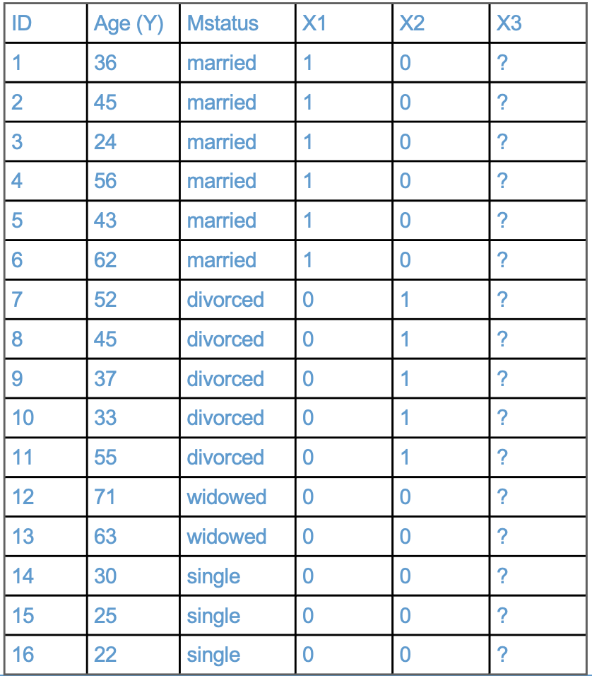
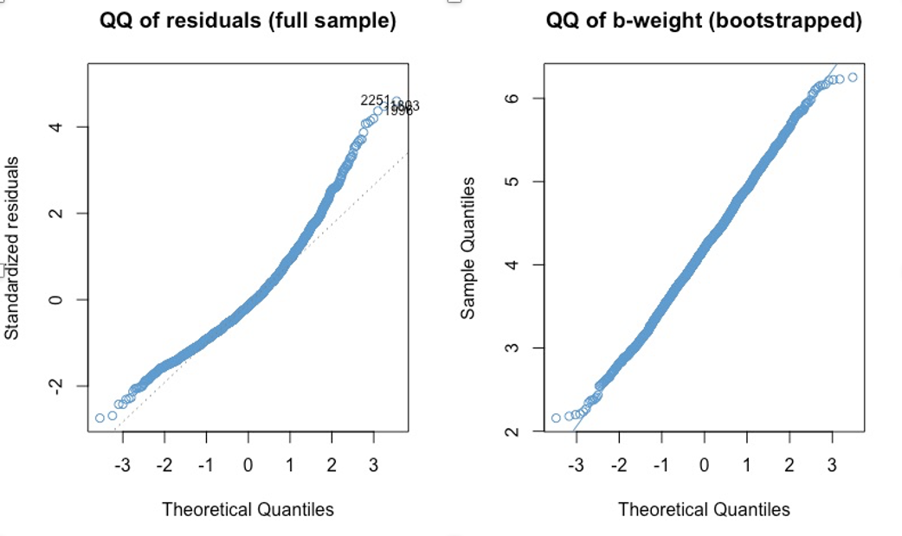

--- 
title: "EDUC 784: Regression"
author: "Peter Halpin"
date: "`r Sys.Date()`"
site: bookdown::bookdown_site
documentclass: book
bibliography: [book.bib, packages.bib]
description: |
  Course notes for EDUC 784
link-citations: yes
github-repo: peterhalpin/EDUC_784
cover-image: images/image1.png
favicon: null
---

# About This Book

```{r, echo = F}
button_css <-  "position: relative; 
                top: -25px; 
                left: 85%;   
                color: white;
                font-weight: bold;
                background: #4B9CD3;
                border: 1px #3079ED solid;
                box-shadow: inset 0 1px 0 #80B0FB"
```


This "book" provides the course notes for EDUC 784. It is currently under development, so any feedback is appreciated (e.g., during class,  via email, or via github). In particular, R Studio does not do a great job catching typos, so let me apologize in advance for the many that you will find scattered through these "pages." 

This first chapter is just about how to use the book -- the course content starts in Chapter \@ref(chapter-2).   

## Why this format? 

These notes serve a few related purposes: 

* To integrate course content (slides, readings, code, examples, and exercises) into one format, rather than having multiple files to sort through.

* To address the perennial problem of choosing a textbook for this course -- rather than having a required text, the goal is for these notes to be used as the official course text. We discuss supplementary texts during our first class. 

* Most importantly, having a course text that is tightly aligned with the course content lets me assign readings as homework *before class*, so we can spend less class time in lecture and more time discussing any questions you have about the readings, going through the examples together in R, and working on assignments.  

* As a bonus, this book is another example of cool things you can do with R. It's written in R (https://bookdown.org) -- that is crazy, right??

## Tips for using the notes

```{r codefolder, echo=FALSE, results='asis'}
codefolder::bookdown(init = "hide", 
                     style = button_css)
```

In my experience, students often prefer to have a conceptual overview of the material before getting into the coding. To facilitate this, these notes uses "code folding". An example of code folding is given on this page. A histogram is presented below. By clicking on the button called "Show Code" on the top of the page, the R code that produced the histogram will become visible. Notice that you may need to scroll horizontally to see all of the text in the code window. Also notice that when you hover your mouse over the code window, an icon appears in the top right corner -- this lets you copy the block of code with one click. (I don't recommend always copy-pasting code, but it's a good way to get started.) 


```{r}
# Here is some R code. You don't have to look at it when reading the book, but it is here when you need it
x <- rnorm(200)
hist(x, col = "#4B9CD3")
```

The overall idea is that you will read the notes for conceptual understanding before class, and then we will review the concepts and do the coding together during class. Note that sections denoted with an asterisk (*) are optional!

Two other important points: 

* The readings contain questions that are written in **bold font**. The questions are also collected in the section of each chapter called "Workbook". During class time,  we will discuss the Workbook questions, your answers, any additional question you have, etc. So, it really is important for you to do the readings, and write down your responses to the questions, before class. You won't get much out of the lessons if you haven't done this preparation. 

* Some chapters contain a section called "Exercises" that collect all the R code in the chapter into a single overall workflow. **You don't need to do the exercises before class**, but you can if you want to. The main advantage of doing the readings and questions ahead of time is that it will free up more class time for us to work on exercises together.  Coding is very much a "hands on" activity and it is easy to get frustrated or discouraged when the software doesn't do what you want it to. So, having others there to help you along while coding (e.g., the instructor, TA, your fellow students) is a big advantage! If the chapter doesn't have an Exercises section, that means we will be working on an assignment together instead.

## Summary 

In summary, the basic workflow of this book / course is as follows. 

1. Before class, go through the assigned readings for conceptual understanding. You can skip all the code during your first reading if you like, but make sure to write down answers to the questions contained in the readings before class. Also write down any questions or anything else you want to discuss. You can optionally use the online Forum to post any questions, and I will address them at the beginning of each class. 

2. We will go through the Workbook questions in class together, with the goal of having a more of a class discussion than a lecture. You will need to read the assigned material and think about the Workbook questions beforehand in order to meaningfully participate in and learn from the class discussion. 

3. Either as part of the discussion or afterwards, we will work on the coding Exercises in each chapter. You don't need to do the Exercises before class, but you can if you want to. If there are no Exercises in the assigned readings, that means we will be working on an assignment together instead. 

Alright, let's get to it! 


<!--chapter:end:index.Rmd-->

---
output:
  word_document: default
  html_document: default
---
# Simple Regression {#chapter-2}

```{r, echo = F}
button <-  "position: relative; 
            top: -25px; 
            left: 85%;   
            color: white;
            font-weight: bold;
            background: #4B9CD3;
            border: 1px #3079ED solid;
            box-shadow: inset 0 1px 0 #80B0FB"
options(digits = 4)
```

The focus of this course is linear regression with multiple predictors (AKA *multiple regression*), but we start by reviewing regression with one predictor (AKA *simple regression*). 

## An example from NELS {#example-2}
 
```{r, echo=FALSE, results='asis'}
codefolder::bookdown(init = "hide", style = button)
```

Figure \@ref(fig:fig1) shows the relationship between Grade 8 Math Achievement (percent correct on a math test) and Socioeconomic Status (SES; a composite measure on a scale from 0-35). The data are a subsample of the 1988 National Educational Longitudinal Survey (NELS; see https://nces.ed.gov/surveys/nels88/). 

```{r fig1, fig.cap = 'Math Achievement and SES (NELS88).', fig.align = 'center'}
# Load and attach the NELS88 data
load("NELS.RData")
attach(NELS)

# Scatter plot
plot(x = ses, y = achmat08, col = "#4B9CD3", ylab = "Math Achievement (Grade 8)", xlab = "SES")

# Run the regression model
mod <- lm(achmat08 ~ ses)

# Add the regression line to the plot
abline(mod) 
```

The strength and direction of the linear relationship between the two variables is summarized by their correlation (specifically, the Pearson product moment correlation). In this sample, the correlation is

```{r}
options(digits = 4)
cor(achmat08, ses)
```

This is a moderate, positive correlation between Math Achievement and SES. This correlation means that eighth graders from more well-off families (higher SES) also tended to do better in math (higher Math Achievement). 

This relationship between SES and academic achievement has been widely documented and discussed in education research (e.g., https://www.apa.org/pi/ses/resources/publications/education). **Please look over this web page and be prepared to share your thoughts about this relationship.** 


## The regression line {#regression-line-2}

```{r, echo=FALSE, results='asis'}
codefolder::bookdown(init = "hide", style = button)
```

The line in the Figure \@ref(fig:fig1) can be represented mathematically as   

\[ 
\widehat Y = a + b X
(\#eq:yhat)
\]

where 

* $Y$ denotes Math Achievement
* $X$ denotes SES 
* $a$ represents the regression intercept (the value of $\widehat Y$ when $X = 0$)
* $b$ represents the regression slope (how much $\widehat Y$ increases for each unit of increase in $X$)

Note that $Y$ represents the values of Math Achievement in the data, whereas $\widehat Y$ represents the values computed from the regression equation (i.e., the values on the regression line). The difference $e = Y - \widehat Y$ is called a *residual*. The residuals for a subset of the data points in Figure \@ref(fig:fig1) are shown in pink in Figure \@ref(fig:fig2) 

```{r fig2, fig.cap = 'Residuals for a Subsample of the Example.', fig.align = 'center'}
# Get predicted values from regression model
yhat <- mod$fitted.values

# select a subset of the data
set.seed(10)
index <- sample.int(500, 30)

# plot again
plot(x = ses[index], y = achmat08[index], ylab = "Math Achievement (Grade 8)", xlab = "SES")
abline(mod)

# Add pink lines
segments(x0 = ses[index], y0 = yhat[index] , x1 = ses[index], y1 = achmat08[index], col = 6, lty = 3)

# Overwrite dots to make it look at bit better
points(x = ses[index], y = achmat08[index], col = "#4B9CD3", pch = 16)
```

Notice that $Y = \widehat Y + e$ by definition. So, we can use either Equation \@ref(eq:yhat) or the equation below to write out a regression model: 

\begin{align} 
Y = a + bX + e.  
(\#eq:y)
\end{align} 

Both equations say the same thing, but Equation \@ref(eq:y) lets us talk about the values of $Y$ in the data, not just the predicted values. 

Another way to write out the model is using the variable names (or abbreviations) in place of the more generic "X, Y" notation. For example, 

\begin{align} 
\widehat {MATH} = a + b(SES). 
(\#eq:read)
\end{align} 

This notation is more informative about the specific variables in the example. But it is also more clunky and doesn't lend itself to other mathematical expressions. For example, $r_{XY}$ is much clearer than $r_{SES, MATH}$ -- in general, we want most of the text on the "baseline", not the subscripts or superscripts.

You should be familiar with all 3 ways of presenting regression equations and you are free to use whatever approach you like best in your own writing.  

## OLS {#ols-2}

```{r, echo=FALSE, results='asis'}
codefolder::bookdown(init = "hide", style = button)
```

Intuitively, one approach to “fitting a line to the data” is to select the parameters of the line (its slope and intercept) to minimize the residuals. In ordinary least squares (OLS) regression, we minimize a related quantity, the sum of squared residuals: 

\[
\begin{align} 
SS_{\text{res}} & = \sum_{i=1}^{N} e_i^2 \\ 
& = \sum_{i=1}^{N} (Y_i - a - b X_i)^2 
\end{align} 
\]

where $i = 1 \dots N$ indexes the respondents in the sample. OLS regression is very widely used and is the main focus of this course, although we will visit some other approaches in the second half of the course. 

Solving the  minimization problem (setting derivatives to zero) gives the following equations for the regression parameters: 

\[ 
a = \bar Y - b \bar X \quad \quad \quad \quad b = \frac{\text{Cov}(X, Y)}{s^2_X} = r_{XY} \frac{s_Y}{s_X}
\]

(If you aren't familiar with the symbols in these equations, check out the review materials in Section \@ref(review-2) for a refresher.)  

For the NELS example, the regression intercept and slope are, respectively: 

```{r}
coef(mod)
```

**Please write down an interpretation of these numbers in terms of the line in Figure \@ref(fig:fig1), and be prepared to share your answers in class!** 

### Correlation and regression

Note that if $X$ and $Y$ are transformed to z-scores (i.e., to have mean of zero and variance of one), then 

* $a = 0$
* $b = \text{Cov}(X, Y) = r_{XY}$

(You can check these results by plugging the value 0 for the means and the value 1 for the variance in the equations above.) 

So, regression, correlation, and covariance are all very closely related when we consider only two variables at a time. This is why we didn't make a big deal about simple regression in EDUC 710 -- its basically just the same thing as correlation. But, when we get to multiple regression (i.e., more than one $X$ variable), we will see that relationship between regression and correlation (and covariance) gets more complicated.  

<!-- ## Residuals 
- show that Cor(\hatY e) = 0  and explain why that is important
- talk about standard error of estimate and how its used
-->

## R-squared {#rsquared-2}
```{r, echo=FALSE, results='asis'}
codefolder::bookdown(init = "hide", style = button)
```
In the previous section we saw that the predicted value of Math Achievement increased by .43 units (about half a percentage point) for each unit of increase in SES. Another way to interpret this relationship is in terms of the proportion of variance in Math Achievement that is associated with SES -- i.e., to what extent are individual differences in Math Achievement associated with, or explained by, individual differences in SES? 

This question is represented graphically in Figure \@ref(fig:rsquared). The horizontal line denotes the mean of Math Achievement. The difference between the indicated student's Math Achievement score and the mean can be divided into two parts. 

* The black dashed line shows how much closer we get to the student's Math Achievement score ($Y$) by considering the predicted values ($\widehat Y$) instead of the overall mean ($\bar Y$). This represents the extent to which this student's Math Achievement is explained by the linear relationship with SES. 

* The pink dashed line is the regression residual, which was introduced in Section \@ref(regression-line-2). This is the variation in Math Achievement that is "left over" after considering the linear relationship with SES. 


```{r rsquared, fig.cap = 'The Idea Behind R-squared.', fig.align = 'center', echo = F}
plot(x = ses[index], y = achmat08[index], ylab = "Math Achievement (Grade 8)", xlab = "SES")
abline(mod)

ybar <- mean(achmat08)
abline(h = ybar, col = "gray")

# Add pink lines for case 6
segments(x0 = ses[index[22]], y0 = yhat[index[22]] , x1 = ses[index[22]], y1 = achmat08[index[22]], col = 6, lty = 3, lwd = 3)

# Add black lines 
segments(x0 = ses[index[22]], y0 = yhat[index[22]] , x1 = ses[index[22]], y1 = ybar, col = 1, lty = 3, lwd = 3)

# Overwrite dots to make it look at bit better
points(x = ses[index], y = achmat08[index], col = "#4B9CD3", pch = 16)
```

The R-squared statistic averages the variation in Math Achievement associated with SES (i.e., the black dashed line) relative to the total variation in Math Achievement (i.e., black + pink) for all students in the sample. R-squared is a widely used statistic in regression analysis, so we will be seeing it a lot. Some authors call it the "coefficient of determination" instead of R-squared. 

Using all of the cases from the example (Figure \@ref(fig:fig1)), the R-squared statistic is: 

```{r}
options(digits = 5)
summary(mod)$r.squared
```

**Please write down an interpretation of this number and be prepared to share your answer in class.** 

### Derivation*

To derive the R-squared statistic we work the numerator of the variance, which is called the total sum of squares.  

\[SS_{\text{total}} = \sum_{i = 1}^N (Y_i - \bar Y)^2. \]

It can be re-written using the predicted values $\widehat Y$:

\[SS_{\text{total}} = \sum_{i = 1}^N [(Y_i - \widehat Y_i) + (\widehat Y_i - \bar Y)]^2. \]

The right hand side can be reduced to two other sums of squares using the rules of summation algebra (see the review in Section \@ref(review-2)):

\begin{align} 
SS_{\text{total}} & = \sum_{i = 1}^N (Y_i - \widehat Y_i)^2 + \sum_{i = 1}^N (\widehat Y_i - \bar Y)^2 \\
\end{align} 

The first part is just $SS_\text{res}$ from Section \@ref(ols-2). The second part is called the regression sum of squares and denoted $SS_\text{reg}$. Using this terminology we can re-write the above equation as

\[ SS_{\text{total}} = SS_\text{res} + SS_\text{reg} \] 

The R-squared statistic is 

\[R^2 = SS_{\text{reg}} / SS_{\text{total}}. \]

As discussed above, this is interpreted as the proportion of variance in $Y$ that is explained by its linear relationship with $X$. 

<!--
### Additional details* 

Another way to get to $R^2$ is through the definition of $R$ as the correlation between $Y$ and $\widehat Y$. In simple regression, this is just equal to the regular correlation coefficient (Again, you can use the rules of summation algebra to show this). 

\[ R = \text{cor}(Y, \widehat Y) = \text{cor}(Y, a + bX) = \text{cor}(Y, X)\]


Consequently, in simple regression, $R^2 = r^2_{XY}$ -- i.e., the proportion of variance explained by the predictor is just the squared Person product moment correlation. When we add multiple predictors, this relationship between $R^2$ and $r^2_{XY}$ no longer holds. 

Still need to show the two definitions of R-squared are equivalent ;

\[ R^2 = SS_reg /SS_total = \text{var}(\hat Y) / \text{var}(Y) = \text{var}(a + bX) / \text{var}(Y)
= b^2 \text{var}(X) / \text{var}(Y)= \text{cov}(X, Y)^2 / \text{var}(X) \text{var}(Y)= r^2
\]
-->
## The population model {#population-model-2}  

In the NELS example, the population of interest is U.S. eighth graders in 1988. We want to be able to draw conclusions about that population based on the sample of eighth graders that participated in NELS. In order to do that, we make some statistical assumptions about the population, which are collectively referred to as the population model. We talk about how to check the plausibility of these assumptions in Chapter \@ref(chapter-8). 

The regression population model has the following three assumptions, which are also depicted in the diagram below. Recall that the notation $Y \sim N(\mu, \sigma)$ means that a variable $Y$ has a normal distribution with mean $\mu$ and standard deviation $\sigma$.

1. Normality: The values of $Y$ conditional on $X$, denoted $Y|X$, are normally distributed (the figure shows these distributions for three values of $X$):  

\[Y | X \sim  N(\mu_{Y | X} , \sigma_{Y | X}) \]

2. Homoskedasticity: The conditional distributions have equal variances (also called homegeneity of variance).

\[ \sigma_{Y| X} = \sigma \]

3. Linearity: The means of the conditional distributions are a linear function of $X$.

\[ \mu_{Y| Χ} = a + bX \]

```{r, pop-model, echo = F, fig.cap = "The Regression Population Model.", fig.align = 'center'}
knitr::include_graphics("images/population_model.png")
```

These three assumptions are summarized by writing 

\[ Y|X \sim N(a + bX, \sigma). \] 

Sometimes it will be easier to state the assumptions in terms of the population residuals, $\epsilon = Y - \mu_{Y|X}$, which subtracts off the regression line: $\epsilon \sim N(0, \sigma)$. 

An additional assumption is usually made about the data in the sample -- that they were obtained as a simple random sample from the population. We will see some ways of dealing with other types of samples later on the course, but for now we can consider this a background assumption that applies to all of the procedures discussed in this course.  

## Clarifying notation {#notation-2}

At this point we have used the mathematical symbols for regression (e.g., $a$, $b$) in two different ways:

* In Section \@ref(regression-line-2) they denoted sample statistics.
* In Section  \@ref(population-model-2) they denoted population parameters.

The population versus sample notation for regression is a bit of a hot mess, but the following conventions are widely used.

Concept                Sample statistic    Population parameter               
-------               ------------------  ----------------------
regression line         $\widehat Y$          $\mu_{Y|X}$ 
slope                   $\widehat b$          $b$                                 
intercept               $\widehat a$          $a$                                 
residual                $e$                   $\epsilon$                           
variance explained      $\widehat R^2$        $R^2$


The "hats" always denote sample quantities, and the Greek letters (in this table) always denote population quantities, but there is some lack of consistency. For example, why not use $\beta$ instead of $b$ for the population slope? Well, $\beta$ is conventionally used to denote standardized regression coefficients in the *sample*, so its already taken  (more on this in the Chapter \@ref(chapter-4) ). 

One thing to note is that the hats are usually omitted from the statistics $\widehat a$,  $\widehat b$, and $\widehat R^2$ if it is clear from context that we are talking about the sample rather than the population. This doesn't apply to $\widehat Y$, because the hat is required to distinguish the predicted values from the data points. 

Another thing to note is that while $\widehat Y$ are often called the predicted values, $\mu_{Y|X}$ is not usually referred to this way. It is called the conditional mean function or the conditional expectation function. We will introduce some other notations for $\widehat Y$ and $\mu_{Y|X}$ later in the course. 

**Please be prepared for a pop quiz on notation during class!**

<!-- Finally, recall that the symbol $E(\cdot)$ denotes the expected value of whatever statistic appears in the place of the dot. The expected value is a way of referring to the mean of the sampling distribution of the statistic (otherwise we would have to say things like "the mean of the mean", which would be horrible). So $E(Y\mid X)$ is the expected value of $Y$ for a given value of $X$. The $\mu_{Y|X}$ is the the population conditional mean, $\mu_{Y|X}$ is equal to $E(Y\mid X)$ when the population model is true (i.e., OLS regression is an unbiased estimator of the population conditional mean function). So, the two symbols are used interchangeably. (Omit this paragraph?) -->


## Inference for the slope {#inference-for-slope-2}

```{r, echo=FALSE, results='asis'}
codefolder::bookdown(init = "hide", style = button)
```

When the population model is true, $\widehat b$ is an unbiased estimate of $b$. We also know the standard error of $\widehat b$, which is equal to (cite:fox)

\[ s_{\widehat b} = \frac{s_Y}{s_X} \sqrt{\frac{1-R^2}{N-2}} . \]

Using these two results, we can compute t-tests and confidence intervals for the regression slope in the usual way. These are summarized below. See the review in Section \@ref(review-2) for background information on bias, standard errors, t-tests, and confidence intervals.

### t-tests

The null hypothesis $H_0: \widehat b = b_0$ can be tested against the alternative $H_A: \widehat b \neq b_0$ using the test statistic: 

\[ t = \frac{\widehat b - b_0}{s_{\widehat b}} \]

which has a t-distribution on $N-2$ degrees of freedom when the null hypothesis is true. 

The test assumes that the population model is correct. The null hypothesis value of the parameter is usually chosen to be $b_0 = 0$, in which case the test is interpreted in terms of the "statistical significance" of the regression slope.  

### Confidence intervals

For a given Type I Error rate, $\alpha$, the corresponding $(1-\alpha) \times 100\%$ confidence interval is

\[ b_0 = \widehat b \pm t_{\alpha/2} \times s_{\widehat b} \]

where $t_{\alpha/2}$ denotes the $\alpha/2$ quantile of the $t$-distribution with $N-2$ degrees of freedom. 

For example, if $\alpha$ is chosen to be $.05$, the corresponding $95\%$ confidence interval uses $t_{.025}$, or the 2.5-th percentile of the t-distribution. 

### The NELS example 

For the NELS example, the t-test of the regression slope is shown in the second row of the table below (we cover the rest of the output in the next few sections):

```{r}
summary(mod)
```

The corresponding $95\%$ confidence interval is

```{r}
confint(mod)
```

**Please write down an interpretation of the t-test and confidence interval of the regression slope, and be prepared to share your answers in class!** 

## Inference for the intercept {#inference-for-intercept-2}

The situation for the regression intercept is similar to that for the slope: the OLS estimate is unbiased and its standard error is (cite:fox)

<!--- check this and get source -->
\[ 
s_{\widehat a} = \sqrt{\frac{SS_{\text{res}}}{N-2} \left(\frac{1}{N} + \frac{\bar X^2}{(N-1)s^2_X}\right)}.
\]

The t-tests and confidence intervals are constructed in the way same as for the slope, just by $a$ replacing $b$ in the notation of the previous slide. The t-distribution also has $N-2$ degrees of freedom for the intercept.  

It is not usually the case that the regression intercept is of interest in simple regression. Recall that the intercept is the value of $\widehat Y$ when $X = 0$. So, unless you have a hypothesis or research question about this particular value of $X$ (e.g., eighth graders with $SES = 0$), you won't be interested in this test (even though R always provides it). 

When we get to multiple regression, we will see some examples of regression models where the intercept is meaningful, especially when we talk about categorical predictors in Chapter \@ref(chapter-5) and interactions in Chapter \@ref(chapter-6). But, for now, we can put it on the back burner. 

## Inference for R-squared {#inference-for-rsquared-2}

```{r, echo=FALSE, results='asis'}
codefolder::bookdown(init = "hide", style = button)
```

Inference for R-squared is quite a bit different than for the regression parameters. As we saw in section \@ref(rsquared-2), R-squared is a ratio of two sums of squares. We know from our study of ANOVA last semester that ratios of sums of squares are tested using an F-test, rather than a t-test. The F-test for (the population) R-squared is summarized below. 

### F-tests

The null hypothesis $H_0: R^2 = 0$ can be tested against the alternative $H_A: R^2 \neq 0$ using the test statistic: 

\[ F = (N-2) \frac{\widehat R^2}{1-\widehat R^2} \]

which has a F-distribution on $1$ and $N – 2$ degrees of freedom when the null is true. The test assumes that the population model is true. Confidence intervals for R-squared are generally not reported. 

The R output from Section \@ref(inference-for-slope-2) is presented again below. **Please write down an interpretation of the F-test of R-squared and be prepared to share your answers in class!** Note that the output uses the terminology "multiple R-squared" to refer to R-squared. 


```{r}
summary(mod)
```

## Power analysis {#power-2}

```{r, echo=FALSE, results='asis'}
codefolder::bookdown(init = "hide", style = button)
```

Statistical power is the probability of rejecting the null hypothesis, when it is indeed false. Rejecting the null hypothesis when it is false is sometimes called a "true positive", meaning we have correctly inferred that a parameter of interest is not zero. Power analysis is useful for designing studies so that the statistical power / true positive rate is satisfactory. In practice, this comes down to having a large enough sample size. 

Power analysis in regression is very similar to power analysis for the tests we studied last semester. There are four ingredients that go into a power analysis: 

* The desired Type I Error rate, $\alpha$.
* The desired level of statistical power. 
* The sample size, $N$.
* The effect size, which for regression is Cohen's f-squared statistic (AKA the signal to noise ratio): 

\[ f^2 = {\frac{R^2}{1-R^2}}. \]

In principal, we can plug-in values for any three of these ingredients and then solve for the fourth. But, as mentioned, power analysis is most useful when we solve for $N$ while planning a study. When solving for $N$ "prospectively," the effect size $f^2$ should be based on reports of R-squared in past research. Power and $\alpha$ are usually chosen to be .8 and .05, respectively. 

When doing secondary data analysis (as in this class) there is not much point in solving for the sample size, since we already have the data. Instead, we can solve for the effect size. In the NELS example we have $N=500$ observations. The output below reports the smallest effect size we can detect with a power of .8 and $\alpha = .05$. This is sometimes called the "minimum detectable effect size" (MDES). Note that the output $u$ and $v$ denote the degrees of freedom in the numerator and denominator of the F-test of R-squared, respectively. 

```{r}
library(pwr)
pwr.f2.test(u = 1, v = 498, sig.level = .05, power = .8)
```

**What is the MDES for the NELS example? Please be prepared to share your answer in class.**

## Workbook {#workbook-2}

```{r, echo=FALSE, results='asis'}
codefolder::bookdown(init = "hide", style = button)
```

This section collects the questions asked in this chapter. We will discuss these questions in class. If you haven't written down / thought about the answers to these questions before class, the lesson will not be very useful for you! So, please engage with each question by writing down one or more answers, asking clarifying questions, posing follow up questions, etc. 

**Section \@ref(example-2)**

```{r, fig.cap = 'Math Achievement and SES (NELS88).', fig.align = 'center'}
# Scatter plot
plot(x = ses, y = achmat08, col = "#4B9CD3", ylab = "Math Achievement (Grade 8)", xlab = "SES")

# Run the regression model
mod <- lm(achmat08 ~ ses)

# Add the regression line to the plot
abline(mod) 
```

The strength and direction of the linear relationship between the two variables is summarized by their correlation (specifically, the Pearson product moment correlation). In the plot above, the correlation is

```{r}
options(digits = 4)
cor(achmat08, ses)
```

This correlation means that eighth graders from more well-off families (higher SES) also tended to do better in Math (higher Math Achievement). 

This relationship between SES and academic achievement has been widely documented and discussed in education research (e.g., https://www.apa.org/pi/ses/resources/publications/education). Please look over this web page and be prepared to share your thoughts about this relationship.


**Section \@ref(ols-2)**

For the NELS example, the regression intercept and slope are, respectively: 

```{r}
coef(mod)
```

Please write down an interpretation of these numbers in terms of the line in Figure \@ref(fig:fig1), and be prepared to share your answers in class.

**Section \@ref(rsquared-2)**

Using all of the cases from the example (Figure \@ref(fig:fig1)), the R-squared statistic is: 

```{r}
options(digits = 5)
summary(mod)$r.squared
```

Please write down an interpretation of this number and be prepared to share your answer in class.

**Section \@ref(notation-2)**

Please be prepared for a pop quiz on notation during class!

Concept                Sample statistic    Population parameter               
-------               ------------------  ----------------------
regression line          
slope                                            
intercept                                        
residual                                          
variance explained      

**Section \@ref(inference-for-slope-2)**

```{r}
summary(mod)
```

The corresponding $95\%$ confidence interval is

```{r}
confint(mod)
```

Please write down an interpretation of the t-test and confidence interval of the regression slope, and be prepared to share your answers in class!

**Section \@ref(inference-for-rsquared-2)**

Using the same output as above, please write down an interpretation of the F-test of R-squared and be prepared to share your answers in class. Note that the output uses the terminology "multiple R-squared" to refer to R-squared. 

**Section \@ref(power-2)**

When doing secondary data analysis (as in this class) there is not much point in solving for the sample size, since we already have the data. Instead, we can solve for the effect size. In the NELS example we have $N=500$ observations. The output below reports the smallest effect size we can detect with a power of .8 and $\alpha = .05$. This is sometimes called the "minimum detectable effect size" (MDES). Note that the output $u $ and $v$ denote the degrees of freedom in the numerator and denominator of the F-test of R-squared, respectively. 

```{r}
library(pwr)
pwr.f2.test(u = 1, v = 498, sig.level = .05, power = .8)
```

What is the MDES for the NELS example? Please be prepared to share your answer in class.

## Exercises {#exercises-2}
  
These exercises collect all of the R input used in this chapter into a single step-by-step analysis. It explains how the R input works, and provides some additional exercises. We will go through this material in class together, so you don't need to work on it before class (but you can if you want.)

### The `lm` function

The function`lm`, short for "linear model", is used to estimate linear regressions using OLS. It also provides a lot of useful output. 

The main argument that the user provides to the `lm` function is a formula. For the simple regression of Y on X, a formula has the syntax:

`Y ~ X `

Here `Y` denotes the outcome variable and `X` is the predictor variable. The tilde `~` just means "equals", but the equals sign `=` is already used to assign values in R, so `~` is used in its place when writing a formula.  We will see more complicated formulas as we go through the course. For more information on R's formula syntax, see `help(formula)`. 

Let's take a closer look using the following two variables from the NELS data. 
  
  * `achmat08`: eighth grade math achievement (percent correct on a math test)
  
  * `ses`: a composite measure of socio-economic status, on a scale from 0-35 

```{r}
# Load the data. Note that you can click on the .RData file and RStudio will load it
# load("NELS.RData") #Un-comment this line to run

# Attach the data: will dicuss this in class
# attach(NELS) #Un-comment this line to run!

# Scatter plot of math achievment against SES
plot(x = ses, y = achmat08, col = "#4B9CD3")

# Regress math achievement on SES; save output as "mod"
mod <- lm(achmat08 ~ ses)

# Add the regression line to the plot
abline(mod)

# Print out the regression coefficients
coef(mod)
```

Let's do some quick calculations to check that the `lm` output corresponds the formulas for the slope and intercept in Section \@ref(ols-2): 

$$ a = \bar Y - b \bar X \quad \text{and} \quad b = \frac{\text{Cov}(X, Y)}{s_X^2} $$
We won't usually do these kind of "manual" calculations, but it is a good way consolidate knowledge presented in the readings with the output presented by R. It is also useful to refresh our memory about some useful R functions and how the R language works.  

```{r}
# Confirm that the slope from lm is equal to the covariance divided by the variance of X
cov_xy <- cov(achmat08, ses)
s_x <- var(ses)
b <- cov_xy / s_x
b

# Confirm that the y-intercept is obtained from the two means and the slope
xbar <- mean(ses)
ybar <- mean(achmat08)

a <- ybar - b * xbar
a
```

Let's also check our interpretation of the parameters. If the answers to these questions are not clear, please make sure to ask in class! 

* What is the predicted value of `achmat08` when `ses` is equal to zero? 

* How much does the predicted value of `achmat08` increase for each unit of increase in `ses`? 

### Variance explained

Above we found out that the regression coefficient was 0.4-ish. Another way to describe the relationships is by considering the amount of variation in $Y$ that is associated with (or explained by) its relationship with $X$. Recall that one way to do this is via the variance decomposition

$$ SS_{\text{total}} = SS_{\text{res}} + SS_{\text{reg}}$$

from which we can compute the proportion of variation in Y that is associated with the regression model 

$$R^2 = \frac{SS_{\text{reg}}}{SS_{\text{total}}}$$


The R-squared for the example is presented in the output below. You should be able to provide an interpretation of this number, so if it's not clear make sure to ask in class!  

```{r}
# R-squared from the example
summary(mod)$r.squared
```

As above, let's compute $R^2$ "by hand" for our example. 

```{r}
# Compute the sums of squares
ybar <- mean(achmat08)
ss_total <- sum((achmat08 - ybar)^2)
ss_reg <- sum((yhat - ybar)^2)
ss_res <-  sum((achmat08 - yhat)^2)

# Check that SS_total = SS_reg + SS_res
ss_total
ss_reg + ss_res

# Compute R-squared
ss_reg/ss_total

# Check that R-squared is really equal to the square of the PPMC
cor(achmat08, ses)^2
```

### Predicted values and residuals

The `lm` function also returns the residuals $e_i$ and the predicted values $\widehat{Y_i}$, which we can access using the `$` operator. These are useful for various reasons, especially model diagnostics which we discuss later in the course. For now, lets just take a look at the residual vs fitted plot to illustrate the code. 

```{r}
yhat <- mod$fitted.values
res <- mod$resid

plot(yhat, res, col = "#4B9CD3")
cor(yhat, res)
```

Note that the predicted values are uncorrelated with the residuals -- this is always the case in OLS. 

### Inference

Next let's talk about statistical inference, or how we can make conclusions about a population based on a sample from that population. 

We can use the `summary` function to test the coefficients in our model.

```{r}
summary(mod)
```

In the table, the t-test and p-values are for the null hypothesis that the corresponding coefficient is zero in the population. We can see that the intercept and slope are both significantly different from zero at the .05 level. However, the test of the intercept is not very meaningful (why?). 

The text below the table summarizes the output for R-squared, including its F-test, it's degrees of freedom, and the p-value. (We will talk about adjusted R-square in Chapter 4) 

We can also use the `confint` function to obtain confidence intervals for the regression coefficients. Use `help` to find out more about the `confint` function.

```{r}
confint(mod)
```

Be sure to remember the correct interpretation of confidence intervals: *there is a 95% chance that the interval includes the true parameter value* (not: there is a 95% chance that the parameter falls in the interval). For example, there is a 95% chance that the interval [.31, .54] includes the true regression coefficient for SES. 

### Power analysis 

Power analyses should ideally be done before the data are collected. Since this class will work with secondary data analyses, most of our analyses will be retrospective. But don't let this mislead you about the importance of statistical power -- you should always do a power analysis before collecting data!! 

To do a power analsyis in R, we can install and load the `pwr` package. If you haven't installed an R package before, it's pretty straight forward -- but just ask the instructor or a fellow student if you run into any issues. 

```{r, eval = F}
# Install the package 
install.packages("pwr")
```
```{r}
# Load the package by using the library command
library("pwr")
```
```{r}
# Use the help menu to see what the package does
help("pwr-package")
```

To do a power analysis for linear regression, it is common to use Cohen's $f^2$ as the effect size: 

$$f^2 = \frac{R^2}{1-R^2}.$$

Recall that $R^2$ is the proportion of variance in $Y$ explained by the model, and so $1 - R^2$ is the proportion of variance not explained by the model. Thus, $f^2$ can be interpreted as a signal to noise ratio. 

In addition to the effect size, we need to know the degrees of freedom for the F-test of R-square. The `pwr` functions use the following notation:

* `u` is the degrees of freedom in the numerator of an F-test. 
* `v` is the degrees of freedom in the denominator of an F-test. 

In simple regression, `u = 1` and `v = N - 2`. 


As an example of (prospective) power analysis, let's find out many observations would be required to detect an effet size of R-square = .1, using $\alpha = .05$ and power = .8. To find the answer, enter the provided information into the `pwr.f2.test` function, and the function will solve for the "missing piece" -- in this case $v = N - 2$.


```{r}
# Use the provided values of R2, alpha, power (and u = 1) to solve for v = N - 2
R2 <- .1
f2 <- R2/(1-R2)
pwr.f2.test(u = 1, f2 = f2, sig.level = .05, power = .8)
```

In this example we find that $v = 70.6$. Since $v = N - 2$, so we know that a sample size of $N = 72.6$ (rounded up to 73) is required to reject the null hypothesis that $R^2 = 0$, when the true population value is $R^2 = .1$, with a power of .8 and using a significance level of .05. 

### Additional exercises

If time permits, we will address these additional exercises in class.  

These exercises replace `achmat08` with

* `achrdg08`: eighth grade Reading Achievement (percent correct on a reading test)

Please answer the following questions using R. 

* Plot `achrdg08` against `ses`. Is there any evidence of nonlinearity in the relationship? 

* What is the correlation between `achrdg08` and `ses`? How does it compare to the correlation with Math and SES? 

* How much variation in Reading is explained by SES? Is this more or less than for Math? Is the proportion of variance explained significant at the .05 level? 

* How much do predicted Reading scores increase for a one unit of increase in SES? Is this a statistically significant at the .05 level?

* What are your overall conclusions about the relationship between Academic Achievement and SES in the NELS data? 

## Review {#review-2}

This is a short recap of stuff you need to know in this class. If this recap is too short, you'll need to go back to your notes from a previous Stats class. 

### Summation notation

Summation notation uses the symbol $\Sigma$ to stand in for summation. For example, instead of writing 

$$ X_1 + X_2 + X_3 + .... + X_N$$

to represent the sum of the values of the variable $X$ in a sample of size $N$, we can instead write: 

$$ \sum_{i=1}^{N} X_i. $$

The symbol $\Sigma$ stands in for the summation. The symbol is called "Sigma" -- it's the capital Greek letter corresponding to the Latin letter "S". The value $i$ is called the index, and $1$ is the starting value of the index and $N$ is the end value of the index. You can choose whatever start and end values you want to sum over. So, if you just want the second and third index, write

$$ \sum_{i=2}^{3} X_i = X_2 + X_3. $$


When it is clear from context, we can omit the start and end values:

$$ \sum_i X_i. $$
If you write it this way, the reader will assume that you mean to sum over all the values of $X$ in a sample. 

Summation notation is useful because it is more compact, and we use it a lot to write the formulas for statistics. 

There are also rules for manipulating summation notation that are useful for proving results in statistics. I'll often write things like "you can prove this result using the rules of summation algebra". You don't need to do mathematical proofs or derivations in this class, but you might like to (if not, you can skip to the next section). The rules are just things you learned in grade school, but they are presented using a new notation. Surprisingly, they can prove a lot about statistics. 

Here are the rules:  

* **Rule 1: Sum of a constant (multiplication)**. Summing the values of a constant $c$ is the same as multiplication. In this notation, we know the value $c$ is a constant because it doesn't have an index. Specifically, if you sum a constant $N$ times, this just $N$ times the constant: 

\begin{align}
\sum_{i = 1}^{N} c &= c + c +  .... \\
& = Nc 
\end{align}


* **Rule 2: Distributive property** The sum of a variable $X_i$ times a constant $c$ is equal to the constant times the sum. 

\begin{align}
\sum_{i = 1}^{N} c X_i &= cX_1 + cX_2 + .... \\
& = c(X_1 + X_2 + ....) \\ 
& = c \sum_{i = 1}^{N} X_i 
\end{align}

* **Rule 3: Associative property ** It doesn't matter what order we do addition in:

\begin{align}
\sum_{i = 1}^{N} (X_i + Y_i) &= (X_1 + Y_1) + (X_2 + Y_2) + .... \\
& = (X_1 + X_2 + ....) + (Y_1 + Y_2 + ....) \\
& = \sum_{i = 1}^{N} X_i  + \sum_{i = 1}^{N} Y_i 
\end{align}

### Sample statistics

The main sample statistics we use in the class are the mean, standard deviation, variance, covariance and correlation. These are the building blocks for regression. Their symbols and formulas are presented below (using the shorthand summation notation). If you don't remember their interpretation, you will need to go back to your Stat 1 notes. 

* The mean 

$$\bar X = \frac{\sum_i X_i}{N}$$

* The variance can be written as $\text{var}(X)$ or sometimes using the symbol $s^2$

$$ \text{var}(X) = \frac{\sum_i (X_i - \bar X)}{N - 1} $$

* The standard deviation can be written $\text{sd}(X)$ or using the letter $s$ 

$$ \text{sd}(X) = \sqrt{\text{var}(X)} $$

* The covariance is a generalization of the variance to two variables, it describes how they co-vary: 

$$\text{cov}(X, Y) = \frac{\sum_i (X_i - \bar X) (Y_i - \bar Y)}{N - 1} $$

* The correlation is the covariance divided by the product of the standard deviations of the variables. It takes on values between -1 and 1 and describes the strength and direction of the linear relationship between two variables.   

$$\text{cor}(X, Y) = \frac{\text{cov}(X, Y)}{\sqrt{\text{var}(X)} \sqrt{\text{var}(Y)}} $$

The code below shows how you compute these statistics in R, using reading and math in grade 8 from NELS as an example. The code should seem intuitive. The numbers (output) aren't important here, so they are suppressed.  

```{r, results = 'hide'}
mean(achmat08)
var(achmat08)
sd(achmat08)
cov(achmat08, achrdg08)
cor(achmat08, achrdg08)
```

### Bias and precision

A sampling distribution is the distribution of a statistic that would arise if you did the following: 

1. Take a sample of size $N$ from a population of interest.
2. Compute a statistic using the sample data. It can be any statistic, but let's say the mean, $\bar X$, for concreteness. 
3. Write down the value of the mean and then return the sample to the population.
 
After doing these 3 steps many times, you will have many values the sample mean, 

$$ \bar{X}_1, \bar{X}_2, \bar{X}_3, ... $$

These means are just like any other statistic -- i.e., they have a distribution. That distribution is called the sampling distribution (of the mean). 

The sampling distribution is just like any other distribution (except that it is purely imaginary) -- so it has its own mean, and its own variance, etc. etc. These statistics, when computed for a sampling distribution, have special names. We are mostly interested in the following two statistics. 

* **The expected value** of the mean, denoted $E(\bar X)$, is the mean of the sampling distribution of the mean. That is a mouthful alright! That is why we say the expected value of a statistic rather than the mean of a statistic. The latter would lead us to say ridiculous things like the mean of the variance, the mean of the standard deviation ... yuck! Anyway, it's called the expected value because it's the average value over many samples. 

* **The standard error** of the mean, denoted $SE(\bar X)$, is the standard deviation of the sampling distribution of the mean. It describes the sample-to-sample variation of the mean around its expected value. 

There are two additional important concepts related to expectation and standard error: 

* **Bias**: If the expected value of a statistic is equal to a population parameter, we say that the statistic is an unbiased estimated of that parameter. For example, the expected value of the sample mean is equal to the population mean (in symbols: $E(\bar{X}) = \mu)$, so we say the sample mean is an unbiased estimate of the population mean. 

* **Precision**: The inverse of the squared standard error (i.e., one over the variance of the sampling distribution) is called the precision of a statistic. So, the less a statistic varies from sample to sample, the more precise it is. That should hopefully make intuitive sense. The main thing to know about precision is that it is usually increasing in the sample size -- i.e., we get more precise estimates by using larger samples. Again, this should feel intuitive. 

Below is a figure that is often used to illustrate the ideas of bias and precision. The middle of the concentric circles represent the target parameter (like a bull's eye) and the dots represent the sampling distribution of a statistic. You should be able to describe each panel in terms of the bias and precision of the statistic. 

```{r, bp, echo = F, fig.cap = "Bias and precision", fig.align = 'center', fig.width = 2}
knitr::include_graphics("images/bias_and_precision.png", dpi = 200)
```


In general, we want to work with unbiased, precise statistics when making inferences from a sample back to the population from which it was drawn. 

### t-tests
The t-test is used to make an inference about the value of an unknown  population parameter using an unbiased sample statistic that is normally distributed (i.e., that has a normally distributed sampling distribution). This includes sample means and regression coefficients. 

The test compares the value of the statistic to the null-hypothesized value of the population parameter. The null hypothesis is usually that the population parameter is equal to zero. 

The general formula for a t-test is

$$ t = \frac{\text{sample value} - \text{null-hypothesized value}}{\text{standard error}} $$
For a specific example, see section \@ref(inference-for-slope-2). 

When we conduct a t-test, the basic rationale is, "if the sample statistic is close the null hypothesized value of the parameter, then  $t$ should be close to zero". The null hypothesis usually translates into "no effect", so if $t$ is close to zero, it means there was no effect. If $t$ is far away from zero, it means there was an effect. 

The problem in all of this is to give precise meaning to the terms "close" and "far". We can start to answer this question by looking at the t-distribution.  The t-distribution tells what are the typical values of the t-test, if the null hypothesis is true -- i.e., what values should $t$ have if the population parameter is equal to the null hypothesized value? Some examples of the t-distriubtion are shown below. 

```{r, t, echo = F, fig.cap = "t distribution (source: https://en.wikipedia.org/wiki/Student%27s_t-distribution)", fig.align = 'center', out.width = "60%"}
knitr::include_graphics("https://upload.wikimedia.org/wikipedia/commons/thumb/4/41/Student_t_pdf.svg/1920px-Student_t_pdf.svg.png", dpi = 200)
```

You can see that the t-distribution looks like a normal distribution centered a zero. So, when the null hypothesis is true, the expected value of the t-test is zero. Values greater than $\pm 2$ are pretty unlikely if the null hypothesis is true, and values greater than $\pm 4$ are very unlikely. 

So now we can say which values of $t$ are large -- the ones that are unlikely under the null hypothesis. But the problem now is to determine how unlikely is "unlikely enough" to reject the null hypothesis. 

We answer this question by setting the significance level of the test, usually denoted $\alpha$. This number represents our tolerance for false positives or Type I errors -- i.e., for incorrectly concluding that the null hypothesis is false. When we set $\alpha$ to a small number, we are saying that we want the probability of a false positive to be small. This means we are going to need strong evidence before we reject the null hypothesis -- i.e., the value of $t$ would need to be very unlikely under the null hypothesis. How unlikely?  Smaller than $\alpha$. 

In summary, we use the t-test to make an inference about the null hypothesis by comparing two probabilities: 

1. The probability of observing the value in our sample, under the assumption that the null hypothesis is true (i.e., under the t-distribution). This is called the $p$-value. (Actually the $p$-value is probability of observing a value $t$ at least as large as the one in our sample, but this is a just technicality.)

2. The significance level that represents our tolerance for a false positive, $\alpha$.

If $p < \alpha$ (i.e., if the likelihood of $t$ being a false positive is less than we have required), we reject the null hypothesis. Otherwise we retain the null hypothesis and conclude there was no effect.

There is a lot more to say here, but all of this is what Stat 1 was for. Usually we set $\alpha = .05$ and that is that. 

One last thing before moving on: unlike the normal distribution, the t-distribution has a single parameter called its "degrees of freedom", which is denoted as $\nu$ in the figure above. The degrees of freedom are always an increasing function of the sample size, so that larger samples lead to more degrees of freedom. When the degrees of freedom approach $\infty$, the t distribution approaches a normal distribution. When the degrees of freedom are small, the t distribution has wider tails than the normal distribution. This is important when doing statistical tests, because we are interested in values in the tails of the distribution -- i.e., the large / unlikely values of $t$. 


### Confidence intervals 

A confidence interval use the same equation as a t-test, except we solve for the population parameter rather than the value of $t$. Whereas a t-test lets us make a guess about specific value of the parameter of interest (i.e., the null-hypothesized value), a confidence interval gives us a range of values that we can be sure include the parameter of interest, with some degree of "confidence." 

Confidence intervals have the general formula:

$$\text{Interval} = \text{sample value} \pm t \times {\text{standard error}}. $$
We get the value of $t$ from the t distribution. In particular, if we want the interval to include the true population parameter $(1-\alpha) \times 100$ - percent of the time, the we choose $t$ to be the $\alpha/2 \times 100$ percentile of the $t$ distribution. For example, if we set $\alpha = .05$, we will have a $(1-\alpha) \times 100$ = 95% confidence interval by choosing $t$ to be the $\alpha/2 \times 100$ = 2.5th percentile of the t-distribution. 

As mentioned, t-tests and confidence intervals are closely related. In particular, if the confidence interval includes the value $0$ -- i.e., we are confident that the parameter could equal zero -- then this is the same as retaining the null hypothesis that the parameter is equal to zero. This relationship assumes we use the same level of $\alpha$ for both the test and confidence interval. 

In summary, if the confidence interval includes zero, we retain the null hypothesis. If the confidence interval does not include zero, we reject the null hypothesis. 

For an example of a confidence in R, see section \@ref(inference-for-slope-2).

### F-tests

As noted above, the t-test is used when the sample statistic we are testing is normally distributed, usually a mean or a regression coefficient. The F-test is used when the sample statistic we are testing is a variance -- actually, the ratio of two independent variances. 

A variance can be defined in general as a sum-of-squares divided by its degrees of freedom. For example, the sample variance shown above is just a sum-of-squared deviations from the sample mean (i.e., a sum of squares) divided by $N - 1$ (the degrees of freedom). The generic formula for an F-test is:

$$F = \frac{SS_A / df_A}{SS_B / df_B}, $$

where SS denotes sums-of-squares and df denotes degrees of freedom. 

In regression, we often see the F-test when we want to make an inference about whether R-squared is statistically different from zero. Recall that R-squared is computed as the ratio of two sums-of-squares (see section \@ref(rsquared-2)). The F-test shown in section \@ref(inference-for-rsquared-2) provides the degrees of freedom that will convert R-squared into an F-test. 

Just the like t-test, the F-test is called by the letter "F" because it has an F distribution when the null hypothesis is true. The plot below shows some example F distributions. These distributions tell us the values of F that are likely, if the null hypothesis is true (i.e., if R-squared is equal to zero in the population). 

```{r, F, echo = F, fig.cap = "F distribution (source: https://en.wikipedia.org/wiki/F-distribution)", fig.align = 'center', out.width = "60%"}
knitr::include_graphics("https://upload.wikimedia.org/wikipedia/commons/thumb/7/74/F-distribution_pdf.svg/1920px-F-distribution_pdf.svg.png", dpi = 200)
```

The F distribution has two parameters, which are referred to as the "degrees of freedom in the numerator" and the "degrees of freedom in the denominator" (in the figure, d1 and d2, respectively). We always give the numerator df first and then the denominator. So we might say the green line in the figure is "an F distribution on 10 and 1 degrees of freedom", which means the df in the numerator is 10 and the df in the denominator is 1. 

We use an F-test the same way we use a t-test -- we set a significance level and use this level to determine how large the F-test needs to be for us to reject the null hypothesis. The main difference is that F is non-negative, because it is the ratio of squared numbers. For this same reason, we don't usually compute confidence intervals for statistics with an F distribution. 

### APA reporting

It is important that you can write up the results of an analysis in a way that other people will understand. For this reason, there are conventions about how to report statistical results. In this class, we will mainly use Table and Figures (formatted in R) rather than inline text. But sometimes the latter is unavoidalbe, so you should know how to do it. 

The examples below illustrate APA conventions for reporting some of the statistics we have talked about in this review. Everything about the formatting is important (spacing, italics, number of decimal places, whether or not to use a leading zero before a decimal, etc). More details are available [here](https://psych.uw.edu/storage/writing_center/stats.pdf). 
You don't need to use APA (unless you are in psych or educ), but you should be familiar with some kind of conventions for reporting statistical results in your academic writing. 

  * Jointly, the two predictors explained about 22% of the variation in Academic Achievement, which was statistically significant at the .05 level ($R^2 = .22, F(2, 247) = 29.63, p < .001$).
  
 * After controlling for SES, a one unit of increase in Maternal Education was associated with $b = 1.33$ units of increase in Academic Achievement ($t(247) = 5.26, p < .001$).
  
 * After controlling for Maternal Education, a one unit of increase in SES was associated with $b = 0.32$ units of increase in Academic Achievement. This was a statistically significant relationship ($t(247) = 2.91, p < .01$).

```{r, echo=F}
detach(NELS)
```

<!--chapter:end:02_simple_regression.Rmd-->

# Interpretations of Regression {#chapter-3}

```{r, echo = F}
# Reload example when knitting just this chapter
button <-  "position: relative;
            top: -25px;
            left: 85%;
            color: white;
            font-weight: bold;
            background: #4B9CD3;
            border: 1px #3079ED solid;
            box-shadow: inset 0 1px 0 #80B0FB"
```


Before moving onto more complicated regression models, let's consider why we might be interested in them first place. As discussed in the following sections, regression has three main uses:

* Prediction (focus on $\hat Y$)
* Causation (focus on $b$)
* Explanation (focus on $R^2$)

By understanding these uses, you will have a better idea of how regression is applicable to your own research. Each of these interpretations also provides a different perspective on the importance of using multiple predictor variables, rather than only a single predictor.

## Prediction

```{r echo=FALSE, results='asis'}
codefolder::bookdown(init = "hide", style = button)
#load("NELS.RData")
#attach(NELS)
```

<!-- I think ggplot is doing something weird because the prediction error is way too small for the full sample -- but then again N is in the denominator of the variance. Dobule check by hand and also use a second examples to show that prediction error decreases when adding another predictor -->

Prediction (etymology: “to make known beforehand”) means that we want to use $X$ to make a guess about $Y$. This use of regression makes the most sense when we know the value of $X$ before we know the value of $Y$.

When we are interested in using values of $X$  to make predictions about (yet unobserved) values of $Y$, we use $\hat Y$ as our guess. This is why $\hat Y$ is called the "predicted value" of $Y$.

When making predictions, we usually want some additional information about how good the predictions will be. In OLS regression, this information is provided by the prediction error variance (cite: Fox)

\[ s^2_{\hat Y_i} = \frac{SS_{\text{res}}}{N - 2} \left(1 +  \frac{1}{N} + \frac{(X_i - \bar X)^2}{(N-1) s^2_X} \right). \]

The prediction errors for the NELS example in Figure \@ref(fig:fig1) are represented in Figure \@ref(fig:fig3) as a gray band around the regression line.

<!-- This figure is plotting the in-sample prediction error, not the out-of-sample prediction error (i.e., the error band it too small. Need to do plot manually to get correct predictor bands) --> 

```{r, fig3, warning=F, message=F, fig.cap = 'Prediction Error for Example Data.', fig.align = 'center'}

load("NELS.RData")
library(ggplot2)
ggplot(NELS, aes(x = ses, y = achmat08)) +
               geom_point(color='#3B9CD3', size = 2) +
               stat_smooth(method = stats::lm, 
                           color = "grey35",
                           level = .9999999) +
               ylab("Math Achievement (Grade 8)") +
               xlab("SES") +
               theme_bw()

```

Notice that the prediction error variance increases with $SS_{\text{res}}$, which is the variance in the outcome that is *not* explained by the predictor (see Section \@ref(rsquared-2)). As we will see in the following chapters, one way to reduce $SS_{\text{res}}$ is by adding more predictors to the model. In other words, we can obtain better predictions if we use more predictor variables -- i.e., multiple regression. 

### More about prediction

Prediction was the original use of regression (see https://en.wikipedia.org/wiki/Regression_toward_the_mean#History). More recent methods developed in machine learning also focus mainly on prediction -- although the methods used in machine learning are often more complicated than OLS regression, and the research context is usually quite different, the basic problem is the same. Machine learning has led to the use of out of sample predictions, rather than prediction error, as the main criterion for judging the quality of predictions made from a model. Machine learning has also introduced some new techniques for choosing which potential predictors to include in a model (i.e., "variable selection"). We will touch on these topics later in the course, although our main focus is OLS regression.

### Regression toward the mean

Regression got its name from a statistical property of predicted scores called "regression toward the mean." To explain this property, let's assume $Y$ and $X$ are z-scores (i.e., both variables have $M = 0$ and $SD = 1$). Recall that this implies that $a = 0$ and $b = r_{XY}$, so the regression equation reduces to

\[ \hat Y = r_{XY} X \]

Since $|r_{XY} | ≤ 1$, the absolute value of the $\hat Y$ must be less than or equal to that of $X$. And, since both variables have $M = 0$, this implies that $\hat Y$ is closer to the mean of $Y$ than $X$ is to the mean of $X$. This is what is meant by regression toward the mean.


## Causation

A causal interpretation of regression means that that changing $X$ by one unit will change $\mu_{Y|X}$ by $b$ units. Note that this is a statement about the population conditional mean function, not the sample predicted values. 

The gold standard for ensuring a causal interpretation of a regression coefficient is to randomly assign people to the different levels of the predictor. While this type of experimental design is possible in some settings, there are many types of variables we cannot feasibly randomly assign (e.g., SES). 

In regression analysis, the concept of an omitted variable is used to  understand how lack of random assignment affects the interpretation of the model parameters. An omitted variable is any variable that is correlated with both $Y$ and $X$. In the experimental context, random assignment serves to ensure that $X$ is not correlated with any pre-treatment variables. In other words, random assignment can be interpreted as an experimental procedure for eliminating omitted variables. 

The problem that arises when we don't use random assignment is called *omitted variable bias*. This situation is nicely explained by Gelman and Hill (cite:Gelman), and a modified version of their discussion is provided below. The overall idea is the same as "correlation $\neq$ causation", but the discussion is a bit technical, so the take-home messages are summarized in the following points. 

* When a predictor variable that is correlated with $Y$ and with $X$ is left out of a regression model, it is called an omitted variable.

* The problem is not just that we have an incomplete picture of how the omitted variable is related to $Y$. 

* Omitted variable bias means that the predictor variable that *was included in the model* ends up having the wrong regression coefficient. Otherwise stated, the regression coefficient of the predictor in the model is biased. 

* In order to mitigate omitted variable bias, we want to include plausible omitted variables in our regression models -- i.e., multiple regression. 


### Omitted variable bias*

We start by assuming a "true" regression model with two predictors. In the context of our example, this means that there is one other variable, in addition to SES, that is important for predicting Math Achievement. Of course, there are many predictors of Math Achievement (see Section \@ref(example-2)), but we only need two to explain the problem of omitted variable bias.

Let's write the "true" model as:

\begin{equation}
Y = a + b_1 X_1 + b_2 X_2 + \epsilon
(\#eq:2parm)
\end{equation}

where $X_1$ is SES and $X_2$ is any other variable that is correlated with both $Y$ and $X_1$ (e.g., maternal education).

Next, imagine that instead of using the model in \@ref(eq:2parm), we analyze the data using the model with just SES. In our example, this would reflect a situation in which we don't have data on maternal education, so we have to make due with just SES, leading to the usual regression line (Section \@ref(regression-line-2)):

\[
\hat Y = a^* + b^*_1 X_1 + \epsilon^*
(\#eq:1parm)
\]

The basic problem of omitted variable bias is that $b_1 \neq b^*_1$ -- i.e., the regression coefficient in the true model is not the same as the regression coefficient in the model with only one predictor. This is perhaps surprising -- leaving out maternal education gives us the wrong regression coefficient for SES!

To see why, start by writing $X_2$ as a function of $X_1$.

\[
X_2 = \alpha + \beta X_1 + \nu
(\#eq:X2)
\]

where the regression coefficients are written with Greek letters to distinguish them from the previous equations, and the residual is denoted $\nu$ instead of $\epsilon$ for the same reason. 

Next we use Equation \@ref(eq:X2) to substitute for $X_2$ in Equation \@ref(eq:2parm),

\begin{align}
 Y & = a + b_1 X_1 + b_2 X_2 + \epsilon \\
 Y & = a + b_1 X_1 + b_2 (\alpha + \beta X_1 + \nu) \\
 Y & = \color{orange}{(a + \alpha)} + \color{green}{(b_1 + b_2\beta)} X_1 + (e + \nu)
(\#eq:3parm)
\end{align}

Notice that in the last line of Equation \@ref(eq:3parm), $Y$ is predicted using only $X_1$, so it is equivalent to Equation \@ref(eq:1parm). Based on this comparison, we can write

* $a^* = \color{orange}{a + \alpha}$
* $b^*_1 = \color{green}{b_1 + b_2\beta}$
* $\epsilon^* = \epsilon + \nu$

The equation for $b^*_1$ is what we are most interested in. It shows that the regression parameter in our one-parameter model ($b^*_1$) is not equal to the "true" regression parameter using both predictors ($b_1$).

This is what omitted variable bias means -- leaving out $X_2$ in Equation \@ref(eq:1parm) gives us the wrong regression parameter for $X_1$. This is one of the main motivations for including more than one predictor variable in a regression model -- i.e., to avoid omitted variable bias.


Notice that there two special situations in which omitted variable bias is not a problem:

* When the two predictors are not related -- i.e., $\beta = 0$.
* When the second predictor is not related to $Y$ -- i.e., $b_2 = 0$.

We will discuss the interpretation of these situations in class.  

## Explanation

Many uses of regression fall somewhere between prediction and causation. We want to do more than just predict outcomes of interest, but we often don't have a basis for making the strong assumptions required for a causal interpretation of regression coefficients. This grey area between prediction and causation can be referred to as explanation.

In terms of our example, we might want to explain why eighth graders differ in their Math Achievement in terms of a large number of potential predictors, such as

* Student factors
  * attendance
  * past academic performance in Math
  * past academic performance in other subjects (Question: why include this? Hint: see previous section)
  * ...
* School factors
  * their ELA teacher
  * the school they attend
  * their peers (e.g., the school's catchment area)
  * ...
* Home factors
  * SES
  * maternal education
  * paternal education
  * number of books in the household
  * ...
  
When the goal of an analysis is explanation, it usual to focus on the proportion of variation in the outcome variable that is explained by the predictors, i.e., R-squared (see Section \@ref(rsquared-2)). Later in the course we will see how to systematically study the variance explained by individual predictors, or blocks of multiple predictor (e.g., student factors, school factors). 

Note that even a long list of predictors such as that above leaves out potential omitted variables. While the addition of more predictors can help us explain more of the variation in Math Achievement, it is rarely the case that we can claim that all predictors have been included in the model. 


<!--chapter:end:03_interpretations.Rmd-->

#  Regression with Two Predictors {#chapter-4}

<!-- Move definition of R to chapter 2, show relation with r^2. 

\Use K not J to index predictors! it switches to K later

-->

```{r, echo = F}
rm(list = ls())

button <-  "position: relative; 
            top: -25px; 
            left: 85%;   
            color: white;
            font-weight: bold;
            background: #4B9CD3;
            border: 1px #3079ED solid;
            box-shadow: inset 0 1px 0 #80B0FB"
```

## An example from ECLS {#ecls-4}

```{r, echo=FALSE, results='asis'}
codefolder::bookdown(init = "hide", style = button)
```

This section considers a subset of data from the 1998 Early Childhood Longitudinal Study (ECLS; https://nces.ed.gov/ecls/). We focus on the following three variables. 

* Math Achievement in the first semester of Kindergarten. This variable can be interpreted as the number of questions (out of 61) answered correctly on a math test. Don't worry -- the respondents in this study did not have to write a 61-question math test in the first semester of K! Students only answered a few of the questions and their scores were re-scaled to be out a total of 61 questions afterwards. 

* Socioecomonic Status (SES), which is a composite of household factors (e.g., parental education, household income) ranging from 30-72. 

* Approaches to Learning (ATL), which is a teacher-reported measure of behaviors that affect the ease with which children can benefit from the learning environment. It includes six items that rate the child’s attentiveness, task persistence, eagerness to learn, learning independence, flexibility, and organization. The items have 4 response categories (1-4), coded so that higher values represent more positive responses, and the scale is an unweighted average the six items.

More details about these variables  are available in the ECLS user manual: https://nces.ed.gov/ecls/data/ECLSK_K8_Manual_part1.pdf.

### Correlation matrices

In the scatter plots below, the panels are arranged in matrix format. The variable named on the diagonal appears on the vertical ($Y$) axis in its row and the horizontal ($X$) axis in its column. For example, Math Achievement is on the vertical axis in the first row and the horizontal axis in the first column. Notice that plots below the diagonal are a mirror image of the plots above the diagonal. 

```{r, pairs, fig.cap = 'ECLS Example Data.', fig.align = 'center'}
load("ECLS250.RData")
attach(ecls)
example_data <- data.frame(c1rmscal, wksesl, t1learn)
names(example_data) <- c("Math", "SES", "ATL")
pairs(example_data , col = "#4B9CD3")
```


The format of Figure \@ref(fig:pairs) is the same as that of the correlation matrix among the variables: 
```{r}
options(digits = 2)
cor(example_data)
```

Again, notice that the entries below the diagonal are mirrored by the entries above the diagonal. We can see that all three variables are positively correlated. SES and ATL have similar correlations with Math Achievement (.44 and .40, respectively), and are also moderately correlated with each other (.29). 

In order to represent the correlation matrix among a single outcome variable ($Y$) and two predictors ($X_1$ and $X_2$) we will use the following notation. 

\[
\begin{array}{c}
\text{var } Y \\ \text{var } X_1 \\ \text{var } X_2
\end{array}
\quad
\left[ 
\begin{array}{ccc}
 1       & r_{Y1}  & r_{Y2}  \\
 r_{1Y}  & 1       & r_{12}  \\
 r_{2Y}  & r_{21}  & 1
\end{array}
 \right]
\]

<!-- \[ -->
<!-- \begin{array}{c} -->
<!-- \text{var 1} \\ \text{var 2} \\ \text{var 3}  -->
<!-- \end{array} -->
<!-- \quad -->
<!-- \left[  -->
<!-- \begin{array}{ccc} -->
<!--  1       & r_{12}  & r_{13}  \\ -->
<!--  r_{21}  & 1       & r_{23}  \\ -->
<!--  r_{31}  & r_{32}  & 1 -->
<!-- \end{array} -->
<!--  \right] -->
<!-- \] -->


This notation is a bit tricky to understand, but the basic idea is that each correlation coefficient has two subscripts. The subscripts tell us which two variables are being correlated. For the outcome variable we use the subscript $Y$, and for the two predictors we use the subscripts $1$ and $2$. As with the numerical examples, the values below the diagonal mirror the values above the diagonal. So,  we really just need the three correlations shown in the matrix below. 

\[
\begin{array}{c}
\text{var } Y \\ \text{var } X_1 \\ \text{var } X_2
\end{array}
\quad
\left[ 
\begin{array}{ccc}
 -       & r_{Y1}  & r_{Y2}  \\
 -  & -       & r_{12}  \\
 -  & -  & -
\end{array}
 \right]
\]

The three correlations are interpreted as follows: 

* $r_{Y1}$ - the correlation between the outcome ($Y$) and the first predictor ($X_1$). 

* $r_{Y2}$ - the correlation between the outcome ($Y$) and the second predictor  ($X_2$). 

* $r_{12}$ - the correlation between the two predictors.

**If you have questions about how these plots and correlations are presented, please write them down now and share them class.**


## The two-predictor model

In the ECLS example, we can think of Kindergarteners' Math Achievement as the outcome variable, with SES and Approaches to Learning as potential predictors / explanatory variables. The multiple regression model for this example can be written as 

\[ 
\widehat Y = b_0 + b_1 X_1 + b_2 X_2 
(\#eq:yhat-4)
\]

where 

* $\widehat Y$ denotes the predicted Math Achievement scores.
* $X_1 = \;$ SES and $X_2 = \;$ ATL (it doesn't matter which predictor we denote as $1$ or $2$).
* $b_1$ and $b_2$ are the regression slopes.
* The intercept is denoted by $b_0$ (rather than $a$).

Just like simple regression, the residual for Equation \@ref(eq:yhat-4) is defined as $e = Y - \widehat Y$ and the model can be equivalently written as $Y = \widehat Y + e$. Also, remember that you can write out the model using the variable names in place of $Y$ and $X$ if that helps keep track of all the notation.   

The correlations reported in Section \@ref(ecls-4) address how the three variables are (linearly) related in the ECLS data. Multiple regression lets us additionally address the following types of questions: 

* Does ATL "add anything" to our understanding of Math Achievement, beyond SES alone?
* What is the relative importance of the two predictors? 
* How much of the variance in Math Achievement do both predictors explain together? 

<!--

## Multiple vs simple regression {#comparison-4}

```{r, echo=FALSE, results='asis'}
codefolder::bookdown(init = "hide", style = button)
```

At first glance, it might appear that simple regression and multiple regression are essentially the same thing. However, there is an important ingredient in multiple regression that is missing from simple regression. This section illustrates how the two approaches differ and asks you to think about what the missing ingredient might be. 

Table \@ref(tab:compare) compares the output of three regression models using the ECLS example. 

* "Multiple" is a two-predictor model that regresses Math Achievement on SES and ATL.
* "Simple (SES)" regresses Math Achievement on SES only. 
* "Simple (ATL)" regresses Math Achievement on ATL only.  
  

```{r compare}
# Run models
mod1 <- lm(Math ~ SES  + ATL, data = example_data)
mod2a <- lm(Math  ~ SES, data = example_data)
mod2b <- lm(Math  ~ ATL, data = example_data)

# Collect output
out1 <- c(coef(mod1), summary(mod1)$r.squared)
out2a <- c(coef(mod2a), NA, summary(mod2a)$r.squared)
out2b <- c(coef(mod2b), NA, summary(mod2b)$r.squared)[c(1,3,2,4)]
out <- data.frame(rbind(out1, out2a, out2b))

# Clean up names
names(out) <- c(names(coef(mod1)), "R-squared")
out$Model <- c("Multiple", "Simple (SES)", "Simple (ATL)")
out <- out[c(5, 1:4)]
row.names(out) <- NULL

# Table 
options(knitr.kable.NA = '---')
knitr::kable(out, caption = "Regression Coefficients and R-squared From the Three Models")
```

There are two main things to notice about the table: 

* The regression coefficients in the multiple regression model do not equal the regression coefficients in the two simple regressions. This is an illustration of omitted variable bias, which we discussed in Section \@ref(causation).

* The proportion of variance explained (R-squared) in the two-predictor model is less than the sum of the proportion of variance explained in the two simple models. Why is this weird? Well, we know that total variance of Math Achievement isn't changing -- i.e., $SS_\text{total}$ is the same in all of the models. Therefore the R-squared values are all fractions with the same denominator, so they should be additive (e.g., $a/c + b/c = (a + b)/ c$). But the values in the table don't follow this pattern. 

In summary, the regression coefficients and R-squared in the multiple regression model are different than what we would expect by extending simple regression in a naive way (i.e., by doing simple regression multiple times). 

### What is the missing ingredient? 

Recall that in simple regression, the regression slope is just a repackaging of the correlation between the outcome and predictor (see Section \@ref(ols)). So, 

* the "Simple (SES)" model considers the correlation between Math Achievement and SES, and 
* the "Simple ATL" model considers the correlation between Math Achievement and ATL. 

These two models leave out one of the correlations from Section \@ref(ecls-4) -- which one? Bonus: Explain why this constitutes a case of omitted variable bias. 

**Please write down your answers and be prepared to share them in class!**

--> 

## OLS with two predictors {#ols-4}

We can estimate the parameters of the two-predictor regression model in Equation \@ref(eq:yhat-4) model using same approach as for simple regression. We do this by choosing the values of $b_0, b_1, b_2$ that minimize 

\[SS_\text{res} = \sum_i e_i^2.\]

Solving the minization problem (setting derivatives to zero) leads to the following equations for the regression coefficients (remember, the subscript $1$ denotes the first predictor and the subscript $2$ denotes the second predictor)

\begin{align}
b_0 & = \bar Y - b_1 \bar X_1 - b_2 \bar X_2 \\ \\ 
b_1 & = \frac{r_{Y1} - r_{Y2} r_{12}}{1 - r^2_{12}} \frac{s_Y}{s_1} \\ \\
b_2 & = \frac{r_{Y2} - r_{Y1} r_{12}}{1 - r^2_{12}} \frac{s_Y}{s_2}
(\#eq:2pred)
\end{align}


As promised, these equations are more complicated than for simple regression :) The next section addresses the interpretation of the regression coefficients. 

<!-- The simple regression model was a line in two dimensions, which was easy to visualize. The two-predictor models is technically a plane in 3 dimensions. This makes it harder to visual the model, especially as the number of predictors increases. But we can use various work arounds. For example, rather than plotting Y against X, we can plot the residuals against the fitted values as in Figure \@ref(fig:fig1-4). The pink lines in Figure \@ref(fig:fig1-4) have the same interpretation as in Figure \@ref(fig:fig2): they show how far the data points are form the predicted values. 

```{r fig1-4, fig.cap = 'Residuals for a Subsample of the Example.', fig.align = 'center'}
# Get predicted values from regression model
yhat <- mod1$fitted.values
res <- mod1$residuals

plot(x = yhat, y = res, ylab = "e", xlab = "Y-hat")
abline(h = 0)

# Add pink lines
segments(x0 = yhat, y0 = 0 , x1 = yhat, y1 = res, col = 6, lty = 2)

# Overwrite dots to make it look at bit better
points(x = yhat, y = res, col = "#4B9CD3", pch = 16)
```
-->

## Interpreting the coefficients {#interpretation-4}

```{r, echo=FALSE, results='asis'}
codefolder::bookdown(init = "hide", style = button)
```

An important part of using multiple regression is getting the correct interpretation of the regression coefficients. The basic interpretation is that the slope for SES represents how much predicted Math Achievement changes for a one unit increase of SES, *while holding ATL constant.* (The same interpretation holds when switching the predictors.) The important difference with simple regression is the "holding the other predictor constant" part, so let's dig into it. 

### "Holding the other predictor constant"

We can start by revisitng the regression model in Equation \@ref(eq:yhat-4): 
 
\[ \widehat {MATH} = b_0 + b_1 (SES) + b_2 (ATL). \] 

If we increase $SES$ by one unit and hold $ATL$  constant, we get

\[ \widehat {MATH^*} = b_0 + b_1 (SES + 1) + b_2 (ATL). \]

The difference between $\widehat{MATH^*}$ and $\widehat{MATH}$ is how much the predicted value changes for a one unit increase in SES, while holding ATL constant: 

\[ \widehat{MATH^*} - \widehat{MATH}  = b_1.\]

So, this why we interpret the regression coefficients in multiple regression differently than simple regression. In multiple regression, we interpret the "effect" of each predictor while holding the other predictor(s) constant. 


### "Controlling for the other predictor"

Another interpretation of the regression coefficients is in terms of the equations in for $b_1$ and $b_2$ presented in Section \@ref(ols-4).  For example, the equation for $b_1$ is

\begin{equation}
b_1 = \frac{r_{Y1} - r_{Y2} \color{red}{r_{12}}} {1 - \color{red}{r^2_{12}}} \frac{s_1}{s_Y}. 
\end{equation} 

This is the same equation as from Section \@ref(ols-4), but the correlation between the predictors is shown in red. Note that if the predictors are uncorrelated (i.e., $\color{red}{r^2_{12}} = 0$) then

\[ b_1 = r_{Y1} \frac{s_1}{s_Y}, \]

which is just the regression coefficient from simple regression (Section \@ref(ols-2)). 

In general, the formulas for the regression coefficients in the two-predictor model are more complicated because they "control for" or "account for" the relationship between the predictors. In simple regression, we only had one predictor, so we didn't need to account for how the predictors were related. 

Another way of saying this is that, if your predictors are uncorrelated, then multiple regression is just the same thing as doing simple regression multiple times. However, most of the time our predictors will be correlated, which is why multiple regression is more complicated than simple regression. In particular, the regression coefficients "control for" or "adjust for" the correlation between the predictors. 

### The ECLS example

Below, the R output from the ECLS example is reported. **Please provide a written explanation of the regression coefficients for SES and ATL, using the interpretations above and / or any other interpretations you want to talk about. If you have questions about how to interpret the coefficients, also note them now. And, please be prepared to share your thoughts in class!**


```{r}
summary(mod1)
```

<!--- 
### Other interpretations 

There are other interpretation of the regression coefficients, and if time permits we will address them in class (e.g., the correlations among residuals from different models). Also, we can see in the equation for $\widehat Y$ above that the interpretation of the regression intercept is basically the same as for simple regression: it is the value of $\widehat Y$ when $X_1 = 0$ and $X_2 = 0$ (i.e., still not very interesting). 
-->

## Standardized coefficients {#beta-4}

```{r, echo=FALSE, results='asis'}
codefolder::bookdown(init = "hide", style = button)
```

One question that arises in the interpretation of the example is the relative contribution of the two predictors to Kindergartener's Math Achievement. In particular, the regression coefficient for ATL is 10 times larger than the regression coefficient for SES -- does this mean that ATL is 10 times more important than SES? 

The short answer is, "no." ATL is on a scale of 1-4 whereas SES ranges from 30-72. In order to make the regression coefficients more comparable, we can standardize the $X$ variables so that they have the same variance. 

Many researchers go a step further and standardize all of the variables $Y, X_1, X_2$ to be z-scores with M = 0 and SD = 1. The resulting regression coefficients are often called $\beta$-coefficients or $\beta$-weights.

The $\beta$-weights are related to the regular regression coefficients from Section \@ref(ols-4):

\[ \beta_j = b_j \frac{s_j}{s_Y}. \] 

However, the `lm` function in R does not provide an option to report standardized output. So, if you want to get the $\beta$-coefficients in R, it's easiest to just standardized the variables first and then do the regression with the standardized variables. 

However you compute them, the interpretation of the $\beta$-coefficients is in terms of the standard deviation units of both the $Y$ variable and the $X$ variable -- e.g., increasing $X_j$ by one standard deviation increases $\hat Y$ by $\beta_j$ standard deviations (holding the other predictor(s) constant). 

For the ECLS example, the $\beta$-weights are reported below. Notice that standardizing the coefficients doesn't change the t-tests or the p-values of the regression slopes. It just changes the scale of the regression slopes. It also doesn't affect R-squared or its F-test. The intercept, however, is now equal to zero in the sample (see the equation for the intercept in Section \@ref(ols-4))

```{r}
# Unlike other software, R doesn't have a convenience functions for beta coefficients. 
z_example_data <- as.data.frame(scale(example_data))
z_mod <- lm(Math ~ SES  + ATL, data = z_example_data)
summary(z_mod)
```

You should be careful when using $\Beta$-coefficients to "ease" the comparison of regression predictors. In the context of our example, we might wonder whether the overall cost of raising a child's Approaches to Learning by 1 SD is comparable to the overall cost of raising their family's SES by 1 SD. In general, putting variables on the same scale is only a superficial way of making comparisons among their regression coefficients. 

**Please write down an interpretation of the of beta coefficients in the above output. Is one predictor more important than the other? Your interpretation should include reference to the fact that the variables have been standardized. Please be prepared to share your interpretation / questions in class!** 

## (Multiple) R-squared {#rsquared-4}
R-squared in multiple regression has the same general formula and interpretation as in simple regression: 

\[ R^2 = \frac{SS_{\text{reg}}} {SS_{\text{total}}}. \]

As shown in the previous sections, the R-squared for the ECLS example is equal to .273. **Please write down your interpretation of this value and be prepared to share your answer in class.** 

As discussed below, we can also say a bit more about R-squared in multiple regression. 

### Relation with simple regression

Like the regression coefficients in Equation \@ref(eq:2pred), the equation for R-squared can also be written in terms of the correlations among the three variables: 

\[ R^2 = \frac{r^2_{Y1} + r^2_{Y2} - 2 r_{12}r_{Y1}r_{Y2}}{1 - r^2_{12}} \]

If the correlation between the predictors is zero, then this equation simplifies to

\[ R^2 = r^2_{Y1} + r^2_{Y2}. \]

But, when the predictors are correlated, either positively or negatively, it can be show that 

\[ R^2 < r^2_{Y1} + r^2_{Y2}. \]

In other words, correlated predictors will jointly explain less variance in the outcome than when considering each predictor separately. Again, the reason is the correlation between the two predictors -- if the predictors are correlated, then they share some variation with each other. If we considered the predictors one at a time, we double-count their shared variation. 


The conceptual relationships between R-squared for one versus two predictors can be represented in terms of the following Venn diagram. 

```{r, venn-diagram, echo = F, fig.cap = "Shared Variance Among $Y$, $X_1$, and $X_2$.", fig.align = 'center'}
knitr::include_graphics("images/venn_diagram.png")
```

The circles represent the variance of each variable and the overlap between circles represents their shared variance. If we do two simple regression and then add up the R-squared values, we would double count the area labelled "B". When we compute R-squared in multiple regression, we only count that area once. 

<!--
\begin{align}
R^2_{Y.12} & = \frac{A + B + C}{A + B + C + D} \\ \\
R^2_{Y.1} & = \frac{A + B}{A + B + C + D} \\ \\
R^2_{Y.2} & = \frac{B + C}{A + B + C + D} \\ \\
\end{align}

These equations imply 

\[ R^2_{Y.1} + R^2_{Y.2} = \frac{A + 2B + C}{A + B + C + D} \geq R^2_{Y.12} \] 

This explains the relationship among the R-squared values in Table \@ref(tab:compare). The reason that the sum of the R-squared values in the simple models is greater than the R-squared value in the two-predictor model is because the sum double counts the shared variation among the predictors (area B in the diagram). 

### Relation with $\beta$-weights

The squared standardized coefficients in Section \@ref(standardized-coefficients) are closely related to a quantity called the squared semi-partial correlation: 

\[ r^2_{Y1 \mid 2} = \beta_1^2 * (1 - r^2_{12}) \]

In this notation, the subscript $Y1 \mid 2$ denotes the correlation between $Y$ and $X_1$ after removing the (linear) association between $X_1$ and $X_2$. Similarly for $Y2 \mid 1$. 

The squared semi-partial correspond to the areas in the Venn diagrams as follows

\begin{align}
r^2_{Y1 \mid 2} & = \frac{A}{A + B + C + D} \\ \\
r^2_{Y2 \mid 1} & = \frac{B}{A + B + C + D} 
\end{align}

Using this relationship, we can see that squared semi partials (and hence the \beta-weights) 
\end{align} \]

-->


### Adjusted R-squared

The sample R-squared is an upwardly biased estimate of the population R-squared.
This bias is illustrated in the figure below. In the example, we are considering simple regression (one predictor), and we assume that the population correlation between the predictor and the outcome is zero (i.e., $\rho = 0$). 

```{r, adjusted, echo = F, fig.cap = "Sampling Distribution of $r$ and $r^2$ when $\rho = 0$.", fig.align = 'center'}

```

In the left panel, we can see that "un-squared" correlation, $r$, has a sampling distribution that is centered at the true value $\rho = 0$. This means that $r$ is an unbiased estimate of $\rho$. 

But in the right panel, we can see that the sampling distribution of the squared correlation  $r^2$, has a  mean that is slightly above zero. This is because all of the random sample-to-sample deviations in left panel are now positive (because they have been squared). Since the average value of $r^2$ is greater than the population value ($\rho = 0$),  we say that $r^2$ is an upwardly biased estimate of $\rho^2$.  (i.e., it's too large). 

The adjusted R-squared corrects this bias. The formula for the adjustment is: 

\[ \tilde R^2 = 1 - (1 - R^2) \frac{N-1}{N - J - 1} \]

where $J$ is the number of predictors in the model. It can be seen that the adjustment is larger when the number of predictors $J$ is large relative to the sample size $N$. So, roughly speaking, the adjustment will be more severe when there are a lot of predictors in the model. This situation is sometimes called "overfitting" the data. 

There is no established cut-off for when you should reported R-squared or adjusted R-squared. I recommend that you report both whenever the two values would lead to different substantive conclusions. We can discuss this more in class. 

### The multiple correlation  

$R$, the square-root of $R^2$, is called the *multiple correlation* because

\[R = \text{Cor}(Y, \widehat Y). \]

It is the correlation between the observed $Y$ values and the predicted $\widehat Y$ values. In simple regression, the multiple correlation is just the same the regular correlation coefficient $r_{XY}$. But in multiple regression, it is the correlation between the observed $Y$ values and a linear combination of the $X$ values (i.e., $\widehat Y$), so it gets a special name, the "multiple correlation." 

(This should go in Chapter 2!)

## Inference for the slopes {#inference-for-slopes-4}

```{r, echo=FALSE, results='asis'}
codefolder::bookdown(init = "hide", style = button)
```

There isn't really any thing new that about inference with multiple regression, except the formula for the standard errors (cite:fox): 

\[ 
s_{\widehat b_j} = \frac{s_y}{s_x} \sqrt{\frac{1 - R^2}{N - J - 1}} \times \sqrt{\frac{1}{1 - R_j^2}} 
(\#eq:se-4)
\]

In this formula, $J$ denotes the number of predictors and $R^2_j$ is the R-squared that results from regressing predictor $j$ on the other $J-1$ predictors (without the $Y$ variable). 

Notice that the first part of the standard error (before the "$\times$") is the same as simple regression (see Section \@ref(inference-for-slope-2)). The last part, which includes $R^2_j$, is different and we talk about it more below.

The standard errors can be used to construct t-tests and confidence intervals using the same approach as simple regression (see Section \@ref(inference-for-slope-2)). The degrees of freedom for the t-distribution is $N - J -1$ (this applies to simple regression too, where J = 1). 

The R output for the ECLS example is presented (again) below. **Please write down your conclusions about the statistical significance of the predictors and be prepared to share your answer in class.**

```{r}
summary(mod1)
```

### Precision of $\hat b$
We can use Equation \@ref(eq:se-4) to understand the factors that influence the size of the standard errors of the regression coefficients. Recall that standard errors describe the sample-to-sample variability of a statistic. If there is a lot sample-to-sample variability, the statistic is said to be imprecise. Equation \@ref(eq:se-4) shows us what factors make $\hat b$ more or less precise. 

* The standard errors *decrease* with 
  * The sample size, $N$ 
  * The proportion of variance in the outcome explained by the predictors, $R^2$

* The standard errors *increase* with
  * The number of predictors, $J$
  * The proportion of variance in the predictor that is explained by the other predictors, $R^2_j$

So, large sample sizes and a large proportion of variance explained lead to high precision in multiple regression. On the other hand, including many predictors that are highly correlated with each other leads to less precision. In particular, the situation where $R^2_j$ approaches the value of $1$ is called *multicollinearity* (or just *collinearity* with 2 predictors). We will talk about multicollinearity in more detail in Chapter \@ref(chapter-6). 

## Inference for R-squared{#inference-for-rsquared-4}

The R-squared statistic in multiple regression tells us how much variation in the outcome is explained by all of the predictors together. If the predictors do not explain any variation, then the population R-squared is equal to zero. 

Notice that $R^2 = 0$ implies $b_1 = b_2 = ... = b_J = 0$ (in the population). So, testing the significance of R-squared is equivalent to testing whether any of the regression parameters are non-zero. When we addressed ANOVA last semester, we called this the omnibus hypothesis. But in regression analysis, it is usually just referred to as a test of R-squared. 

The null hypothesis $H_0 : R^2 = 0$ can be tested using the statistic

\[ F = \frac{\widehat R^2 / J}{(1 - \widehat R^2) / (N - J - 1)}, \]

which has an F-distribution on $J$ and $N - J -1$ degrees of freedom when the null hypothesis is true. 

**Using the R output reported in the previous section, please write down your conclusion about the statistical significance of the R-squared statistic in the ECLS example.** 

## Workbook

This section collects the questions asked in this chapter. We will discuss these questions in class. If you haven't written down / thought about the answers to these questions  before class, the lesson will not be very useful for you! So, please attempt to engage with each question by writing down one or more answers, asking clarifying questions, posing follow up questions, etc. 

**Section \@ref(ecls-4)**

* If you have questions about the interpretation of a correlation matrix (below) or pairwise plots (see Section \@ref(ecls-4)), please write them down now and share them class.

```{r}
cor(example_data)
```

\[
\begin{array}{c}
\text{var } Y \\ \text{var } X_1 \\ \text{var } X_2
\end{array}
\quad
\left[ 
\begin{array}{ccc}
 1       & r_{Y1}  & r_{Y2}  \\
 r_{1Y}  & 1       & r_{12}  \\
 r_{2Y}  & r_{21}  & 1
\end{array}
 \right]
\]

**Section \@ref(interpretation-4)**

* Below, the R output from the ECLS example is reported. Please provide a written explanation of the regression coefficients for SES and ATL, using the interpretations from Section \@ref(interpretation-4) and / or any other interpretations you want to talk about. If you have questions about how to interpret the coefficients, also note them now. And, please be prepared to share your thoughts in class!

```{r}
summary(mod1)
```

**Section \@ref(beta-4)**

* Please write down an interpretation of the $\beta$-coefficients reported the output below. Your interpretation should include reference to the fact that the variables have been standardized. Please be prepared to share your interpretation / questions in class!

```{r}
summary(z_mod)
```

**Section \@ref(rsquared-4)**

* The R-squared for the ECLS example is equal to .273. Please write down your interpretation of this value and be prepared to share your answer in class.


**Section \@ref(inference-for-slopes-4)**

* Look at the R output for the ECLS example above again (either one). Please write down your conclusions about the statistical significance of the predictors and be prepared to share your answer in class.

**Section \@ref(inference-for-rsquared-4)**

* Look at the R output for the ECLS example above again (either one). Please write down your conclusion about the statistical significance of the R-squared statistic in the ECLS example.


## Exercises

These notes provide an overview of regression with two variables in R. They also walk through some details of the ECLS data. 

### The ECLS250 data  

Let's start by getting our example data loaded into R. We will be using a subset of $N = 250$ cases from the Early Childhood Longitudinal Survey 1998-1998 (ECLS-K). Here is a description of the data from the official NCES codebook (page 1-1 of  https://nces.ed.gov/ecls/data/ECLSK_K8_Manual_part1.pdf): 

*The ECLS-K focuses on children’s early school experiences beginning with kindergarten and ending with eighth grade. It is a multisource, multimethod study that includes interviews with parents, the collection of data from principals and teachers, and student records abstracts, as well as direct child assessments. In the eighth-grade data collection, a student paper-and-pencil questionnaire was added. The ECLS-K was developed under the sponsorship of the U.S. Department of Education, Institute of Education Sciences, National Center for Education Statistics (NCES). Westat conducted this study with assistance provided by Educational Testing Service (ETS) in Princeton, New Jersey.*

*The ECLS-K followed a nationally representative cohort of children from kindergarten into middle school. The base-year data were collected in the fall and spring of the 1998–99 school year when the sampled children were in kindergarten. A total of 21,260 kindergartners throughout the nation participated*.

The subset of the ECLS-K data used in this class was obtained from the link below. The codebook for these data is available in our Resources folder. Note that we will be  using only a small subset of the full ECLS2577 data for this example

<http://routledgetextbooks.com/textbooks/_author/ware-9780415996006/data.php>

Let's load ECLS-K data into R. Make sure to download the file `ECLS250.RData` from this week's resources folder and save the file in your working directory -- check out the R exercises from our first lesson for a refresher of how to do this. 

```{r echo = F}
detach(ecls)
```

```{r}
load("ECLS250.RData") # load new example
attach(ecls) # attach 

# knitr and kable are just used to print nicely -- you can just use head(ecls[, 1:5]) 
knitr::kable(head(ecls[, 1:5]))
```

The naming conventions for these data are bit challenging. 

* Variable names begin with `c`, `p`, or `t` depending on whether the respondent was the child, parent, or teacher. Variables that start with `wk` were created by the ECLS using other data sources available in during the kindergarten year of the study. 

* The time points (1-4 denoting fall and spring of K and Gr 1) appear as the second character.

* The rest of the name describes the variable.

The variables we will use for this illustration are:

  * `c1rmscal`: Child's score on a math assessment, in first semester of Kindergarten . The scores can be interpreted as  number of correct responses out of a total of approximately 80 math exam questions.  
  
  * `wksesl`: An SES composite of household factors (e.g., parental education, household income) ranging from 30-72. 
  
  * `t1learn`: Approaches to Learning Scale (ATLS), teacher reported in first semester of kindergarten. This scale measures behaviors that affect the ease with which children can benefit from the learning environment. It includes six items that rate the child’s attentiveness, task persistence, eagerness to learn, learning independence, flexibility, and organization. The items have 4 response categories (1-4), coded so that higher values represent more positive responses, and the scale is an unweighted average the six items. 
  
To get started lets produce the simple regression of Math with SES. This is another look at the relationship between Academic Achievement and SES that we discussed in Chapter \@ref(chapter-2). If you do not feel comfortable running this analysis or interpreting the output, take another look at Section \@ref(exercises-2). 

```{r}
plot(x = wksesl, y = c1rmscal, col = "#4B9CD3")
mod <- lm(c1rmscal ~ wksesl)
abline(mod)
summary(mod)
cor(wksesl, c1rmscal)
```

### Multiple regression with `lm`

First, let's tale a look at the "zero-order" relationship among the three variables. This type of descriptive, two-way analysis is a good way to get familiar with your data before getting into multiple regression. We can see that the variables are all moderately correlated and their relationships appear reasonably linear.


```{r}
# Use cbind to create a data.frame with just the 3 variables we want to examine
data <- cbind(c1rmscal, wksesl, t1learn)

# Correlations
cor(data)

# Scatterplots
pairs(data, col = "#4B9CD3") 
```

 
In terms of input, multiple regression with `lm` is similar to simple regression. The only difference is the model formula. To include more predictors in a formula, just include them on the right hand side, separated by at `+` sign. 

* e.g, `Y ~ Χ1 + Χ2` 

For our example, let's consider the regression of math achievement on SES and Approaches to Learning. We'll save our result as `mod1` which is short for "model one".

```{r}
mod1 <- lm(c1rmscal ~ wksesl + t1learn)
summary(mod1)
```

We can see from the output that regression coefficient for `t1learn` is about 3.5. This means that, as the predictor increases by a single unit, children's predicted math scores increase by 3.5 points (out of 80), after controlling for the SES. You should be able to provide a similar interpretation of the regression coefficient for `wksesl`. Together, both predictors accounted for about 27% of the variation in students' math scores. In education, this would be considered a pretty large effect".  

We will talk about the statistical tests later on. For now let's consider the relationship with simple regression. 

### Relations between simple and multiple regression

First let's consider how the two simple regression compare to the multiple regression with two variables. Here is the relevant output:  

```{r}
# Compare the multiple regression output to the simple regressions
mod2a <- lm(c1rmscal ~ wksesl)
summary(mod2a)

mod2b <- lm(c1rmscal ~ t1learn)
summary(mod2b)
```

The important things to note here are 

  * The regression coefficients from the simple models ($b_{ses} = 4.38$ and $b_{t1learn} = 4.73$) are larger than the regression coefficients from the two-predictor model. Can you explain why? (Hint: see Section \@ref(interpretation-4).) 
  
  * The R-squared terms in the two simple models (.194 + .158 = .352) add up to more than the R-squared in the two-predictor model (.274). Again, take a moment to think about why before reading on. (Hint: see Section \@ref(rsquared-4).) 

### Inference with 2 predictors

Let's move on now to consider the statistical tests and confidence intervals provided with the `lm` summary output. 

For regression with more than one predictor, both the t-tests and F-tests have a very similar construction and interpretation as with simple regression. The main differences are (see Sections \@ref(inference-for-slopes-4) and \@ref(inference-for-rsquared-4)):

* The degrees of freedom for both tests now involve $J$, the number of predictors. 

* The standard error of the b-weight is more complicated, because it involves the inter-correlation among the predictors. 

We can see for `mod1` that both b-weights are significant at the .05 level, and so is the R-square. As mentioned previously, it is not usual to interpret or report results on the regression intercept unless you have a special reason to do so (e.g., see Chapter \@ref(chapter-5)). 

```{r}
# Revisting the output of mod1
summary(mod1)
```

### APA reporting of results

In terms of writing out the results, there are many formatting styles used in social sciences. As one example, the convention for APA style is to write the coefficient, followed by the test statistic (with its degrees of freedom) and then the p-value. It is also conventional to use 2 decimal places, unless more decimal places are needed to address rounding error.  

Here is how we might write out the results of our regression using APA format:

  * The regression of Math Achievement on SES was positive and statistically significant at the .05 level ($b = 3.53, t(247) = 6.27, p < .001$).

  * The regression of Math Achievement on Approaches to Learning was also positive and statistically significant at the .05 level ($b = 3.50, t(247) = 5.20, p < .001$).

  * Together both predictors accounted for about 27\% of the variation in Math Achievement ($R^2$ = .274, adjusted $R^2$ = .268), which was also statistically significant at the .05 level ($F(2, 247) = 45.54, p < .001$). 
  
Instead of, or in addition to, the statistical tests, we could include the confidence intervals for the regression coefficients. It is not usual to report confidence intervals on R-squared. 

```{r}
confint(mod1)
```

* The 95% confidence interval on the regression coefficient of Math achievement on SES was $[2.42 , 4.64]$. For Approaches to Learning, the 95% confidence interval was $[2.18, 4.83]$.
  
When we have a regression model with many predictors, or are comparing among different models, it is more usual to put all the relevant statistics in a table rather than writing them out one by one. We will see how to do that later on in the course.

For more info on APA format, see the APA publications manual (https://www.apastyle.org/manual). 

```{r echo = F}
detach(ecls)
```

<!--chapter:end:04_two_predictors.Rmd-->


#  Categorical Predictors {#chapter-5}

```{r, echo = F}
button <-  "position: relative; 
            top: -25px; 
            left: 85%;   
            color: white;
            font-weight: bold;
            background: #4B9CD3;
            border: 1px #3079ED solid;
            box-shadow: inset 0 1px 0 #80B0FB"
options(digits = 4)
```


So far we have considered examples in which we regress a continuous outcome variable (e.g., Math Achievement) on one or more continuous predictors (SES, Approaches to Learning). In this chapter we consider how regression can be used with categorical predictors. 

In an experimental context, the canonical example of a categorical predictor is treatment status (e.g.,  1 = treatment group, 0 = control group). Examples of other categorical predictors commonly used in education research include: 

* Geographical region / school district  (Orange, CH-C, Wake, …)
* Type of school (public, private, charter, religious)
* Which classroom, teacher, or school a student was assigned to
* Gender (if recorded as categorical)
* Race  / ethnicity (if recorded as categorical) 
* Free / reduced price lunch status 
* English language learner status
* Individualized learning plan status
* ...


This chapter will focus on the topic of "contrast coding" (also called "effect coding" or "dummy coding"). In particular, we will 

* Address the special case of a single binary predictor.

* Show some ways that this approach generalizes to categorical predictors with more than 2 categories, specifically
  * reference-group coding (called "treatment" contrasts in R).
  * deviation coding (called "sum" contrasts in R). 

The main thing to know about the different approaches to contrast coding is that they each lead to a different interpretation of the coefficients in the regression model. In this chapter we will use a two-step procedure to work out how to interpret the regression coefficients. We will apply this two-step approach to the types of contrast coding listed above, and you can use the same approach to work out the interpretation of other contrasts that you may encounter in your research (there are many different types of contrasts out there!). 

Along the way we will see that regression includes as special cases the independent samples t-tests of means and one-way ANOVA procedure we discussed last semester. In the next chapter we will address how to combine categorical and continuous predictors in the same model. 

## Focus on interpretation 

```{r, echo=FALSE, results='asis'}
codefolder::bookdown(init = "hide", style = button)
```

Categorical predictors are challenging to understand, because, depending on the contrast coding used, the model results can appear quite different.

For example, the two models below uses the same data and the same variables (Math Achievement regressed on Urbanicity), but their regression coefficients have different values --  Why? Because Urbanicity used different contrast coding. 

The `lm` output doesn’t tell us what kind of coding was used for our categorical variables – we need to know what is going on “under the hood” so that we can interpret the output correctly. 

Notice that nothing has changed with respect to the computation of the statistics reported in the table -- all the  formulas are the same as last week. The difference between these two models is just how the categorical predictor is interpreted. 


```{r}
load("NELS.RData")
attach(NELS)

# run model with default contrast (treatment / dummy coding)
egA <- lm(achrdg08 ~ urban)

# change to sum / deviation contrasts and run again
contrasts(urban) <- contr.sum(n = 3)
colnames(contrasts(urban)) <- c("Rural", "Suburban")
egB <- lm(achrdg08 ~ urban)

# print
summary(egA)
summary(egB)
```

## Data and social constructs
Before getting into the math, let's consider some conceptual points. 

First, some terminology. *Binary* means the a variable can take on only two values: 1 and 0. If a variable takes on two values but these are represented with other numbers (e.g., 1 and 2) or with non-numeric values ("male", "female"), it is called *dichotomous* rather than binary. Otherwise stated, a binary variable is a dichotomous variable whose values are 1 and 0. The term *categorical* is used to describe variables with two or more categories. 

Note that encoding a variable as dichotomous does not imply that the underlying social construct is dichotomous. For example, we can encode educational attainment as a dichotomous variable indicating whether or not a person has graduated high school. This does not imply that educational attainment has only two values "irl", or even that educational attainment is best conceptualized in terms of years of formal education. Nonetheless, for many outcomes of interest it can be meaningful to consider whether individuals have completed high school (e.g., https://www.ssa.gov/policy/docs/research-summaries/education-earnings.html).

In general, the way that a variable is encoded in a dataset is not a statement about reality -- it reflects a choice made by researchers about how to represent social constructs. In particular, we are often faced with less-than-ideal encodings of so-called demographic variables in quantitative data. For example, both NELS and ECLS conceptualize gender as dichotomous and use a limited set of categories for race. These representations are not well aligned with current literature on gender and racial identity. Some recent perspectives on how these issues play into quantitative research are available here: https://www.sree.org/critical-perspectives. 

In general, I would argue that categorical variables often have utility, *especially* in the study of social inequality. Here is an example of why I think gender qua "male/female" is a flawed but important consideration in global education: https://www.unicef.org/education/girls-education.  

**Please take a moment to write down your thoughts on the tensions that arise when conceptualizing social constructs such as gender or race as categorical, and I will invite you to share you thoughts in class.**

## Binary predictors {#binary-predictors-5}

```{r, echo=FALSE, results='asis'}
codefolder::bookdown(init = "hide", style = button)
```

Let's start our interpretation of categorical predictors with the simplest case: a single binary predictor. 

Figure \@ref(fig:reading-on-gender-5) illustrates the regression of Reading Achievement in Grade 8 (`achrdg08`) on a binary encoding of Gender (female = 0, male = 1) using the NELS data. There isn't a lot going on the plot! However, we can see the conditional distributions of Reading Achievement for each value of Gender, and the means of the two groups are indicated. 

```{r reading-on-gender-5, fig.cap = 'Reading Achievement on Binary Gender.', fig.align = 'center', fig.width=5}
# Don't read this unless you really like working on graphics :) 
binary_gender <- (gender == "Male") * 1 
plot(binary_gender, achrdg08, col = "#4B9CD3", 
     xlab = "binary gender (Female = 0, Male = 1)",
     ylab = "Reading (Grade 8)")

means <- tapply(achrdg08, binary_gender, mean)
labels <- c(expression(bar(Y)[0]), expression(bar(Y)[1]))

text(x = c(.1, .9), y = means, labels = labels, cex = 1.5) 
text(x = c(0, 1), y = means, labels = c("_", "_"), cex = 2) 
# 
```

In this situation, the simple regression equation from Section \@ref(regression-line-2) still holds

\[ \widehat Y = b_0 + b_1 X, \]

but $X$ can only take on one of two values: 0 or 1. The question we want to answer is how to interpret the regression coefficients in this context. The general strategy for approaching this kind of problem has two steps: 

* *Step 1.* Plug the values for $X$ into the regression equation.

\begin{align}
\widehat Y (Female) & = b_0 + b_1 (0) = b_0 \\ 
\widehat Y (Male) & = b_0 + b_1 (1) = b_0 + b_1 
\end{align}

* *Step 2.* Solve for the model parameters in terms the predicted values. 

\begin{align}
b_0 & = \widehat Y (Female) (\#eq:binary1-5)\\ 
b_1 & = \widehat Y (Male) - b_0 = \widehat Y (Male) - \widehat Y (Female) (\#eq:binary2-5)
\end{align}

Looking at Equation \@ref(eq:binary1-5) we can conclude that intercept ($b_0$) is equal to the predicted value of Reading Achievement for Females, and Equation \@ref(eq:binary2-5) shows that the regression slope ($b_1$) is equal to the difference between predicted Reading Achievement for Males and Females. 

For a single categorical predictor, the predicted values for each category are just the group means on the $Y$ variable. So, using the notation of Figure \@ref(fig:reading-on-gender-5) we can re-write Equations \@ref(eq:binary1-5) and \@ref(eq:binary2-5) as

\begin{align}
b_0 & = \bar Y_0 (\#eq:binary3-5) \\ 
b_1 & = \bar Y_1 - \bar Y_0 (\#eq:binary4-5)
\end{align}

Note that we will use the equivalence between the predicted values for each category and the mean of the corresponding group throughout this chapter. This equivalence holds when there is only one categorical predictor in the model, and no other predictors. Additional predictors are discussed in the next chapter. 


For the example data, regression coefficients are: 

```{r} 
# convert "Female / Male" coding to binary
gender <- NELS$gender
binary_gender <- (gender == "Male")*1
mod_binary <- lm(achrdg08 ~ binary_gender)
coef(mod_binary)
```

**Please take a moment and write down how these two numbers are related to Figure \@ref(fig:reading-on-gender-5). In particular, what is $\bar Y_0$ equal to, what is $\bar Y_1$ equal to, and what is their difference equal to?**


### Relation with t-tests

Simple regression with a binary predictor is equivalent to conducting an independent samples t-test in which the $X$ variable (Gender) is the grouping variable and the $Y$ variable (Reading Achievement) is the outcome. The following output illustrates this. 


For the regression model (same as above): 
```{r}
summary(mod_binary)
```

For the independent samples t-test (with homogeneity of variance assumed): 
```{r}
options(digits = 4)
t.test(achrdg08 ~ binary_gender, var.equal = T)
```
The differences between the two outputs is just rounding error -- I am not sure why bookdown prints  `t.test` with only 2 significant digits but the `summary(lm)` with 3 digits...sigh. Anyway, if you try this out in R, you'll see the output is the same other than the sign of the difference (i.e., `lm` subtracts males from females, `t.test` subtracts females from males). 

**If you have any questions about the relation between these two sets of output, please note them now and be prepared ask them in class.**

<!-- Derive the result that the hats equal the predicted values? 
### Some math*
We have -->

### Summary

When doing regression with a binary predictor: 

* The intercept is equal to the mean of the group coded "0".

* The regression coefficient is equal to the mean difference between the groups.

* Testing $H_0: b_1 = 0$ is equivalent to testing the mean difference $H_0: \mu_1 – \mu_0 = 0$
  * i.e., regression with a binary variable is the same as a t-test of means for independent groups.

## Reference-group coding {#reference-group-coding-5}

```{r, echo=FALSE, results='asis'}
codefolder::bookdown(init = "hide", style = button)
```


Now that we know how regression with a binary predictor works, let's consider how to extend this approach to categorical predictors with $C ≥ 2$ categories. There are many ways to do this, and the general topic is variously called "contrast coding", "effect coding", or "dummy coding".

The basic idea is to represent the $C$ categories of a predictor in terms of $C – 1$ dummy variables. Binary coding of a dichotomous predictor is one example of this: We represented a categorical variable with $C = 2$ categories using $1$ binary predictor. 

The most common approach to contrast coding is called *reference-group* coding. In R, the approach is called *treatment contrasts* and is the default coding for categorical predictors. 

It is called reference-group coding because:

* The researcher chooses a reference-group.
* The intercept is interpreted as the mean of the reference-group. 
* The $C – 1$ regression coefficients are interpreted as the mean differences between the $C – 1$ other groups and the reference-group.

Note that reference-group coding is a generalization of binary coding. In the example from Section \@ref(binary-predictors-5):

* Females were the reference-group. 
* The intercept was equal to the mean Reading Achievement for females.
* The regression coefficient was equal to the mean difference between males and females. 

The rest of this section considers how to generalize this approach to greater than 2 groups.

### A hypothetical example
 
Figure \@ref(fig:martital-status1) presents a toy data example. The data show the Age and marital status (Mstatus) of 16 hypothetical individuals. Marital status is encoded as 

* Single (never married)
* Married
* Divorced


```{r martital-status1, fig.cap = 'Toy Martital Status Example.', fig.align = 'center'}
knitr::include_graphics("images/marital_status1.png")
```

These 3 categories are represented by two binary variables, denoted $X_1$ and $X_2$. 

* $X_1$ is a binary variable that is equal to 1 when Mstatus is "married", and equal to 0 otherwise. 
* $X_2$ is a binary variable that is equal to 1 when Mstatus is "divorced", and equal to 0 otherwise. 

The binary variables are often called *dummies* or *indicators*. For example, $X_1$ is a dummy or indicator for married respondents. 

In reference-group coding, the group that does not have a dummy variable is the reference group. It is also the group that is coded zero on all of the included dummies. 


**What is the is reference-group for this example? Please write down your answer and be prepared to share it in class.**

### Interpreting the regression parameters

Regressing Age on the dummies we have: 

\[ \widehat Y = b_0 + b_1 X_1 + b_2 X_2 \]

In order to interpret the regression coefficients we can use the same two steps as in Section \@ref(binary-predictors-5)

* *Step 1.* Plug the values for the $X$-variables into the regression equation.

\begin{align}
\widehat Y (Single) & = b_0 + b_1 (0) + b_2 (0) = b_0 \\
\widehat Y (Married) & = b_0 + b_1 (1) + b_2 (0) = b_0 + b_1 \\ 
\widehat Y (Divorced) & = b_0 + b_1 (0) + b_2 (1) = b_0 + b_2 
\end{align}

* *Step 2.* Solve for the model parameters in terms the predicted values. 

\begin{align}
b_0 & = \widehat Y (Single) \\ 
b_1 & = \widehat Y (Married) - b_0 = \widehat Y (Married) - \widehat Y (Single) \\ 
b_2 & = \widehat Y (Divorced) - b_0 = \widehat Y (Divorced) - \widehat Y (Single)
\end{align}

**Using the above equations, please write down an interpretation of the regression parameters for the hypothetical example. (Note: this question is not asking for a numerical answer, it is just asking you to put the above equations into words.)**

### $> 3$ categories

Figure \@ref(fig:martital-status1) extends the toy data example by adding another category for Mstatus ("widowed"). 

```{r martital-status2, fig.cap = 'Toy Martital Status Example, Part 2.', fig.align = 'center'}

```

**Please work through the following questions and be prepared to share your answers in class**

* **How should $X_3$ be coded so that "single" is the reference-group?** 
* **Using the two-step approach illustrated above, write out the interpretation of the model parameters in the following regression equation:**

\[ \widehat Y = b_0 + b_1 X_1 + b_2 X_2 + b_3 X_3  \]


### Summary 

In reference-group coding with a single categorical variable: 

* The reference is group is chosen by the analyst – it is the group that is coded zero on all dummies, or the one that has its dummy left out of the $C-1$ dummies used in the model.  

* The intercept is interpreted as the mean of the reference group.

* The regression coefficients of the dummy variables are interpreted as the difference between the mean of the indicated group and the mean of the reference group.

## Deviation coding {#deviation-coding-5}

```{r, echo=FALSE, results='asis'}
codefolder::bookdown(init = "hide", style = button)
```

In some cases there is a clear reference group (e.g., in experimental conditions, comparisons are made to the control group). But in other cases, it is not so clear what the reference group should be. In both of the examples we have considered, the choice of reference group was arbitrary. 

In such cases it can be preferable to use different types of contrast coding that do not require a reference group. One approach to getting rid of the reference-group is called *deviation coding*. In R this is called *sum-to-zero constrasts*, or *sum* contrasts for short. )

In deviation coding: 

* The intercept is equal to the mean of the predicted values for each category i.e, 

\begin{equation}
b_0 = \frac{\sum_{c=1}^C \widehat Y_c} {C} 
(\#eq:unweighted-mean)
\end{equation} 

* The regression coefficients compare each group to the intercept. 

The main difference compared to reference-group coding is the interpretation of the intercept -- it is no longer an arbitrarily chosen reference-group, but instead represents the mean of the predicted values. For a single predictor, this is equal to overall mean on $Y$, when the groups have equal sample size ($n$):

\begin{equation}
b_0 = \frac{\sum_{c=1}^C \widehat Y_c} {C} 
 = \frac{\sum_{c=1}^C \bar Y_c}{C} = \frac{\sum_{c=1}^C \left(\frac{\sum_{i=1}^n Y_{ic}}{n}\right)} {C} =  \frac{\sum_{c=1}^C \sum_{i=1}^n Y_{ic}}{nC} = \bar Y 
\end{equation}

This equation says that, when the groups have equal sample sizes, the deviation-coded intercept is equal to the overall mean $\bar Y$. Consequently, the regression coefficients are interpreted as the deviation of each group mean from the overall mean. This is why it is called deviation coding. 

When the groups have unequal sample size, the situation is a bit more complicated. In particular, we have to weight the predicted values in Equation \@ref(eq:unweighted-mean) by the group sample sizes. This is addressed in \@ref(extra1-5) (optional). To clarify that intercept in deviation coding is not always equal to $\bar Y$, we refer to it as an "unweighted mean" of group means / predicted scores. 

Note that there are still only $C-1$ regression coefficients. So one group gets left out of the analysis, and the researcher has to chose which one. This is a shortcoming of deviation coding, which is addressed in the Section \@ref(extra2-5) (optional) 


### A hypothetical example

The International Development and Early Learning Assessment (IDELA) is an assessment designed to measure young children's development in literacy, numeracy, social-emotional, and motor domains, in international settings. Figure \@ref(fig:idela1) shows the countries in which the IDELA had been used as of 2017 (https://www.savethechildren.net/sites/default/files/libraries/GS_0.pdf.)


```{r idela1, fig.cap = 'IDELA Worldwide Usage, 2017.', fig.align = 'center'}

```

If our goal was to compare countries' IDELA scores, it would be difficult to agree on which country should serve as the reference group to which the others are compared. Therefore, it would be preferable to avoid the problem of choosing a reference group altogether. In particular, deviation coding let's us compare each country’s mean IDELA score to the (unweighted) mean over all of the countries. 

Figure \@ref(fig:idela2) presents a toy data example. The data show the IDELA scores and Country for  16 hypothetical individuals. The countries considered in this example are 

* Ethiopia
* Vietnam
* Boliva

These 3 countries are represented by two binary variables, denoted $X_1$ and $X_2$. 

* $X_1$ is a dummy for Ethiopia
* $X_2$ is a dummy for Vietnam


```{r idela2, fig.cap = 'Toy IDELA Example.', fig.align = 'center'}
knitr::include_graphics("images/idela1.png")
```

Note that the dummy variables are different than for the case of reference-group coding discussed Section \@ref(reference-group-coding-5). In deviation coding, the dummies always take on values $1, 0, -1$. The same group must receive the code $-1$ for all dummies. The group with the value $-1$ is the group that gets left out of the analysis. 

### Interpreting the regression parameters

Regressing IDELA on the dummies we have: 

\[ \widehat Y = b_0 + b_1 X_1 + b_2 X_2 \]

In order to interpret the regression coefficients we proceed using the same two steps as in Section \@ref(binary-predictors-5) and Section \@ref(reference-group-coding-5)

* *Step 1.* Plug the values for the $X$-variables into the regression equation.

\begin{align}
\widehat Y (Ethiopia) & = b_0 + b_1 (1) + b_2 (0) = b_0 + b_1\\
\widehat Y (Vietnam) & = b_0 + b_1 (0) + b_2 (1) = b_0 + b_2 \\ 
\widehat Y (Bolivia) & = b_0 + b_1 (-1) + b_2 (-1) = b_0 - b_1 - b_2 
\end{align}

* *Step 2.* Solve for the model parameters in terms the predicted values. 

\begin{align}
b_1 &= \widehat Y (Ethiopia) - b_0 \\
b_2 &= \widehat Y (Vietnam) - b_0 \\
b_0 & = \widehat Y (Bolivia) + b_1 + b_2 \\  
\end{align}

At this point, we want to use the first two lines to substitute in for $b_1$ and $b_2$ in the last line: 

\begin{align}
 b_0 & = \widehat Y (Bolivia) + \widehat Y (Ethiopia) - b_0 + \widehat Y (Vietnam) - b_0 \\
\implies & \\ 
3b_0 & = \widehat Y (Bolivia) + \widehat Y (Ethiopia) + \widehat Y (Vietnam) \\

\implies & \\ 
b_0 & = \frac{\widehat Y (Bolivia) + \widehat Y (Ethiopia) + \widehat Y (Vietnam)}{3}
\end{align}

In the last line we see that $b_0$ is equal to the (unweighted) mean of the predicted values. 

**Using the above equations, please write down an interpretation of the regression parameters for the hypothetical example. In particular, what do you think about using the unweighted mean of countries' predicted IDELA scores as the comparison point? Is this meaningful? Would another approach be better?**

### Summary

In deviation coding with a single categorical variable: 

* The intercept is interpreted as the unweighted mean of the groups' means, which is equal to the overall mean on the $Y$ variable when the groups have equal sample sizes. 

* The regression coefficients of the dummy variables are interpreted as the difference between the mean of the indicated group and the unweighted mean of the groups.

* There are still only $C - 1$ regression coefficients, so one group gets left out (see extra material for how to get around this).

### Extra: Deviation coding with unequal sample sizes* {#extra1-5}

When groups have unequal sample size, the unweighted mean of the group means is not the overall mean of the Y variable. This is not always a problem. For example, in the international comparisons example, it is reasonable (i.e., democratic) that each country should receive equal weight, even if the size of their populations differ.

However, if you want to compare each groups' mean to the overall mean on $Y$, deviation coding can be adjusted by replacing the dummy-coded value $-1$ with the ratio of indicated group's sample size to the omitted group's sample size. An example for 3 groups is shown below. 

\[ \begin{matrix} & \text{Dummy 1}& \text{Dummy 2}\\ 
                   \text{Group 1} & 1 & 0  \\ 
                   \text{Group 2} & 0 & 1 \\
                  \text{Group 3}  & - n_1 /n_3 & - n_2 / n_3 \\
   \end{matrix} 
\]

You can use the 2-step procedure to show that this coding, called *weighted deviation coding*, results in 

\begin{equation}
b_0 = \frac{n_1 \widehat Y( \text{Group 1}) + n_2 \widehat Y( \text{Group 2}) + n_3 \widehat Y( \text{Group 3})}{n_1 + n_2 + n_3}
\end{equation}

Replacing $\widehat Y( \text{Group }c )$ with $\bar Y_c$ you can also show that $b_0 = \bar Y$, using the rules of summation algebra. So, unlike the case for the deviation coding, the intercept in *weighted deviation coding*  is always equal to the overall mean on the outcome variance, regardless of the sample sizes of the groups. 

### Extra: Deviation coding all groups included* {#extra2-5}

Another issue with deviation coding is that it requires leaving one group out of the model. This is a shortcoming of the approach. As a work around, one can instead use the following approach. Note that this approach will affect the value, statistical significance, and interpretation of R-squared, so you should only use it if you aren't interested in reporting R-squared. 

* Step A: Standardize the $Y$ variable to have M = 0 and SD = 1. 
* Step B: Compute binary dummy variables (reference-group coding) for all $C$ groups, $X_1, X_2, \dots, X_C$ 
* Step C: Regress $Y$ on the dummy variables, without the intercept in the model

\[ \hat Y = b_1X_1 +  b_2 X_2 + \dots + b_cX_C. \]

It is easy to show that the regression coefficients are just the means of the indicated group. Since the overall mean of $Y$ is zero (see Step A), the group means can be interpreted as deviations from the overall mean on $Y$. 

Note that to omit the intercept in R, you can use the formula syntax 

`Y ~ -1 + X1 + ...` 

in the `lm` function. The `-1` removes the intercept from the model. Again, keep in mind that this will make the R-squared uninterpretable. 


## Workbook

This section collects the questions asked in this chapter. We will discuss these questions in class. If you haven't written down / thought about the answers to these questions  before class, the lesson will not be very useful for you! So, please engage with each question by writing down one or more answers, asking clarifying questions, posing follow up questions, etc. 

**Section \@ref(data-and-social-constructs)**

* Please take a moment to write down your thoughts on the tensions that arise when conceptualizing social constructs such as gender or race as categorical, and I will invite you to share you thoughts in class.

**Section \@ref(binary-predictors-5)**

* Please take a moment and write down how these the regression output below is related to the Figure. In particular, what is $\bar Y_0$ equal to, what is $\bar Y_1$ equal to, and what is their difference equal to?


```{r} 
# regression coefficients from Reading Achievement on Binary Gender
coef(mod_binary)
```

```{r, fig.cap = 'Reading Achievement on Binary Gender.', fig.align = 'center'}

```

* If you have any questions about the relation between regression with a binary predictor and an independent samples t-test (output below), please note them now and be prepared ask them in class. (Recall the the outputs differ due to different rounding -- I am not sure why bookdown prints  `t.test` with only 2 significant digits but the `summary(lm)` with 3 digits, but if you try this out in R, you'll see the output is the same other than the sign of the difference.)

```{r}
summary(mod_binary)
```

```{r}
t.test(achrdg08~binary_gender, var.equal = T, data = NELS)
```

**Section \@ref(reference-group-coding-5)**

* What is the is reference-group in the example below? Please write down your answer and be prepared to share it in class.

```{r fig.cap = 'Toy Martital Status Example.', fig.align = 'center'}
knitr::include_graphics("images/marital_status1.png")
```

* Using the equations below, please write down an interpretation of the regression parameters for the hypothetical example. (Note: this question is not asking for a numerical answer, it is just asking you to put the equations into words.)

\begin{align}
b_0 & = \widehat Y (Single) \\ 
b_1 & = \widehat Y (Married) - b_0 = \widehat Y (Married) - \widehat Y (Single) \\ 
b_2 & = \widehat Y (Divorced) - b_0 = \widehat Y (Divorced) - \widehat Y (Single)
\end{align}


* Using the example below: 
  * How should $X_3$ be coded so that "single" is the reference-group? 
  * Using the two-step approach illustrated above, write out the interpretation of the model parameters in the following regression equation:
\[ \widehat Y = b_0 + b_1 X_1 + b_2 X_2 + b_3 X_3  \]
 
```{r fig.cap = 'Toy Martital Status Example, Part 2.', fig.align = 'center'}

```

**Section \@ref(deviation-coding-5)**

* Using the equations (below), please write down an interpretation of the regression parameters for the hypothetical example. In particular, what do you think about using the unweighted mean of countries' predicted IDELA scores as the comparison point? Is this meaningful? Would another approach be better?

\begin{align}
b_1 &= \widehat Y (Ethiopia) - b_0 \\
b_2 &= \widehat Y (Vietnam) - b_0 \\ \\
b_0 & = \widehat Y (Bolivia) + b_1 + b_2 \\  
& = \widehat Y (Bolivia) + \widehat Y (Ethiopia) - b_0 + \widehat Y (Vietnam) - b_0 \\
\implies & \\ 
3b_0 & = \widehat Y (Bolivia) + \widehat Y (Ethiopia) + \widehat Y (Vietnam) \\

\implies & \\ 
b_0 & = \frac{\widehat Y (Bolivia) + \widehat Y (Ethiopia) + \widehat Y (Vietnam)}{3}
\end{align}


## Exercises

```{r, include=FALSE}
knitr::opts_chunk$set(echo = TRUE)
rm(list = ls())
```

These exercises provide an overview of contrast coding with categorical predictors in R. Two preliminary topics are also discussed: linear regression with a binary predictor, and the `factor` data class in R.  

### A single binary predictor

Regression with a single binary predictor is equivalent to an independent groups t-test of a difference between means. Let's illustrate this using  reading achievement in grade 8 (`achrdg08`) and `gender` in the NELS dataset. Note that, although the construct gender need not be conceptualized as dichotomous or even categorical, the variable `gender` reported in NELS data is dichotomous, with values "Female" and "Male". 

R treats variables like `gender` as "factors". Factors have special properties that we are going to work with later on, but for now let's recode `gender` to `binary_gender` by setting `Female = 0` and `Male = 1`

### Recoding a factor to numeric

```{r}
# load("NELS.RData")
# attach(NELS)

# Note that gender is non-numeric -- it is a factor with levels "Female" and "Male"
head(gender)
class(gender)

# A trick to create a binary indicator for males   
binary_gender <- (gender == "Male") * 1 

# Check that the two variables are telling us the same thing
table(gender, binary_gender)
```

It is often hassle to get from factor to numeric or vice versa. Above we used the trick of first creating from the factor a logical vector (`gender == "Male"`) and then coercing the logical vector to binary by multiplying it by 1. Other strategies can be used. See `help(factor)` for more information. 

### Binary predictors and independent samples t-tests

Now let's get back to regressing reading achievement (`achrdg08`) on `binary_gender`, and comparing this to an independent groups t-test using the same two variables.

```{r}
# Regression with a binary variable
mod1 <- lm(achrdg08 ~ binary_gender)
summary(mod1)

# Compare to the output of t-test
t.test(achrdg08 ~ binary_gender, var.equal = T)
```

Note that:

  * The intercept in `mod1` is equal the mean of the group coded 0 (females) in the t-test: 
  
$$b_0 = \bar Y_0 = 56.4678$$
  
  * The b-weight in `mod1` is equal to difference between the means:

$$b_1 = \bar Y_1 - \bar Y_0 = 55.54546 - 56.4678 = -0.9223$$
  
  * The t-test of the b-weight, and its p-value, are equivalent to the t-test mean difference (except for the sign): 
  
  $$ t(498) = 1.1633, p = .245$$
  
In summary, a t-test of a b-weight of a binary predictor is equal equivalent to a t-test of the mean difference. 

### Reference-group coding

As discussed in Section \@ref(reference-group-coding-5), the basic idea of contrast coding is to replace a categorical variable with $C$ categories with $C-1$ "dummy" variables. In reference-group coding, the dummy variables are binary, and the resulting interpretation is: 

  * The intercept is interpreted as the mean of the reference group. The reference is group is chosen by the analyst – it is the group that is coded zero on all dummies, or the group whose dummy variable is "left out" of the $C-1$ dummy variables.  

  * The regression coefficients of the dummy variables are interpreted as the difference between the mean of the indicated group and the mean of the reference group

Reference-group coding is the default contrast coding in R. However, in order for contrast coding to be implemented, our categorical predictor needs to be represented in R as a `factor`.

### More about factors

Factors are the way that R deals with categorical data. If you want to know if your variable is a factor or not, you can use the functions `class` or `is.factor`. Let's illustrate this with the `urban` variable from NELS.

```{r}

# Two ways of checking what type a variable is 
class(urban)
is.factor(urban)

# Find out the levels of a factor using "levels"
levels(urban)

# Find out what contrast coding R is using for a factor "constrasts"
contrasts(urban)
```

In the above code, we see that `urban` is a factor with 3 levels and the default reference-group contrasts are set up so that `Rural` is the reference group. Below we will show how to change the contrasts for a variable. 

If we are working with a variable that is not a factor, but we want R to treat it as a factor, we can use the `factor` command. Let's illustrate this by turning `binary_gender` back into a factor. 

```{r}
# Change a numeric variable into a factor
class(binary_gender)
factor_gender <- factor(binary_gender)
class(factor_gender)
levels(factor_gender)
```

We can also use the `levels` function to tell R what labels we want it to use for our factor. `levels` should be assigned a text vector with length equal to the number of levels of the variable. The entries of the assigned vector will be the new level names of the factor. 

```{r}
# Change the levels of factor_gender to "F" and "M"
levels(factor_gender) <- c("Female", "Male")
levels(factor_gender)
```
### Back to reference-group coding
OK, back to reference coding. Let's see what `lm` does when we regress `achrdg08` on `urban`. 

```{r}
mod2 <- lm(achrdg08 ~ urban)
summary(mod2)
```

In the output, we see that two regression coefficients are reported, one for `Suburban` and one for `Urban`. As discussed in Section \@ref(reference-group-coding-5), these coefficients are the mean difference between the indicated group and the reference group (`Rural`). 

We can see that Urban students scores significantly higher than Rural students (3.125 percentage points), but there was no significant difference between Rural and Suburban students. 

The intercept is the mean of the reference group (`rural`) -- about 55% on the reading test. 

Note the R-squared -- Urbanicity accounts for about 2% of the variation reading achievement. As usual, the F-test of R-squared has degrees of freedom $K$ and $N - K -1$, but now $K$ (the number of predictors) is equal to $C - 1$ -- the number of categories minus one. 

### Changing the reference group

What if we wanted to use a group other than `Rural` as the reference group? We can chose a different reference group using the `cont.treatment` function. This function takes two arguments

  * `n` tells R how many levels there
  * `base` tells R which level should be the reference group 

```{r}
# The current reference group is Rural
contrasts(urban)

# Chance the reference group to the Urban (i.e., the last level)
contrasts(urban) <- contr.treatment(n = 3, base = 3)
contrasts(urban)
```

Note that when we first ran `contrasts(urban)`, the column names were names of the levels.  But after changing the reference group, the column names are just the numbers 1 and 2. To help interpret the `lm` output, it is helpful to name the contrast levels appropriately

```{r}
# Naming our new contrasts
colnames(contrasts(urban)) <- c("Rural", "Suburban")
contrasts(urban)
```

Now we are ready to run our regression again, this time using a different reference group.

```{r}
mod3 <- lm(achrdg08 ~ urban)
summary(mod3)
```

Compared to the output from `mod2`, note that 

  * The intercept now represents the mean reading scores of the Urban group, because this is the new reference group.
  
  * The regression coefficients now represent the mean difference between the indicated group with the new reference group.
  
  * The R-square and F stay the same -- in other words, the total amount of variation explained by the variable `urban` does not change, just because we changed the reference group. 


### Deviation coding

It is possible to change R's default contrast coding to one of the other built-in contrasts (see `help(contrasts)` for more information on the built in contrasts).

For instance, to change to deviation coding, we use R's `contr.sum` function and tell it how many levels there are for the factor (`n`). In deviation coding, the intercept is equal to the unweighted mean of the predicted values, and the regression coefficients are difference between the indicated group and the unweighted mean. 

```{r}
contrasts(urban) <- contr.sum(n = 3)
contrasts(urban)

# As above, it is helpful to name the contrasts using "colnames"
colnames(contrasts(urban)) <- c("Rural", "Suburban")
```

Now we are all set to use deviation coding with `lm`.

```{r}
mod4 <- lm(achrdg08 ~  urban)
summary(mod4)
```

Note the following things about the output: 

  * The regression coefficients compare each group's mean to the unweighted mean of the groups. Rural and Suburban students are below the unweighted mean, but the difference is only significant for Rural. 
  
  * Although the output looks similar to that of `mod3`, the coefficients are all different and they all have different interpretations. The `lm` output doesn't tell us this, we have to know what is going on under the hood. 
  
  * The R-square does not change from `mod2` -- again, the type of contrast coding used doesn't affect how much variation is explained by the predictor.  


### Extra: Relation to ANOVA  

As our next exercise, let's compare the output of `lm` and the output of `aov` -- R's module for Analysis of Variance. If regression and ANOVA are really doing the same thing, we should be able to illustrate it with these two modules. Note that if you check out `help(aov)`, it explicitly states that `aov` uses the `lm` function, so, finding that the two approaches give similar output shouldn't be a big surprise!


```{r}

# Run our model as an ANOVA
aov1 <- aov(achrdg08 ~ urban)

# Compare the output with lm
summary(aov1)
summary(mod2)
```

If we compare the output from `aov` to the F-test reported by `lm` we see that the F-stat, degrees of freedom, and p-value are all identical. If we compute eta-squared from aov, we also find that it is equal to the R-squared value from `lm`. 

```{r}
# Compute eta-squared from aov output
741 / (741 + 38163)
```

In short, ANOVA and regression are doing the same thing: R-squared is the same as omega-squared and the ANOVA omnibus F-test is the same as the F-test of R-squared. The main difference is that `lm` focuses on contrasts for analyzing and interpreting the group differences, whereas ANOVA focuses on the F-test of the omnibus hypothesis and the procedures for analyzing group difference are conducted as a follow-up step.

### Extra: Group-mean coding
As a step towards addresses the issues with deviation coding, let's consider another coding procedure. If we omit the intercept term, all of the reference-group coded dummies can be included and the regression coefficients now correspond to means of each group. We omit the intercept using `-1` in the model formula. 

```{r}
# Omit the intercept using -1
mod5 <- lm(achrdg08 ~ -1 + urban)
summary(mod5)
```


Note the following things about the output: 

* The coefficients are no **longer interpreted mean differences**, just the raw means. 

* The R-square and F-test **do** change from `mod2`. When the intercept is omitted, R-squared can no longer interpretated as a proportion of variance   unless the variable $Y$ variable is centered. When the intercept is omitted, it also changes the degrees of freedom in the F-test, because there are now 3 predictors instead of 2. In general, when the intercept is omitted, R-square and its F-test do not have the usual interpretation. When reporting R-squared and its F-test, we should use a model with the intercept.  

By itself, group mean coding is not very interesting uninteresting -- we don't usually want to test whether the group means are different from zero. However, we will see in the next section that it can be used to provide an alternative to deviation coding. 

### Extra: Weighted versus unweighted deviation coding

This section presents a "hack" for addressing the two main issues with deviation coding noted in Section \@ref(deviation-coding-5). This is a hack in the sense that we are working around R's usual procedures rather than replacing them with a completely new procedure. The result of this hack is to provide deviation coding in which comparisons are made to grand mean on the outcome for all $C$ categories, not just $C-1$ categories. As a side effect, the F-test for the R-squared statistic is no longer correct, so you should not use this approach to report R-squared. 

First, note that the group sample sizes are not equal for `ubran`

```{r}
table(urban)
```

Because of this, the unweighted mean of the group means (i.e., the intercept in `mod4` above) is not equal to the overall mean on `achrdg08` -- we can see that the overall mean and the unweighted group means are slightly different for these data: 

```{r}
group_means <- tapply(achrdg08, INDEX = urban, FUN = mean)
group_means

# Compare the overall mean and the unweighted mean of the group means
# Center the outcome variable
ybar <- mean(achrdg08)
ybar
mean(group_means)
```

Note that the intercept in `mod4` is not equal to the overall mean, `ybar`, but is instead equal to the unweighted average of the group means, `mean(group_means)`. the difference isnt very big in this example, but it can be quite drastic with highly unequal sample sizes. 

If you would like to compare the groups to the overall mean when the sample sizes are unequal, the simplest way to do this in R is by first centering the Y variable and then using group mean coding.  

After centering, the grand mean of $Y$ is zero, and so the group means represent deviations from the grand mean (i.e., deviations from zero) and the tests of the regression coefficients are tests of whether the group means are different from the grand mean. 

```{r}
# Change the contrasts back to reference group
contrasts(urban) <- contr.treatment(n = 3, base  = 1)
colnames(contrasts(urban)) <- c("Suburban", "Urban")

# Center the outcome variable
dev_achrdg08 <- achrdg08 - ybar

# Run the regression with group mean coding
mod6 <- lm(dev_achrdg08 ~ -1 + urban)
summary(mod6)
```

Note the following things about the output: 

  * The regression coefficients compare each group's mean to the overall mean on the outcome. Urban students are significantly above average, Rural and Suburban students are below average but the difference is not significant. 
  
  * The R-square is the same as `mod2` because the Y variable is centered, but the F test **does** change from `mod2`, because there are now 3 variables included in the model. In general, when the intercept is omitted, R-square and its F-test do not have the usual interpretation. So, when reporting R-squared and F-test, we should use a model with the intercept, rather than the approach outlined here. 

```{r, echo = F}
detach(NELS)
```

<!--chapter:end:05_categorical_predictors.Rmd-->

---
output:
  word_document: default
  html_document: default
---
# Interactions {#chapter-6}


```{r, echo = F}
# Clean up check
rm(list = ls())
options(digits = 4)
button <-  "position: relative; 
            top: -25px; 
            left: 85%;   
            color: white;
            font-weight: bold;
            background: #4B9CD3;
            border: 1px #3079ED solid;
            box-shadow: inset 0 1px 0 #80B0FB"
```


In statistics, the term *interaction* means that the relationship between two variables depends on a third variable. In the context of regression, we are usually interested in the situation where the relationship between the outcome $Y$ and a predictor $X_1$ depends on the value of another predictor $X_2$. This situation is also referred to as *moderation* or sometimes as *effect heterogeneity*.

Interactions are a "big picture" idea with a lot conceptual power, especially when describing topics related to social inequality or "gaps". Some examples of interactions are:  

* The relationship between wages and years of education depends on gender. (https://en.wikipedia.org/wiki/Gender_pay_gap)
* The relationship between reading achievement and age depends on race (https://cepa.stanford.edu/educational-opportunity-monitoring-project/achievement-gaps/race/)
* The effect of COVID-19 school shutdowns on academic achievement depends on SES. (https://www.mckinsey.com/industries/education/our-insights/covid-19-and-student-learning-in-the-united-states-the-hurt-could-last-a-lifetime) 


This chapter starts by considering what happens when both categorical and continuous predictors are used together in a model, and uses this combination of predictors as a way of digging into the math behind interactions. Later sections will consider what happens when we have interactions between two continuous predictors, or two categorical predictors. 


In this chapter we are exclusively interested in interactions between two predictors at a time -- *two-way interactions*. It is possible to consider "higher-order" interactions as well, e.g., interactions among three predictors or *three-way interactions*. But we will just focus on the simplest case. Sometimes we will also use the terminology *main effect* to describe the relationship between each individual predictor and the outcome variable, as distinct from the interactions among the predictors. Up to now, we have be working only with main effects. 

## An example from NELS{#example-6}

```{r, echo=FALSE, results='asis'}
codefolder::bookdown(init = "hide", style = button)
```
There is well-documented gender gap in STEM achievement by the end of high school. The t-test reported below illustrates the gap in Math Achievement using the NELS data. 

```{r}
load("NELS.RData")
attach(NELS)
t.test(achmat12 ~ gender, var.equal = T)
```

In this chapter, our first goal is to use linear regression to better understand this gender gap in Math Achievement. To do this, we consider a third variable, Reading Achievement. The plot below shows the relationship between Math Achievement and Reading Achievement estimated just for males (Blue), and the same relationship estimated just for females (Black). 

```{r math-reading-1, fig.cap = 'Math Achievement, Reading Achievement, and Gender.', fig.align = 'center'}
females <- gender == "Female"
males <- gender == "Male"

mod1 <- lm(achmat12[females] ~ achrdg12[females])
mod2 <- lm(achmat12[males] ~ achrdg12[males])

# Plot reading and math for females
plot(achrdg12[females], achmat12[females], xlab = "Reading", ylab = "Math")
abline(mod1, lwd = 2)

# Add points and line for males
points(achrdg12[males], achmat12[males], col = "#4B9CD3", pch = 2)
abline(mod2, col = "#4B9CD3", lwd = 2)

# Add a legend
legend(x = "topleft", legend = levels(gender), pch = c(1, 2), col = c(1, "#4B9CD3"))
```

**Take a minute to think about what this plot is telling us about the relationships among Math Achievement, Reading Achievement, and Gender.**

* **Is the gender gap in math constant?** 
* **Is the relationship between math and reading the same for males and females?**
* **Can you provide a summary of the plot in terms of what it says about the gender gap in Math Achievement?**

**Please write down your answers to these questions and be prepared to share them in class.**

Note that in the figure above, we estimated two separate simple regression models, one just for males and one just for females. In the next few sections, we will work our way towards a single multiple regression model that can be used to represent the relationships among these three variables.  
 
## Binary + continuous{#binary-continuous-6}

```{r, echo=FALSE, results='asis'}
codefolder::bookdown(init = "hide", style = button)
```
As a first step, let's consider what happens when we include both Gender and Reading Achievement as predictors of Math Achievement in our usual multiple regression equation: 

\[\widehat Y = b_0 + b_1X_1 + b_2 X_2 
(\#eq:yhat-6a)
\]

where

* $Y$ is Math Achievement in grade 12
* $X_1$ is Reading Achievement in grade 12
* $X_2$ is Gender (binary, with Female = 0 and Male = 1)

Note that this model does **not** include an interaction between the two predictors -- we are first going to consider what is "missing" from the usual regression model, and then use this to motivate inclusion of another predictor that represents the interaction. To get an initial sense of what is missing, the model in Equation \@ref(eq:yhat-6a) is plotted Figure \@ref(fig:math-reading-2) -- can you spot the difference with Figure \@ref(fig:math-reading-1)? 


```{r math-reading-2, fig.cap = 'Math Achievement, Reading Achievement, and Gender (No Interaction).', fig.align = 'center'}
mod3 <- lm(achmat12 ~ achrdg12 + gender, data = NELS)
a_females <- coef(mod3)[1]
b_females <- coef(mod3)[2]

a_males <- a_females + coef(mod3)[3]
b_males <- b_females 

# Plot reading and math for females
plot(achrdg12[females], achmat12[females], xlab = "reading", ylab = "math")
abline(a_females, b_females, lwd = 2)

# Add points and line for males
points(achrdg12[males], achmat12[males], col = "#4B9CD3", pch = 2)
abline(a_males, b_males, col = "#4B9CD3", lwd = 2)

# Add a legend
legend(x = "topleft", legend = levels(gender), pch = c(1, 2), col = c(1, "#4B9CD3"))
```

In order to interpret our multiple regression model, we can take the same two-step approach we used to interpret categorical predictors in Chapter \@ref(chapter-5). First, we plug in values for the categorical predictor, then we use the resulting equations solve for quantities of interest. In particular, 

\begin{align}
\widehat Y (Female) & = b_0 + b_1X_1 + b_2 (0) \\ & = b_0 + b_1X_1  \\\\
\widehat Y (Male) & = b_0 + b_1X_1 + b_2 (1) \\ & = (b_0 + b_2) + b_1 X_1 \\\\
\widehat Y (Male) - \widehat Y (Female) & = b_2
\end{align}

The equations for $\widehat Y (Female)$ and $\widehat Y (Male)$ are referred to *simple trends* or *simple slopes*. These describe the regression of Math on Reading, simply for Males, or simply for Females. This usage of the term "simple" is related to the simple regression model with only one predictor, but it is also used more widely. The difference between the two simple regression equations is, in this context, the predicted gender gap in Math Achievement. 

From these equations we can see that: 

* The simple trends for Females and Males have different intercepts, because the regression coefficient for Gender ($b_2$) is added to the intercept for Males. 
* The simple trends for Females and Males have the same slope, meaning that the regression lines are parallel (see Figure \@ref(fig:math-reading-1)).  
* The difference between the predicted values (i.e., the predicted gender gap in Math Achievement) is a constant, and is equal to the regression coefficient for Gender ($b_2$)

The regression coefficients for the example data are shown below. **Please use these numbers to provide an interpretation of the simple trends and the gender gap in Math Achievement for the NELS example** (Don't worry about statistical significance, just focus on the meaning of the coefficients.) 

```{r}
coef(mod3)
```

### Marginal means

Before moving on to discuss what is missing from the regression model in Equation \@ref(eq:yhat-6a), it is important to note that the interpretation of the regression coefficient on gender has changed from what we discussed in Chapter \@ref(chapter-5). In Chapter \@ref(chapter-5), we noted that the regression coefficient on a dummy variables can be interpreted as the mean of the group indicated by the dummy (e.g. the mean of Math Achievement for Males, or for Females). However, when additional predictors are included in the regression model, this relationship no longer holds in general. 

To see this we can compare the output of the t-test in Section \@ref(example-6) with the regression output shown above. In the t-test, the group means for Math Achievement were 55.47 for Females and 58.63 for males, so the mean difference was

\[58.63 - 55.47 = 3.16 \]

However, the regression coefficient on gender in the multiple regression model above is equal to $3.50$. Why the difference? 

Remember that in the multiple regression model, the regression coefficient on Gender controls for the relationship between Reading Achievement and Gender. So, the multiple regression coefficient represents the relationship between Gender and Math, after controlling for Reading. The t-test doesnt control for Reading.  

In order to emphasize the distinction between "raw" group means computed from the data and the predicted group means obtained from a multiple regression model, the latter are referred to as *marginal means*, or sometimes as *adjusted means* or *least squares means*. 

### Summary 

In a regression model with one continuous and one binary predictor (and no interaction):  

* The model results in two regression lines, one for each value of the binary predictor. These are called the simple trends.
* In a standard multiple regression model, the simple trends are parallel but can have a different intercept; the difference in the intercepts is equal to regression coefficient of the binary variable. 
* The difference between the simple trends is often called a "gap", and the gap is also equal to the regression coefficient of the binary variable. 
* It is important to note that the predicted group means for the binary variable are no longer equal to the "raw" group means computed directly from the data, because the predicted group means now control for the intercorrelation among the predictors. The predicted group means are called marginal means to emphasize this distinction. 

## Binary + continuous + interaction {#binary-continuous-interaction-6}

```{r, echo=FALSE, results='asis'}
codefolder::bookdown(init = "hide", style = button)
```

In the previous section, the multiple regression model led us to conclude that the gender gap in Math Achievement is constant and equal to 3.50 (i.e., the regression coefficient on Gender). As we saw in Figure \@ref(fig:math-reading-2), this implies that the simple trends are parallel. However, these conclusions do not agree with what we saw in Section \@ref(example-6) when we fitted two simple regression model to the NELS data. In this section, we discuss what is missing from the multiple regression model in Equation \@ref(eq:yhat-6a): the interaction between Gender and Reading. 

Mathematically, an interaction is just the product between two variables. Equation \@ref(eq:yhat-6b) shows how to include this product in our multiple regression model -- we just take the product of the two predictors and add it into the model as a third predictor:

\[\hat Y = b_0 + b_1X_1 + b_2 X_2 + b_3 (X_1 \times X_2).
(\#eq:yhat-6b)
\]


For the NELS example, this regression model is depicted in Figure \@ref(fig:math-reading-3). Note the the simple trends are no longer parallel and the regression lines agree exactly with what we had in Section \@ref(example-6). So, as promised, we have now arrived at a single multiple regression model that captures the relationships among Math Achievement, Reading Achievement, and Gender.


```{r math-reading-3, fig.cap = 'Math Achievement, Reading Achievement, and Gender (No Interaction).', fig.align = 'center'}
# Interaction via hard coding
genderXachrdg12 <- (as.numeric(gender) - 1) * achrdg12
mod4 <- lm(achmat12 ~ achrdg12 + gender + genderXachrdg12)

a_females <- coef(mod4)[1]
b_females <- coef(mod4)[2]

a_males <- a_females + coef(mod4)[3]
b_males <- b_females + coef(mod4)[4]

# Plot reading and math for females
plot(achrdg12[females], achmat12[females], xlab = "reading", ylab = "math")
abline(a_females, b_females, lwd = 2)

# Add points and line for males
points(achrdg12[males], achmat12[males], col = "#4B9CD3", pch = 2)
abline(a_males, b_males, col = "#4B9CD3", lwd = 2)

# Add a legend
legend(x = "topleft", legend = levels(gender), pch = c(1, 2), col = c(1, "#4B9CD3"))
```

To see what the model says about the data, let's work through the model equations using our two-step procedure. As usual, we first plug in values for the categorical predictor, then we use the resulting equations solve for quantities of interest (the simple trends and the gender gap). 

\begin{align}
\widehat Y (Female) & = b_0 + b_1X_1 + b_2 (0) + b_3(X_1 \times 0) \\ & = b_0 + b_1X_1  \\\\
\widehat Y (Male) & = b_0 + b_1X_1 + b_2 (1) +  b_3(X_1 \times 1)\\ & = (b_0 + b_2) + (b_1 + b_3) X_1 \\\\
\widehat Y (Male) - \widehat Y (Female) & = b_2 + b_3 X_1
\end{align}

Similar to the results in Section \@ref(binary-continuous-6), we can that see that 

* The simple trends for Females and Males have different intercepts, because the regression coefficient for Gender ($b_2$) is added to the intercept for Males.

However, in contrast to Section \@ref(binary-continuous-6), 

* The simple trends for Females and Males no longer have same slope, because the regression coefficient for the interaction ($b_3$) is added to the slope for Males.

* The difference between the predicted values (i.e., the predicted gender gap in Math Achievement) is no longer constant, but is instead a function of $X_1$. In particular, the gender gap in Math changes by $b_3$ units for each unit of change in Reading. 

This last point is especially important in the context of our example. The gender gap in Math Achievement is a function of Reading Achievement. This is the mathematical meaning behind the concept of an interaction -- the relationship between two variables (Math and Gender) is changing as a function of a third variable (Reading). This is what is means when we say, e.g., that the relationship between Gender and Math depends on Reading. 

### Choosing the moderator 

The concept of an interaction is "symmetrical" in the sense that we can chose which variable goes in the "depends on" clause. For example, it is equally valid to say 

* the relationship between Math and Gender depends on Reading, or
* the relationship between Math and Reading depends on Gender. 

Whichever variable appears in the "depends on" clause is called the *moderator*, and the other two variables are called the focal variables. The researcher chooses which variable to treat as the moderator when interpreting an interaction. The overall idea here is to "break down" the interaction in the way that is most compatible with the research question(s). 

For example, our research question was about the gender gap in STEM Achievement. So, our focal relationship is between Math and Gender, and Reading would be our moderator. Taking this approach, it would make sense to focuses our interpretation on difference $\widehat Y (Male) - \widehat Y (Female)$ -- i.e., the predicted gender gap. So, we could say that the relationship between Math and Gender depends on Reading, or, more specifically, that the predicted gender gap in Math changes by $b_3$ units for each unit of increase in Reading.  

By contrast, if we were more interested in the relationship between Math and Reading, then we could treat Gender as the moderator. Here it would make sense to focus our interpretation on the simple trends, and in particular on the slope parameters in these equations. For example, we might say: 

* For females, predicted Math Achievement changed by $b_1$ units for each unit of increase in Reading, 
* whereas for males, the predicted change was ($b_1 + b_3$) units for each unit of increase in Reading. 

This might feel less intuitive than talking about the gender gap, but the two interpretations are mathematicaly equivalent. Its just a matter of whether you want to interpret the regression coefficient $b_3$ with reference to the gender gap, or with reference to the simple trends. 

### Back to the example 

The regression coefficients for the example data are shown below. **Please use these numbers to provide an interpretation of the interaction between Gender and Reading.** (Don't worry about statistical significance, just focus on the meaning of the coefficients.) 

```{r}
coef(mod4)
```

Some potential answers are hidden below, but don't peak until you have tried it for yourself!

```{r}
# Gender gap
# General: The gender gap in Math is smaller for students who are also strong in Reading
# Specific: The gender gap in Math Achievement decreases by .18 percentage points for each percentage point increase Reading Achievement

# Simple slopes
# General: The relationship between Math and Reading is stronger (i.e. has a larger slope) for Females than for Males
# Specific:
#  For Females, Math scores are predicted to increase by .72 percentage points for each percentage point increase in Reading Achievement
#  For Males, Math scores are predicted to increase by .55 percentage points for each percentage point increase in Reading Achievement
```

### Centering the continuous predictor

You may have noticed that the coefficient on gender was wildly different in regression models with and without the interaction. In the model without the interaction (Section \@ref(binary-continuous-6)) the coefficient on Gender was 3.50, and in the model with the interaction (above), it was 13.40. So in one model, the "effect" of being Male was a 3.5 percentage points gain on a Math exam, but in the other model, it was a 13.40 percentage point gain. Why this huge difference in the effect of Gender? 

The answer can be seen in the equation for the gender gap. In the model **without the interaction**, the gender gap was constant and equal to the regression coefficient on Gender (denoted as $b_2$ in the model): 

\[ \widehat Y (Male) - \widehat Y (Female) = b_2 \]

But in the regression model **with the interaction**, the gender gap was a linear function of Reading and the regression coefficient on Gender is actually the intercept for the linear relationship. 

\[ \widehat Y (Male) - \widehat Y (Female) = b_2 + b_3 X_1 \]

So, in the model with the interaction, $b_2$ is the gender gap for students who score zero on Reading Achievement. Since the lowest score on Reading Achievement was around 35, the intercept in this equation (i.e., the regression coefficient on gender, $b_2$) is not very meaningful. 

One way to address this situation is to center the Reading variable so that it has a mean of zero. To do this, let

\[ D_1 = X_1 - \bar X_1 \] 

denote the deviation scores for $X_1$ (i.e., the mean-centered version of $X_1$). Then we just regress Math Achievement on $D_1$ rather than $X_1$. Working through the equations shows that the gender gap is now 

\[ \widehat Y (Male) - \widehat Y (Female) = b_2 + b_3 D_1 \] 

Since $D_1 = 0$ when $X_1 = \bar X_1$, the regression coefficient on Gender ($b_2$) is now interpretable as the gender gap in Math Achievement, for students with average Reading Achievement. This is a much more interpretable number than the coefficient in the original interaction model! 

In the example, this approach yields the following model parameters: 

```{r}
# compute the deviation scores for reading
reading_dev <- achrdg12 - mean(achrdg12, na.rm = T) 

# Run the interaction model as above
genderXreading_dev <- (as.numeric(gender) - 1) * reading_dev

mod5 <- lm(achmat12 ~ reading_dev + gender + genderXreading_dev)
coef(mod5)
```

The regression coefficient for Gender is now pretty close to what it was in the original model without the interaction, but the interpretation is different. Notice that the intercept in the multiple regression model with Reading centered has changed compared to the previous model in which Reading was not centered. However, the centering did not affect the regression coefficient for Reading or the interaction. 

**Please write down your interpretation of the intercept and the regression coefficient for Gender in the above regression output, and be prepared to share your answer in class**. 

### Summary

The interaction between two variables is just their product. When this product is added as a predictor in a multiple regression model with one continuous and one binary predictor:

* The model again results in two regression lines, one for each value of the binary predictor, but we get regression lines with
different intercepts *and different slopes*. 
* The difference in slopes is equal to the regression coefficient on the interaction term.
* The difference (“gap”) between the regression lines changes as a linear function of the continuous predictor, and this change is again equal to the regression coefficient on the interaction term.
* These last two points are equivalent ways of stating the central idea behind a (two-way) interaction: the relationship between two variables changes as a function of a third variable.
* When interpreting an interaction, the researcher chooses which pair of variables will be the "focal relationship" and which variable will be the moderator.  
* Centering the continuous predictor can be helpful for ensuring that the regression coefficient on the binary variable remains interpretable in the presense of an interaction. 

## Inference for interactions {#inference-for-interactions-6}

```{r, echo=FALSE, results='asis'}
codefolder::bookdown(init = "hide", style = button)
```

Compared to the two simple regression models discussed in Section \@ref(example-6), the real power of the multiple regression model is that it facilitates statistical inference about the simple trends and "gaps". 

For example, in the standard summary output for the regression model, we now have a test of whether the interaction terms is statistically significant. You should feel comfortable interpreting the regression coefficients in this output based on the work we have done so far in this chapter, but now is a good time double check. The interpretation of the standard errors, tests of statistical significance, R-squared, etc, are all the same as in Chapter \@ref(chapter-4). 

```{r}
summary(mod5)
```

Note that the output above doesn't answer all of the questions we might have about a  interaction. For example, since we are interested in the gender gap in Math Achievement, we might want to know for which students the gap is statistically significant. In particular, does the gap disappear for students with higher levels of Reading Achievement? We can answer this type of question by testing marginal effects, which are a generalization of the marginal means discussed in section \@ref(binary-continuous-6). **In general, marginal effects are useful when the goal is to "follow up" a significant interaction in which the focal predictor is categorical (the moderator cab be categorical or continuous).** 

Note that marginal effects are only of interest when the interaction is significant -- if the interaction is not significant, then we know that the relationship between the focal variables doesn't depend on the moderator. 

### Marginal effects

There are three main types of marginal effects. To explain these three approaches, first let's write the gender gap in Math Achievement using a slightly more compact notation. 

\[ \widehat Y (Male) - \widehat Y (Female) = b_2 + b_3 X_1 = \Delta(X_1) \] 

Then we having the following marginal effects that can be computed: 

* Marginal effects at the mean (MEM): Report the gap at the mean value of $X_1$

\[ MEM =  \Delta(\bar X_1) \] 
 
 * Average marginal effect (AVE): Report the average of the marginal effect: 
 
 \[ AVE =  \frac{\sum_i \Delta(X_{i1})}{N} \] 

* Marginal effects at represenative values (MERV): Report the marginal effect for a range of "interesting" values 

 \[ MERV =  \{\Delta(X^*_1), \Delta(X^\dagger_1), \dots \} \] 
 
 MEM and AVE are equivalent for linear regression models (but we will visit the distinction again when we get to logistic regression).  In this section we focus on MERV, which is the more widely used approach. One usual choice for the "interesting values" is the quartiles of $X_1$, which is reported below. Another popular choice is the mean of $X_1$ plus or minus 1 SD. 

```{r}
# Install the package if you haven't already done so
# install.packages("emmeans")

# Load the package into memory
library(emmeans)

# Fit the model using R's formula syntax for interaction '*'
mod6 <- lm(achmat12 ~ gender*achrdg12, data = NELS)

# Use the emmeans function to get the gender means on math, broken down by reading
gap <- emmeans(mod6, specs = "gender", by = "achrdg12", cov.reduce = quantile)

# Test whether the differences are significant
contrast(gap, method = "pairwise")
```
 
The output shows the gender gap in Math Achievement for 5 values of Reading Achievement. The values of Reading Achievement are its 5 quartiles. **Please examine the statistical significance of the gender gap in Math Achievement at the 5 quartiles of Reading Achievement and make a conclusion whether the gap "dissapeared" for students with higher levels of Reading Achievement. Please be prepared to share your answer in class!**

Note that the computations going on "under the hood" for testing marginal means are pretty complicated. You can read more details here: https://cran.r-project.org/web/packages/emmeans/vignettes/basics.html 


### Simple trends

Another way to follow-up a significant interaction is to examine the statistical significance of the simple trends. As discussed in Section \@ref(binary-continuous-interaction-6), the simple trends aren't very meaningful in the context of our example, so this section is just about illustrating the technique, not about adding anything to our discussion of the gender gap in STEM. **In general, testing simple trends can be useful when following-up a significant interaction in which the focal predictor is continuous (the moderator can be categorical or continuous).** 

We can understand simple trends in reference to what they add to the standard `summary` output for the `lm` function (reported at the beginning of Section \@ref(inference-for-interactions-6)): 

* The regression coefficient on the continuous predictors tells us about simple trend for the group designated as zero on the binary predictor (e.g, simply for  females). 

* The regression coefficient on the interaction term tells whether the simple trends differ for the two groups (e.g., whether the simple trend for males differs from the simple trend for females). 

Note that what is missing, or implicit, in this output is a test of the simple trend for males (the group designated as one on the binary predictor). The standard regression output does not provide a statistical test of whether this trend is different from zero. To get this, we need to test the simple trends. 

The test of the simple trends for the example are reported below. Again, these aren't super interesting in the context of our example, but you should **check your understanding of simple trends by writing down an interpretation of the output below**. 

```{r}
# Use the emtrends function to get the regression coefficients on reading, broken down by gender
simple_slopes <- emtrends(mod6, var = "achrdg12", specs = "gender")
test(simple_slopes)
```

### A note on plotting
 
 Another nice advantage of having everything in one model is that we can level-up our plotting. Check out this plot from the `visreg` package (and its only line of code!). You should be able to draw a similar conclusion from the plot as you did from looking at the MERVs. 
 
 
```{r visreg, fig.cap = 'Example of a plot using the `visreg` package.', fig.align = 'center'}
# Install the package if you haven't already done so
# install.packages("visreg")
# Load the package into memory
library(visreg)

mod6 <- lm(achmat12 ~ gender*achrdg12, data= NELS)
visreg(mod6, xvar = "achrdg12", by = "gender", overlay = TRUE)
```

### Summary

When making inferences about an interaction: 

* Often we can get all of the information we need from the regression coefficient on the interaction term, and its associated test of significance. If the interaction isn't significant, we stop there. But if the interaction is significant, we may want to report more information about how the focal relationship depends on the moderator. 

* When the focal predictor is categorical it can be interesting to "follow-up" a significant interaction by taking a closer look at the statistical significance of the marginal means (e.g, how the gender gap in Math changes as a function of Reading)

* When the focal predictor is continuous, it can be interesting to "follow-up" a significant interaction by taking a closer look at the statistical significance of the simple trends / simple slopes. 

## Two continuous predictors {#two-continuous-predictors-6}

```{r, echo=FALSE, results='asis'}
codefolder::bookdown(init = "hide", style = button)
```

In this section we address the situation in there is an interaction between two continuous predictors. The regression equation and overall interpretation is the same as the previous sections – e.g., the relationship between Y and X1 changes as a function of X2. 

However, there are also some special details that crop up when considering an interaction between two continuous predictors. In this section we will address: 

* The importance of centering the two predictors. When there are two continuous predictors, centering helps interpret the coefficients on the predictors (just like in Section \@ref(binary-continuous-interaction-6)), and can additionally be helpful for reducing the correlation between the predictors and the interaction.  

* How to follow-up a significant interaction using simple trends. Because the predictors are continuous, the focus is on simple trends rather than marginal means.

First, we introduce an new example. 

### Another NELS example

To illustrate an interaction between two continuous predictors, let's replace Gender with SES in our previous analysis. Apologies that this new example is mainly for convenience and doesn't represent a great research question about, e.g., why the relationships between Math and Reading might change as a function of SES. 

The example data and overall approach with SES as the moderator are illustrated below (note that the values 9, 19, and 28 are 10th, 50th, and 90th percentiles SES, respectively). 

```{r readingXses, fig.cap = 'Math (achmat), Reading (achrdg), and SES', fig.align = 'center'}
#Interaction without centering 
mod7 <- lm(achmat12 ~ achrdg12*ses, data = NELS)

# Note that band = F removes the confidence intervals
visreg(mod7, xvar = "achrdg12", by = "ses", overlay = TRUE, band = F)
```

### Centering the predictors

Centering the predictors facilitates the interpretation of their regression coefficients in the presence of an interaction, just as it did Section \@ref(binary-continuous-interaction-6). In particular, the coefficients $b_1$ and $b_2$ in the regression model

\[ \widehat Y = b_0 + b_1X_1 + b_2X_2 + b_3 (X_1 \times X_2) \]

can be interpreted in terms of the following simple trends: 

\begin{align} 
\widehat Y(X_2 =0) & = b_0 + b_1X_1 \\
\widehat Y(X_1 =0)&  = b_0 + b_2X_2. 
(\#eq:simple)
\end{align}

For example, $b_1$ is the relationship between $Y$ and $X_1$, when $X_2$ is equal to zero. 

In general, setting a variable to the value of zero may not be meaningful. But, when setting a *centered* variable (i.e., a deviation score) to zero, this is equivalent to setting the original variable to its mean. So, if the variables in Equation \@ref(eq:simple) were centered, we could say that $b_1$ is the relationship between $Y$ and $X_1$, when $X_2$ is equal to its mean. Again, this is just the same trick as Section \@ref(binary-continuous-interaction-6), but this time both predictors are continuous and both are centered. 

There is another reason for centering continuous predictors when there is an interaction in the model, and this has to do with reducing the correlation among the predictors and their interaction. In general, the interaction term will be positively correlated with both predictors if (a) the predictors themselves are positively correlated and (b) the predictors take on strictly positive (or strictly negative) values. Highly correlated predictors lead to redundant information the model, so we generally want to avoid this situation (this is technically called *multicollinearity* and we discuss it in more detail in a  Chapter \@ref(chapter-7)). Centering can "break" the correlation between the preditors and the interaction, thereby making the predictors less redundant with their interaction. 

To see how this works, let's take a look at Figure \@ref(fig:centering). The left hand panel shows that SES and its interaction with reading are highly correlated. This is because (a) SES and Reading are themselves positively correlated, and (b)  both SES and Reading take on strictly positive values. As mentioned, the interaction term will be positively correlated with both predictors whenever these two conditions hold. (The figure just shows the correlation between SES and the interaction, but the same situation holds for Reading.) 

```{r centering, fig.cap = 'Correlation Between SES and SES X Reading, With and Without Centering', fig.align = 'center'}
# Correlation without centering
r <- cor(ses, achrdg12*ses)

# Plot
par(mfrow = c(1, 2))
title <- paste0("correlation = ", round(r, 3))
plot(ses, achrdg12*ses, col = "#4B9CD3", main = title, xlab = "SES", ylab = "SES X Reading")

achrdg12_dev <- achrdg12 - mean(achrdg12)
ses_dev <- ses - mean(ses)
r <- cor(ses_dev, achrdg12_dev*ses_dev)

# Plot
title <- paste0("correlation = ", round(r, 3))
plot(ses_dev, achrdg12_dev*ses_dev, col = "#4B9CD3", main = title, xlab = "SES Centered", ylab = "SES Centered X Reading Centered")
```

We can see in the right hand panel of Figure \@ref(fig:centering) how centering the two predictors "breaks" the linear relationship between SES and its interaction with Reading. After centering, the relationship between the SES and its interaction is now highly non-linear, and the correlation is approximately zero. Again, the same is true for the relationship between Reading and the interaction, but the figure only shows the situation for SES. The upshot of all this is that centering reduces multicollinearity between the "main effects" of the predictors and their interaction. 

The two sets of output below show the regression of Math on Reading, SES, and their interaction. The first ouptut does not center the predictors, but the second output does (the `_dev` notation denotes the centered predictors).  

We can see that  SES is a significant predictor in the centered model but not in the "un-centered" model. This has to do with changing the interpretation of the coefficient (it now represents the relationship between Math and SES for students with average Reading), and also reflects the fact that SES is no longer so highly correlated with the interaction term after centering. 

```{r}
# Without centering
mod7 <- lm(achmat12 ~ achrdg12*ses)
summary(mod7)
```

```{r}
# With centering
mod8 <- lm(achmat12 ~ achrdg12_dev*ses_dev)
summary(mod8)
```

**To check your understanding of the output above, please provide an interpretation of all four regression coefficients in the centered model. Your interpretations should make reference to the situation where one or both predictors are equal to zero (see Equation \@ref(eq:simple) above) and should also mentioned the interpretation of the value of zero for the centered variables**

Note that the interaction, the R-squared, and their associated tests do not change value. This is discussed in more detail in the extra material at the end of this section, but it is sufficient to note that centering only affects the interpretation of the main effects (and the intercept, of course). 

### Simple trends

Centering helps us interpret the "main effects" of the individual predictors, but we haven't yet discussed how to interpret the interaction term when both predictors are continuous. In the case with a binary predictor, we had two different regression lines. So what do we get when both predictors are continuous? 

The usual way to answer this question is an extension of the MERV approach to marginal effects, discussed in Section \@ref(inference-for-interactions-6). The basic idea is to present the relationship between the two focal variables, for a selection of values of the moderator. This idea is shown in Figure \@ref(fig:readingXses) above. As with MERV, the choice of values of the moderator is up to the researcher, but some usual choices are 

* The quartiles of the moderator (i.e., the five number summary) or subset thereof
* M $\pm$ 1 SD of the moderator
* A selection of percentiles (`visreg` uses the 10th, 50th, and 90th)

These are all doing very similar things, so choosing among them isn't very important. 

Although the interaction between Reading and SES was not significant in our example model, let's break down the interaction using SES as the moderator, just to see how this approach works. The first part output below shows the simple slopes for the three values of SES shown in Figure \@ref(fig:readingXses) (i.e., the 10th, 50th, and 90th deciles). We can see that the simple slopes are all different from zero (and the non-significant interaction tells us that they are not different from one-another). 

```{r}
# Break down interaction with SES as moderator
simple_slopes <-emtrends(mod7, var = "achrdg12", specs = "ses", at = list(ses = c(9, 19, 28)))
test(simple_slopes)
```

### Summary

When regressing an outcome on two continuous predictors and their interaction, the overall interpretation of the model is same as discussed in Section \@ref(binary-continuous-interaction-6), but: 

* It is useful to center both predictors, to facilitate the interpretation of the main effects (i.e., regression coefficients on the individual predictors), and to reduce the correlation between the predictors and their interaction (i.e., reduce multicollinearity). 

* When following up a significant interaction, the usual approach is to report the simple trends between the focal variables for a selection of values of the moderator (e.g., a selection of percentiles). The example illustrated how to do this even though the interaction was not significant, but you shouldn't follow up a non-significant interaction. 

### Extra: How centering works* {#how-centering-works-6}

It might seem that centering both predictors to improve the chances of getting significant main effects is a dubious practice. However, using the centered or the un-centered variables doesn’t really make a difference in term of what predictors are in the model are. The follow algebra show why, using $D = X - \bar X$ for the centered variables: 

\begin{align} 
\widehat Y & = b_0 + b_1D_1 + b_1D_2 + b_3 (D_1 \times D_2) \\ 
& = b_0^* + (b_1 - b_3 \bar X_1) X_1 + (b_2 - b_3 \bar X_2) X_2 +  b_3 (X_1 \times X_2) \\ 
\text{where} & \\ \\ 
b_0^* & = a - b_1\bar X_1 - b_2\bar X_2 - b_3\bar X_1\bar X_2. 
\end{align}

The second line of the equation shows that we are not changing what we regress $Y$ on -- i.e., the predictors are still $X_1$ and $X_2$. We are re-packaging the intercept and main effects, which is exactly the purpose of this approach. But, centering does not change the regression coefficient for the interaction -- it is still interpreted with respect to the un-centered variables.  

## Two categorical predictors {#two-categorical-predictors-6}

```{r, echo=FALSE, results='asis'}
codefolder::bookdown(init = "hide", style = button)
```

This section addresses interactions between two categorical predictors. Up until now, we have looked at interactions only for categorical predictors that are dichotomous. In this section we address an example in which one of the categorical predictors has more than two levels. This requires combining what we learned about contrast coding (Chapter \@ref(chapter-5)) with what we have learned about interactions. One nice aspect of interactions among categorical predictors is that we usually don't need to use procedures like marginal effects to follow up significant interactions, so long as we make good use of contrast coding. 

In experimental (as opposed to observational) settings, interactions among categorical predictors fall under the much larger topic of ANOVA and experimental design. The analysis we look at in this section is a two-way between-subjects ANOVA, meaning that there are two categorical predictors considered, as well as their interaction, and both predictors are cross-sectional. ANOVA is a big topic and is not the focus of this course. However, we will discuss how to summarize the results of our analysis in an ANOVA table, and consider how this differs from the standard regression approach.  

### An example from ECLS

For this topic we will switch over to the ECLS data and examine how SES and Pre-K attendance interact to predict Math Achievement at the beginning of Kindergarten. The variables we will examine are

* Math Achievement at the beginning of K (`c1rmscal`). This is the number of correct questions on a test with approximately 70 items. 

* Whether the child attended Pre-K (`p1center`). This is a binary variable that indicates pre-K attendance. 

* SES, coded as quintiles (`wksesq5`). We will denote this variable as SES, but keep in mind it is quintiles in this example (e.g., SES = 1 are the respondents with SES between the minimum and the first quintile). 

Coding SES as quintiles allows us to consider it as a categorical predictor with 5 levels. This is convenient for our illustration of interactions between categorical predictors. It is also a widely-used practice in policy research, because SES often has non-linear relationships with outcome variables of interest, and these relationships can be more easily captured by treating SES as a categorical variable. 

In this analysis, our focus will be whether the "effect" of Pre-K on Math Achievement depends on (i.e., is moderated by) the child's SES. Please note that I will use the term "effect" in this section to simplify language, but we know that Pre-K attendance was not randomly assigned in ECLS, so please keep in mind that this terminology is not strictly correct. 

The relationship among the three variables is summarized in the `visreg` plot below. We can see that the effect of Pre-K on Math Achievement appears to differ as a function of SES -- i.e., it appears that there is an interaction between Pre-K and SES. Our goal in this section is to produce an analysis corresponding to the figure. **Before moving on, please take a moment to write down your interpretation of  Figure \@ref(fig:prek-by-ses), focussing on how it illustrates an interaction between SES and Pre-K. Additionally, please describe how the figure would be different if there was no interaction between Pre-K and SES**. 

```{r, prek-by-ses, fig.cap = 'Math Achievement, Pre-K Attendence, and SES', fig.align = 'center'}
# 
load("ECLS2577.Rdata")
ecls$prek <- factor(2 - ecls$p1center)
ecls$wksesq5 <- factor(ecls$wksesq5)
mod <- lm(c1rmscal ~ prek*wksesq5, data = ecls)
visreg::visreg(mod, xvar = "wksesq5", by = "prek", 
               partial = F, rug = F, overlay = T, 
               strip.names = T, xlab = "SES", 
               ylab = "Math Achievement in K")
```

### The "no-interaction" model 

As in Section \@ref(binary-continuous-6), we will start with a model that includes only the main effects of SES and Pre-K. Seeing where that model "goes wrong" is a good way of understanding the interaction between the two predictors. 

In order to represent a model with multiple categorical predictors, it is helpful to change our notation from the usual $Y$ and $X$ to the more informative "variable names" notation:

\begin{align}
\widehat Y = b_0 + b_1 PREK + b_2SES_2 + b_3SES_3 + b_4 SES_4 + b_5 SES_5. 
(\#eq:prek-ses1)
\end{align}

In this notation, the predictor variables are indicators (binary dummies) that use the variable names rather than $X_1$, $X_2$, etc. The variable $PREK$ is just the indicator for Pre-K attendance, as defined above. The variable $SES_j$ is an indicator for the j-th quintile of SES. 

Note that both predictors use reference-group coding, as discussed in Chapter \@ref(chapter-5). For $PREK$, reference-group coding is implied because it is a binary indicator. For $SES$, reference-group coding is accomplished by omitting the dummy for the first quintile (i.e., the first quintile is the reference group). 

We can interpret the coefficients in this model using the same two-step procedure described in Chapter \@ref(chapter-5). Since there are many terms in the model, things are going to start getting messy quickly, so brace yourself for some long equations (but simple math!). 

The main points about the interpretation of this model are as follows. 

* The intercept is the predicted value of Math Achievement for students in the first SES quintile who did not attend Pre-K. This corresponds to the blue line in the first column of Figure \@ref(fig:prek-by-ses). 

\begin{align}
\widehat Y(PREK = 0, SES = 1) & = b_0 + b_1 (0) + b_2(0)+ b_3(0) + b_4 (0) + b_5 (0) \\  
& = b_0
\end{align}

* The effect of Pre-K attendance for students in the first SES quintile is equal to $b_1$. This corresponds to the difference between the red and blue lines in the first column of Figure \@ref(fig:prek-by-ses). 

\begin{align}
\widehat Y(PREK = 1, SES = 1) & = b_0 + b_1 (1) + b_2(0)+ b_3(0) + b_4 (0) + b_5 (0) \\  
& = b_0 + b_1 \\
\implies & 
\end{align}

\begin{align}
\widehat Y(PREK = 1, SES = 1) - \widehat Y(PREK = 0, SES = 1) & = b_1
\end{align}

* Because the model in Equation \@ref(eq:prek-ses1) does not include an interaction, we know that it implies the effect of pre-K is constant over levels of SES. Below we consider SES = 2, but the same approach works for the other levels of SES.

\begin{align}
\widehat Y(PREK = 0, SES = 2) & = b_0 + b_1 (0) + b_2(1 )+ b_3(0) + b_4 (0) + b_5 (0)\\  
& = b_0 + b_2 \\ \\ 
\widehat Y(PREK = 1, SES = 2)& = b_0 + b_1 (1) + b_2(1)+ b_3(0) + b_4 (0) + b_5 (0)\\  
& = b_0 + b_1 + b_2 \\ \\ 
\implies & 
\end{align}

\begin{align}
\widehat Y(PREK = 1, SES = 2) - \widehat Y(PREK = 0, SES = 2) = b_1  
\end{align}

This equation says that the difference between the red and blue lines in the second column of Figure \@ref(fig:prek-by-ses) is the same as the difference in the first column -- i.e., they both equal $b_1$. This is what it means for there to be no interaction between two categorical predictors. 

If you want more practice with this, you can show that Equation \@ref(eq:prek-ses1) implies the effect of Pre-K is constant over all levels of SES. Additionally, you can use the 2-step approach to show that the effect of SES is constant over levels of Pre-K attendance. 

### Adding the interaction(s)

We have just seen that Equation \@ref(eq:prek-ses1) implies that the effect of Pre-K is constant over levels SES, and vise versa. In order to address our research question about whether the relationship between Pre-K attendance and Math Achievement depends on children's SES, we will need to add something to the model -- an interaction (surprise!). 

We know that interactions are just products (multiplication) of predictor variables. But, since SES is represented as 4 dummies, this means we need 4 products in order to represent the interaction of Pre-K with SES. The resulting model can be written: 

\begin{align}
\widehat Y  = & b_0 + b_1 PREK + b_2SES_2 + b_3SES_3 + b_4 SES_4 + b_5 SES_5 + \\ 
&  b_6 (PREK \times SES_2) + b_7(PREK \times SES_3) + \\
& b_8 (PREK \times SES_4) + b_9 (PREK \times SES_5) 
(\#eq:prek-ses2)
\end{align}

As you can see, we have a lot of predictors in this model! Although we are only considering two distinct "conceptual" predictors, we have 9 coefficients in our regression model (+ the intercept). 

Again, there are a few main things to notice: 

* The interpretation of the intercept has not changed. It still corresponds to the blue line in the first column of Figure \@ref(fig:prek-by-ses). 

* The regression coefficient on $PREK$ is still the "effect" of Pre-K for students in the first SES quintile. It corresponds to the difference between the red and blue line in the first column of Figure \@ref(fig:prek-by-ses). This is because all the $SES_j$ variables are equal to zero for students in the first SES quintile, and so all of the interaction terms in Equation \@ref(eq:prek-ses2) are equal to zero for this case. 

* The effect of Pre-K is no longer constant over levels of SES. Again we will focus on SES = 2, but the same approach works for the other levels of SES.

\begin{align}
\widehat Y(PREK = 0, SES = 2) & = b_0 + b_1 (0) + b_2(1 )+ b_3(0) + b_4 (0) + b_5 (0) + \\
&  b_6 (0 \times 1) + b_7(0 \times 0) + b_8 (0 \times 0) + b_9 (0\times 0) \\  
& = b_0 + b_2 \\ \\ 
\widehat Y(PREK = 1, SES = 2) & = b_0 + b_1 (1) + b_2(1)+ b_3(0) + b_4 (0) + b_5 (0) + \\
&  b_6 (1 \times 1) + b_7(1 \times 0) + b_8 (1 \times 0) + b_9 (1\times 0) \\  
& = b_0 + b_1 + b_2 + b_6 \\ \\ 
\implies & 
\end{align}

\begin{align}
\widehat Y(PREK = 1, SES = 2) - \widehat Y(PREK = 0, SES = 2) = b_1 + b_6
\end{align}

The last line shows that the "effect" of Pre-K for students in the second SES quintile is $b_1 + b_6$. This is not the same as for the effect for students in the first quintile, which was just $b_1$. In other words, the difference between the red and blue lines in the first column of Figure \@ref(fig:prek-by-ses) (i.e., $b_1$) is not equal to the difference in the second column (i.e., $b_1 + b_6$). Consequently, our new model with the interaction better reflects the example data. 

The same approach shows that the effect of Pre-K at each level of SES results in a similar equation:

\begin{align}
\widehat Y(PREK = 1, SES = 3) - \widehat Y(PREK = 0, SES = 3) & = b_1 + b_7 \\ 
\widehat Y(PREK = 1, SES = 4) - \widehat Y(PREK = 0, SES = 4) & = b_1 + b_8 \\ 
\widehat Y(PREK = 1, SES = 5) - \widehat Y(PREK = 0, SES = 5) & = b_1 + b_9 \\ 
\end{align}

This pattern makes it clear that, to isolate effect of each interaction (i.e., $b_6$ through $b_9$), we need to subtract off $b_1$ -- i.e., we need to subtract off the effect of Pre-K for students in the first SES quintile. In this sense, the interpretation of $b_1$ is quite similar the interpretation of the intercept in regular reference-group coding (see Section \@ref(reference-group-coding)). It is the "reference effect" or baseline to which the interaction terms are compared. 

For example

* The interaction between Pre-K and the second SES quintile is the additional effect pre-K has on Math Achievement for students in the second SES quintile, *as compared to the effect in the first SES quintile.* 

* The interaction between Pre-K and the third SES quintile is the additional effect pre-K has on Math Achievement for students in the 3rd SES quintile, *as compared to the effect in the first SES quintile.* 

* etc etc. 

Mathematically, the interaction terms are represented as "differences-in-differences". For example, 

\begin{align} 
b_6 & = [\widehat Y(PREK = 1, SES = 2) - \widehat Y(PREK = 0, SES = 2)] -  b_1 \\ 
    & = [\widehat Y(PREK = 1, SES = 2) - \widehat Y(PREK = 0, SES = 2)] \\
    & - [\widehat Y(PREK = 1, SES = 1) - \widehat Y(PREK = 0, SES = 1)]
\end{align}

This looks quite complicated but it is just an extension of reference-group coding. This equation is saying that the "reference effect" or "baseline" for interpreting the interaction ($b_6$) is the effect of Pre-K in the first SES quintile (i.e., $b_1$). As noted above, all of the interaction terms have the same reference effect. 

### Back to the example

That last section was a lot to take in, so let's put some numbers on the page to check our understanding. The output below shows the summary for a model that regresses Math Achievement on Pre-K, SES, and their interaction. **Please write down an interpretation of magnitude, direction, and statistical significance of each regression coefficient in this output (including the intercept), and be prepared to share your answers in class.** Remember that `wksesq5` is the variable code for the SES quintiles -- the digit that follows the variable code indicates the level of variable. It may be helpful to refer to Figure \@ref(fig:prek-by-ses) in your interpretations. 

```{r}
mod <- lm(c1rmscal ~ prek*wksesq5, data = ecls)
summary(mod)
```

### The ANOVA approach 
The output in the previous section is detailed enough that it is not usually required to follow-up a significant interaction among categorical predictors using marginal effects. However, the summary output omits some information we might be interested in. For example, the Pre-K indicator in the above output tells us the effect of Pre-K, but only for children in the first SES quintile. We might also want to know, what is the main effect of Pre-K across levels of SES -- i.e., is there a significant difference in Math Achievement for students who attended Pre-K or not, after controlling for their level of SES? Similarly, what is the main effect of SES? 

I'll note that some people think it is bad practice to interpret main effects in the presence of an interaction. The main effects tell us what the effect of a predictor is "on average" or overall, after controlling for the other predictor(s). But the interaction tells us that this effect depends on the other predictor(s). Some people think that you shouldn't report the overall effect when the "real message" of the interaction is that the effect changes as a function of the other predictors. I think that main effects and interactions aren't really incompatible concepts, but you should be careful with them. 

Anyway, we can summarize the main effects of Pre-K and SES, as well as their interaction, by asking how much variance they explain. Note that this is variance explained, after controlling for the other predictors in the model. Also note that this is just the ANOVA approach we discussed last semester, but now applied to two categorical predictors. 

The ANOVA table for our example is below, and it is followed by the R-squared coefficients for each predictor, which are called "eta-squared" ($\eta^2$) in the context of ANOVA. These R-squared (eta-squared) coefficients tell us what proportion of the variance in Math Achievement is attributable to the main effects and the interaction. Note that the R-squared (eta-squared) values do not add up to the total R-squared reported in the `lm` output above. This is because any variance that is jointly explained by the predictors is not attributed to the individual predictors (e.g., the area "B" in the Venn diagram in Figure \@ref(fig:venn-diagram) is not counted towards the effects for the individual predictors). In the next chapter, we will address how to build models so that we can systematically divide up the variance explained by the predictors. 


```{r}
# ANOVA Table
anova(mod)

# R-squared (eta-squared)
#install.packages("effectsize")
effectsize::eta_squared(mod, partial = F)
```

**Please write down your interpretation of the ANOVA table and R-squared (eta-squared) coefficients and be prepared to share you thoughts in class.** Note that the ANOVA output leads to different conclusions than the regression output above. We will discuss the discrepancies between the ANOVA and regression output in class. 

## Workbook 

```{r, echo=FALSE, results='asis'}
codefolder::bookdown(init = "hide", style = button)
```

This section collects the questions asked in this chapter. We will discuss these questions in class. If you haven't written down / thought about the answers to these questions  before class, the lesson will not be very useful for you! So, please engage with each question by writing down one or more answers, asking clarifying questions, posing follow up questions, etc. 


**Section \@ref(example-6)**

```{r example-1, fig.cap = 'Math Achievement, Reading Achievement, and Gender.', fig.align = 'center'}
mod1 <- lm(achmat12[females] ~ achrdg12[females])
mod2 <- lm(achmat12[males] ~ achrdg12[males])

# Plot reading and math for females
plot(achrdg12[females], achmat12[females], xlab = "Reading", ylab = "Math")
abline(mod1, lwd = 2)

# Add points and line for males
points(achrdg12[males], achmat12[males], col = "#4B9CD3", pch = 2)
abline(mod2, col = "#4B9CD3", lwd = 2)

# Add a legend
legend(x = "topleft", legend = levels(gender), pch = c(1, 2), col = c(1, "#4B9CD3"))
```

Take a minute to think about what this plot is telling us about the relationships among Math Achievement, Reading Achievement, and Gender.

* Is the gender gap in math constant?
* Is the relationship between math and reading the same for males and females?
* Can you provide a summary of the plot in terms of what it says about the gender gap in Math Achievement?


**Section \@ref(binary-continuous-6)**

* No interaction model: The regression coefficients for the example data are shown below. Please use these numbers to provide an interpretation of the simple trends and the gender gap in Math Achievement for the NELS example. (Don't worry about statistical significance, just focus on the meaning of the coefficients.) 

```{r}
mod3 <- lm(achmat12 ~ achrdg12 + gender, data = NELS)
coef(mod3)
```

**Section \@ref(binary-continuous-interaction-6)**

* Interaction model: The regression coefficients for the example data are shown below. Please use these numbers to provide an interpretation of the interaction between Gender and Reading. (Don't worry about statistical significance, just focus on the meaning of the coefficients.) 

```{r}
genderXachrdg12 <- (as.numeric(gender) - 1) * achrdg12
mod4 <- lm(achmat12 ~ achrdg12 + gender + genderXachrdg12)
coef(mod4)
```

* Interaction model with centered continuous predictor: Please write down your interpretation of the intercept and the regression coefficient for Gender in the regression output below. 

```{r}
# compute the deviation scores for reading
reading_dev <- achrdg12 - mean(achrdg12, na.rm = T) 

# Run the interaction model as above
genderXreading_dev <- (as.numeric(gender) - 1) * reading_dev

mod5 <- lm(achmat12 ~ reading_dev + gender + genderXreading_dev)
coef(mod5)
```

**Section \@ref(inference-for-interactions-6)**

* The output shows the gender gap in Math Achievement for 5 values of Reading Achievement. The values of Reading Achievement are the 5 quartiles. Please examine the statistical significance of the gender gap in Math Achievement at the 5 quartiles of Reading Achievement and make a conclusion whether the gap "dissapeared" for students with higher levels of Reading Achievement.

```{r}
# Install the package if you haven't already done so
# install.packages("emmeans")

# Load the package into memory
library(emmeans)

# Fit the model using R's formula syntax for interaction '*'
mod6 <- lm(achmat12 ~ gender*achrdg12, data= NELS)

# Use the emmeans function to get the gender means on math, broken down by reading
gap <- emmeans(mod6, specs = "gender", by = "achrdg12", cov.reduce = quantile)

# Test whether the differences are significant
contrast(gap, method = "pairwise")
```
 

**Section \@ref(two-continuous-predictors-6)**

* To check your understanding of centering with two continuous predictors, please provide an interpretation of all four regression coefficients in the centered model (below). Your interpretations should make reference to the situation where one or both predictors are equal to zero (see Equation \@ref(eq:simple)) and should also mentioned the interpretation of the value of zero for the centered variables.
 
```{r}
mod8 <- lm(achmat12 ~ achrdg12_dev*ses_dev)
summary(mod8)
```

**Section \@ref(two-categorical-predictors-6)**

* Please take a moment to write down your interpretation of the  figure below, focussing on how it illustrates an interaction between SES and Pre-K. Additionally, please describe how the figure would be different if there was no interaction between Pre-K and SES.

```{r}
load("ECLS2577.Rdata")
ecls$prek <- factor(2 - ecls$p1center)
ecls$wksesq5 <- factor(ecls$wksesq5)
mod <- lm(c1rmscal ~ prek*wksesq5, data = ecls)
visreg::visreg(mod, xvar = "wksesq5", by = "prek", 
               partial = F, rug = F, overlay = T, 
               strip.names = T, xlab = "SES", 
               ylab = "Math Achievement in K")
```


 * Please write down an interpretation of magnitude, direction, and statistical significance of each regression coefficient in this output (including the intercept), and be prepared to share your answers in class. Remember that `wksesq5` is the variable code for the SES quintiles -- the digit that follows the variable code indicates the level of variable. 
  
```{r}
summary(mod)
```

* Please write down your interpretation of the ANOVA table and R-squared (eta-squared) coefficients reported below, and be prepared to share you thoughts in class.** .

**Please write down your interpretation of the ANOVA table and R-squared (eta-squared) coefficients and be prepared to share you thoughts in class.** 

```{r}
anova(mod)
effectsize::eta_squared(mod, partial = F)
```

## Exercises {#exercises-6}

```{r, include=FALSE}
knitr::opts_chunk$set(echo = TRUE)
rm(list = ls())
```

These exercises provide an overview of how to add interactions using the `lm` function, how to center continuous predictors, and how to follow-up significant interactions with the `emmeans` package. 

### Binary + continuous + interaction

There are multiple ways of implementing interactions in R. 

  * We can "hard code" new variables into our data (e.g., the product of a binary gender variable and reading)
  
  * We can use R's formula notation for single term interactions (`:`)
  
  * We can use R's formula notation for factorial interactions (`*`)
  
The following code illustrates the three approaches and shows that they all producing the same output. In general, the `*` syntax is the easiest to use, so we will stick with that one going forward. The variables used in the example are from the NELS data: 

* `achmat12` is Mat Achievement (percent correct on a mat test) in grade 12. 
* `achrdg12` is Reading Achievement (percent correct on a reading test) in grade 12. 
* `gender` is dichotomous encoding of gender with values `Male` and `Female` (it is not a binary variable, but a factor, as discussed in Section \@ref(exercises-5)). 

```{r}
# Interaction via hard coding
genderXreading <- (as.numeric(gender) - 1) * achrdg12
mod1 <- lm(achmat12 ~ achrdg12 + gender + genderXreading)
summary(mod1)

# Interaction via `:` operator
mod2 <- lm(achmat12 ~ achrdg12 + gender + achrdg12:gender)
summary(mod2)

# Interaction via `*` operator
mod3 <- lm(achmat12 ~ achrdg12*gender)
summary(mod3)
```

Before moving on, check your interpretation of the coefficients in the models. In particular, what does the regression coefficient on the interaction term mean?

### Centering continuous predictors

As noted in Section \@ref(binary-continuous-interaction-6), the regression coefficient on Gender is not very interpretable when there is an interaction in the model. In the above output, the coefficient on gender tells us the gender gap in Math Achievement when `achrdg12 = 0`. We can fix this issue by re-scaling `achrdg12` so that zero has a meaningful value. One easy and widely used approach is to center `achrdg12` at its mean. When a variable is centered at its mean it is called a deviation score.

Let's see what happens when we use deviation scores `achrdg12` instead of the "raw" score

```{r}
# Re-run the model with reading centered at its mean
achrdg12_dev <- achrdg12 - mean(achrdg12)
mod4 <- lm(achmat12 ~ achrdg12_dev*gender)
summary(mod4)
```
  
Note that the intercept and the regression coefficient on gender have changed values compared to `mod3`. What is the interpretation of these coefficients in the new model? Also note the coefficient on reading and the interaction don't change. We showed why in section \@ref(how-centering-works-6).

Next, let's plot our model with the interaction term.  One advantage of having everything in a single model is that we can level-up our plotting! The following code uses the `visreg` package.  Note that the error bands in the plot are produced using the standard errors from `emmeans`, which is discussed in the following section. If you want to know more about how visreg works, type `help(visreg)`.

```{r}
# Install the package if you haven't already done so
# install.packages("visreg")

# Load the package into memory
library(visreg)

visreg(mod3, xvar = "achrdg12", by = "gender", overlay = TRUE)
```


### Breaking down a significant interaction

If an interaction is significant, then we usually want to report a bit more information about how the focal relationship changes as a function of the moderators. There are two main ways to do this: 

* Marginal effects (aka marginal means, least squares means, adjusted means): This approach is used when the focal predictor is categorical and we want to compare means across the categories, as a function of the moderator. 

* Simple trends (aka simple slopes): This approach is used when the focal predictor is continuous and we want to examine the slopes of the simple trends as a function of the moderator. 

Usually, the researcher will chose one or the other approach, whichever is best suited to address the research questions of interest. Our example was motivated by consideration of the gender gap in STEM (i.e., the relationship between a STEM and a categorical predictor), so the marginal effects approach is better suited. We will also illustrate simple trends, just to show how that approach works. 

### Marginal effects

Let's breakdown the interaction by asking how the relationship between Math and Gender (i.e., the gender achievement gap in Math) changes as a function of Reading. This can be done using `emmeans` package, and the main function in that pacakge  is also called `emmeans`.

The three main arguments for the `emmeans` function: 

  * `object` -- the output of `lm`. This is the first argument
  * `specs` -- which factors in the model we want the means of (i.e., the focal predictor)
  * `by` -- which predictor(s) we want to use to breakdown the means (i.e., the moderator(s))
  
We can use `emmeans` to compute the marginal effect at the mean (MEM) as follows: 

```{r}
# Install the package if you haven't already done so
  # install.packages("emmeans")

# Load the package into memory
library(emmeans)

# Use the emmeans function to get the gender means on math, broken down by reading
gap <- emmeans(mod3, specs = "gender", by = "achrdg12")
summary(gap)

# Test whether the difference is significant
contrast(gap, method = "pairwise")
```

In the above output, we only get one Gender difference in Math, and that is computed for the value of `achrdg12 = 55.6`, which is the mean value of Reading. As noted, this is called the marginal effect at the mean (MEM).   

It is often more helpful to report Gender difference for multiple different values of `achrdg12`, which is called MERV (marginal effects at representative values). While there are many ways to  chose the representative values, one convenient approach approach is to use the quartiles of `achrdg12`. This is accomplished using the `cov.reduce` argument of `emmeans` as follows.   

```{r}
# Use the the covarate reduce option of emmeans with the quantile function
gap_quartiles <- emmeans(mod3, specs = "gender", by = "achrdg12", cov.reduce = quantile)
summary(gap_quartiles)

# Test whether the gender difference in math achievement is significant at each quartile of reading achievement
contrast(gap_quartiles, method = "pairwise")
```

At this point, you should be able to summarize your conclusions about the gender gap in Math and how it depends on Reading.  

### Simple trends

Next we will show how to use  `emtrends` to test the conditional or "simple" slopes of Math on Reading, given Gender. As mentioned, this approach is not very well suited to the example, but we are going through it here just to illustrate how to do this type of analysis. 

The three main arguments for `emtrends` are

  * `object` -- the output of `lm`. This is the first argument
  * `var` -- which continuous predictor in the model we want the slopes of
  * `specs` -- which factor predictor(s)  in the model to break the trend down by

Let's see how it works.

```{r}
# Use the emtrends function to get the regression coefficients on reading, broken down by gender
simple_slopes <- emtrends(mod3, var = "achrdg12", specs = "gender")
summary(simple_slopes)
test(simple_slopes)
```

The foregoing analysis tells us how the relationship between reading and math changes as a function of gender, and, in particular, whether the simple slopes are significant for males and females. Recall that the simple slope for females (the group coded zero) is just the regression coefficient on reading in the original `lm` output. So, the only new thing this output gives us is the simple slope for males. 

### Two continuous predictors

Interactions with continuous predictors are basically the same as for continuous and categorical. One main issue is that we should always center the predictors, not only to facilitate interpretation of the regression coefficients, but also to reduce the correlation between the main effects and the interaction. 

For an example, let's replace gender with SES from our previous analysis. Apologies that this new example is mainly for convenience and doesn't represent a great research question about, e.g., about why the relationships between math and reading might change as a function of SES!

Here we will focus on how centering affects the results of a regression with interactions among continuous predictors.

```{r}
# Without centering
mod5 <- lm(achmat12 ~ achrdg12*ses)
summary(mod1)

# With centering
achrdg12_dev <- achrdg12 - mean(achrdg12)
ses_dev <- ses - mean(ses)
mod6 <- lm(achmat12 ~ achrdg12_dev*ses_dev)
summary(mod2)
```

We can see that, while both models account for the same overall variation in math, SES is significant in the centered model. This has to do both with changing the interpretation of the coefficient (it now represents the relationship between math and reading for students with average reading) and because it is no longer so highly redundant with the interaction term. 

Although the interaction with SES was not significant in either model, let's break down the interaction with `emtrends` just to see how it works. This time we will use the `at` option rather than the 'cov.reduce` option to break down the interaction. The values 9, 19, and 28 are the 10th, 50th, and 90th percentile of SES, which is the same approach `visreg` uses (You can overwrite the defaults using the `breaks` argument -- see `help(visreg)`).

```{r}
# Break down interaction with SES as moderator
simple_slopes <-emtrends(mod5, var = "achrdg12", specs = "ses", at = list(ses = c(9, 19, 28)))
summary(simple_slopes)
```

Finally let's summarize our (non significant) interaction with a nice plot. 

```{r}
# Note that band = F removes the confidence intervals
visreg(mod5, xvar = "achrdg12", by = "ses", overlay = TRUE, band = F)
```

### Two categorical predictors

For this topic we will switch over to the ECLS data and examine how SES and Pre-K attendance interact to predict Math Achievement at the beginning of Kindergarten. The variables we will examine are

* Math Achievement at the beginning of K (`c1rmscal`). This is the number of correct questions on a test with approximately 70 items. 
* Whether the child attended Pre-K (`p1center`). This is a binary variable that indicates pre-K attendance. 
* SES, coded as quintiles (`wksesq5`). We will denote this variable as SES, but keep in mind it is quintiles in this example (e.g., SES = 1 are the respondents with SES between the minimum and the first quintile). 

The regression model is as follows. Note that both variables need to be converted to factors in R, so that R will treat them as categorical variables. Also recall that in R the default contrast coding for categorical predictors is reference-group coding. 

```{r}
load("ECLS2577.Rdata")
ecls$prek <- factor(2 - ecls$p1center)
ecls$wksesq5 <- factor(ecls$wksesq5)
mod <- lm(c1rmscal ~ prek*wksesq5, data = ecls)
summary(mod)
```

To facilitate interpretation of the ouput, you can refer to the plot below. Each regression coefficient in the output corresponds to a feature of this plot. 

```{r}
visreg::visreg(mod, xvar = "wksesq5", by = "prek", 
               partial = F, rug = F, overlay = T, 
               strip.names = T, xlab = "SES", 
               ylab = "Math Achievement in K")
```

In order to summarize the model as an ANOVA table, we can use the following code. Note that the ANOVA output tests the variance explained (i.e., R-squared) of the original variables, and does not include dummy variables. 

```{r}
anova(mod)
```

In an ANOVA context, the R-squared statistics are called  eta-squared. They are reported below: 

```{r}
effectsize::eta_squared(mod, partial = F)
```

```{r, echo = F}
rm(list = ls())
detach(NELS)
```


<!--chapter:end:06_interactions.Rmd-->

# Model Building {#chapter-7}

```{r, echo = F}
rm(list = ls())
options(digits = 4)

button <-  "position: relative; 
            top: -25px; 
            left: 85%;   
            color: white;
            font-weight: bold;
            background: #4B9CD3;
            border: 1px #3079ED solid;
            box-shadow: inset 0 1px 0 #80B0FB"
```

Up until this point we have considered models with only a handful of predictors. This chapter addresses how to scale-up to 'real life' applications in which we may have many predictors. 

There are two basic approaches to model building with many predictors. A *simulataneous* model is a single regression model that includes all predictors of interest. When there are many predictors, this is sometimes referred to the "kitchen sink" approach -- just put everything in the model (including the kitchen sink). Conceptually, this approach has the advantage that it mitigates  omitted variable bias and therefore helps justify the causal interpretation of regression coefficients. However, in practice it can lead to computational problems, especially when highly correlated predictors are included in the model. We discuss this situation in Section \@ref(too-many-predictors-7)

*Hierarchical* model building is an alternative approach in which predictors are added into a model sequentially. A hierarchical approach is most appropriate when the predictors can be partitioned into conceptual "blocks", and the blocks are added into the model one at a time. A block is just a conceptual grouping of one or more predictors, and we will some examples below as well as in Sections \@ref(hierarchical-models-7) and \@ref(worked-example-7).
The rationale for adding the blocks of predictors sequentially is to isolate the proportion of variance in the outcome (i.e., R-squared) attributable to each block.  

Let's illustrate the difference between these two approaches with a hypothetical example. In the example, we seek to explain Reading Achievement using predictors that can be conceptually grouped into student and curriculum factors. 

* Student factors
  * age
  * previous achievement
  * parental education
  * SES
* Curriculum factors
  * in-classroom reading (hrs)
  * peer discussion (hrs)
  * reading materials (level)
  * homework (hrs)

  
In a simultaneous model, all predictors would be entered into a regression model at the same time and we would interpret the regression coefficients and R-squared from that one model. 

In a hierarchical model, we could instead proceed as follows.

* First we run a regression model with just the student factors. These variables are known to predict Reading Achievement, but are not malleable from the perspective of educational policy. That is, we know they are important for predicting the outcome, but they aren't the types of factors that can be intervened upon via schooling. These types of predictors are often called "control variables". What counts as a control variable is a largely non-statistical consideration that depends on the research context. 

  * After we run the regression model with this first block of predictors, we record the R-squared statistic. We don't care about the value of the regression coefficients at this point, since we know we have left out the curriculum factors. <br></br>

* Next we run a regression model with student factors *and* the curriculum factors, so that our model now includes all of the predictors. By comparing the the R-squared of the model in this second step (curriculum and student factors) to the R-squared of the model in the first step (only student factors), we can determine how much additional variation in Reading Achievement was explained by the curriculum factors. If the additional of variation explained by the curriculum factors is substantial, we can reason that intervening on the curriculum may be a good way to improve Reading Achievement. 

It is important to note the following points about this example: 

* The second step in the hierarchical model is the same the simultaneous model -- they both include all of the predictors. This is true in general. The final step of a hierarchical model is always the same as the corresponding simultaneous model. 

* So, what does the hierarchical model give us that the simultaneous model doesn't? The change in R-squared attributable to each additional block of predictors, controlling for the previous block(s) of predictors. This "change-in-R-squared" statistic is the main focus of this chapter.

* We usually interpret the regression coefficients in the simultaneous model only (i.e., in the last step of the hierarchical model), because any model that doesn't include all of the relevant predictors is subject to omitted variable bias. 

* It is important to distinguish model building from variable selection. Model building is about research-question-driven strategies for including a fixed set of predictors in a regression model. Variable selection is about "weeding out" predictors that are not useful. So, in model building, the final model should always include all of the potential predictors, but in variable selection, the final model may include only a subset of the potential predictors.

* Variable selection is an important topic that is the focus of a lot current research in machine learning (e.g, LASSO). There was also a large number of "step-wise" regression procedures proposed for variable selection in last century, but they didn't work (i.e., different procedures resulted in different models and there were no good criteria by which to choose amongst them). If you have a research scenario that requires variable selection, this problem is best dealt with through machine learning. If you are interested, check out this resource: https://glmnet.stanford.edu and feel free to ask questions in class. 

* A note on terminology: In some research areas, "hierarchical" is used to refer to multilevel models (e.g., "hierarchical linear models" in sociology). That is not the usage here. It would make sense to refer to the types of models we are calling "hierarchical" as "step-wise", but, as mentioned, the term "step-wise" already refers to a large number flawed techniques for variable selection. So... here we are.   

One last thing -- in general, you should build models that answer your research questions. This chapter illustrates the main statistical techniques in terms of hierarchical regression, but you can use those techniques in other ways as well. 

## Hierarhical models {#hierarchical-models-7}

The key ideas of hierarchical modeling are: 

1. Partition the predictors into conceptual "blocks". Each block contains at least one predictor, but they usually contain more than one (e.g., "control variables"). No predictor can be included in more than one block. 

2. Build a series of regression models in which the blocks are entered into the model sequentially. For this to be *hierarchical* model building it is required that each new model in the series includes the blocks from all previous models. So, with three blocks we would have:

\begin{align}
& \text{Model 1: Block 1} \\
& \text{Model 2: Block 1 + Block 2} \\
& \text{Model 3: Block 1 + Block 2 + Block 3} \\
\end{align}

3. Compare the R-squared's of each subsequent model to determine whether the new block "adds anything" to the model. Denoting the R-squared values of the three models as $R^2_1, R^2_2, R^2_3$, the focal quantities are:
    * Compute $R^2_1$ to evaluate the contribution of Block 1
    * Compute $\Delta R^2_{21} = R^2_2 - R^2_1$ to evaluate contribution of Block 2, controlling for Block 1 
    * Compute $\Delta R^2_{32} = R^2_3 - R^2_2$ to evaluate contribution of Block 3, controlling for Block 1 & 2. 

The symbol $\Delta R^2$ is read "delta R-squared" and the subscripts denote which two models are being compared. 

The main advantage of hierarchical modeling is that we partition the variance explained by all of the variables together ($R^2_3$ in this example) into parts contributed uniquely by each block:

\[ R^2_3 = R^2_1 + \Delta R^2_{21} + \Delta R^2_{32}. \]

Sometimes we write $R^2_1$ as $\Delta R^2_{10}$, since $R^2_1$ is the contribution of the first block of predictors after controlling for a model with no predictors ("Model 0"). This makes the notation a bit more consistent:

\[ R^2_3 = \Delta R^2_{10} + \Delta R^2_{21} + \Delta R^2_{32}.\]

There are many other approaches to model building, but it is the above equation that uniquely defines *hierarhical* modeling building. 
In short, hierarchical modeling is about partitioning the total variance explained by a set of predictors (here denoted $R^2_3$) in to the variance uniquely attributable to different blocks of predictors (the $\Delta R^2$s).  

### Example of blocks

We have already seen some examples of blocks of predictors. 

* Categorical predictors with $C$ categories are represented as blocks of $C-1$ dummy variables. The dummies are conceptually equivalent to a single predictor. 

* Interactions are blocks of predictors. Often interactions are entered into a regression model on separate step, after the "main effects" have been entered. Below is an excerpt that explains this rational (cite: Lu & Wienberg (2016). Public Pre-K and Test Taking for the NYC Gifted-and-Talented Programs: Forging a Path to Equity. Educational Researcher, 45, 36-47):  


```{r, echo = F, fig.align = 'center'}
knitr::include_graphics("images/lu_weinberg_quote.png")
```

More generally, blocks are any subset of predictors about which you want to ask a research question. It can be just one variable, or it can be a collection of conceptually related variables. 

**Please take a moment to write down one or more example of a block of variables from your area of research, and I will invite you to share your examples in class.**

### Nested models

Whatever your blocks are, it is important that they are used to make a sequence of *nested models*. The idea behind nesting is depicted in Figure \@ref(fig:nested1). 

```{r nested1, fig.cap = "Nested Models", echo = F, fig.align = 'center'}
knitr::include_graphics("images/nested1.png")
```

In words: Model 1 is nested within Model 2 if Model 1 can be obtained from Model 2 by removing some predictors from Model 2. We can think of this like Matryoshka nesting dolls -- Model 1 is contained within Model 2 in the sense that all of the predictors in Model 1 are also in Model 2. In the Figure, this is indicated by Model 1 being contained within Model 2. 

Not all models that can be made from a set of predictors are nested. The difference between nested and non-nested models is illustrated in Figure \@ref(fig:nested2). (The partially overlapping ovals are intended to indicate that the models share some predictors, but each model also has some unique predictors.) 

```{r nested2, echo = F, fig.cap = "Nested vs Non-Nested Models",  fig.align = 'center'}
knitr::include_graphics("images/nested2.png")
```

A hierarchical model is a series of nested regression models combined with a specific sequence of $\Delta R^2$ statistics. It is important that the models are nested, otherwise we can't compute 
statistical tests for the $\Delta R^2$ statistics (more on this in Section \@ref(delta-rsquared-7)). In short, we can compare Model 1 and Model 2 in the left hand panel of Figure \@ref(fig:nested2), but not in the right hand panel. 

(Side note: In the right hand panel, We could compare Model 1 vs Model 3 and Model 2 vs Model 3,  but this would not be a hierarchical model because the $\Delta R^2$s wouldn't add up to the $R^2$ of Model 3.)

### Some practical advice

Before moving on to the math, it might be helpful to consider some practical advice about hierarchical modeling. The advice offered by the late Jacob Cohen is summarized below. 

* The hierarchical approach provides an effective strategy of inference if variables are entered into the model according to their relevance to the study. 

* The variables that are most central to the study should be entered first, those that are secondarily of interest should be entered second, and those that fall into the category, “I wonder if” or “just in case” should be entered last.

* This principle may be succinctly stated as “least is last.”  That is, “when research factors can be ordered as to their centrality, those of least relevance are appraised last in the hierarchy, and their results taken as indicative rather than conclusive” (Cite:CCWA 5.7.3). 

Figure \@ref(fig:nested3) maps Cohen's strategy onto our diagram for nested models. One addendum to this approach is that "control variables" are usually entered first. These are variables that have been established as important in past research, but are not of central interest to the present study. The rationale for entering them first is that new studies should add something beyond what has been established by past research. 


```{r nested3, fig.cap = "Cohen's 'Least is Last' Principle", echo = F, fig.align = 'center'}
knitr::include_graphics("images/nested3.png")
```

## $\Delta R^2$ {#delta-rsquared-7}

We have already seen how to compute $\Delta R^2$ -- by subtracting the R-squared value of a nested model from that of a nesting model. This is a very widely used way of comparing nested regression models. 

When adding predictors into a model one at a time (i.e., blocks with only a single predictor), testing $\Delta R^2$ is equivalent to testing the b-weight of the added predictor. But when adding multiple predictors into a model, $\Delta R^2$ provides important information that is not captured by any of the statistics we have considered so far. 

### Inference for $\Delta R^2$

Let Model 1 be a regression model with $K_1$ predictors that is nested within a second model, Model 2, with $K_2 > K_1$ predictors. Define $\Delta R^2 = R^2_2 - R^2_1$ and $\Delta K = K_2 - K_1$. To test the hypothesis $H_0: \Delta R^2 = 0$ versus $H_A : \Delta R^2 > 0$ we can use the test statistic

\[ F = \frac{\Delta R^2 / \Delta K}{(1 - R^2_2) /(N - K_2 - 1)}  \]

which has an F-distribution on $\Delta K$ and $N - K_2 - 1$ degrees of freedom, when the null hypothesis true. This test assumes that Model 2 satisfies the linear regression population model (see Section \@ref(population-model-2)). 

## A worked example {#worked-example-7}

```{r, echo=FALSE, results='asis'}
codefolder::bookdown(init = "hide", style = button)
```

To illustrate hierarchical modeling, let's use the ECLS data to address whether reading achievement at the beginning of Kindergarten (`c1rrscal`) is related to SES (`wksesl`), parental (mother's and father's) education (`wkmomed` and `wkdaded`, respectively), and attendance in center-based care before K (`p1center`; pre-K status, for short). 

This example is intended to be a realistic illustration of how to use the techniques we have covered up to this point, and also shows how to report results in a regression table. But there are some caveats that should be mentioned before starting: 

* We used some tricks from later chapters to deal with non-linearity, and 
* keep in the mind the subset of ECLS data we are using is not a representative sample. 

### Statement of research questions

We will address the following research questions. 

 * RQ1: Does SES predict Reading Achievement upon entry to K?
 
 * RQ2: Does Parental Education (mother's and father's) predict Reading Achievement, after controlling for SES?
 
 * RQ3: After controlling for both SES and Parental Education, is Pre-K Status associated with better Reading Achievement in K?
 
 * RQ4: Does the relationship of SES or Parental Education to Reading Achievement change as function of Pre-K Status -- in more causal language: does Pre-K participation reduce pre-existing disparities in Reading Achievement upon entry to K?
 
### Modeling building strategy 

The research questions were addressed via hierarchical regression modeling with the following blocks of predictors.

  * Block 1: `wksesl`    
  * Block 2: `wkmomed` and `wkdaded`
  * Block 3: `plcetner`
  * Block 4: Interactions between `p1center` and the other predictors
  
To aid the interpretation of regression coefficients in the presence of interactions, all continuous variables (predictors and outcome) were transformed to z-scores. `plcenter` was coded as binary indicator for pre-K status.

The blocks were entered into the model in the indicated order. The RQs were addressed by examining the R-square change ($\Delta R^2$) for each corresponding block. (In practice, we would also interpret the sign and direction of the significant regression coefficients in the final model, but we will leave that as an exercise.) A significance level of .05 was used for all tests reported in this study.

Preliminary examination of the model residuals indicated violation of the assumption of linearity. To address this, the outcome variable was log-transformed and a quadratic term was added for `wksesl` (`wksesl_sq`). These procedures for checking and addressing non-linearity are discussed in the coming chapters. 

### Results

The following table reports the results of the hierarchical model. The table was produced using the `stargazer` package in R, and is representative of the usual format for reporting regression output from hierarchical regression models. The rows are the variables and the columns are the series of nested models. The values reported for each variable are  the regression coefficients, with the standard errors in parenthesis. **Please take a  moment to look over the table and write down any questions you have about its interpretation** 

```{r}
load("ECLS2577.RData")
attach(ecls)

# Recode variables
p1center <- 2 - p1center
z_c1rrscal <- scale(c1rrscal)
z_wksesl <- scale(wksesl)
z_wksesl_sq <- z_wksesl^2
z_wkmomed <- scale(wkmomed)
z_wkdaded <- scale(wkdaded)
log_c1rrscal <- log(z_c1rrscal - min(z_c1rrscal) + 1)

# Run models
# models
mod1 <- lm(log_c1rrscal ~  z_wksesl + z_wksesl_sq)
mod2 <- lm(log_c1rrscal ~  z_wksesl + z_wksesl_sq + z_wkmomed + z_wkdaded)
mod3 <- lm(log_c1rrscal ~  z_wksesl + z_wksesl_sq + z_wkmomed + z_wkdaded + p1center)
mod4 <- lm(log_c1rrscal ~  (z_wksesl + z_wksesl_sq + z_wkmomed + z_wkdaded)*p1center)

# Regression Table
#stargazer::stargazer(mod1, mod2, mod3, mod4, type = 'html', omit = "Constant")
```

```{r, echo = F, fig.align = 'center'}
knitr::include_graphics("images/stargazer.png")
```

The above table reports the $R^2$ for each model but does not provide the $\Delta R^2$ statistics or the corresponding F-tests. The $\Delta R^2$ statistics were

```{r} 
R2_1 <- summary(mod1)$r.squared
R2_2 <- summary(mod2)$r.squared
R2_3 <- summary(mod3)$r.squared
R2_4 <- summary(mod4)$r.squared

delta_rsquared <- c(R2_1, R2_2 - R2_1, R2_3 - R2_2, R2_4 - R2_3)
Models <- paste0("Model ", 1:4)
names(delta_rsquared) <- Models
delta_rsquared
```

The F-tests of the $\Delta R^2$s for each model are give are reported below. The rows of the table report the F-test of $\Delta R^2$ for each model. The test for Model 1 is omitted.  

```{r}
# Tests of R-square change
knitr::kable(cbind(Models, anova(mod1, mod2, mod3, mod4)))
```

**Before moving on, please write down your a conclusions about which blocks had statistically significant values of $\Delta R^2$.**

### Interpretation

The focus of this section is on the interpretation of the $\Delta R^2$ statistics and their significance. In practice, we would also interpret the sign and direction of the significant regression coefficients in the final model. The outcome variable was log transformed but we ignore that detail here. 

  * RQ1: SES had significant linear and quadratic relationships with Reading Achievement. Together, both predictors explained about 17.6% of the variance in log Reading ($R^2 = .176, F(2, 2574) = 275.12, p < .001)$.

  * RQ2: After controlling for SES, Parental Education explained a small but statistically significant proportion of the variance in Reading Achievement ($\Delta R^2 = .003, F(2, 2572) = 4.94, p = .007$), 

  * RQ3: After controlling for SES and Parental Education, Pre-K status explained an additional .5% of the variation in reading achievement ($\Delta R^2 = .005, F(1, 2571) = 16.15, p < .001$). 

  * RQ4: There was mixed evidence about the interactions between Pre-K Status and the other predictors. The F-test of R-squared change indicated that the interaction terms did not explain a significant amount of variation in reading ($\Delta R^2 = .002, F(4, 2567) = 1.68, p = .15$). However, the interaction with paternal education was significant at the .05 level. As shown below, re-running Model 4 with only the paternal education interaction, it was found that this effect was not significant at the .05 level ($t(2570) = -0.856, p = 0.39$). It may be concluded that there were no significant interactions with Pre-K status. 

```{r}
mod4A <- lm(log_c1rrscal ~  z_wksesl + z_wksesl_sq + z_wkmomed + z_wkdaded*p1center)
summary(mod4A)
```
  
In summary, it was found that SES and Parental Education were significant predictors of children's Reading Achievement upon entry to Kindergarten, indicating that pre-existing disparities in reading due to economic factors are apparent at even this very early age. Attendance in Pre-K explained an additional .5% of variance in Reading Achievement and was associated with increased Reading Achievement; however, there was no evidence that participation in Pre-K reduced pre-existing disparities in Reading Achievement associated with the economic factors (i.e., there were no interactions between Pre-K participation and the economic factors).
  

## Too many predictors? {#too-many-predictors-7}

```{r, echo=FALSE, results='asis'}
codefolder::bookdown(init = "hide", style = button)
```

What is better: more predictors or fewer? While there is no definitive answer to this question, there are two points that we should keep in mind when adding variables into a model:

* The ratio of sample size to number of predictors: $N / K$. 

* The correlation among the predictors (AKA multicollinearity). 

In order to understand the effect of these factors on multiple regression, its helpful to refer to the formula for the standard error of a regression coefficient (from section \@ref(inference-for-slopes-4)), which is presented again below: 

\[ 
s_{b_k} = \frac{s_Y}{s_k} \sqrt{\frac{1 - R^2}{N - K - 1}} \times \sqrt{\frac{1}{1 - R_k^2}}.
\]

Also recall that the standard error is the inverse of the precision, and that $R_k^2$ is the R-squared from the regression of the $k$-th predictor on the remaining $K-1$ predictors. 

### $N/K$

We can see from the equation for $s_{b_k}$ that increasing the number of predictors leads the term $N-K-1$ to get smaller. Consequently, the ratio

\[ {\frac{1 - R^2}{N - K - 1}} \] 

will get larger (and hence the standard error will get larger) if the increase in the number of predictors is not compensated for by an increase in $R^2.$ In other words, predictors that do not add explanatory power to the model (i.e., do not increase R-squared) will lead to reduced precision for all of the regression coefficients. A similar story applies to the adjusted R-squared statistic discussed in Section \@ref(rsquared-4). 

So long as N >> K, the effect of the number of predictors is negligible. But when the number of predictors gets close to the sample size, the precision of the regression coefficients can become inflated.  Many people seek "rules of thumb" for the ratio of observations to predictors. This is just a complicated way of asking how large the sample size needs to be, and if you want to answer that question you should do a power analysis (Section \@ref(power-2)). That said, if $N/K < 30$-ish you should start probably worrying about the number of predictors in your model.

### Multicollinearity 

Regardless of sample size, when a predictor is highly correlated with the other predictors, its precision is negatively affected via the term $R^2_k$. When $R^2_k = 1$ the situation is called multicollinearity. Note that multicollinearity can occur even if none of the pairwise correlations among the predictors is large -- 
it has to do with the relation between predictor $k$ and *all* of the other predictors, which is why it is called *multi*collinearity. 

The term $1 - R_k^2$ is called the *tolerance* and its reciprocal is called the variance inflation factor (VIF).

\[ VIF = \frac{1}{1 - R_k^2} \] 

Note that the $\sqrt{VIF}$ is in the standard error of the regression coefficient. 

There is no exact cut off for $VIF$, but think of it as telling you how many times the variance of a regression coefficient (i.e., its squared standard error) increases due to the predictor's linear association with the other predictors. 

* If VIF = 5, the variance is 5 times larger than it would be without multicollinearity.

* If VIF = 10, the variance is 10 times larger than it would be without multicollinearity.

* If VIF > 10, it is a good idea to reconsider whether the predictor needs to be in the model.

In general, it is a good practice to check VIF as part of model diagnostics, which is the topic of the next chapter. For our example, the VIF statistics for Model 3 and Model 4 are reported below. 

Model 3: 
```{r}
# install.packages("car")
car::vif(mod3)
```

Model 4
```{r}
car::vif(mod4)
```

It is apparent that including the interaction terms led to a high degree of multicollinearity for some regression coefficients in the model. Based on this information, as well as the non-singificant $\Delta R^2$ for the interaction block, it would be advisable to focus our interpretation on Model 3 rather than Model 4. 

## Workbook

```{r, echo=FALSE, results='asis'}
codefolder::bookdown(init = "hide", style = button)
```

This section collects the questions asked in this chapter. We will discuss these questions in class. If you haven't written down / thought about the answers to these questions  before class, the lesson will not be very useful for you! So, please engage with each question by writing down one or more answers, asking clarifying questions, posing follow up questions, etc. 

**Section \@ref(hierarchical-models-7)**

Please take a moment to write down one or more example of a block of variables from your area of research, and I will invite you to share your examples in class.

**Section \@ref(worked-example-7)**


* Look over the table below and write down any questions you have about its interpretation.

```{r, echo = F, fig.align = 'center'}
knitr::include_graphics("images/stargazer.png")
```

* Please write down your a conclusions about which blocks had statistically significant values of $\Delta R^2$.

```{r}
# Tests of R-square change
knitr::kable(anova(mod1, mod2, mod3, mod4))
```

## Exercises


The exercises reproduce the worked example in Section \@ref(worked-example-7). For additional details on the interpretation of the output, please see that section. 
First we set up the variables

```{r}
# Clean up env. and load data
#rm(list = ls())
#load("ECLS2577.RData")
#attach(ecls)

# Recode variables
p1center <- 2 - p1center
z_c1rrscal <- scale(c1rrscal)
z_wksesl <- scale(wksesl)
z_wksesl_sq <- z_wksesl^2
z_wkmomed <- scale(wkmomed)
z_wkdaded <- scale(wkdaded)
log_c1rrscal <- log(z_c1rrscal - min(z_c1rrscal) + 1)
```

Next, run the models. 

```{r}
# Run models
mod1 <- lm(log_c1rrscal ~  z_wksesl + z_wksesl_sq)
mod2 <- lm(log_c1rrscal ~  z_wksesl + z_wksesl_sq + z_wkmomed + z_wkdaded)
mod3 <- lm(log_c1rrscal ~  z_wksesl + z_wksesl_sq + z_wkmomed + z_wkdaded + p1center)
mod4 <- lm(log_c1rrscal ~  (z_wksesl + z_wksesl_sq + z_wkmomed + z_wkdaded)*p1center)

# Regression Table
#stargazer::stargazer(mod1, mod2, mod3, mod4, type = 'html', omit = "Constant")
```

The `stargazer` table doesn't format nicely in markdown, so I attach a screen shot instead. We will go through some different types of output with stargazer in class You must install the `stargazer` package for the function to work. 

```{r, fig.align = 'center'}
knitr::include_graphics("images/stargazer.png")
```

The above table reports the $R^2$ for each model but does not provide the $\Delta R^2$ statistics or the corresponding F-tests. The $\Delta R^2$ statistics were

```{r} 
# Compute R-squared change
R2_1 <- summary(mod1)$r.squared
R2_2 <- summary(mod2)$r.squared
R2_3 <- summary(mod3)$r.squared
R2_4 <- summary(mod4)$r.squared

# Organize and add names
delta_rsquared <- c(R2_1, R2_2 - R2_1, R2_3 - R2_2, R2_4 - R2_3)
Models <- paste0("Model ", 1:4)
names(delta_rsquared) <- Models
delta_rsquared
```

The F-tests of the $\Delta R^2$s for each model are give are reported below. The rows of the table below the report the F-test of $\Delta R^2$ for each model. The test for Model 1 is omitted.  

```{r}
# Tests of R-square change
knitr::kable(cbind(Models, anova(mod1, mod2, mod3, mod4)))
```

The variance inflation factors for Model 3 and Model 4 are obtained use the `vif` function of the `car` package (you must install the package for this code to work)

```{r}
# install.pacakges("car")
car::vif(mod3)
car::vif(mod4)
```

```{r, echo = F}
rm(list = ls())
detach(ecls)
```

<!--chapter:end:07_model_building.Rmd-->

# Assumption Checking {#chapter-8}

```{r, echo = F}
# Clean up check
rm(list = ls())

button <-  "position: relative; 
            top: -25px; 
            left: 85%;   
            color: white;
            font-weight: bold;
            background: #4B9CD3;
            border: 1px #3079ED solid;
            box-shadow: inset 0 1px 0 #80B0FB"
```


In Section \@ref(population-model-2) we introduced the population model for linear regression. But how do we know whether this model applies to our data? That is the question we address in this chapter. In particular, we discuss data analyses that can be used to better understand whether the population assumptions of linear regression are consistent with our data. This is referred to *assumption checking*. 

Why do we care about assumption checking? Well, if the population assumptions of linear regression are not met, any of the following can happen: 

* Regression coefficients and R-squared could be biased
* Standard errors could be too small (or too large)
* t- and F-tests could be too small (or too large)
* p-values could be too small (or too large)
* Confidence intervals could be too small (or too large)

Basically, all of the numbers we get in the regression output from R could be wrong. 

The philosophy of assumption checking is not to verify the assumptions or prove beyond doubt that they are true -- i.e., we are not *testing* assumptions, we are just checking them. Checking means we want to know if there are any problems with a regression model that might affect our conclusions (e.g., which predictors are significant). So, for example, we don’t really care if the residuals are normally distributed – we just care if there are any violations of this assumption that might be affecting the results our analysis. If there is no evidence that an assumption is problematic, we proceed with the main analysis as intended. 

Assumption checking generally involves plotting the residuals from a regression model and trying to infer what the plots tell us about the population model. The focus of this chapter is to introduce you to these plots and how to interpret them. Sometimes assumption checking can feel a bit like reading tea leaves, because interpreting plots can be pretty subjective. Honing your interpretation will happen gradually with experience. 

This chapter focusses on checking assumptions, and the following two chapters talk about strategies for dealing with assumption violations. There is one exception -- in this chapter we address how to deal with heteroskedasticity. The short version is that heteroskedasticity affects the standard errors of regression coefficients (and, consequently, the t-values, p-values, and confidence intervals). However, there are corrections to the standard errors that can be used to address this. Since the solution to this assumption is relatively "plug-and-play", we cover it in this chapter. In particular, we will focus on one widely used procedure called heteroskedasticity-corrected (HC) standard errors. 

*Regression diagnostics* are a related topic that is also introduced in this chapter. These are procedures for detecting outliers. Unlike assumption checking, which focuses on the model *per se*, diagnostics focus on whether individual data points are having an undue influence on the model (e.g., the predicted values or the parameter estimates). We only cover the basics behind diagnostics in this chapter and the material is optional (i.e., it will not be assessed in this course, but you may find it useful for your research). 

Outlier detection can be useful for identifying influential data points, but it is almost never the the case that data points should be omitted because they are outliers. Unless you can find something specifically wrong with a data point (e.g., a data entry error) you should not omit data. A better way to deal with outliers is by using statistical procedures that are specifically designed to deal with them, called *robust statistics*. Robust regression is an advanced topic that we won't get to in this course, but check out this resource if you are interested and feel free to ask questions in class: https://cran.r-project.org/web/views/Robust.html. 

## Recap of population model {#recap-8} 

Before moving, let's recap the population model for linear regression. This was introduced for simple linear regression in Section \@ref(population-model-2). To restate the assumptions for multiple linear regression we will use the vector notation 

\[\mathbf X = [X_1, X_2, \dots, X_K]\]

to represent the predictor variables. For our purposes, the vector $\mathbf X$ is just a list of the predictors in a model. 

1. Normality: The distribution of $Y$ conditional on $\mathbf X$ is normal for all values of $\mathbf X$. 

\[Y | \mathbf X \sim  N(\mu_{Y | \mathbf X} , \sigma_{Y | \mathbf X}) \]

2. Homoskedasticity: The conditional distributions have equal variances (also called homogeneity of variance).

\[ \sigma_{Y| \mathbf X} = \sigma \]

3. Linearity: The means of the conditional distributions are a linear function of $\mathbf X$.

\[ \mu_{Y| \mathbf X} = b_0 + \sum_{k = 1}^K b_k X_k\]

These three assumptions can be summarized in term of the model residuals $\epsilon = Y - \mu_{Y|\mathbf X}$, which subtract off the regression line and therefore have mean of zero, but otherwise have the same distribution as $Y$: 

\[ \epsilon \sim N(0, \sigma). \] 

These assumptions about the residuals are presented graphically in Figure \@ref(fig:pop-model-e). This plot is similar to the one we saw in Section \@ref{population-model-2}, but is modified for the multiple regression setting by using predicted values and residuals as the axes (rather than X and Y). The plots we looks at in the following sections are sample analogues to this population model -- they plot residuals against predicted values.

```{r, pop-model-e, echo = F, fig.cap = "The Multiple Regression Population Model.", fig.align = 'center'}
knitr::include_graphics("images/pop_model_e.png")
```

## Linearity {#linearity-8}

```{r, echo=FALSE, results='asis'}
codefolder::bookdown(init = "hide", style = button)
```

This assumption is about whether the regression function is “really” a line or if it could be better represented as some other relationship. A classic example is shown below. The example is from Anscombe's quartet, which we address in more detail in Section \@ref(diagnostics-8)

```{r linearity1, fig.width = 8, fig.cap = "Anscombe's second dataset", fig.align = 'center'}
# non linearity in Anscombe's second example
attach(anscombe)
mod <- lm(y2 ~ x2)

# Take a look at the raw data
par(mfrow = c(1, 2))
plot(x2, y2, col = "#4B9CD3", xlab = "X", ylab = "Y")
abline(mod)

# Compare to the residual vs fitted plot
plot(mod, which = 1)
detach(anscombe)
```

The left hand panel of Figure \@ref(fig:linearity1) shows the scatter plot of the example data. It is pretty obvious that the relationship between $Y$ and $X$ is not linear. 

The right hand panel shows the residuals versus the predicted ("fitted") values from the regression of $Y$ on $X$. This is the sample analogue of the population model in Figure \@ref(fig:pop-model-e). It is important to note the following about this plot:

* The key idea is that deviations from the regression line in the left hand panel correspond to deviations from the horizontal line (i.e., Residuals = 0) in the right hand panel. 

* The non-linear trend is still apparent in the right hand panel, but now the nonlinearity is with reference to Residuals = 0. Recall that the residuals should all be centered around this horizontal line if the population model is true (see Figure \@ref(fig:pop-model-e)). 

* The red line in the right hand panel is a locally weighted smoothed ("lowess") regression line -- it follows whatever trend is in the residuals without assuming the trend is linear. 

* The overall interpretation of the residual vs fitted plot is as follows: 
  * if the red line is roughly horizontal at Residuals = 0, we conclude that the the assumption of linearity is not problematic for the data. 
  * If the red line deviates systematically from a horizontal line at Residuals = 0, this is evidence that the assumption of linearity is not met. 
  
In Figure \@ref(fig:linearity1), the assumption of linearity is clearly not met. In fact, this is so obvious that we could see it in the regular scatter plot. So, why do we need the residual vs fitted plot? Well, the regular scatter plot is only useful for diagnosing linearity with a single predictor, whereas the residual vs fitted plots works $K \geq 1$ predictors. So, in general, it is much easier to check the assumption using the residual versus fitted plot, even if the patterns are a bit harder to interpret in the case of a single predictor. 

Figure \@ref(fig:linearity2) illustrates the residual vs fitted plot using a model with 2 predictors. ** Please write down whether you think the linearity assumption is problematic for the example below, and be sure to explain why with reference to the figure.**

 * Please write down whether you think the linearity assumption is problematic for the example below, and be sure to explain why with reference to the figure.

```{r linearity2, fig.width = 8, fig.cap = "An example from ECLS.", fig.align = 'center'}
load("ECLS250.RData")
attach(ecls)

# Rund model for example
mod2 <- lm(c1rmscal ~ ses_orig + t1learn, data = ecls)

# Plot resid vs fitted
plot(mod2, which = 1)
```

Before moving on, let's take a look at a few more examples. For each of these examples, **please write down whether you think the linearity assumption is problematic and explain why with reference to the plots.**. 
Hint: be careful not to over-interpret the lowess line in the tails of the plots, where only a few data points can have a big impact on the local trend. Focus your interpretation on the bulk of the data, and whether it shows a systemic trend away from a horizontal line at 0. 

```{r linearity3, fig.height = 10, fig.cap = "More examples.", fig.align = 'center'}
# Example: regression c1rmscal on ses_orig and t1learn
set.seed(101)
par(mfrow = c(2, 2))
for(i in 1:4) {
  x <- rnorm(200)
  e <- rnorm(200)
  y <- x + e 
  plot(lm(y ~ x), which = 1)
}  
```

### Summary 

To check the assumption of linearity, we can use a residual vs predicted (fitted) plot. 

 * If the plot does not show a systematic trend other than a horizontal line at Residuals = 0, then there is no evidence against the assumption.

* If the residuals do show a trend away from 0, then we should worry about the assumption.

* Don't over interpret the tails of the lowess (red) lines in the R plots. 
* If the assumption is violated: consider a non-linear transformations of the $Y$ variable \@ref(chapter-9) or adding quadratic or other non-linear terms to the model \@ref(chapter-10). 

## Homoskedasticity {#homoskedasticity-8}

```{r, echo=FALSE, results='asis'}
codefolder::bookdown(init = "hide", style = button)
```

This assumption means that the variance of the residuals should not change as a function of the predicted values. Because we are again concerned with residuals and predicted values, we can re-use the same plot we used to check linearity. However, we are no longer interested in whether the lowess trend (red line) systematically deviates from zero – we are interested in whether the range of the residuals (on the vertical axis) changes over the predicted values (on the horizontal axis). 

Figure \@ref(fig:homo1) illustrates two data sets in which the assumption of linearity is met, but the right hand panel shows evidence of heteroskedasticity. This is apparent by observing the range of the residuals over values of $\widehat Y$. 

```{r homo1, fig.width = 8, fig.cap = "Illustration of homo- and heteroskedasicity.", fig.align = 'center'}
# homoskedastic example
set.seed(1)
x <- sort(rnorm(250))
e <- rnorm(250)
y <- x + e
mod3 <- lm(y~x)
par(mfrow = c(1, 2))
plot(mod3, which = 1)

# Heteroskedastic example
y2 <- y
y2[x > 0] <- x[x > 0] + 3* e[x > 0]
y2[x < -1] <- x[x < -1] + .3* e[x < -1]
mod4 <- lm(y2~x)
plot(mod4, which = 1)
```

To make it clearer what aspect of these plots is relevant for evaluating the assumption of homoskedasticity, the same figures are replicated below, but this time with blue lines represented my own "eye-balling" of the range of the residuals. In the left plot, the two lines are parallel, meaning the range is constant. In the right plot, the two lines form a cone, meaning the the range of the residuals increases for larger values of $\widehat Y$. 

Note that I didn't draw any lines in the tail ends of the plots -- this is because there are fewer observations in the tails, so it is harder to make a judgment about the range of values. To avoid "reading the tea leaves" I focus on the values of $\widehat Y$ for which there are sufficient observations to judge the range of the residuals. 

To repeat, *the blue lines are just there for your reference*, to highlight the relevant information in the plot. You wouldn't generally include these lines in the plot. 

```{r homo2, fig.width = 8, fig.cap = "Illustration of Homo- and Heteroskedasicity, with Reference Lines", fig.align = 'center'}
# homoskedastic example with ref lines
par(mfrow = c(1, 2))
plot(mod3, which = 1)
segments(x0 = -1.5, y0 = 2, x1 = 1.5, y1 = 2, col = "#4B9CD3", lty = 2, lwd = 3)
segments(x0 = -1.5, y0 = -2, x1 = 1.5, y1 = -2, col = "#4B9CD3", lty = 2, lwd = 3)

# Heteroskedastic example
plot(mod4, which = 1)
segments(x0 = -1.5, y0 = 1, x1 = 1.5, y1 = 8, col = "#4B9CD3", lty = 2, lwd = 3)
segments(x0 = -1.5, y0 = -1, x1 = 1.5, y1 = -8, col = "#4B9CD3", lty = 2, lwd = 3)

# remove y2 from memory to avoid naming conflicts later on
rm(y2)
```

Let's take another look at the plots in Figure \@ref(fig:linearity3). **Please write down whether you think the homoskedasticity assumption is problematic and  explain why with reference to the plots**.  


### Dealing with Heteroskedasticity {#heteroskedasticity-8}

Heteroskedasticity in linear regression, and corrections thereof, is a pretty big topic in the methodological literature (see Cite:fox).  In this section we are just going to discuss one widely used solution, and how to implement it in `R`. 

As mentioned previously, heteroskedasticity affects the standard errors of the regression coefficients, and consequently the t-tests, p-values, and confidence intervals. This means that the p-values for the regression coefficients will be wrong (usually too small) if the data are heteroskedastic but we mistakenly assume they are homoskedastic. Note that heteroskedasticity won't affect the estimated values of the coefficients (i.e., the $\widehat{b}$'s, and also doesn't affect R-squared or its F-test.

There are lots of ways to make standard errors robust to heteroskedasticity, and we will focus on one widely used procedure called heteroskedasticity-corrected (HC) standard errors. HC standard errors are also sometimes called heteroskedasticity-consistent, heteroskedasticity-robust, or just robust. 

HC standard errors do not assume the data are homoskedastic. So, they can be used regardless of whether the homoskedasticity assumption is met. But, when the data are homoskedastic, the "regular" OLS standard errors are more efficient (i.e., precise). So, we usually don't want to make the correction unless there is evidence of heteroskedasticity in the data.   

There are many different version of HC standard errors, but they are all equivalent with "large" samples. The simplest version is (see cite:Fox)

\[ \text{HCSE}_{\hat{b}_k} = \sqrt{\frac{\sum_{i=1}^N (X_{ik} - \widehat{X}_{ik})^2 (Y_i-\widehat{Y}_i)^2} {\sum_{i=1}^N (X_{ik} - \bar X_k)^2 (1 - R^2_k)}}
(\#eq:se-10)
\] 

In this equation, $\widehat{X}_{ij}$ is the predicted value that results from regressing $X_j$ on the remaining $J-1$ predictors. Comparing this equation to the "regular" standard errors (Equation  \@ref(eq:se-4)), the main difference is that the $(1 - R^2)$ term for the $Y$ variable is now replaced with a crossproduct of residuals for the $X_j$ and $Y$ variables. The equation is not very intuitive to look at, but the general idea is that it can be derived without assuming homoskedasticity. 

The procedure for using HC standard errors in R has three steps. 

* First, we estimate the model as usual using the `lm` function
* Second, we compute the HC standard errors (e.g.,`hccm` function of the `car` package.)
* Third, we use the HC standard errors to compute the correct t-tests / confidence intervals (e.g., using the `coeftest` function of the `lmtest` package. )

The following output shows the results for the heteroskedastic (cone-shaped) example data, using both the regular standard error and HC standard errors. **Please note the differences between these two sets of output and write down any questions you have about their interpretation.** 

Regular: 
```{r}
## Make sure the required pacakges are installed
# install.packages("car")
# install.packages("lmtest")

# Regular SE: 
summary(mod4)
```

HC: 

```{r}
# HC SE
# Step 2. Use "hccm" to get the HC SEs for our piecewise model 
hcse <- car::hccm(mod4)

# Step 3. Use "coeftest" to compute t-tests with the HC SEs
lmtest::coeftest(mod4, hcse)
```


### Summary 

To check the assumption of homoskedasticity, we can use a residual versus fitted plot (again). 

* If the range of values on the vertical axis (residuals) appears approximately constant over the horizontal axis (predicted), then there is no evidence against the assumption.

* If the range does show a pattern (e.g., cone, bow-tie, ellipse), then we should worry about this assumption. 

* If the assumption is violated, it will affect the standard errors of the regression coefficients as well as the resulting t-tests, p-values and confidence intervals (but it won't affect the estimates themselves). 

* To deal with heteroskedasticity, there are number of different types of robust standard errors that can used. Above, we illustrated the use of the HC standard errors using the `car::hccm` function -- check out the documentation for the function to see what other options are out there!

## Normality {#normality-8}

```{r, echo=FALSE, results='asis'}
codefolder::bookdown(init = "hide", style = button)
```


There are many ways to compare the empirical distribution of a variable (e.g., the residuals in a regression analysis) to a theoretical distribution (e.g., the normal). One general-purpose technique is a qq plot (short for quantile-quantile plot). A qq plot compares the quantiles (e.g., percentiles) of two different distributions. 

For our assumption, we want to compare the quantiles of our standardized residuals to the quantiles of a standard normal distribution. Standardizing means the residuals should have variance equal to one, and, combined with the other population assumptions of linear regression, this implies that the residuals should have a standard normal distribution (see Section \@ref(recap-8)).

Since qq plots might not be something you have seen before, we'll take a look at a few examples. Each figure below pairs a histogram and qq plot. In the qq plot, data points should fall on the diagonal line if the data are normally distributed. 

In the following examples, focus on how the pattern in the histogram shows up as deviations from the diagonal line in the qq plot. We will discuss the interpretation of these patterns together in class. 

*Please write down any questions you have about the interpretation of the qq plots and we can address them together in class.**

Also, it should be emphasized that the line in the normal qqplot is *not a regression line!* It is just the diagonal line $Y = X$, and the bulk of the data points should fall on that line if the data were drawn from a normal distribution. 


```{r}
# Comparing histograms and q-q plots
distributions <- read.csv("distributions.csv")
names(distributions)[2] <- "normal"
attach(distributions)
dist_names <- names(distributions)

# Normal 
par(mfrow = c(1, 2))
hist(normal, col = "#4B9CD3")
qqnorm(normal, col = "#4B9CD3")
qqline(normal)

# Negative skew
par(mfrow = c(1, 2))
hist(neg_skew, col = "#4B9CD3")
qqnorm(neg_skew, col = "#4B9CD3")
qqline(neg_skew)

# Positive skew
par(mfrow = c(1, 2))
hist(pos_skew, col = "#4B9CD3")
qqnorm(pos_skew, col = "#4B9CD3")
qqline(pos_skew)

# Leptokurtic
par(mfrow = c(1, 2))
hist(lepto, col = "#4B9CD3")
qqnorm(lepto, col = "#4B9CD3")
qqline(lepto)

# Platykurtic
par(mfrow = c(1, 2))
hist(platy, col = "#4B9CD3")
qqnorm(platy, col = "#4B9CD3")
qqline(platy)
detach(distributions)
```

Next, let's consider a more realistic example using the default plotting from the `lm` function. **Please write down whether you think the normality assumption is problematic for the data in Figure \@reff(fig:normality1), and be sure to explain why with reference to the plot.** Hint: if you think the data are non-normal, you should be able to interpret the pattern of deviations with reference to the examples given above (e.g. skew, kurtosis). 

```{r normality1, fig.width = 8, fig.cap = "An example from ECLS.", fig.align = 'center'}
# Example: regression c1rmscal on ses_orig and t1learn
plot(mod2, which = 2)
```

Practice makes perfect, so lets work through a few more examples. In each of the examples in Figure \@ref(fig:normality2), **please write down whether you think the normality assumption is problematic and explain why with reference to the plots.**

```{r normality2, fig.height = 10, fig.cap = "More examples.", fig.align = 'center'}
# Example: regression c1rmscal on ses_orig and t1learn
set.seed(101)
par(mfrow = c(2, 2))
for(i in 1:4) {
  x <- rnorm(200)
  e <- rnorm(200)
  y <- x + e 
  plot(lm(y ~ x), which = 2)
}  
```


### Summary 

To check the assumption of normality, we can use a qq plot of the standardized residuals against the standard normal distribution. 

* If the points from the qq plot follows the line Y = X, then there is no evidence against the assumption

* If the residuals do show a trend off of the diagonal line, then we should worry about the assumption

* If the assumption is violated, the central limit theorem implies that significance tests used in OLS regression will be robust to violations of normality when sample sizes are large.  
 
  * Practically this means N / K > 30 (but other guidelines are used too)
  * For some specific types of violations, notably positive skew, it is also common to transform the Y variable (see Chapter \@ref(chapter-10)). 
  
* The line in a qqplot is *not a regression line!*

## A worked example {#worked-example-8}

```{r, echo=FALSE, results='asis'}
codefolder::bookdown(init = "hide", style = button)
```

To illustrate these assumption checking procedures, let's revisit the example from Section \@ref(worked-example-7). In that example, it was noted that there was evidence that one (or more) of the assumptions were problematic. Let's take a look at why this was the case. 

For this example, we will use the ECLS data to regress reading achievement at the beginning of Kindergarten (`c1rrscal`) on SES (`wksesl`), parental (mother's and father's) education (`wkmomed` and `wkdaded`, respectively), and attendance in center-based care before K (`p1center`). This is model 3 from Section \@ref(worked-example-7) (we don't consider the model with the interactions). 

The workflow for assumption checking requires first running the model and then producing the residual vs fitted plot and a qqplot of the residuals. If the plots look OK, we go ahead and interpret the model results. If the plots don't look OK, we give up and wonder why we ever bothered with regression in the first place. Just kidding :)  -- the next two chapters of these notes address how to deal with violations of the linearity and normality assumptions, and we already know how to deal with heteroskedasticity. 

After running the model, we obtain the following two plots from the regression output. **For each of the three population assumptions of linear regression, please write down whether you think the assumption is problematic and explain why with reference to the plots.**

```{r}
# Clean up and load data
#rm(list = ls())
#load("ECLS2577.RData")
#attach(ecls)

# Run model
mod5 <- lm(c1rrscal ~ factor(p1center) + wksesl + wkmomed + wkdaded, data = ecls)

# Check assumptions
par(mfrow = c(1,2))
plot(mod5, 1)
plot(mod5, 2)
```

To foreshadow the next couple of chapters, here is what the plots looked like after dealing with the problematic assumptions. Note that the data still exhibit heteroskedasticity (as apparent in the diagonal lines at the bottom of the residual vs fitted plot), and we can address that using HC standard errors.  

```{r}
# Run model
log_c1rrscal <- log(c1rrscal - min(c1rrscal) + 1)
wksesl_sq <- wksesl^2
mod6 <- lm(log_c1rrscal ~ factor(p1center) + wksesl + wksesl_sq + wkmomed + wkdaded)

# Check assumptions
par(mfrow = c(1,2))
plot(mod6, 1)
plot(mod6, 2)
```


## Diagnostics* {#diagnostics-8}

This section is optional and is currently under construction. It focuses on walking through the code so the "hide code" button is currently omitted. 

Like assumption checking, regression diagnostics also make extensive use of regression residuals, but this time the objective is to identify individual data points that are "outliers" with respect to the model. To work through the basic concepts of regression diagnostics, let's again use the Anscombe's quartet.

```{r, fig.height= 8}
# Plotting Anscombe's quartet
attach(anscombe)
par(mfrow = c(2,2))
ymax <- max(anscombe[,5:8])
ymin <- min(anscombe[,5:8])
xmax <- max(anscombe[,1:4])
xmin <- min(anscombe[,1:4])


plot(x1, y1, col = "#4B9CD3", xlim = c(xmin, xmax), ylim = c(ymin, ymax))
abline(lm(y1 ~ x1))

plot(x2, y2, col = "#4B9CD3", xlim = c(xmin, xmax), ylim = c(ymin, ymax))
abline(lm(y2 ~ x2))

plot(x3, y3, col = "#4B9CD3", xlim = c(xmin, xmax), ylim = c(ymin, ymax))
abline(lm(y3 ~ x3))

plot(x4, y4, col = "#4B9CD3", xlim = c(xmin, xmax), ylim = c(ymin, ymax))
abline(lm(y4 ~ x4))
```

The interesting thing about these four examples is that they all have the same univariate and bivariate summary statistics -- e.g., the same mean, variance, covariance, correlation, and regression coefficients. 
But first example is the only one that would be suitable for analysis by using these statistics. The second example shows a non-linear relationship, which we addressed in Section \@ref(linearity-8). In this section we will focus on the last two examples, since they have clear outliers.

### Leverage

Leverage describes how "unusual" a data point is on the X variable(s) -- i.e., how far from the mean it is on each predictor. The function `hatvalues` computes the leverage for each data point. Let's check out the leverage for the 3rd and 4th examples from Anscombe's quartet.

```{r}
# leverage for Anscombe 3
anscombe3 <- lm(y3 ~ x3)
leverage3 <- hatvalues(anscombe3)

# Take a look at the leverage values for each data point
leverage3

# Show the leverage values in the scatter plot using the function "text"
par(mfrow = c(1,2))

plot(x3, y3, col = "white", xlim = c(xmin, xmax), ylim = c(ymin, ymax), main = "Leverage for Anscombe 3")
abline(lm(y3 ~ x3))

text(y3 ~ x3, labels = round(leverage3, 2), col = "#4B9CD3")

# leverage for Anscombe 4
anscombe4 <- lm(y4 ~ x4)
leverage4 <- hatvalues(anscombe4)

# Take a look at the leverage values for each data point
leverage4

# Show the leverage values in the scatter plot using the function "text"
plot(x4, y4, col = "white", xlim = c(xmin, xmax), ylim = c(ymin, ymax),  main = "Leverage for Anscombe 4")
abline(lm(y4 ~ x4))

text(y4 ~ x4, labels = round(leverage4, 2), col = "#4B9CD3")
```

Recall from the lesson that 
  
  * h should be smaller (closer to 0) for values closer to the mean of X
  
  * The maximum value of h is 1
  
Based on the plots, we can see that the largest leverage is for the outlier in Anscombe 4. 

### Distance (residuals)

Distance is about the size of the residuals. In order to judge the size of a residual, it helps to use the (externally) studentized residuals rather than the "raw" residuals. Because the studentized residual have a t-distribution on $N - K - 2$ degrees of freedom, a rough ballpark for interpreting studentized residuals is that 

  * Values around +/- 2 are considered large.
  
  * Values beyond +/- 3 are considered very large. 
  
Let's see what we have for our examples:

```{r}
# Distance for Anscombe 3
distance3 <- rstudent(anscombe3)

par(mfrow = c(1,2))
plot(x3, distance3, main = "Leverage for Anscombe 3",  col = "#4B9CD3")

# Distance for Anscombe 4
distance4 <- rstudent(anscombe4)
plot(x4, distance4, main = "Leverage for Anscombe 4",  col = "#4B9CD3")
```

Clearly, the notion of distance is useful for describing what the problem is with Anscombe's 3rd example. For the 4th example, the outlying data point is omitted because it has leverage of exactly 1, which means that the studentized residuals are undefined (divide by zero; R notes this in the console). 

### Influence 

Influence describes how much the model results would change if a data point were omitted. Roughly, the conceptual relationships among influence, distance, and leverage are given by the following equation:

\[ \text{Influence} = \text{Distance} \times \text{Leverage}  \]

This equation tells us that, for a data point to have high influence, it must be a large distance from the regression line (have a large residual) *and* have high leverage (be far away from the mean on $X$). 

There are a number of ways of computing influence. Like externally studentized residuals, they are all deletion statistics, or statistics computed using a “leave-one-out” approach. 

Influence statistics can also be classified into global versus local. Global approaches consider how a data point affects the predicted values. Local approaches consider how a data point affects the value of a specific regression coefficient.

Let's start with DFFITS and Cook's distance, two measures of global influence.

```{r}
# DFFITS for Anscombe 3
DFFITS3 <- dffits(anscombe3)

par(mfrow = c(1,2))
plot(x3, DFFITS3, main = "DFFITS for Anscombe 3",  col = "#4B9CD3")

# Distance for Anscombe 4
DFFITS4 <- dffits(anscombe4)
plot(x4, DFFITS4, main = "DFFITS for Anscombe 4",  col = "#4B9CD3")
```

```{r}
# Cook's distance for Anscombe 3
Cooks3 <- cooks.distance(anscombe3)

par(mfrow = c(1,2))
plot(x3, Cooks3, main = "Cook's D for Anscombe 3",  col = "#4B9CD3")

# Distance for Anscombe 4
Cooks4 <- cooks.distance(anscombe4)
plot(x4, Cooks4, main = "Cook's D for Anscombe 4",  col = "#4B9CD3")
```

These statistics are similar but Cook's distance is more interpetable. Values greater than 1 are considered indicative of high influence. We can see that the outlier in the 3rd example is highly influence. The outlier in the 4th example is "NA" because h = 1 hence there is a divide by zero problem. 

For local measures of influence, the interpretation is roughly the same as global measures with simple regression (i.e., a  single predictor). For multiple regression, local measures can provided additional insight to consider which regression coefficients are most influenced by an outlier. 

```{r}
# DFBETAs distance for Anscombe 3
DFBETA3 <- dfbetas(anscombe3)

#Take a look at the output: We get values for each coefficient, including the intercept
DFBETA3 

# Plots for the regression coefficients
par(mfrow = c(1,2))
plot(x3, DFBETA3[,"x3"], main = "DFBETA for Anscombe 3",  col = "#4B9CD3")

# Distance for Anscombe 4
DFBETA4 <- dfbetas(anscombe4)
plot(x4, DFBETA4[,"x4"], main = "DFBETA for Anscombe 4",  col = "#4B9CD3")
```

The output for DFBETA3 looks a lot like DFFITS3 (because we only have one predictor). 

For DFBETA4, it is strange that our unusual data point (x4 = 18) was not identified as problematic -- keep in mind that when this data point is removed, the variance of X is zero and so the regression coefficient for the leave-one-out model is not defined. Still, it is not clear why R reports the value as zero, rather than omitted. 

### A more realistic example

As a more realistic example, let's consider Question 3 from Assignment 1 using the graphical output from `lm`. Note that the graphical output uses the internally studentized residuals, and refers to these as "standardized residuals". 

```{r}
model <- lm(c4rmscal ~ wksesl + t1learn, data = ecls)

# Influence via Cook's distance
plot(model, which = 4)
```

We can see that, although R automatically labels the 3 data points with the highest values of Cook's D, none of the data points are actually close to the cut off value of 1. In other words, none of the data points in this example have an undue influence on the results of the regression model. 

## Workbook

```{r, echo=FALSE, results='asis'}
codefolder::bookdown(init = "hide", style = button)
```

This section collects the questions asked in this chapter. We will discuss these questions in class. If you haven't written down / thought about the answers to these questions  before class, the lesson will not be very useful for you! So, please engage with each question by writing down one or more answers, asking clarifying questions, posing follow up questions, etc. 

**Section \@ref(linearity-8)**

 * Please write down whether you think the linearity assumption is problematic for the example below, and be sure to explain why with reference to the figure.

```{r, fig.width = 8, fig.cap = "An example from ECLS.", fig.align = 'center'}
plot(mod2, which = 1)
```

 * For each of the four examples below, please write down whether you think the linearity assumption is problematic and explain why with reference to the plots. Hint: be careful not to over-interpret the lowess line in the tails of the plots, where only a few data points can have a big impact on the local trend. Focus your interpretation on the bulk of the data, and whether it shows a systemic trend away from the horizontal line at 0. 

```{r fig.height = 10, fig.cap = "More examples.", fig.align = 'center'}
# Example: regression c1rmscal on ses_orig and t1learn
set.seed(101)
par(mfrow = c(2, 2))
for(i in 1:4) {
  x <- rnorm(200)
  e <- rnorm(200)
  y <- x + e 
  plot(lm(y ~ x), which = 1)
}  
```

**Section \@ref(homoskedasticity-8)**

* Let's take another look at the four plots in the above figure. For each plot, please write down whether you think the homoskedasticity assumption is problematic and explain why with reference to the plot. 

* The following output shows the results for the heteroskedastic (cone-shaped) example data, using both the regular standard error and HC standard errors. Please note the differences between these two sets of output and write down any questions you have about their interpretation.

Example: 
```{r}
plot(mod4, which = 1)
```

Regular SE: 
```{r}
## Make sure the required pacakges are installed
# install.packages("car")
# install.packages("lmtest")

# Regular SE: 
summary(mod4)
```

HC SE: 

```{r}
# HC SE
# Step 2. Use "hccm" to get the HC SEs for our piecewise model 
hcse <- car::hccm(mod4)

# Step 3. Use "coeftest" to compute t-tests with the HC SEs
lmtest::coeftest(mod4, hcse)
```


**Section \@ref(normality-8)**

* Please write down whether you think the normality assumption is problematic for the data in the figure below, and be sure to explain why with reference to the plot. Hint: if you think the data are non-normal, you should be able to interpret the pattern of deviations (e.g. skew, kurtosis). 

```{r fig.width = 8, fig.cap = "An example from ECLS.", fig.align = 'center'}
# Example: regression c1rmscal on ses_orig and t1learn
plot(mod2, which = 2)
```

 *  In each of the examples below, please write down whether you think the normality assumption is problematic and explain why with reference to the plots.

```{r, fig.height = 10, fig.cap = "More examples.", fig.align = 'center'}
# Example: regression c1rmscal on ses_orig and t1learn
set.seed(101)
par(mfrow = c(2, 2))
for(i in 1:4) {
  x <- rnorm(200)
  e <- rnorm(200)
  y <- x + e 
  plot(lm(y ~ x), which = 2)
}  
```

**Section \@ref(worked-example-8)**

* For each of the three population assumptions of linear regression, please write down whether you think the assumption is problematic for the example shown below, and explain why with reference to the plots.

```{r}
par(mfrow = c(1,2))
plot(mod5, 1)
plot(mod5, 2)
```


## Exercises 

There isn't much new in terms of R code in this chapter. Once we run a model with `lm`, we just call the `plot` function on the `lm` output to produce the graphics requires for assumption checking. This section shows these steps for the worked example in Section \@ref(worked-example-8). Please refer to that section for interpretation of the output. 


```{r}
# Clearn up env and load data 
#rm(list = ls())
#load("ECLS2577.RData")

# Run model
mod5 <- lm(c1rrscal ~ factor(p1center) + wksesl + wkmomed + wkdaded, data = ecls)

# Puts both plots in one figure
par(mfrow = c(1,2)) 

# Check assumptions
plot(mod5, 1)
plot(mod5, 2)
```

```{r, echo = F}
rm(list = ls())
detach(ecls)
```

<!--chapter:end:08_assumptions.Rmd-->

# Log-linear Regression {#chapter-9}

<!-- 9.1 and 9.5  need review! Consider starting with the exact interpretation in 9.5. Make sure to have answers for numerical question prepared. The lesson is short, so also plan to do the worked example in class. --> 

```{r, echo = F}
# Clean up check
rm(list = ls())

button <-  "position: relative; 
            top: -25px; 
            left: 85%;   
            color: white;
            font-weight: bold;
            background: #4B9CD3;
            border: 1px #3079ED solid;
            box-shadow: inset 0 1px 0 #80B0FB"
```

In the previous chapter we considered how to check whether the population assumptions of linear regression are problematic for a given data set. In this chapter we discuss one way to deal with assumption violations --  by "transforming" the $Y$ variable. In general, a transformation is just a function we apply to a variable to change it into another variable that we would rather work with. We have already seen some examples of transformations: the z-transformation (z-scores) and percentiles. 

In this chapter we will focus on the use and interpretation of the log-transform, $\log(Y)$, which results in the log-linear regression model. This serves to illustrate the overall approach to transforming the $Y$ variable, and also leads into a later topic -- logistic regression -- which also involves logarithms. 

Whenever we transform a $Y$ variable in a regression model, it always has three types of consequences. It affects: 

* The distribution of the variable / residuals. 
* The (non-)linearity of its relationship with predictor variables.
* The interpretation of the coefficients the model.  

One big theme of this chapter is that we have to consider all three of these when transforming the $Y$ variable. So, addressing assumption violations using this approach is not always as straightforward as we might hope. In particular, we might find that addressing one problem (e.g., non-normality) can create other  problems (e.g., nonlinearity). 

Another big theme of this chapter is the overall strategy for extending what we have learned about linear regression to other settings. In particular, when we are faced with data that are not compatible with the assumptions of regression modeling, we often proceed using the following 3-step approach: 

1. Transform the data to make them compatible with linear regression (or some other model we know how to use).

2. Run the analysis on the transformed data.

3. "Reverse-transform" the results of the analysis so that they are interpretable in terms of the original variable(s).

We will see this "transform$\rightarrow$analyze$\rightarrow$reverse- transform" strategy in this chapter on log-linear regression, and again when we cover logistic regression in Chapter \@ref(chapter-11). Both of these approaches are exemplars of *generalized linear modeling*, which is an advanced regression topic that formalizes the intuitive idea behind this approach.  

Before getting started, one last note about organization: This chapter addresses transformations of the Y-variable. Another approach for dealing with assumption violations in linear regression is to transform one or more of the $X$ variables instead of (or in addition to) the $Y$ variable. These approaches are discussed in the next chapter. 

## Math review {#math-review-9}

```{r, echo=FALSE, results='asis'}
codefolder::bookdown(init = "hide", style = button)
```

Before we get into transforming our variables, let's review the requisite math -- logs and exponents. This section uses the lowercase symbols $x$ and $y$ for generic mathematical variables. These symbols do not correspond to the uppercase symbols $X$ and $Y$ in regression notation. So, e.g., $x$ is not a predictor, its just a generic variable. 

The function $\log_{10}(x)$ returns the power to which we need to raise 10 to get the value $x$. It answers the question: $10^? = x$. 

Some examples:

* $\log_{10}(10) = 1$, because $10^1 = 10$
* $\log_{10}(100) = 2$, because $10^2 = 100$
* $\log_{10}(1000) = 3$, because $10^3 = 1000$
* ...

In Figure \@ref(fig:logx) we can see that $\log(x)$ grows much more slowly than $x$. The three values computed above are marked by dashed lines. This is telling us that "big differences" on $x$ translate into "small differences" on $\log(x)$. For every order of magnitude that $x$ increases (e.g., from 10 to 100, or from 100 to 1000), its log only increases by one unit.  

```{r, logx, echo = F, fig.cap = "Log base 10", fig.align = 'center'}
knitr::include_graphics("images/logx.png", dpi = 150)
```

This "compression" of large values down to a smaller scale turns out to be useful for dealing with positive skew, as illustrated in Figure \@ref(fig:logdata). This is one reason that the log transform is widely used.

```{r logdata, echo = F, fig.cap = "Log transform and positive skew", fig.align = 'center'}
load("ECLS2577.Rdata")
attach(ecls)

# Plots
par(mfrow = c(1,2))
hist(c1rmscal, col = "#4b9cd3")
hist(log(c1rmscal + 1), col = "#4b9cd3")
```

This section has covered the basic interpretation logs and their utility in addressing skewness of an outcome variable. The following sections add some details. 

### Natural logarithm
The symbol $\log_{10}$ is read "log base 10". In statistics, we usually use a different base -- log base $e$. Here $e = 2.7182...$ is an irrational number called *Euler's number*. We will see later on that using $\log_e$ makes the interpretation of log-linear regression simpler. Note that in this context, $e$ is not the residual from a regression model -- the interpretation should be clear from context, but just ask a question in class if you are unsure. 

Regardless of which base we use, logs have the same overall compression effect, as shown in Figure \@ref(fig:loge). For example, $\log_{10}(1000) = 3$ and $\log_{e}(1000) \approx 7$ -- both numbers are much smaller than $1000$! The same is true when applied to real data -- in fact, the right hand panel in Figure \@ref(fig:logdata) was computed using $\log_e$. 

```{r, loge, echo = F, fig.cap = "Log base 10 vs log base e", fig.align = 'center'}
knitr::include_graphics("images/loge.png", dpi = 150)
```

Log base $e$, or $\log_e$,is called the *natural logarithm* and often denoted "$\ln$". But $\ln$ can be hard to read so we will just stick with $\log$ and omit the base symbol when we mean $\log_e$. This is consistent with what R's `log` function does -- its default base is $e$.

### log and exp

Recall that our overall modeling strategy in log-linear regression is "transform$\rightarrow$analyze$\rightarrow$reverse- transform". In mathematics, the reverse transform is called the *inverse* of the original function, and the inverse of the logarithm is exponentiation. So, if we start by log-transforming our $Y$-variable, we are going to end up doing exponents later on. This section reviews exponents and their relation to logs. 

Exponentiation means raising a base number to a power. As with logs, we will assume that the base is $e$. So, in our context, exponentiation means

$$ e^x $$
where $x$ is the variable and $e$ is the base. 

The mathematical symbol $\exp(x)$ is often used instead of $e^x$ to avoid having to write complicated expressions in the superscript. The idea is that the left-hand side of the following equation is easier to read than the right-hand side

$$ \exp(17 - choclate + banna ) = e^{17 - choclate + banna} $$ 

As mentioned, $\exp$ is the *inverse* of $\log$, and vice versa. The relationship is a bit slippery to grasp, but the overall idea is that we once we log-transform a variable, we can use the inverse transformation ($\exp$) to get back to the original variable. 

For example, if we start with the number $x= 100$, we can take the log (base $e$) of that number as above

\[\log(100) =  4.60517 \]

In this equation, we can think of $100$ as our original value and $4.60517$ as our transformed value. The overall idea of inversion is that we want to get from the transformed value back to the original value. (Why would we do this? Recall our overall strategy: first we transform the variable, then we run the analysis, then we reverse transform (invert) the results.)  

To invert the log-transform, we use exponents. Remember that, by definition, the logarithm tells us what power we have to raise $e$ to, in order to get $100$. In other words, the above equation tells us that 

\[e^{4.60517} = 100. \]

In this equation, we can see that we take our transformed value ($4.60517$) as input and return the original value ($100$) as output. This is what it means for $\exp$ to undo or invert the $\log$ function. 

Putting the two equations together, we can see that

\[ e^{\log(100)} = 100. \]

On the left-hand side we input the our original value (100) and on the right-hand size we get back our original value (100). In general, we can write

\[ \exp(\log(x)) = x. \]


### Pop quiz

I'll ask some questions like the following to start class off.  **Please write down your answers and be prepared to share them in class**. Note: some of these are "trick questions" in the sense that the answer is not defined.

* $\log(2.7182) = ?$
* $\log(1) = ?$
* $\log(0) = ?$ 
* $\log(-1) = ?$ 
* $\exp(1) = ?$
* $\exp(0) = ?$
* $\exp(-1) = ?$
* What is larger, $\log(10)$ or $\exp(10)$? 
* $\log(\exp(x)) = ?$ 


### Rules for log and exp*

There are some rules for working with logs and exponents that we will use later on to derive some results about the interpretation of log-linear regression. You don't need to know these but you might find them useful if you like to follow derivations. 

* Addition with logs:
\[ \log(m) + \log(n) = \log(mn) \] 

* Multiplication with exponents:  
\[\exp(m) \times \exp(n) = \exp(m + n) \] 

## The log-linear model

```{r, echo=FALSE, results='asis'}
codefolder::bookdown(init = "hide", style = button)
```

There are a number of ways to apply logs in regression analysis, which are outlined in the following table and discussed in more detail in (cite:fox). The focus of this section is log-linear models. Note that the term "log-linear" is also the name of a family of models for contingency table data -- that is not what we are talking about here. 

```{r, log-table, echo = F, fig.cap = "Logs in regression analysis", fig.align = 'center'}
knitr::include_graphics("images/log_table.png")
```

In terms of data analysis, the overall approach to each of these models is to apply the log-transformation to the indicated variable(s) and then run the linear regression analysis as usual. So, for log-linear regression in `R`, we use the `log` function to transform the $Y$-variable, then we just do regression as usual (i.e., using the `lm` function). A worked example is provided in Section \@ref(worked-example-9).

As mentioned, whenever we transform the $Y$ variable we are doing three interrelated things: 

* Changing the distribution Y variable / residuals 
* Changing the (non-)linearity of its relationship with other variables
* Changing interpretation of the regression coefficients

Before getting into the worked example, we will review each of these in more detail. 

## Distribution of $\log(Y)$ {#distribution-9}

```{r, echo=FALSE, results='asis'}
codefolder::bookdown(init = "hide", style = button)
```

Below are some examples of the log transform applied to positively skewed data. We can see a range of results, from "wow, that definitely worked" in the first example to, "better but still not great" in the second two examples. These are realistic reflections of how a log transform works to address skew. We will discuss the data used for the third example in more detail in the following subsections, but for now it is sufficient to note that the plots for the third example show the hourly wages of a sample 200 individuals from 1985. 


```{r skew1, echo = F, fig.cap = "Example 1: Log transforming ECLS math", fig.align = 'center', fig.height=8}
par(mfrow = c(2,2))

# histograms 
hist(c1rmscal, col = "#4b9cd3")
hist(log(c1rmscal + 1), col = "#4b9cd3")

# qq plots
qqnorm(c1rmscal, col = "#4b9cd3", main = "qq-plot of c1rmscal" )
qqline(c1rmscal)
qqnorm(log(c1rmscal + 1), col = "#4b9cd3",  main = "qq-plot of log(c1rmscal + 1)" )
qqline(log(c1rmscal + 1))
```

```{r skew2, echo = F, fig.cap = "Example 2: Log transforming ECLS reading", fig.align = 'center', fig.height=8}
par(mfrow = c(2,2))

# histograms
hist(c1rrscal, col = "#4b9cd3")
hist(log(c1rrscal + 1), col = "#4b9cd3")

# qqplots
qqnorm(c1rrscal, col = "#4b9cd3", main = "qq-plot of c1rrscal" )
qqline(c1rrscal)
qqnorm(log(c1rrscal + 1), col = "#4b9cd3",  main = "qq-plot of log(c1rrscal + 1)" )
qqline(log(c1rrscal + 1))
```

```{r skew3, echo = F, fig.cap = "Example 3: Log transforming hourly wages", fig.align = 'center', fig.height=8}
load("Wages.RData")
attach(wages)

# histograms
par(mfrow = c(2,2))
hist(wage, col = "#4b9cd3")
hist(log(wage + 1), col = "#4b9cd3")

# qqplots
qqnorm(wage, col = "#4b9cd3", main = "qq-plot of wage" )
qqline(wage)
qqnorm(log(wage + 1), col = "#4b9cd3",  main = "qq-plot of log(wage + 1)" )
qqline(log(wage + 1))
detach(wages)
```

### Why $\log(x+1)$?
There are a few things to note about this approach to correcting positive skew. First, you might wonder why we are computing $\log(x + 1)$ instead of $\log(x)$. This is because the log function has "weird" behavior for values of $x$ between 0 and 1. These values were not shown in Figures \@ref(fig:logx) and \@ref(fig:loge) where we discussed compression, but they are shown below in Figure \@ref(fig:log0). 

```{r, log0, echo = F, fig.cap = "Logs for small values of X", fig.align = 'center'}
knitr::include_graphics("images/log0.png", dpi = 150)
```

We can see that $\log(1) = 0$, which is true regardless of the base (i.e., $b^0 = 1$ for all choices of the $b$). But for values of $x < 0$, $\log(x)$ goes to negative infinity. This is because of how negative exponents are defined:

\[ b^{-x} = \frac{1}{b^x}. \]

The upshot is that, if your variable takes on values in the range $(0, 1)$, the log transform is going to change those values into large negative numbers. This can result in negative skew, rather fixing your positive skew. 

We can see this in Figure \@ref(fig:skew4) below. The top row of the Figure shows the same variable as Example 1 above (ECLS Math Achievement), and the bottom shows the variable transformed to proportion correct. In the left-hand panels we can see that the distribution of the proportions is qualitatively the same the as the distribution of the original variable. However, the log transform behaves much differently for these two cases. Why? Because logs are "weird" on the range $(0, 1)$. 

```{r skew4, echo = F, fig.cap = "Comparing Log transforms of ECLS math total score versus proportion correct", fig.align = 'center', fig.height=8}
par(mfrow = c(2,2))
prop_c1rmscal <- (c1rmscal - min(c1rmscal))/100
hist(c1rmscal, col = "#4b9cd3")
hist(log(c1rmscal + 1), col = "#4b9cd3")
hist(prop_c1rmscal, col = "#4b9cd3")
hist(log(prop_c1rmscal), col = "#4b9cd3")
```


To avoid this situation we can add 1 to a variable before taking its log. Technically, there is no reason to do this if the variable does not take on values in the range 0 to 1, but I always apply the "add 1" rule just so I don't have to worry about it. 

### What about negative values of $x$?

You may have noted that the "add 1" rule doesn't cover cases where the variable can take on negative values. The problem here is that there is no way to turn a positive base $b$ into a negative number through exponentiation - i.e., $\log(x)$ is undefined whenever $x < 0$. 

To address situations where you want to log transform a variable that can take on negative values, we can use 

\[ \log(x - \text{min}(x) + 1). \]

The following table shows how this transformation works. The first column shows the original data, the second column shows how subtracting the minimum makes all of the negative numbers positive, and the third column shows how adding 1 makes all of the numbers less than 1 equal to or greater than 1. 

```{r, log-min, echo = F, fig.cap = "Dealing with negative values of x in log transforms", fig.align = 'center'}
knitr::include_graphics("images/log_min.png")
```

The take home message: If we have negative values of $x$, before we apply the log transform we need to: 

* Step 1. “Add” the minimum value of $x$ to prevent undefined values of log
* Step 2. Add 1 to make sure no values are less than 1

**Can you think of a log transformation that would work to address data that were negatively skewed, rather than positively skewed? Hint: the trick is similar to the one in this section** 

### Skew versus censoring

It is important to distinguish between skew and floor (or ceiling) effects. Floor and ceiling effects are collectively known as "censoring". While transforming you data can help with skew, it isn't going to do anything about censoring, so it is important to be able to tell the difference. 

Censoring can look like extreme skew, but is importantly different from skew because a large proportion of the observations have exactly the same value. An example is shown in Figure \@ref(fig:floor) below, which shows a floor effect in which a large proportion of the cases have a values of 0 ("are censored at zero"). Note that the log transformation does do not anything about the censored data. In general, if you transform a "heap" of values, then the same heap shows up in the transformed data. 

To deal with censored data, we need to consider alternatives to linear regression (e.g., tobit regression). We won't cover regression for censored data in this course. For our purposes, the moral is: don't mistake censoring for skew, because they don't have the same solution. 

```{r, floor, echo = F, fig.cap = "A floor effect is not the same as positive skew", fig.align = 'center'}
knitr::include_graphics("images/floor_effect.png", dpi = 125)
```

### Final comments on dealing with skew

Recall that the assumptions of linear regression are about the residuals, not about the $Y$ variable itself (see Section \@ref(recap-8)). So, a skewed outcome variable is not necessarily a problem. In particular, it is entirely possible that $Y$ is positively skewed but its residuals are not, especially if one of the $X$ variables has a similar distribution to $Y$. So, don't worry about non-normality of $Y$, its non-normality of the residuals that matters. 

Second, even if the residuals are non-normal, this still doesn't matter very much with very large samples. The central limit theorem assures us that, as the sample size gets larger, the sampling distribution of the regression coefficients converges to a normal distribution, regardless of the distribution of the residuals. This is illustrated in Figure \@ref(fig:clt) below. 

The left panel shows the qq-plot of the residuals when Math Achievement (`c1rmscal`) is regressed on SES (`wksesl`) using the ECLS dataset. The right panel shows the bootstrapped sampling distribution of the regression coefficient, with samples of size $N = 100$. It is apparent that the skewness of the $Y$ variable does not affect the normality of the sampling distribution of the b-weight when the sample size is $100$. This is why we can often ignore skew in $Y$ with “large” samples ($N = 100$ in this case).

```{r, clt, echo = F, fig.cap = "The sampling distribution of a regression coefficient when residuals have positive skew", fig.align = 'center'}

```

The moral of this section is that, if you are considering log-transforming an outcome variable due to positive skew, you should keep in mind:

1. The problem may not really need to be fixed: 
    * Check the residuals! 
    * If you have sufficient sample size, mild to moderate violations of normality are not really an issue.

2. The log-transformation has other important implications for you model ... 

s## Relationship with $X$ {#relationship-9}

```{r, echo=FALSE, results='asis'}
codefolder::bookdown(init = "hide", style = button)
```


In addition to normality, transformations of the $Y$ variable necessarily affect the linearity of regression. In particular, if $Y$ is linearly related to $X$, then $\log(Y)$ cannot also be linearly related to $X$. 

Stated more formally, if

\[ Y = a + bX + \epsilon \] 

then

\begin{align} 
\log(Y) & = \log(a + bX + \epsilon) \\
 & \neq a + bX + \epsilon. \\
\end{align}

What this means in practice is that addressing positive skew using a log transform can sometimes create more problems than it solves. Figure \@ref(fig:nonlinear1) illustrates this situation. In the top row, we see  the residual versus fitted plot and qqplot of residuals for the regression of Math Achievement (`c1rmscal`) on SES (`wksesl`). The linear regression resulted in a clear violation of normality (positive skew). In the bottom row, we see same output after log transforming Math Achievement -- it fixed the issue with normality, but also made the nonlinearity more apparent.  

```{r nonlinear1, echo = F, fig.cap = "Nonlinear vs non-normality when log transforming Y", fig.align = 'center', fig.height=8}
mod1 <- lm(c1rmscal ~ wksesl)
mod2 <- lm(log(c1rmscal + 1) ~ wksesl)
par(mfrow = c(2,2))
plot(mod1, 1)
plot(mod1, 2)
plot(mod2, 1)
plot(mod2, 2)

```

The take home message is that when we transform $Y$ (or $X$) we necessarily affect the relationship between the variables, as well as their individual distributions. It is often the case that when we try to “fix” the normality of the $Y$ variable, we can inadvertently make its relationship to $X$ more non-linear.

Note that the opposite can also happen -- a log transform can make a non-linear (exponential) relationship more linear. The exact result of the transformation depends on the relationships in the original data. 


As we discuss in the next chapter, we can address non-linearity of regression by transforming the $X$ variable(s). But we should be sure that the problem we are trying to solve (normality) isn’t worse than the the problem we end up with (non-linearity). 

**What do you think about the example given in Figure \@ref(fig:nonlinear1)? Is addressing the normality assumption "worth it"? Why or why not?**

## Interpretation {#interpretation-9}

```{r, echo=FALSE, results='asis'}
codefolder::bookdown(init = "hide", style = button)
```

The final point about the log-linear model is how it affects the interpretation of the model parameters. For example, in linear regression we know what a $b$-unit increase in $Y$ means -- but how to we interpret a $b$-unit increase in $\log(Y)$? This is definitely the most important point about the log transformation, which is why we saved it for last. In terms of three-step "transform$\rightarrow$analyze$\rightarrow$reverse- transform" strategy, this section addresses the final step. 

In general, one of the main shortcomings of "transforming your data" is that it can lead to uninformative or unclear interpretations of model parameters. If the results don't make sense, its not much of a consolation to know that the assumptions looked OK! 

However, it turns out that there is very nice interpretation of the log-linear model. It is because of this interpretation that we often use the log transform to address skew in $Y$, rather than some other transformation. 

In terms of our three 

### Approximate interpretation {#approximate-9}

In a log-linear model, the regression coefficients can be interpreted as the *approximate* proportion change in $Y$, in the original units. So, in this equation, 

\[ \log(Y) = a + bX + \epsilon, 
(\#eq:logy)
\]

we can interpret $b$ as the approximate proportion change in $Y$  associated with one unit change in $X$. This should seem surprising. $Y$ is not the outcome variable -- $\log(Y)$ is. But, we can still interpret the model with respect to $Y$! 

It is important to note that this interpretation is approximate and it only applies when $|b| < 1$. When $b$ takes on larger values, we will either need to rescale $X$ or use the exact interpretation in the next section. The mathematical rationale for these interpretations is presented in Section \@ref(derivation-9)

Before moving on, let's get clear on what proportion change means. For any two values $Y$ and $Y'$, the difference ("change") $Y' - Y$ as a proportion of $Y$ is

\[ \text{proportion change} = \frac{Y' - Y}{Y} = Y'/Y - 1.\]

Multiplying this by 100 gives us the percentage change, which is usually easier to talk about. If we want to talk about the change without specifying the units (e.g, proportion, percentage), we just say relative change. 

Note that relative change is not the same as relative magnitude. $Y'/Y$ is the magnitude of $Y'$ relative to $Y$. To get relative change, we subtract 1 from relative magnitude. 

For example, say I loan $Y = 100$ dollars to a friend and they pay me back $Y' = 150$ dollars. The amount my friend paid me back is 1.5 times, or 150%, of what I initially lent them:

$$ Y'/Y = 150/100 = 1.5 $$
This is the relative *magnitude* of the two amounts.

Equivalently, we could say that I have *gained* 50%, or 1/2, of the initial amount:

$$ Y'/Y - 1 = 150/100 - 1 = .5 $$
This is relative *change*. 

In more financial terms, I charged my friend 50% interest on the loan, and so they had to pay me back 150% of the principal (some friend!). My gains are 50%, so the final amount I have is 150% of what I initially had. 

As another example, if $Y' = 40$ and $Y = 100$, then $Y'$ is 40% of $Y$ (relative magnitude) and the relative decrease from 100 to 40 is 60%. In the context of our example, my friend  paid me back 40% of what I lent them, so I lost 60% of my initial amount. 

Here are some more examples. **Please write down your answers and be prepared to share them in class**

1. How many times larger is $Y' = 6$ than $Y = 2$?   
2. What is the relative increase from $Y = 2$ to $Y' = 6$?  

3. What is the percent increase from $Y = 200$ to $Y' = 600$?

4. What is the percent decrease from $Y = 600$ to $Y' = 200$?

5. What is the percent change from $Y = 1$ to $Y' = 1$?

The answers are hidden below, but please try the questions before viewing (use the "Show Code" button).

```{r}
# 1. 6 is 3 times larger than 2, or 300% percent larger than 2 (6/2 = 3)
# 2. 6 is a 200% increase from 2 (6/2 - 1 = 2)
# 3. 600 is a 200% increase from 200 
# 4. 200 is a 66% decrease from 600
# 5. 1 is a zero percent increase from 1 (but 100% as large as 1!)
#5. 
```

Now that we know about relative change, let's use these concepts to interpret the regression coefficient in Equation \@ref(eq:logy). Recall that this interpretation is approximate and only applies when $|b| < 1$. 

Some numerical examples: 

* if $b = .25$, then $Y$ is expected to increase by 25% when $X$ increases by 1 unit. 
* if $b = 0$, then $Y$ is expected to be the same when $X$ increases by 1 unit (i.e., no relationship)
* if $b = -.55$, then $Y$ is expected to decrease by 55% when $X$ increases by 1 unit. 

### A hypothetical example

Let's use a hypothetical example to get a better idea of how the interpretation of log-linear regression differs from the interpretation of linear regression. We will use the following variables:

* $Y$ is wages (dollars per week) 
* $X$ is hours worked per week

A linear relationship between $Y$ and $X$ would imply

\[ \widehat Y = a + bX. \]

Let's further assume that $b = 20$. With this information, you should be able to work out answers to the following two questions pretty easily: 

1.  For someone who is expected to earn $100/week, what would be their predicted earnings if they worked one hour more per week? 

2.  What about for someone who was expected to earn $1000/week? 

Now let's consider a log-linear model, this time with a regression coefficient of $b = .2$:

\[ \log(\widehat Y) = a + bX. \]

Again, the following questions should be pretty easy: 

3.  For someone who is expected to earn $100/week, what would be their (approximate) predicted earnings if they worked one hour more per week? 

4.  What about for someone who was expected to earn $1000/week? 

**Please write down your answers to these four questions and be prepared to share your responses in class**. The answers are hidden below, you can use the "Show Code" button to see them, but please try to answer on your own first. 

```{r, results = F}
# 1. 120 dollars per week
# 2. 1020 dollars per week
# 3. 120 dollars per week
# 4. 1200 dollars per week
```

This example shows that, while the linear model represents change in fixed units (e.g., dollars), the log-linear model represents change that is proportional to the magnitude of $Y$. This is particularly useful in applications involving monetary outcomes, where it has been argued that people’s "subjective evaluation" of money is more like the latter than the former. 

For example, a \$20 increase in weekly wages means different things to some one who makes \$100/week as opposed to someone who makes 
\$1000/week.

* At \$100/week, \$20 for an additional hour is equivalent to a 20% increase in wages for only a 2.5% (1/40) increase in hours worked.

* At \$1000/week, \$20 is a 2% increase in wages, which is less than the 2.5% increase in hours worked.

On the other hand, a 20% increase for both people might be considered as having “equal subjective value.” 

Some real life examples of this kind of interpretation are linked below.

* Sliding scales for parking, car pool / day care late pick-up, bail and fines, https://www.theatlantic.com/business/archive/2015/03/finland-home-of-the-103000-speeding-ticket/387484/

* Proportional tuition based on income and number of dependents. 
https://ronclarkacademy.com/tuition-and-financial-aid

### Exact interpretation {#exact-9}

The exact interpretation of the regression coefficients in the log-linear model is a bit involved. The main result is about the relative magnitude of $\hat Y$ corresponding to a one-unit change in $X$

\[ \frac{\widehat Y(X + 1)}{\widehat Y(X)} = \exp(b) 
(#eq:expb)
\]

where $\widehat Y(X)$ is the predicted value of $Y$ for a given value of $X$. This is result derived in Section \@ref(derivation-9) below (optional).

From Equation \@ref(eq:expb) and the definition of proportion change in the  Section \@ref(approximate-9), it follows that the proportion of change in $\widehat Y$ for a 1 unit increase in $X$ is *exactly* equal to $\exp(b) - 1$. So, if we want an exact interpretation of the regression coefficients in a log-linear model, we need to do some "follow up math". In the hypothetical example above (wages and hours worked), the exact proportion change in the log-linear model is

\[ \exp(.2) - 1 = 1.2214 - 1= .2214 \]

or about 22%. 

The reason the approximate interpretation in Section \@ref(approximate-9) works is because 

\[ \exp(b) - 1 \approx b \] 

for $|b| < 1$. This is illustrated in the graph below, where the blue line is $\exp(x)-1$ and black line is $x$. We can see that the two lines are pretty close over the range (-1, 1). This is one of the reasons that the natural log is used in the log-linear model, because it makes it easier to get an approximate interpretation the regression coefficients. 

```{r expb, echo = F, fig.cap = "exp(x) - 1 (blue) versus x (black)", fig.align = 'center'}
x <- seq(-3, 3, by = .1)
plot(x, x, type = "l", ylab = "exact vs approx proportion change", xlab = "value of regression coefficient")
points(x, exp(x)-1, type = "l", col = "#4b9cd3")
#abline(h = 0, col = "grey", lty = 2)
```

### Summary

While there are many transformations that can be used to address skew in the $Y$ variable, the log-linear model has the advantage that it is still interpretable in terms of $Y$. In fact, in many applications, notably those in which $Y$ is monetary, the interpretation is arguably better than for linear regression! 

* The approximate interpretation of the regression coefficients in the log-linear model: a one unit of change in $X$ is expected to yield a $(b \times 100)\%$ change in $Y$. This interpretation only applies with $b$ is small (less than 1 in absolute value).

* The exact interpretation: a one unit of change in $X$ is expected to yield a $(\exp(b) - 1)  \times 100\%$ change in $Y$, and this applies for any value of $b$. 

### Derivation of Equation \@ref(eq:expb) {#derivation-9}

Start with the log-linear model, exponentiate both sides, and then use the multiplication rule for exponents:

\begin{align}
\log(\widehat Y) & = a + bX \\
\implies & \\
\exp(\log(\widehat Y)) & = \exp(a + bX) \\
\implies & \\
\widehat Y & = \exp(a)\exp(bX) \\
\end{align}

Then do the same thing for $X+1$ in place of $X$: 

\begin{align}
\log(\widehat Y^*) & = a + b(X + 1) \\
\implies & \\
\widehat Y^*& = \exp(a)\exp(bX)\exp(b) \\
\end{align}

Finally, take the ratio of $\widehat Y^*$ to $\widehat Y$: 

\[ \frac{\widehat Y^*}{\widehat Y} = \frac{\exp(a)\exp(bX)\exp(b)}{\exp(a)\exp(bX)} = \exp(b) \]

## Worked example {#worked-example-9} 

```{r, echo=FALSE, results='asis'}
codefolder::bookdown(init = "hide", style = button)
```

This section works through log-linear regression using the `Wages.Rdata` example data set (source: Weinberg & Abramowitz (2017) Statistics using Stata: An integrative approach. Cambridge University Press). The dataset was collected in 1985 from $N = 400$ respondents and contains the following variables.   

```{r}
# Load the data and take a look
load("Wages.RData")
knitr::kable(head(wages))
```

We will focus on regressing hourly wage (`wage`) on years of education (`educ`). The distribution of the outcome variable and its relationship with the predictor are depicted below. 


```{r}
attach(wages)
par(mfrow = c(1,2))
hist(wage,  col = "#4B9CD3")
plot(educ, wage, col = "#4B9CD3")
```

This example is a good candidate for log-linear regression because

* `wages` is positively skewed
* Its relationship with `educ` appears somewhat exponential
* The log-transform provides a suitable interpretation when the outcome is monetary

Moreover, a quick a look at the linear model (below) shows that *all* of the assumptions of the model are violated -- we are going to need to try another approach!

```{r}
mod1 <- lm(wage ~ educ)

# Check out model fit
par(mfrow = c(1,2))
plot(mod1, 1, col = "#4B9CD3")
plot(mod1, 2, col = "#4B9CD3")
```

### Log-linear regression of Wages on Education

To run a log-linear model, we can transform the Y-variable using the `log` function, and then run the model as usual. The diagnostic plots are shown below. 

```{r}
# Create log transform of wage
log_wage <- log(wage + 1)

# Regress it on educ
mod2 <- lm(log_wage ~ educ)

# Check out model fit
par(mfrow = c(1,2))
plot(mod2, 1, col = "#4B9CD3")
plot(mod2, 2, col = "#4B9CD3")
```

In the qq-plot, we can see that the log transformation helped with positive skew, although didn't do much for the negative tail. It also reduced the apparent heteroskedasticity. However, the relationship still appears non-linear, perhaps more so than in the original linear model. 

Before moving on to address non-linearity in the following chapter, let's make sure we have a good understanding of what the regression coefficients for the log-linear model mean. The model output is reported below. **Please take a moment to write down your interpretation of the regression coefficient for `educ` in the summary output.**

```{r}
summary(mod2)
```

We can also obtain the "reverse-transformed" model coefficients $\exp(b) - 1$ and their confidence intervals:  

```{r}
conf.b <- cbind(coef(mod2), confint(mod2))
exp.b <- exp(conf.b) - 1
colnames(exp.b)[1] <- c("exp - 1")
exp.b
```

**Please write down your interpretation of the output above for the `educ` variable.**

```{r, echo = F}
detach(wages)
```

## Workbook
```{r, echo=FALSE, results='asis'}
codefolder::bookdown(init = "hide", style = button)
```


This section collects the questions asked in this chapter. We will discuss these questions in class. If you haven't written down / thought about the answers to these questions  before class, the lesson will not be very useful for you! So, please engage with each question by writing down one or more answers, asking clarifying questions, posing follow up questions, etc. 


**Section \@ref(math-review-9)**

I'll ask some questions like the following to start class off. Please write down your answers and be prepared to share them in class. 

* $\log(2.7182) = ?$
* $\log(1) = ?$
* $\log(0) = ?$ 
* $\log(-1) = ?$ 
* $\exp(1) = ?$
* $\exp(0) = ?$
* $\exp(-1) = ?$
* What is larger, $\log(10)$ or $\exp(10)$? 
* $\log(\exp(x)) = ?$ 


**Section \@ref(distribution-9)**

* Can you think of a log transformation that would work to address data that were negatively skewed, rather than positively skewed? 

**Section \@ref(relationship-9)**

* What do you think about the example given in the Figure below. Is addressing the normality assumption "worth it"? Why or why not?

```{r, echo = F, fig.cap = "Nonlinear vs non-normality when log transforming Y", fig.align = 'center', fig.height=8}

mod1 <- lm(c1rmscal ~ wksesl)
mod2 <- lm(log(c1rmscal + 1) ~ wksesl)
par(mfrow = c(2,2))
plot(mod1, 1)
plot(mod1, 2)
plot(mod2, 1)
plot(mod2, 2)
```

**Section \@ref(interpretation-9)**

* Please write down your answers to the questions below and be prepared to share them in class

1. How many times larger is $Y' = 6$ than $Y = 2$?   
2. What is the relative increase from $Y = 2$ to $Y' = 6$?  

3. What is the percent increase from $Y = 200$ to $Y' = 600$?

4. What is the percent decrease from $Y = 600$ to $Y' = 200$?

5. What is the percent change from $Y = 1$ to $Y' = 1$?

  
* Please write down your answers to the four questions about the hypothetical example and be prepared to share your responses in class*
  

**Section \@ref(worked-example-9)**

* Please take a moment to write down your interpretation of the regression coefficient for `educ` in the summary output below.

```{r}
attach(wages)
log_wage <- log(wage + 1)

# Regress it on educ
mod2 <- lm(log_wage ~ educ)
summary(mod2)
detach(wages)
```

* Please write down your interpretation of the following output for the `educ` variable:

```{r}
conf.b <- cbind(coef(mod2), confint(mod2))
exp.b <- exp(conf.b) - 1
colnames(exp.b)[1] <- c("exp - 1")
exp.b
```


## Exercises {#exercises-9}

Again there isn't much new in terms of R code in this chapter. The code for the worked example is presented below, but please refer to Section \@ref(worked-example-9) for the interpretation.


```{r}
# Load the data and take a look
load("Wages.RData")
knitr::kable(head(wages))
```

We will focus on regressing hourly wage (`wage`) on years of education (`educ`). The distribution of the outcome variable and its relationship with the predictor are depicted below. 

```{r}
attach(wages)
par(mfrow = c(1,2))
hist(wage,  col = "#4B9CD3")
plot(educ, wage, col = "#4B9CD3")
```

### Linear regression of Wages on Education

Working with linear model, we can see that *all* of the assumptions of the model are violated -- we are going to need to try another approach!

```{r}
mod1 <- lm(wage ~ educ)

# Check out model fit
par(mfrow = c(1,2))
plot(mod1, 1, col = "#4B9CD3")
plot(mod1, 2, col = "#4B9CD3")
```

### Log-linear regression of Wages on Education

To run a log-linear model, we can transform the Y-variable using the `log` function, and then run the model as usual.

```{r}
# Create log transform of wage
log_wage <- log(wage + 1)

# Regress it on educ
mod2 <- lm(log_wage ~ educ)

# Check out model fit
par(mfrow = c(1,2))
plot(mod2, 1, col = "#4B9CD3")
plot(mod2, 2, col = "#4B9CD3")
detach(wages)
```

Before moving on to address non-linearity, make sure you have a good understanding of the output below

```{r}
summary(mod2)

conf.b <- cbind(coef(mod2), confint(mod2))
exp.b <- exp(conf.b) - 1
colnames(exp.b)[1] <- c("exp - 1")
exp.b
```

```{r, echo = F}
rm(list = ls())
```

<!--chapter:end:09_loglinear.Rmd-->

# Polynomial Regression, etc {#chapter-10}


```{r, echo = F}
# Clean up check
rm(list = ls())


button <-  "position: relative; 
            top: -25px; 
            left: 85%;   
            color: white;
            font-weight: bold;
            background: #4B9CD3;
            border: 1px #3079ED solid;
            box-shadow: inset 0 1px 0 #80B0FB"
```

This chapter will cover two widely-used techniques for addressing violations of the assumption of linearity: 

* Polynomial regression, which means raising $X$-variables to a power (e.g., $X^2$ and $X^3$), and 
* Piecewise or segmented regression, which involves using different regression lines over different ranges of a predictor. 

These techniques involve transforming the $X$-variable(s), which can be done in addition to (or instead of) transforming the $Y$ variable (see Chapter \@ref(chapter-9)). 

Both polynomial and piecewise regression are very useful in practice and lead to advanced topics like splines and semi-parametric regression. They also turn out to be special cases of interactions, so we have already covered a lot of the technical details in Chapter \@ref(chapter-6) -- phew! 


## Polynomial regression {#polynomial-10}

```{r, echo=FALSE, results='asis'}
codefolder::bookdown(init = "hide", style = button)
```

Polynomial regression means that we regress $Y$ on a polynomial function of $X$:

\[ \widehat Y = b_0 + b_1 X + b_2 X^2 + b_3 X^3 + ....\]

Your first thought might be, "doesn’t this contradict the assumption that regression is linear?" The answer here is a bit subtle. 

As with regular linear regression, the polynomial model is linear in the coefficients -- we don’t raise the regression coefficients to a power (e.g., $b_1^2$), or multiply coefficients together (e.g, $b_1 \times b_2$). This is the technical sense in which polynomial regression is still just linear regression, despite its name. 

Polynomial regression does use nonlinear functions of the predictor(s), but the model is agnostic to what you do with your data. The situation here is a lot like when we worked with interactions in Chapter \@ref(chapter-6). In order to model interactions, we computed the product of two predictors and entered the product into the model as a third predictor. Well, $X^2$ is the product of a predictor with itself, so, in this sense, the quadratic term in a polynomial regression is just a special case of an interaction between two variables. 

Although we did not cover interactions among more than two variables in this course, they are computed in the same way -- e.g., a "three-way" interaction is just the product of 3 predictors. Similarly, $X^3$ is just the three-fold product of a variable with itself. 

While polynomial regression is formally similar to interactions, it is used for a different purpose. Interactions address how the relationship between two variables changes as a function of a third. Their inclusion in a model is usually motivated by a specific research question that is formulated before doing the data analysis (see Chapter \@ref(chapter-6)). 

By contrast, polynomial regression is used to address a non-linear relationship between $Y$ and $X$, and is usually motivated by a preliminary examination of data that indicates the presence of such a relationship (e.g., a scatter plot of $Y$ versus $X$; a residual versus fitted plot). While it is possible to formulate research questions about polynomial terms in a regression model, this is not necessarily or even usually the case when polynomial regression is used -- often its just used to address violations of the linearity assumption. 

### Recap of polynomials

In general, a polynomial of degree $n$ (i.e., highest power of $n$) produces a curve that can have up to $n-1$ bends (minima and maxima). Some examples are illustrated in Figure \@ref(fig:poly) below.

* The (orange) linear function of $X$ is a polynomial of degree 1 and has zero bends.
* The (green) quadratic function of $X$ is a polynomial of degree 2 and has 1 bend (a minimum at $X = 0$; this is also called a parabola).
* etc.

```{r, poly, echo = F, fig.cap = "Examples of Polynomials", fig.align = 'center'}
knitr::include_graphics("images/poly.png", dpi = 150)
```

As we can see, this is a very flexible approach to capturing non-linear relationships between two variables. In fact, it can be too flexible! This is the topic of the next section. 

### Polynomials and curve fitting

Figure \@ref(fig:overfit) shows three different regression models fitted to the same (simulated) bivariate data. 

* In the left panel, a standard linear regression model is used, and we can see that the model does not capture the nonlinear (quadratic) trend in the data. 

* The middle panel uses a quadratic model (i.e., includes $X^2$ as a predictor, as well as $X$), and fits the data quite well. 

* The right panel uses a 16-degree polynomial to fit the data. We can see that is has a higher R-squared than the quadratic model. But there is also something fishy about this model, don't you agree? 

```{r, overfit, echo = F, fig.cap = "Polynomial Regression Examples", fig.align = 'center', fig.width = 12}
# Generate data
set.seed(1)
X <- sort(runif(20, -2, 2))
e <- rnorm(20, 0, .5)
Y <- 2 + X - X^2 + e

# Three regression models
mod1 <- lm(Y ~ X)
mod2 <- lm(Y ~ poly(X, 2))
mod3 <- lm(Y ~ poly(X, 16))

# Plots
par(mfrow = c(1, 3)) 

title1 <- paste0("R-squared = ", round(summary(mod1)$r.square, 3))
plot(X, Y, col = "#4B9CD3", pch = 10, lwd = 5, main = title1)
points(X, fitted(mod1), col = 1, type = "l", lwd = 2)

title2 <- paste0("R-squared = ", round(summary(mod2)$r.square, 3))
plot(X, Y, col = "#4B9CD3", pch = 10, lwd = 5, main = title2)
points(X, fitted(mod2), col = 2, type = "l", lwd = 2)

title3 <- paste0("R-squared = ", round(summary(mod3)$r.square, 3))
plot(X, Y, col = "#4B9CD3", pch = 10, lwd = 5, main = title3)
points(X, fitted(mod3), col = 3, type = "l", lwd = 2)
```

To help compare these three models, let's simulate a second sample from the same population. In the plots below, the regression lines from Figure \@ref(fig:overfit) were added to the plots from a second sample. Note that the regression parameters were not re-estimated using the second data set. The model parameters from the first data set were used to produce the regression lines for the second data set. 


```{r, overfit2, echo = F, fig.cap = "Polynomial Regression Examples (With New Data)", fig.align = 'center', fig.width = 12}
# Generate data
set.seed(4)
e <- rnorm(20, 0, .5)
Y1 <- 2 + X - X^2 + e

# Three R-squared values
R.squared1 <- 1 - sum((Y1 - fitted(mod1))^2) / var(Y1) / 19
R.squared2 <- 1 - sum((Y1 - fitted(mod2))^2) / var(Y1) / 19
R.squared3 <- 1 - sum((Y1 - fitted(mod3))^2) / var(Y1) / 19
# Plots

par(mfrow = c(1, 3)) 
title1 <- paste0("R-squared = ", round(R.squared1, 3))
plot(X, Y1, col = "#4B9CD3", pch = 10, lwd = 5, main = title1)
points(X, fitted(mod1), col = 1, type = "l", lwd = 2)

title2 <- paste0("R-squared = ", round(R.squared2, 3))
plot(X, Y1, col = "#4B9CD3", pch = 10, lwd = 5, main = title2)
points(X, fitted(mod2), col = 2, type = "l", lwd = 2)

title3 <- paste0("R-squared = ", round(R.squared3, 3))
plot(X, Y1, col = "#4B9CD3", pch = 10, lwd = 5, main = title3)
points(X, fitted(mod3), col = 3, type = "l", lwd = 2)
```

The technical term for this procedure is out-of-sample-prediction or cross-validation. It is one widely used method for comparing the quality of predictions from different models. In particular, note the R-squared values of the different models in the second sample. 

**Before moving on please take a moment to write down your intuitions about what is going in  Figures \@ref(fig:overfit) and \@ref(fig:overfit2). In particular, consider whether the model in the right-hand panel is better than the one in the middle panel. I will ask you to share your thoughts in class.**

### Interpreting the model

As mentioned, polynomial terms are often added into a model as a way to address nonlinearity. When this is the case, the polynomial terms themselves are not of much substantive interest, and are just added to "patch up" the model after assumption checking. 

We saw an example of this in Section \@ref(worked-example-7). In that example, linear and quadratic terms for SES were entered into the model in the first block. The R-squared was interpreted for the entire block, but the interpretation of the regression coefficient for the quadratic term was not addressed. This is a pretty common way of using polynomial regression -- the polynomial terms are included so that the model assumptions (linearity) are met, but they are not necessarily interpreted beyond this.  

However, we can interpret the terms in a polynomial regression if we want to. This section addresses the interpretation of quadratic polynomials, but a similar approach applies to models with higher-order terms. 

Let's consider a classic example of a quadratic relationship: the Yerkes-Dodson law relating physiological arousal (i.e., stress) to task performance, represented in Figure \@ref(fig:YD). One way to interpret the law is in terms of the overall shape of the relationship. As stress goes up, so does performance -- but only up to a point, after which more stress leads to a deterioration in performance. 

```{r, YD, echo = F, fig.cap = "Yerkes-Dodson Law (Source: Wikipedia)", fig.align = 'center'}
knitr::include_graphics("images/YerkesDodson.png", dpi = 75)
```

In general: 

* A U-shaped curve corresponds to a *positive* regression coefficient on $X^2$ (think of a parabola from high school math). 
* An inverted-U-shaped curve corresponds to a *negative* regression coefficient on $X^2$.

Using this information, you should be able to tell whether the Yerkes-Dodson law implies a positive or a negative quadratic relationship between stress and performance. 

Beyond the overall shape of the relationship, we might also want to know what level of stress corresponds to the optimal level of performance -- i.e., where the maximum of the curve is. This exemplifies a more complicated interpretation of a quadratic relationship, and it requires some calculus (see Section \@ref(deriviation-10), which is optional). The main result is that for the quadratic regression model

\[ \widehat Y = b_0 +b_1X + b_2X^2, \]

the value of $X$ that corresponds to the maximum (or minumum) of the quadratic curve is

\[ X = \frac{-b_1}{2 b_2}. \]

**Based on this discussion, please answer the following questions bout the Yerkes-Dodson Law.** 

* **What is the sign of the regression co-efficient of the quadratic term relating performance to stress?** 

* **What is the value of stress at which performance reaches a maximum? (Note: the image above doesn't provide numerical values for the stress variable the Yerkes-Dodson law. So, for this question, let's assume the linear term is not statistically significant -- i.e., $b_1 = 0$).** 

### Derivation* {#deriviation-10}

Recall from calculus that the extrema (i.e., minima and maxima) of a function occur when the derivative of the function is equal to zero. The derivative of the quadratic regression equation is

$$
\frac{d}{dX} \hat Y = \frac{d}{dX} (b_0 + b_1X + b_2X^2) = b_1 + 2b_2X.
$$

Setting the derivative to zero
$$
b_1 + 2b_2X = 0
$$

and solving for $X$ 

$$ X = -\frac{b_1}{2b_2} $$
gives the value of $X$ at which the $\hat Y$ reaches its minimum (or maximum) value. Let's call this value of $X^*$. Plugging $X^*$ into the original equation tells us the minimum (or maximum) of $\hat Y$.

We can use the second derivative rule to determine whether $X^*$ is a minimum or maximum of $\hat Y$. 

$$
\frac{d^2}{dX^2} \hat Y = \frac{d}{dX} (b_1 + 2b_2X) = 2b_2
$$
If this value is positive (i.e., if $b_2 >0$), then the second derivative rule tells that $X^*$ is minimum, hence the curve is "U-shaped". If the value is negative (i.e., if $b_2 < 0$) then its a maximum, and hence the curve is "inverted-U-shaped". 


### Model building

Up to this point, we have discussed the interpretation of polynomials. In this section we consider how to build polynomial regression models in practice. 

A typical model-building process for polynomial regression might proceed as follows. 

1. Enter just the linear terms into the model and examine a residual versus fitted plot. 

2. If there is evidence of non-linearity, look at the scatter plots between the outcome variable and each individual predictor to make a guess about which predictor(s) may be causing the non-linearity. 

3. Add a quadratic term for a predictor of interest and examine whether there is a statistically significant increase in R-squared (See Section \@ref(delta-rsquared-7)). If there is, you have found a source of non-linearity! If not, the quadratic term is not explaining variance in the outcome variable, so you can remove it from the model. 

4. Keep adding polynomial terms (quadratic terms for other predictors; higher-order terms for the same predictor) one at a time until the model assumptions looks reasonable. This might take a bit of trial and error. 

This overall approach is illustrated in the next section. However, there are a couple of important points to mention first. 

*  Making good use of polynomial regression requires walking a fine line between curve-fitting and theory-based modeling (see Figure \@ref(fig:overfit)). Sometimes, adding polynomial terms can provide an elegant and intuitive interpretation of the relationship between two variables. But, if you find yourself adding more than a couple of polynomial terms into a model and still have unresolved issues with nonlinearity, it is probably best to consider another approach (such as piecewise regression, see Section \@ref(piecewise-10)) 

* Just like with interactions, higher-order polynomial terms are often highly correlated with lower-order terms (e.g., if $X$ takes on strictly positive values, $X$ and $X^2$ will be highly correlated). Recall that if two predictors are highly correlated, this can affect their regression coefficients (see Section \@ref(ols-4)) as well as their standard errors (see Section \@ref(too-many-predictors-7)). In the context of polynomial regression, there are a couple of things that can be done about this.

    * Interpret $\Delta R^2$ values rather than the individual regression coefficients and their $p$-values. This is the easiest thing to do, conceptually. 

    * Use "orthogonal polynomials", which are designed to ensure the different polynomial terms for the same predictor are uncorrelated. The result of this approach is that numerical values of the regression coefficients are not directly interpretable beyond their sign, but the t-tests of the regression coefficients can be interpreted as testing the $\Delta R^2$ for each term in the polynomial. This is conceptually more complicated than first option, but leads to the same overall conclusions. 
    
Both approaches are illustrated in the next section. 
    


## Worked Example {#worked-example-10}

```{r, echo=FALSE, results='asis'}
codefolder::bookdown(init = "hide", style = button)
```

In Section \@ref(worked-example-9) we saw that applying a log-transform to the `Wages.Rdata` example addressed non-normality of the residuals but did not do much to address nonlinearity. The summary output and diagnostic plots for the log-linear regression of wages on education are presented below.    

```{r}
# Load the data and take a look
load("Wages.RData")
attach(wages)

# Create log transform of wage
log_wage <- log(wage + 1)

# Regress log_wages on educ
mod1 <- lm(log_wage ~ educ)

# Check out model fit
par(mfrow = c(1,2))
plot(educ, log_wage, col = "#4B9CD3")
abline(mod1)
plot(mod1, 1, col = "#4B9CD3")

summary(mod1)
```

Because there is one prominent bend in our residual vs fitted plot (at $\hat Y \approx 2.1$), let's see if adding a quadratic term to the model can improve the model fit. 

The `poly` function in `R` makes it  easy to do polynomial regression, without having to hard-code new variables like `educ^2` into our dataset. In the summary output below, `poly(...)n` denote's the $n$-th term in the polynomial. The diagnostic plots for the log-linear model with a quadratic term are also shown below.

```{r}
mod2 <- lm(log_wage ~ poly(educ, 2, raw = T))
par(mfrow = c(1,2))
plot(educ, log_wage, col = "#4B9CD3")

# To plot the trend we need to we first need to order the data and the predicted values ... 
sort_educ <- educ[order(educ)]
sort_fitted<- fitted(mod2)[order(educ)]
points(sort_educ, sort_fitted, type = "l")
plot(mod2, 1, col = "#4B9CD3")
summary(mod2)
```

Let's start with the plots. Based on the left-hand panel, it looks like a quadratic relationship provides a reasonable representation of the data. Based on the right-hand panel, I would conclude that the apparent non-linearity in the residual vs fitted plot has been reduced 

Turning to the summary output, there are three main take-aways: 

1.  Compared to `mod1` above, we can see the linear term (`poly(educ, 2)1`) is no longer statistically significant. This is because the linear and quadratic terms are highly correlated (the correlation is over .99 in the example). Consequently, the focus here should be on what the quadratic term adds to the model. 

2. The test of the quadratic term (`poly(educ, 2)2`) tells us that, controlling for the linear relationship between log-wages and education, the quadratic term is statistically significant at the .1 level (it is not statistically significant at the .05 level). Recall from Chapter \@ref(chapter-7) that this same information could be obtained by testing the change in R-squared that results when adding the quadratic term into the model (e.g., use `anova(mod1, mod2)` in R). 

3. As discussed in the previous section, interpreting the numerical values of the regression coefficients in a polynomial regression is no easy feat (especially with a log-transformed outcome variable!). The sign of the quadratic term does tell us something specific about the relationship (do you remember what that is?), but the interpretation of the numerical values is not straight forward. Therefore, as suggested above, it is often sufficient to focus on whether the two predictors (i.e., `educ` and `educ^2`) together explained a significant proportion of variation in the outcome variable. This information is provided by the F-test of R-squared. For simple models like this one, scatter plots with fitted lines (as above) can also be helpful for interpreting the relationship between the variables.

**What is your interpretation of the log-linear model with the quadratic term for education included? Was the assumption of linearity problematic? Does the model with a quadratic term fit the data better than a model with only a linear term? What would you do next? Please list any other questions you have about polynomial regression and I'll be happy to address them in class!** 

For your reference, a model with the cubic term added is shown below. 

```{r}
mod3 <- lm(log_wage ~ poly(educ, 3, raw = T))
summary(mod3)

# Same plots as above, reusing variable names here
par(mfrow = c(1,2))
plot(educ, log_wage, col = "#4B9CD3")
sort_fitted <- fitted(mod3)[order(educ)]
points(sort_educ, sort_fitted, type = "l")
plot(mod3, 1, col = "#4B9CD3")
```

### Note on orthogonal polynomails*

Before moving on, a quick (and optional) note on orthogonal vs. raw polynomials in `R`. The main thing to know is that both approaches yield the same total variance explained, so if we use the techniques for model building (as illustrated above), it doesn't matter which approach we use. 

When using orthogonal polynomials, the different polynomial terms (e.g., $X, X^2, X^3$) are uncorrelated. This means that the $t$-test of each regression coefficient can be interpreted as testing the proportion of variance associated uniquely with that term of the polynomial. So, using orthogonal polynomials means that we don't really need to do the model building stuff (e.g., sequential blocks)-- it's already built into the coefficients. 

The downside of orthogonal polynomials is that, beyond their sign, the regression coefficients are complicated to interpret. But, these coefficients aren't easy to interpret anyway, and we often don't care much about their exact values. 

In summary, it's often simpler to use orthogonal polynomials in practice, even though the math underlying these polynomials is quite complicated and beyond the scope of the course. 

This use of orthogonal polynomials is illustrated below. You'll see that most of the output is the same, except the numerical value and associated tests of the regression coefficients on the polynomial terms. In particular, the linear trend is statistically significant in the output below, because it is no longer correlated with the quadratic trend. 


```{r}
mod2a <- lm(log_wage ~ poly(educ, 2, raw = F))
par(mfrow = c(1,2))
plot(educ, log_wage, col = "#4B9CD3")

# To plot the trend we need to we first need to order the data and the predicted values ... 
sort_educ <- educ[order(educ)]
sort_fitted <- fitted(mod2a)[order(educ)]
points(sort_educ, sort_fitted, type = "l")
plot(mod2a, 1, col = "#4B9CD3")
summary(mod2a)
```

To find out more, use `help(poly)`. Additionally, a good discussion of this point is available on StatExchange: 

https://stats.stackexchange.com/questions/258307/raw-or-orthogonal-polynomial-regression?r=SearchResults&s=2%7C87.5473

## Piecewise regression {#piecewise-10}

```{r, echo=FALSE, results='asis'}
codefolder::bookdown(init = "hide", style = button)
```

Piecewise or segmented regression is another approach to dealing with nonlinearity. Like polynomial regression, it is  mathematically similar to interaction. Also like polynomial regression, it has a special interpretation and application that makes it practically distinct from interaction. 

In the simplest case, piecewise regression involves interacting a predictor variable with a binary re-coding of itself. To illustrate how the approach works, let’s again consider our wages and education example. The scatter plot of log-wages versus education is presented again below for reference. 

```{r, piecewise1, echo = F, fig.cap = "The Wages Example", fig.align = 'center'}
plot(educ, log_wage, col = "#4B9CD3")
```

Consider the following reasoning about the example: 

* For people with 12 or less years of education (i.e., who did not obtain post-secondary education) the apparent relationship with wage is quite weak. This seems plausible, because if a job doesn't require a college degree, education probably isn’t a big factor in determining wages.

* For people with more than 12 years of education, the relationship with wage seems to be stronger. This also seems plausible: for jobs that require post secondary education, more education is usually associated with higher wages. 

* To restate this as an interaction: the relationship between wage and education appears different for people who have a post-secondary education versus those who do not. 

To represent this reasoning visually we can modify Figure \@ref(fig:piecewise1) as shown in Figure \@ref(fig:piecewise2). This captures the basic idea behind piecewise regression -- we have different regression lines over different ranges of the predictor, and the overall regression is piecewise or segmented. 

```{r, piecewise2, echo = F, fig.cap = "The wages example", fig.align = 'center'}

# Create a dummy variable indicating if education is at least 12 years or more
educ12 <- (educ > 12)*1

# Interact the dummy with educ
mod4 <- lm(log_wage ~ educ*educ12) 

# Add fitted values to dataset
wages$fitted <- fitted(mod4)

# Sort data on educ
wages <- wages[order(educ), ]

# Plot
plot(educ, log_wage, col = "#4B9CD3")

# Change color for the points with educ ≤ 12
with(subset(wages, educ <= 12), points(educ, log(wage + 1)))

# Plot the predicted values for educ > 12
with(subset(wages, educ > 12), lines(educ, fitted, col = "#4B9CD3"))

# Plot the predicted values for educ ≤ 12
with(subset(wages, educ <= 12), lines(educ, fitted))
```

### The piecewise model

We have reasoned that the relationship between wages and education might depend on whether people have a post-secondary education. We also noted that this sounds a lot like an interaction (because it is!), which is the basic approach we can use to create piecewise models. 

In order to run our piecewise regression, first we need to create a dummy-coded version of education that indicates whether a person had more than 12 years education: 

\[ \text{educ12} = \left\{ \begin{matrix}  
                     1 & \text{if educ } > 12\\ 
                    0 & \text{if educ } \leq 12 
                \end{matrix} \right.
\]

Then, we enter the original variable, the dummy-coded indicator, and their interaction into the model: 

\[ \widehat Y = b_0 + b_1\text{educ} + b_2\text{educ12} + b_3 (\text{educ} \times \text{educ12}) \]

As we can see, the resulting model is a special case of an interaction between a continuous predictor (`educ`) and binary predictor (`educ12`).

**Please take a moment to work out the interpretation of $b_1$ and $b_3$ in the model above, using the same approach as Section \@ref(binary-continuous-interaction-6). (The interpretation of $b_0$ and $b_2$ is not very interesting but you can work them out too if you like.)**

While the above model conveys the overall idea of piecewise regression, there are also more complex approaches that will search for breakpoints, smoothly connect the lines at the breakpoints, use nonlinear functions (e.g., polynomials) for the segments, etc. We won't cover these more complex approaches here, but check out the following resource if you are interested and feel free to ask questions in class: https://rpubs.com/MarkusLoew/12164

### Back to the example

Below are diagnostic plots and the summary output for the piecewise model. The output also includes a test of whether the simple simple slopes are statistically different from zero (see Section \@ref(inference-for-interactions-6), specifically the use of the `emtrends` function).

Based on this output, you should be able to come up with a viable interpretation of the model by using

  * What you know about interactions between a binary and continuous variable (Section \@ref(binary-continuous-interaction-6) and the exercise above) 
  
  * What you know about the interpretation of regression coefficients in log-linear models (Section \@ref(interpretation-9)) 
  
Note that the intercept and main effect of the binary variable `educ12` are not of much interest in this application. 

```{r, piecewise3, echo = F, fig.cap = "The Wages Example", fig.align = 'center'}
par(mfrow = c(1, 2))
plot(mod4, 1, col = "#4B9CD3")
plot(mod4, 2, col = "#4B9CD3")
summary(mod4)
emmeans::emtrends(mod4, specs = "educ12", var = "educ")
```

**Please take a moment to write down your interpretation of the results of the piecewise regression, addressing the diagnostic plots, the parameter estimates, and the simple slopes.**

```{r, echo = F}
detach(wages)
```

## Workbook

```{r, echo=FALSE, results='asis'}
codefolder::bookdown(init = "hide", style = button)
```

This section collects the questions asked in this chapter. We will discuss these questions in class. If you haven't written down / thought about the answers to these questions  before class, the lesson will not be very useful for you! So, please engage with each question by writing down one or more answers, asking clarifying questions, posing follow up questions, etc. 

**Section \@ref(polynomial-10)**

* Please take a moment to write down your intuitions about what is going in the  figures below. In particular, consider whether the model in the right-hand panel is better than the one in the middle panel. I will ask you to share your thoughts in class.

```{r, echo = F, fig.cap = "Polynomial Regression Examples", fig.align = 'center', fig.width = 12}

# First Figure: Generate data
set.seed(1)
X <- sort(runif(20, -2, 2))
e <- rnorm(20, 0, .5)
Y <- 2 + X - X^2 + e

# Three regression models
mod1 <- lm(Y ~ X)
mod2 <- lm(Y ~ poly(X, 2))
mod3 <- lm(Y ~ poly(X, 16))

# Plots
par(mfrow = c(1, 3)) 

title1 <- paste0("R-squared = ", round(summary(mod1)$r.square, 3))
plot(X, Y, col = "#4B9CD3", pch = 10, lwd = 5, main = title1)
points(X, fitted(mod1), col = 1, type = "l", lwd = 2)

title2 <- paste0("R-squared = ", round(summary(mod2)$r.square, 3))
plot(X, Y, col = "#4B9CD3", pch = 10, lwd = 5, main = title2)
points(X, fitted(mod2), col = 2, type = "l", lwd = 2)

title3 <- paste0("R-squared = ", round(summary(mod3)$r.square, 3))
plot(X, Y, col = "#4B9CD3", pch = 10, lwd = 5, main = title3)
points(X, fitted(mod3), col = 3, type = "l", lwd = 2)
```


```{r, echo = F, fig.cap = "Polynomial Regression Examples (With New Data)", fig.align = 'center', fig.width = 12}
# Generate data
set.seed(4)
e <- rnorm(20, 0, .5)
Y1 <- 2 + X - X^2 + e

# Three R-squared values
R.squared1 <- 1 - sum((Y1 - fitted(mod1))^2) / var(Y1) / 19
R.squared2 <- 1 - sum((Y1 - fitted(mod2))^2) / var(Y1) / 19
R.squared3 <- 1 - sum((Y1 - fitted(mod3))^2) / var(Y1) / 19
# Plots

par(mfrow = c(1, 3)) 
title1 <- paste0("R-squared = ", round(R.squared1, 3))
plot(X, Y1, col = "#4B9CD3", pch = 10, lwd = 5, main = title1)
points(X, fitted(mod1), col = 1, type = "l", lwd = 2)

title2 <- paste0("R-squared = ", round(R.squared2, 3))
plot(X, Y1, col = "#4B9CD3", pch = 10, lwd = 5, main = title2)
points(X, fitted(mod2), col = 2, type = "l", lwd = 2)

title3 <- paste0("R-squared = ", round(R.squared3, 3))
plot(X, Y1, col = "#4B9CD3", pch = 10, lwd = 5, main = title3)
points(X, fitted(mod3), col = 3, type = "l", lwd = 2)
```

* Please answer the following questions about the Yerkes-Dodson Law (depicted below).

  * What is the sign of the regression co-efficient of the quadratic term relating performance to stress?

  * What is the value of stress at which performance reaches a maximum? (Note: the image above doesn't provide numerical values for the stress variable the Yerkes-Dodson law. So, for this question, let's assume the linear term is not statistically significant -- i.e., $b_1 = 0$). 

```{r, echo = F, fig.cap = "Yerkes-Dodson Law (Source: Wikipedia)", fig.align = 'center'}
knitr::include_graphics("images/YerkesDodson.png", dpi = 75)
```

**Section \@ref(worked-example-10)**

  * What is your interpretation of the log-linear model with the quadratic term included? Was the assumption of linearity problematic? Does the model with a quadratic term fit the data better than a model with only a linear term? What would you do next? Please list any other questions you have about polynomial regression and I'll be happy to address them in class! 

```{r}
attach(wages)
log_wage <- log(wage + 1)
mod2 <- lm(log_wage ~ poly(educ, 2))
par(mfrow = c(1,2))
plot(educ, log_wage, col = "#4B9CD3")

# To plot the trend we need to we first need to order the data and the predicted values ... 
sort_educ <- educ[order(educ)]
sort_fitted<- fitted(mod2)[order(educ)]
points(sort_educ, sort_fitted, type = "l")

plot(mod2, 1, col = "#4B9CD3")
summary(mod2)
```

**Section \@ref(piecewise-10)**

* Please take a moment to work out the interpretation of $b_1$ and $b_3$ in the model below, using the same approach as Section \@ref(binary-continuous-interaction-6). (The interpretation of $b_0$ and $b_2$ is not very interesting but you can work them out too if you like.)

\[ \text{educ12} = \left\{ \begin{matrix}  
                     1 & \text{if educ } > 12\\ 
                    0 & \text{if educ } \leq 12 
                \end{matrix} \right.
\]

\[ \widehat Y = b_0 + b_1\text{educ} + b_2\text{educ12} + b_3 (\text{educ} \times \text{educ12}) \]


* The diagnostics plots, parameter estimates, and simple trends for the piecewise model are presented below. Please provide an overall interpretation of the results and be prepared to share your answers in class. 

```{r}

summary(mod4)
#emmeans::emtrends(mod4, specs = "educ12", var = "educ")
par(mfrow = c(1, 2))
plot(mod4, 1, col = "#4B9CD3")
plot(mod4, 2, col = "#4B9CD3")
```

```{r, echo = F}
detach(wages)
```


## Exercises

This section collects the code from Section \@ref(worked-example-10) and Section \@ref(piecewise-10) and your can refer to those sections for more details on interpretation. 

You'll see that some of the plots below require a lot of fiddling about, especially for the piecewise regression model. We will cover some tricks and shortcuts for producing these types plots during the open lab sessions for Assignment 4. So don't worry too much about the complicated-looking coded for the plots at this point! 

Let's start with the "Vanella" log-linear model for the wages examples 

```{r}
# Load the data and take a look
load("Wages.RData")
attach(wages)

# Create log transform of wage
log_wage <- log(wage + 1)

# Regress it on educ
mod1 <- lm(log_wage ~ educ)

# Check out model fit
par(mfrow = c(1,2))
plot(educ, log_wage, col = "#4B9CD3")
abline(mod1)
plot(mod1, 1, col = "#4B9CD3")
```

Because there is one prominent bend in our residual vs fitted plot of the log-linear model (at $\hat Y \approx 2.1$), let's see if adding a quadratic term to the model can improve the model fit. 

The `poly` function in `R` makes it  easy to do polynomial regression, without having to hard-code new variables like `educ^2` into our dataset. This function automatically uses orthogonal (uncorrelated) polynomials, so we don't have to worry about centering, either. The basic interpretation of the model coefficients in an orthogonal polynomial regression is the same as discussed in Section \@ref(polynomial-10), but the "more complicated" interpretation of the model parameters is not straightforward. To find out more, use `help(poly)`.

The diagnostic plots for the log-linear model with a quadratic term included for education is shown below, along with the model summary. In the output, `poly(educ, 2)n` is the $n$-th degree term in the polynomial. 

```{r}
# Regress log_wage on a quadratic function of eduction 
mod2 <- lm(log_wage ~ poly(educ, 2))

# Model output
summary(mod2)

# Diagnostic plots
par(mfrow = c(1,2))

# scatter plot with trend
plot(educ, log_wage, col = "#4B9CD3")
# order the data and the predicted values ... 
sort_educ <- educ[order(educ)]
sort_fitted <- fitted(mod2)[order(educ)]
points(sort_educ, sort_fitted, type = "l")

# residual versus fitted
plot(mod2, 1, col = "#4B9CD3")
```

Using the same approach for the cubic model: 


```{r}
mod3 <- lm(log_wage ~ poly(educ, 3))
summary(mod3)

# Same plots as above, reusing variable names here
par(mfrow = c(1,2))
plot(educ, log_wage, col = "#4B9CD3")
sort_fitted <- fitted(mod3)[order(educ)]
points(sort_educ, sort_fitted, type = "l")
plot(mod3, 1, col = "#4B9CD3")
```

Moving on, let's consider the piecewise model from Section \@ref(piecewise-10)


```{r, fig.cap = "The wages example", fig.align = 'center'}
# Create a dummy variable indicating if education is at least 12 years or more
educ12 <- (educ > 12)*1

# Interact the dummy with educ
mod4 <- lm(log(wage + 1) ~ educ*educ12) 

# The model output
summary(mod4)

# The simple trends
emmeans::emtrends(mod4, specs = "educ12", var = "educ")

# The diagnostic plots
par(mfrow = c(1, 2))
plot(mod4, 1, col = "#4B9CD3")
plot(mod4, 2, col = "#4B9CD3")
```

We can still see some evidence of heteroskedasticity in the residual versus fitted plot, so the last step is to use heteroskedasticity-corrected standard errors to ensure we are making the right conclusions about statistical significance

```{r}
## Make sure the required pacakges are installed
# install.packages("car")
# install.packages("lmtest")

# Step 1. Use "hccm" to get the HC SEs for our piecewise model 
hcse <- car::hccm(mod4)

# Step 2. Use "coeftest" to compute t-tests with the HC SEs
lmtest::coeftest(mod4, hcse)
```

The next bit is optional. It shows how to produce the piecewise regression plot, which takes quite a bit of messing about with R...Let me know if you find an easier way to do this (in base R). 

```{r}
# Building the piecewise regression plot -- yeeesh

# Add fitted values to dataset
wages$fitted <- fitted(mod4)

# Sort data on educ
wages <- wages[order(educ), ]

# Plot
par(mfrow = c(1, 1))
plot(educ, log(wage + 1), col = "#4B9CD3")

# Change color for the points with educ ≤ 12
with(subset(wages, educ <= 12), points(educ, log(wage + 1)))

# Plot the predicted values for educ > 12
with(subset(wages, educ > 12), lines(educ, fitted, col = "#4B9CD3"))

# Plot the predicted values for educ ≤ 12
with(subset(wages, educ <= 12), lines(educ, fitted))
```

```{r, echo = F}
rm(list = ls())
detach(wages)
```

<!--chapter:end:10_polynomial_regression.Rmd-->

# Logistic Regression {#chapter-11}

<!-- baaaaaah! you need to review ALL of the workbook stuff before first lesson so you remember the numerical values for the examples. And you need to review ALL of the exercise stuff for the second lesson, so you can get through the example in order. --> 

```{r, echo = F}
# Clean up check
rm(list = ls())


button <-  "position: relative; 
            top: -25px; 
            left: 85%;   
            color: white;
            font-weight: bold;
            background: #4B9CD3;
            border: 1px #3079ED solid;
            box-shadow: inset 0 1px 0 #80B0FB"
```

The topic we address in this chapter is logistic regression. Like the previous two chapters, logistic regression is an extension of multiple linear regression to situations in which the "standard" model does not directly apply. This time, the extension is to binary *outcome* variables. 

There are many situations in which the outcome of interest can be thought of as a binary or “yes / no” or “true / false” outcome:

* Death (the original logistic outcome; [Berkson, 1944](https://doi.org/10.2307%2F2280041))
* Onset of disease or condition
* Employment status
* College enrollment
* Passing a course or completing a credential
* Provide a correct response to a test question
* ... 

Just like with linear regression, we often we want to relate these types of binary variables to predictors, such as medical history, family background, personal characteristics, etc. That is what logistic regression does. 

The main theme of this chapter is also an extension of the previous two chapters. We have seen a general strategy for how to deal with data that do not "fit" the assumptions of linear regression: 

1. Transform one or more variables so that the data *do* fit the assumptions linear regression. 
2. Run the analysis as usual.
3. Then work out the interpretation of results in terms of the original variable(s). 

We will see this basic approach again in this chapter. In fact, its kind of a general-purpose hack for quantitative research -- when you are faced with a problem you don't know how to deal with, turn it into something you do know how to deal with. Certainly this is not the most creative approach, but it has the advantage of letting us "port over" many of the tools we have developed in one context (regression with a continuous outcome) into a new context (regression with a binary outcome). 

In terms of statistical modeling, the move to binary outcome variables is a pretty big deal. Everything we have done up until now has focused on OLS regression, using the same basic principles we discussed in Chapters \@ref(chapter-2) and \@ref(chapter-4). However, logistic regression takes us into the wider framework of *generalized linear models* (GLMs), which are estimated using maximum likelihood (ML) rather than OLS. Thus we will need to start at the "ground floor" to build up our knowledge of logistic regression, which then provides a stepping stone to GLMs, which can additionally handle other types of outcome variables (e.g., count data, ordered categorical data). 

Since we are starting with a new modeling approach, let's kick things off with a new example. 

## The CHD example {#chd-example-11}

```{r, echo=FALSE, results='asis'}
codefolder::bookdown(init = "hide", style = button)
```

As a working example, we will use data contained in the file `CHD.RData` to explore the relationship between age in years ("age") and evidence (absence or presence) of coronary heart disease ("chd").  The data set contains 100 cases. Respondents' ages range from 20 to 69, while evidence of CHD is coded 0 when it is absent and 1 when it is present. A sample of 20 cases is shown  below. (Source: Applied Logistic Regression by David W. Hosmer and Stanley Lemeshow, 1989, John Wiley and Sons.) 

```{r}
load("CHD.RData")
attach(chd.data)
knitr::kable(list(chd.data[sample(1:100, 10),2:3], chd.data[sample(1:100, 10),2:3]), row.names = F, caption = "The CHD example")
```

If we regress CHD on age using linear regression (i.e., the "linear probability model"), our diagnostic plots and summary output look like this: 

```{r, lpm, echo = F, fig.cap = "Linear probability model with CHD example", fig.align = 'center', fig.width = 12}
mod1 <- lm(chd ~ age, data = chd.data)
par(mfrow = c(1, 2))
plot(mod1, 1)
plot(mod1, 2)
summary(mod1)
```

**Before moving on, please take a moment to write down you conclusions (and rationle) about whether the assumptions of linear regression are met for these data.**

I'll note that researchers who have a strong preference for OLS methods (AKA economists) often approach binary data using the linear probability model. As we can see, this approach violates all of the assumptions of linear regression, can lead to predicted probabilities outside of the range [0,1], produces incorrect standard errors for model parameters, and is, in a word, wrong. Yet, despite all this, it works pretty well in some situations and has the benefit of being easier to interpret than logistic regression. We will consider the situations in which the linear probability model is "close enough" at the end of the next section. 


## Logit & logistic functions {#logit-11}

```{r, echo=FALSE, results='asis'}
codefolder::bookdown(init = "hide", style = button)
```

The general game plan for dealing with a binary outcome is to transform it into a different variable that is easier to work with, run the analysis, and then "reverse-transform" the model coefficients so that they are intepretable in terms of the original binary variable. This strategy should sound familiar from Chapter \@ref(chapter-9) -- it's the same overall approach we used for log-linear regression. Also in common with Chapter \@ref(chapter-9), we are going to use logs and exponents as the main workhorse for this approach (that is where the "log" in logistic comes from).

However, the overall strategy for transforming the $Y$ variable in logistic regression is a bit more complicated than the log-linear model. So, it is helpful to start wit an overall "roadmap".  

* Step 1 (from binary to probability). First, we are going to work with probabilities rather than the original binary variable. In terms of our example, we are going to shift focus from whether or not a person has CHD to the *probability* of a person having CHD. 

* Step 2 (from probability to logistic). The logistic function is widely-used model for probabilities. In terms of our example, we are going to use the logistic function to relate the probability of a person having CHD to their age. 

* Step 3 (from logistic to logit). The logistic function has a nice interpretation, but it is not a linear function of age. So, we are going to transform it into something that is linear in age, which will let us "port over" a lot of what we have learned about linear models. Actually, the reason we choose the logistic function as a model of probability is because this transform is relatively straightforward and can be "undone" afterwards when interpreting the model coefficients, just like with log-linear regression. The transformation two steps:

    * Step3A (probability to odds). First we transform the probability of having CHD into the *odds* of having CHD. If $p$ denotes probability then odds are just $p / (1-p)$. We will spend a while talking about how to interpret odds below. 
    
    * Step 3B (odds to logit). Then we take the log of the odds, which is called the *logit*. The logit turns out to be a linear function of age, so we can model the relationship between age and the logit of CHD in a way that is very similar to regular linear regression. 
    
So, that's the overall approach to dealing with a binary variable in logistic regression. Clear as mud, right? Don't worry, we will walk through each step in the following subsections. If you find yourself getting lost in the details, it can be helpful to refer back to this overall strategy. In short, the overall game plan is: 

\[ \text{binary outcome} \rightarrow \text{probability} \rightarrow \text{logistic} \rightarrow \text{logit (log odds) }  \]
  
Once we have all these concepts in play, we can start doing logistic regression.

### From binary to probability

The following table presents the example data in terms of the proportion of cases with CHD, broken down by age groups. The first column shows the age groups, the second shows the number of cases without CHD, the third shows the number of cases with CHD, and the last column shows the proportion of cases with CHD. 

```{r, props, echo = T, fig.cap = "From a binary variable to proportions", fig.align = 'center'}

```

Recall that a proportion is computed as the number of cases of interest over the total number of cases. In terms of the table above: 

\[ p(CHD = 1) = \frac{ N_1}{N_0 + N_1 } 
(#eq:prob)\]

were $N_1$ denotes the number of cases with CDH, and $N_0$ is the number of cases without. 

The number $p(CHD = 1)$ can be interpreted in many ways, which leads to a lot of terminology here. 

* The *proportion* of cases in our sample with CHD.
* If we multiply by 100, it is the *percentage* of cases with CHD (i.e., cases per 100) in our sample.
* If we multiply by a number other than 100 (say 1000), it is the *rate* of CHD (e.g., cases per 1000) in our sample.
* Since a proportion is just the mean of binary variable, it is the *mean* CHD in our sample.
* And finally, since proportions are one interpretation of probability, it is the *probability* of CHD in our sample. 

You might hear all of these terms (i.e., proportion, percentage, rate, mean, probability) used in connection with logistic regression. But, they are all just different ways of interpreting the rightmost column of Figure \@ref(fig:props). I will try to make a point of using all of these terms so you get used to interpreting them in this context :)  

Another concept that will be useful for interpreting our data is *odds*. Odds are closely related to, but not the same as, probability. The figure below adds the odds of having CHD to Figure \@ref(fig:props). 

```{r, odds, echo = T, fig.cap = "Proportions and odds", fig.align = 'center'}
knitr::include_graphics("images/odds.png")
```

As shown in the table, the odds are also a function of the two sample sizes, $N_1$ and $N_0$:

\[ \text{odds}(CHD = 1) = \frac{ N_1}{N_0}. 
(#eq:odds)
\]

Let's take a moment to compare the interpretation of probability versus odds. 

* The first row of the table tells us that the probability of having CHD in your 20's is "1 in 10". Loosely, this means that for every 10 people in their 20s, one of them will have CHD. 

* By contrast, the odds of having CHD in your twenties is "1 to 9". Roughly, this means that for every person in their twenties with CHD, there are nine without CHD. 

Clearly, probabilities and odds are just two different ways of packaging the same information. The following equations shows the relation between odds and probability (you can derive these from Equations \@ref(eq:prob) and \@ref(eq:odds))

\begin{align}
p(CHD = 1) & = \frac{\text{odds}(CHD = 1)}{1 + \text{odds}(CHD = 1)} \\ \\
\text{odds}(CHD = 1) & = \frac{p(CHD = 1)}{1 - p(CHD = 1)} 
(#eq:p2o)
\end{align}

We will see these relations again shortly. But, before moving on, let's get some more practice interpreting odds and probabilities using the data in Figure \@ref(fig:odds). **Please write down your answers to the following questions and be prepared to share them in class. For each question provide a verbal interpretation of the numerical answer (e.g, odds of 2 to 1 means that for every two people with a trait, there is one without.) **

  1. What is the probability of a person in their 40s having CHD? 
  2. What are the odds of a person in their 40s having CHD? 
  3. What is the probability of someone in their 50s **not** having CHD? 
  4. What are the odds of someone in their 50s **not** having CHD? 
  5. What is probability of having CHD in your 40s, compared to your 30s? (e.g., is 3 times higher? 4 times higher?)
  6. What are the odds of having CHD in your 40s, compared to your 30s? 
  
The answers hidden below (use Show Code button), but please try out the questions yourself first! 

```{r}
# 1. .39, so about 40% of people
# 2. 11/17, so for 11 people with CHD there are 17 without
# 3. 1 - .72 = .28, so about 28% of people 
# 4. (18/7)^-1 = 7/18, so 7 out ever 18 people
# 5. .39 / .19 ~= 2, so the probability of having CHD in your 40s is about 2 times higher than the probability of having CHD in your 30s. This is called a relative risk, or a risk ratio. 
#6. (11/17)/(5/22) ~= 2.8, so the odds of having CHD in your 40s is about 2.8 times higher than the odds of having CHD in your 30s. This is called an odds ratio. 
```

### From probability to logistic 

On thing you may have noted about the CHD data is that the proportion of cases with CHD increases with age. This relationship is shown visually in Figure \@ref(fig:chd2).

```{r, chd2, echo = T, fig.cap = "Proportion of cases with CHD as a function of age", fig.align = 'center'}
prop <- tapply(chd, catage, mean)
years <- unique(catage)*10
plot(years, prop, type = "l", lwd = 2, col = "#4B9CD3", ylab = "p(CHD =1)", xlab = "Age categories")
```
Looking at the plot, we might suspect that the relationship between the probability of CHD and age is non-linear. In particular, we know that probabilities cannot take on values outside of the range (0, 1), so the relationship is going to have to "flatten out" in the tails. For example, even if you are a baby, your probability of having CHD cannot be less than 0. And, even if you are centenarian, the probability can't be great than 1. 

Based on this reasoning, we know that the relationship between age and the rate of CHD should take on a sort of  "S-shaped" curve or "sigmoid". This S-shape is hinted at in Figure \@ref(fig:chd2) but is not very clear. Some clearer examples are shown in Figure \@ref(fig:sigmoids). 

```{r, sigmoids, echo = T, fig.cap = "Examples of sigmoids", fig.align = 'center'}
logistic <- function(x, a, b){exp(a*x + b) / (1 + exp(a*x + b))}
x <- seq(-5, 5, by = .1)
plot(x, logistic(x, 1, 0), type = "l", lwd = 2, col = 2, ylab = "logistic")
points(x, logistic(x, .75, -1.5), type = "l", lwd = 2, col = 3, ylab = "logistic")
points(x, logistic(x, 1.5,- 1), type = "l", lwd = 2, col = 4, ylab = "logistic")
points(x, logistic(x, 3, 2), type = "l", lwd = 2, col = 5, ylab = "logistic")
```

The mathematical equation used to create these S-shaped curves is called the logistic function, the namesake of logistic regression. Returning to our example, we can see in Figure \@ref(fig:chd3) that the logistic function provides a reasonable approximation for the relationship between the rate of CHD and age. 

```{r, chd3, echo = T, fig.cap = "Proportion of cases with CHD, data versus logistic", fig.align = 'center'}
par(mfrow = c(1, 2))
plot(years, prop, type = "l", lwd = 2, col = "#4B9CD3", ylab = "p(CHD =1)", xlab = "Age categories")
plot(20:60, logistic(20:60, .12, -5.2), col = "#4B9CD3", ylab = "logistic", xlab = "Age in years")
```

One important thing to notice about Figure \@ref(fig:chd3) is that the plot on the left required re-coding age into a categorical variable and computing the proportion of cases with CHD in each age category (see Figure \@ref(fig:props)). However, the logistic plot on the right did not require categorizing age. So, one advantage of using the logistic function is that we can model the probability of CHD as a function of age "directly", without having to categorize our predictor variables. And, just like with linear regression, we can easily extend this approach to multiple predictor variables.

The take home message of this section is that the logistic function is a nice way to model how a proportion depends on a continuous variable like age. Next, we'll talk about the math of the logistic function in a bit more detail. 


### Logistic to log odds (logit) 

The formula for the logistic function (i.e., the function that produced the curves in Figures \@ref(fig:sigmoids)) is

\[ p = \frac{\exp(x)}{1 + \exp(x)}. 
(#eq:logistic)
\] 


This function maps the variable $x$ onto the interval $(0, 1)$. In Figure \@ref(fig:chd3) we saw that the logistic function can provide a nice model for probabilities. And, because of this, the logistic function is also non-linear function of $x$ (i.e., it is sigmoidal or S-shaped). 

However, a nice thing about the logistic function is that we can transform it into a linear function of $x$. Since we already know how to deal with linear functions (that is what this whole course has been about!), transforming the logistic into a linear function of $x$ will let us port over a lot of what we know about linear regression to situations in which the outcome variable is binary. In fact, this was part of the motivation for choosing the logistic function in the first place, rather than some other S-shaped curve.

So, let's see how to get from our S-shaped logistic function of $x$ to a linear function of $x$. Algebra with \@ref(eq:logistic) shows that we can re-express the logistic function in terms of the odds: 

\[ \frac{p}{1- p} = \exp(x).
(#eq:exp-odds)
\]

Note that Equations \@ref(eq:logistic) and \@ref(eq:exp-odds) directly parallel the two expressions in Equation \@ref(eq:p2o). The only difference is that, in the logistic model, the odds are represented as an exponential function of the variable $x$, which is what Equation \@ref(eq:exp-odds) is telling us. 

In order to turn Equation \@ref(eq:exp-odds) into a linear function of $x$, all we need to do is get rid of the exponent. Do you remember how?? That's right, just take the log (see Section \@ref(math-review-9)): 

\[  \log\left(\frac{p}{1- p}\right) = x
(#eq:logit)
\]

This equation is telling us that the log of the odds is linear in $x$. The log-odds is also called the *logit*. The next section discusses how to interpret the logit. 

### Interpretation 

The relationship between the logistic, odds, and logit is shown in Figure \@ref(fig:logit). 

```{r, logit, echo = T, fig.cap = "Logistic, odds, and logit", fig.align = 'center'}
knitr::include_graphics("images/logit.png")
```

* The left-hand panel shows the logistic function, which is our "intuitive-but-nonlinear" model for probabilities. In terms of our example, this panel is saying that the probability of having CHD is a logistic or S-shaped function of age. 

* The middle panel shows that the odds are an exponential function of $x$. In terms of our example, this means that the odds of having CHD are an exponential function of age. This is the main assumption of the logistic model, and we will revisit this assumption again below. 

<!-- in section \@ref(assumption-checking-11). -->

* Finally, the right-hand panel shows the "not-really-intuitive-but-definitely-linear" model for the logit. In terms of our example, the logit of having CHD is a linear function of age. 

The logit is going to be our workhorse for logistic regression. In Section \@ref(simple-11), we will replace the variable $x$ with a simple regression model $a + bX$ to get simple logistic regression. In Section \@ref(multiple-11) we will extend simple logistic regression to multiple logistic regression, just like we did for multiple linear regression. 

Although the logit is the workhorse, we generally don't want to work with the logit when it comes time to interpret the results. The situation here is a lot like log-linear regression (see Chapter \@ref(chapter-9)). In log-linear regression, we treated $\log(Y)$ as a linear function of our predictor variable(s). However, we didn't want to interpret the model in terms of $\log(Y)$, because, well, who thinks in log units? Instead we wanted an interpretation in terms of the original outcome, $Y$.

Now, you might have already noted that the relationship between the logit (i.e., $\log(\text{odds})$) and $\text{odds}$ in logistic regression is the same as the relationship between $\log(Y)$ and $Y$ in log-linear regression. The parallel between the two model is as follows: 

* In the log-linear model we interpreted a $b$ unit increase in $\log(Y)$ in terms of an $(\exp(b) - 1) \times 100\%$ increase in $Y$ (see Section \@ref(interpretation-9)). 

* In logistic regression we will interpret a $b$ unit increase in $\text{logit}(Y)$ in terms of an $(\exp(b) - 1) \times 100\%$ times increase in $\text{odds}(Y)$. 

So, while we use the logit function for modeling, we typically use the odds for interpretation, with the overall situation being directly parallel to log-linear modeling.

Recently, some authors have argued that people don't really know how to interpret odds properly. These authors suggest that we interpret the logistic model in terms of probabilities, rather than odds. We will discuss how to do this as well.

### Pop quiz 

Before moving, lets nail down the relation between probability, odds, and logits. Figure \@ref(fig:logit-table) presents the relationship in tabular form. 

```{r, logit-table, echo = F, fig.cap = "Logistic, odds, and logit", fig.align = 'center'}

```

**I will asks some questions along the following lines in class.**

  * If logit < 0 then probability <  ? and odds < ? 
  * What has a larger logit value: probability of .9 or odds of .9? What about probability = .05 or odds = .05? 
  * Let's assume that a probability of $p$ corresponds to a  $\text{logit}$ of $x$.  What is the logit corresponding to $1-p$? (Hint, try some numerical examples from the table). 
  

### Summary

At this point we have covered the overall logic of how we can model a binary outcome variable like CHD in terms of the logistic function. The overall situation is very similar to, but a bit more complicated than, log-linear regression. The main take aways are

* We use the logit (log-odds) for statistical analysis, because it results in a linear function, and we already know how to deal with linear functions. 

* We use the odds for interpretation, because the logistic model leads to proportional change in the odds, in the same way that the log-linear model leads to proportional change in $Y$. 

* We can also use probabilities for interpretation, but, since the logistic model implies that probabilities are non-linear (sigmoidal), things can get a bit complicated with this approach. 


## Simple logistic regression {#simple-11}

```{r, echo=FALSE, results='asis'}
codefolder::bookdown(init = "hide", style = button)
```

In this section we move onto logistic regression proper. For the CHD example, the model we are interested in is 

\[ \text{logit}(CHD) = a + b (\text{age}). \]

We are going to skip a few steps and go right into the interpretation of the R output. Once we know how to interpret the output, we will loop back to discuss technicals details of estimation and inference in the following sections. 

The summary R output for the example is below. The focus for now is just the interpretation of the values under the "Estimate" heading. 

```{r}
mod2 <- glm(chd ~ age, family = binomial, data = chd.data)
summary(mod2)
```

Plugging the estimates into our logit model, we have the following equation

\[ \text{logit}(CHD) = -5.31  + .11 (\text{age}). \]

The "literal" interpretation of this equation is: 

* When $\text{age} = 0$, $\text{logit}(CHD) = -5.31$.
* Each unit of increase in age (i.e., each additional year) is associated with a .11 unit increase in $\text{logit}(CHD)$. 

While this interpretation is perfectly correct, most applied audiences are not going to know how to interpret   $\text{logit}(CHD)$. So, instead, we often work with the odds. In particular, the logistic regression model implies

\[ \frac{\text{odds} (X+1)}{\text{odds}(X)} = \exp(b)
(#eq:OR)
\]

where $\text{odds}(X)$ are the odds of the outcome associated with a given value of the predictor $X$. Equation \@ref(eq:OR) is called the *odds ratio* (abbreviated OR) associated with a one-unit increase in $X$. If you refer back to section \@ref(derivation-9), you can see we are using the exact same approach from log-linear regression, but in Equation \@ref(eq:OR) we interpret the regression coefficient in term of the odds rather than the $Y$ variable itself. Specifically, we interpret the exponentiated regression coefficient as the predicted odds ratio corresponding to a one unit change in $X$. 

For the CHD example, the OR is:

\[ \exp(b) = \exp(.11) = 1.1163 \] 

This means that each additional year a person ages is associated with an OR of 1.11. 

Just like the log-linear model, we can also report the results of our analysis in terms of proportional (or percentage) change in the odds of CHD associated with each additional year of age: 

\[(\exp(.11) - 1) \times 100 = 11.63\% \]

This means that the predicted odds of CHD increase 11.63% for each additional year of age. 

Whether you use relative size (i.e., odds ratio) or relative change (i.e., percent change) to report the results of logistic regression is up to you. In many fields, it is conventional to reports the odds ratios in tables, but to use percent change when writing about results in a sentence.

Before moving, **please practice your interpretation of the OR in simple logistic regression using the following examples**

* If $b=0$ what is the OR equal to? What is the percent change in the odds for a one unit increase in $X$? 
* If $b=.25$ what is the OR equal to? What is the percent change in the odds for a one unit increase in $X$? 
* If $b=-.025$ what is the OR equal to? What is the percent change in the odds for a 10 unit increase in $X$? 
* If the odds increase 100% for a one unit increase in $X$, what $b$ equal to? 

Answers hidden below (use Show Code button), but please try out the questions yourself first! 

```{r}
# 1. OR = exp(0) = 1 and percent change equals (exp(0) - 1) X 100 = 0%. So, "no relationship" means OR = 1. 
# 2. OR = exp(.25) = 1.2840 and percent change equals (exp(.25) - 1) X 100 = 28.40% increase
# 3. OR = exp(-.025) = 0.9753 and percent change for one unit equals (exp(-.025) - 1) X 100 = (-.02469 X 100 -2.469%. For 10 units of change, multiply by 10, which gives 24.69% decrease (negative sign is decrease). 
# 4. (exp(b) - 1) X 100 = 100 --> exp(b) = 2 --> b = log(2) = .6931
```


### Other interpretations: Predicted probabilities
Another way to interpret the logistic model is in terms of the predicted probabilities, which are plotted below for the example data. 

```{r, pred-prob, echo = T, fig.cap = "Predicted probabilities", fig.align = 'center'}
visreg::visreg(mod2, xvar = "age", scale = "response")
```

Using this plot, we can read off the probability of CHD for any given age. We might also want to report the probability of CHD for two or more chosen ages, which is an example of the MERV approach to marginal effects (see Section  \@ref(inference-for-interactions-6)):  

```{r}
library(emmeans)
emmeans(mod2, specs = "age", at = list(age = c(20, 40)), type = "response")
```

The ratio of two probabilities is often called the *risk ratio* or the *relative risk*. So, we could also say that the risk ratio of CHD for someone who in their 40s as compared to someone who is 20 is .2947 / .0435 = 6.77. Otherwise stated, the risk of having CHD in you are 40s is almost 7 times higher than in your 20s (for this sample)

### Other interpretations: Equal odds

Another interpretation of logistic regression is to report the value of $X$ at which the $\text{odds}$ of the outcome are equal to 1 (equivalently, the probability of the outcome is equal to .5). This idea is illustrated in Figure \@ref(fig:equal-odds). 

```{r, equal-odds, echo = T, fig.cap = "The Equal Odds Interpretation", fig.align = 'center'}
x <- data.frame(age = 20:70)
prob <- predict(mod2, newdata = x, type = "response")
plot(x$age, prob, xlab = "age", ylab = "p(CHD)", type = "l", col = "#4B9CD3")
segments(x0 = 15, y0 = .5, x1 = 48, y1 = .5, lty = 2, lwd = 2)
segments(x0 = 48, y0 = 0, x1 = 48, y1 = .5, lty = 3, lwd = 2)
```

First we find the probability of .5 on the $Y$ axis and then follow the horizontal dashed line to the logistic curve. Then we follow the vertical dashed line down to the value of $X$. This gives use the age at which the probability of CHD is "50-50". Based on the plot we can say that, after your 48th birthday, your chances of having CHD are above 50%. 

The math behind this interpretation is below. Since

\[ \log(.5/.5) = \log(1) = 0 \]

we can solve 

\[ a + b(\text{age}) = 0 \]

to find the age at which someone has equal odds of CHD, leading to

\[ \text{age} = - a/b. \]

For the example data

\[ \text{age} = - a/b = - (-5.31) / .11 = 48.27, \]

which confirms the conclusion we made looking at the plot. 

In summary, another way of interpreting regression coefficients in simple logistic regression is to compute $-a / b$, which gives the value of $X$ at which $p(Y = 1) = .5$. 

### Other interpretations: Rate of change

Yet another interpretation is in terms of the slope of the straight line (tangent) through the point $p(CHD) = .5$. The slope of this line describes the rate of change in the probability of CHD for people who are "close to" the age of equal odds.  

It turns out that the slope of the tangent line is equal to $b/4$. The derivation requires calculus and is omitted, but the line for our example is shown in Figure \@ref(fig:tangent). 

```{r, tangent, echo = T, fig.cap = "The Rate of Change Interpretation", fig.align = 'center'}
x <- data.frame(age = 20:70)
prob <- predict(mod2, newdata = x, type = "response")
plot(x$age, prob, xlab = "age", ylab = "p(CHD)", type = "l", col = "#4B9CD3")
abline(a = -.815, b = .11/4, lty = 2, lwd = 2)
```

For the example data $b / 4 = .11 / 4 = .0275$. So, for every additional year, the predicted probability of CHD increases by .0275. However, this interpretation only applies to people who "around" the age of equal odds  (48 years old in this example). Looking at the plot, we can see that this approximation is pretty good for people between the ages of 40 and 60. 

Before moving on, notice that in this example the logistic function is roughly linear for probabilities in the range $[.2, .8]$. As mentioned in the introduction of this chapter, this is the situation in which using linear regression with a binary outcome (i.e., the linear probability model) works "well enough". Also note that the regression coefficient from the linear probability model in Section \@ref(chd-example-11) ($b_{OLS} = .0218$) is in the ballpark of the coefficient computed above ($b_{logistic} / 4 = .0275$). These numbers are both describing how the probability of CHD is related to a person's age. 

The logistic model also provides us with a way "diagnosing" whether the linear probability model is a good approximation. As noted, the logistic function is roughly linear for probabilities in the range $[.2, .8]$. If we ran a linear regression on CHD and none of the fitted / predicted values are outside the range $[.2, .8]$, we would be in the situation where we might prefer to use linear regression (despite it being technically wrong). Referring back to residual vs. plotted in Section \@ref(chd-example-11), we can see that the predicted values were outside of this range, so the logistic model is the better way to approach these data. 


### Summary 

The simple logistic regression model 

\[ \text{logit}(CHD) = a + b (\text{age}) \]

has the following interpretations. 

* In terms of the logit: 
    * The intercept ($a$) is the predicted value of the log-odds of CHD when age = 0. 
    * The slope ($b$) is how much the predicted log-odds of CHD changes for one unit (year) of increase in age.

* In terms of the odds: 
    * The exponent of the regression parameter, $\exp(b)$, is odds ratio associated with a one unit of increase in age.
    * $(\exp(b) - 1) \times 100$ is the percentage change in the odds of CHD for a one unit increase in age. 
    * Also note that $\exp(a)$ is the predicted odds of having CHD when $age = 0$. This isn't a very useful number in our example, but it can be useful when the predictor(s) are centered.  

* In terms of predicted probabilities
    * The logistic plot provides a visual summary of how the probability of CHD changes as a function of age -- if you are wanting to report in terms of probabilities, this plot is usually a good choice! 
    * Predicted probabilities can be reported for specific values of age (MERVs), and risk ratios / relative risk can be computed to compare the predicted probabilities at specific  ages. 
    * $–a / b$ corresponds the age at which the probability of having CHD is "50-50"
    * $b / 4$ is the approximate rate of increase (slope) of the probability of having CHD for people close to the "50-50" point.  

**Please write down the numerical values of each of the above summaries for the CHD example (except the predicted probability plot). You can select any values of age to report the predicted probabilities and risk ratios, and you can "eye ball" the probabilities using Figure \@ref(fig:pred-prob).** Answers are hidden below (use the Show Code button), but please try them yourself first. 

```{r}
# Logit: 
# predicted logit when age = 0: a = -5.31;
# expected increase in logit when age increases by one year: b = .11

# Odds:
# OR = exp(b) = exp(.11) = 1.1163
# % change in Odds = (exp(b) - 1) X 100 = 11.63%

# Probability
# In the example, used risk for Age = 40 relative to Age = 20: .2947/.0435 = 6.77
# "50-50" age: -a/b = 5.31 / .11 = 48.27 
# Rate of change at "50-50" age: b/4 = .11/4 = .0275
```

## Estimation {#estimation-11} 

```{r, echo=FALSE, results='asis'}
codefolder::bookdown(init = "hide", style = button)
```

The previous section discussed the interpretation of the simple logistic regression model. In this section we discuss how to get the numbers in the “Estimate” column of the R summary table. 

The short version: In logistic regression, we use maximum likelihood (ML) rather than OLS to estimate the model parameters. The resulting estimates are called the maximum likelihood estimates (MLEs). 

By understanding ML estimation, we will also be able to address 

* Testing model parameters for significance, confidence intervals, etc (Section \@ref(inference-11))
* The assumptions of logistic regression, and how to check them (Section \@ref(assumption-checking-11))

### ML vs OLS

Let's first contrast ML with OLS. In linear regression, OLS regression leads to "closed form" expressions for the regression coefficients (see Section \@ref(ols-2)). This means we can write down an explicit algebraic equation for the regression coefficients, e.g., 

\[ b = \text{cov}(Y, X) / s^2_X \] 

As we discussed in the introduction, these estimates usually aren't very good when the outcome is binary. So, instead we use ML. 

However, ML with logistic regression does not lead to closed-form expressions for the regression coefficients. In other words, using algebra we can never write down the other side of the equation $b = ?$ Instead, we define the regression parameters *algorithmically* -- whatever value results from maximizing the likelihood is the value we choose for $b$. We discussed the difference between algebraic and algorithmic definitions when we compared the mean and median last semester. The take home message is:

* In OLS, we didn’t really have to know much about least squares *per se*, because we could just work with the formulas for the regression coefficients.  
* In ML, we really do need to know about likelihood, because we don’t get any other formulas for the coefficients.

### The likelihood 

The likelihood is a function that tells us the probability of sample being drawn from a population. For our example data, we have $N = 100$ cases in which there are 43 people with CHD and 57 people without CHD. The likelihood tell us the probability of this sample being drawn from the population. In particular, when the variable of interest is binary, it is called the *binomial* likelihood. 

The building block of the binomial likelihood is the probability of a person having CHD. For person $i = 1 \dots N$, we use the shorthand notation

\[ p_i = p(CHD_i = 1) \] 

to denote the probability of having CHD. You might be thinking -- don’t we already know if person $i$ has CHD or not? Isn't that is what our data tell us!?

That is true, but recall that we are imaging that person $i$ is sampled from a population, and in that population there are people who are exactly like person $i$ with respect to the predictors we have collected (e.g., of exactly the same age). Some proportion of those people will have CHD, and that is the probability we are interested in -- for example the probability of a person of age 48 having CHD in the population.

The likelihood of CHD for person $i$ is given by the following formula:

\[ L_i = p_i \times CHD_i + (1 - p_i) \times (1 - CHD_i) 
(#eq:Li)
\] 

This looks complicated, but its just a way of writing the population probability of having CHD, or not having CHD, in one equation. All it says is: 

* The probability of sampling someone with CHD is $p_i$.
    * i.e., plug in $CHD_i = 1$ into Equation \@ref(eq:Li) and the answer is $p_i$.

* The probability of sampling someone without CHD is $1 - p_i$.
    * i.e., plug in $CHD_i = 0$ into Equation \@ref(eq:Li) and the answer is $1 - p_i$.
    
For a sample of $N$ **independent** persons (i.e., a simple random sample), the binomial likelihood is

\[ L = \Pi_{i = 1}^N L_i = L_1 \times  L_2 \times \cdots \times L_N
(#eq:L)
\] 

The symbol $\Pi$ is shorthand for multiplication, just like $\Sigma$ is used for addition. If we plug into Equation \@ref(eq:L) using the values of $CHD$ in our sample, this gives us the likelihood of observing the sample. For example, the values of CHD for the first four cases in the example are (1, 1, 0, 1). So, the first four terms in the likelihood are: 

\[ L = \Pi_{i = 1}^N L_i =p_1 \times  p_2 \times (1-p_3) \times p_4 \cdots 
\]

Up until now we have addressed the general form of the likelihood for a binary variable,  but we haven't talked about how to get the numbers $p_i$. This is where the logistic regression comes in -- as discussed in Section \@ref(logit-11), the purpose of logistic regression is to model the probability of CHD for the people in our sample. So, in order to turn the above equation in the likelihood for logistic regression, we plug-in for $p_i$ using Equation \@ref(eq:logistic). 

This is about as much math as we need to state the overall idea behind maximum likelihood estimation: 

* In maximum likelihood estimation, we select the coefficients of the logistic regression model so that the likelihood in Equation \@ref(eq:L) is maximized. This is called the principal of maximum likelihood -- it says "choose the model parameters that make the observed data most likely."

The principal of maximum likelihood might seem a bit flimsy. But, it often leads to precise and unbiased parameter estimates, which is why it gets used a lot. 

Doing the computations that maximize the likelihood can be quite complicated, but that is what we use R for. however, there is one issue that we should be aware of: the likelihood can cause "underflow" issues in computing, because we are multiplying together lots of numbers less than 1, which can lead to very, very small values -- too small for a computer represent. To address this issue, we usually work with the log-likelihood, rather than the likelihood: 

\[ \ell = \log(L) = \log \prod_{i = 1}^N L_i = \sum_{i = 1}^N \log(L_i) 
(#eq:ell)
\] 

The last equality uses the "addition with logs" rule from Section \@ref(math-review-9). For our purposes here, we just need to know that taking the log of the likelihood changes a very small number (the likelihood) into a large negative number (the log-likelihood), which prevents your computer from breaking when doing computations. 

The log-likelihood $ell$ shows up a lot in what follows. In particular, when the log-likelihood is evaluated at the MLEs, $-2 \times \ell$ is called the *deviance.* -- you will see that number in the R example below. 

### Summary 

Lets take a look at our summary output for the example data again: 

```{r}
summary(mod2)
```

This section has addressed the question: how do we get the numbers under the "Estimate" column? The answer is maximum likelihood (ML). In short: 

* The likelihood function tells us the probability of sampling a given set of cases from a population – sometimes it is referred to as "the probability of the data". 
   * When the variable of interest is binary, it is called the binomial likelihood. 

* Intuitively, ML is based on the idea that the values of the model parameters that make the data most likely are the “best”
    * This is sometimes called the principal of maximum likelihood. 
    * The resulting values are called the maximum likelihood estimates (MLEs). 

* In logistic regression, ML is accomplished using a computer algorithm -- we can't write down algebraic expressions for the MLEs, we only have the algorithmic definition (FYI: the algorithm R uses is a version of Newton-Raephson called Fisher Scoring). 

To check your knowledge before moving on: **In a few sentences, describe how the model parameters in logistic regression are estimated and how this compares to OLS regression**. 


## Inference {#inference-11}

```{r, echo=FALSE, results='asis'}
codefolder::bookdown(init = "hide", style = button)
```

There are three main types of inference for logistic regression: 

* *Wald test of regression coefficients*. The Wald test is a z-test that can be used with large samples ($N > 100$). This is what is reported in R's `summary` output for logistic regression. 

* *Confidence intervals for odds ratios*. Odds ratios can be tested using confidence intervals. If the confidence interval includes the value 1, then the odds ratio is not statistically significant at the chosen level of alpha / confidence. 

* *Likelihood ratio test of nested models*. The likelihood ratio test plays the same role as the F-test of $\Delta R^2$ in OLS regression. It allows you to compare nested models. We will talk about the analogue statistic for $\Delta R^2$ in the next section. 

In general, the Wald test should only be used when you have a large sample size. The Wald test is just like a z-test, and so it requires an estimate of the standard error of the coefficient being tests. In logistic regression, the standard errors can be too large in small samples, especially if the coefficient is large in value. So, when you have fewer than 100 cases, it is good practice to use (likelihood-based) confidence intervals on the odds ratio, or the likelihood-ratio test for nested models.  

The rest this section briefly illustrates each of these three methods with our example data. 

### Wald test

MLEs have the property that they obey the central limit theorem. This means that the sampling distribution of an MLE becomes more and more like a normal distribution as the sample size gets large. We say that the MLEs are “approximately” or “asymptotically” normal. 

So, if we divide the MLE by its standard error, we get an approximate z-test of statistical significance. This test is called a Wald test, and it is what R reports in the summary table below. You should have no problem interpreting these tests at this point in the course. 

```{r}
summary(mod2)
```

In summary: The hypotheses pair $H_0: b = b_0$ versus $H_A: b \neq b_0$ can be tested using the statistic 

\[ z = (\hat b - b_0) / s_{\hat b}, \]

which has a standard normal distribution when the null is true. This tests assumes: 

* $\hat b$ is the MLE (requires that model is correct -- more on this in Section \@ref(assumption-checking-11))

* The sample size is "approximately" infinite -- $N > 100$ is a practical lower limit. 

The same test applies to the intercept, or any other MLE. 

### Odds ratio (OR)

Recall that the OR was introduced as a more intuitive way of interpreting logistic regression. But how do we make inferences about this more interpretable quantity? The answer is to use confidence intervals. The reason we use confidence intervals instead of tests of significance is because the $b = 0$ corresponds to 

\[ OR = \exp(b) = \exp(0) = 1. \] 

So, if the regression coefficient is zero (i.e., no relationship), this means the OR is one. In terms of percent change, $OR = 1$ means 0% percent change: 

\[ (OR - 1) \times 100  = (1 - 1) \times 100 = 0. \]

We can get confidence intervals on the OR using the following two steps:

* Compute the confidence intervals for the regression coefficient $b$, say 

\[ [b_{\text{lower}} ,b_{\text{upper}}]. \]

* Then exponentiate the confidence intervals to get a confidence interval on the OR.

\[ [\exp(b_{\text{lower}}) ,\exp(b_{\text{upper}})]. \]

Below is the result of this procedure for our example.

```{r}
ci.b <- confint(mod2)
ci.table <- cbind(coefs = coef(mod2), ci.b)
exp(ci.table)
```

**Please write down your interpretation of the OR and its confidence interval for the example**

Note that the confidence intervals produced by $R$ use the (profile) likelihood rather than the Wald test. So, the problems we discussed with the Wald test don't apply to these confidence intervals. (You can get Waldian confidence intervals form the `confint` function, but this is not the default.)

### Likelihood ratio test

The likelihood ratio tests is analogous to the F-test of R-squared change in OLS regression. If you test a model without any predictors versus a model with one predictor, it can be used to replace the Wald test in simple logistic regression. The LR test is also asymptotic, but it does not require estimating the problematic quantity of the Wald test – i.e., the standard error --  so it is often preferred when the sample size is smaller (< 100).


Like the F-test of R-squared change, the likelihood ratio tests can also be used to compare any two nested models. So, it used quite a lot, not just to replace the Wald test in simple logistic regression. 

 The tests works as follows:

* Assume that model 1 with $K_1$ predictors is nested within model 2 with $K_2$ predictors (i.e., model 1 has fewer predictors than model 2).

* If it is true that the additional predictors in model 2 all have regression coefficients equal to zero in the population, then it is also true that the models have equal likelihoods, so the ratio of the likeihoods  is 1.   

\[H_0: \frac{L_1}{L_2} = 1\]

* When $H_0$ is true, the statistic

\[ -2 \log \frac{\hat L_1}{\hat L_2} = 2 (\hat \ell_2 - \hat \ell_1) \] 

has a chi-square distribution with degrees of freedom equal to $K_2 - K_1$. Note that the "hats" denote the likelihood (or log-likelihood) evaluated at the MLEs. 

The chi-square distribution is a lot like the F-distribution. In fact, the F-static is a ratio of two chi-square statistics. Some examples are shown below ($k$ denotes the degrees of freedom). 


To conduct an LR test of the model with age as a predictor against a model without this predictor (i.e., the model with only the intercept), we can use the `lrtest` function of the `lmtest` package: 

```{r}
# The model with no predictors
mod0 <- glm(chd ~ 1, family = "binomial", data = chd.data)

# The LR test (enter the smaller model first)
lmtest::lrtest(mod0, mod2)
```
**Please write down your interpretation of the LR test for the example give above.**


## (Pseudo) R-squared {#r-squared-11}

```{r, echo=FALSE, results='asis'}
codefolder::bookdown(init = "hide", style = button)
```

As we have just discussed, the likelihood ratio test in logistic regression is analogous to the F-test of R-squared change in linear regression. But what is the statistic analogous to R-squared?  

There are actually a number of statistics, called *pseudo R-squareds*, that have been developed to address this question. 
The pseudo R-squareds are not proportions of variance, but they try to come close, each with their own shortcomings and limitations. 

There is no clear “victor” in the battle of pseudo R-squareds, so we will just present one exemplar that is straight forward to compute and interpret

### McFadden's Pseudo R-squared

McFadden’s Pseudo R-squared captures the idea of how much the likelihood improves when adding more predictors into the model. For model 1 nested within model 2, it is computed as:

\[ R^2 = 1 - \frac{\hat \ell_2}{\hat \ell_1} \]

Note that if the model 2 does not "add anything" to model 1, then the two models have the same likelihood (see Section \@ref(inference-11)). Thus 

\[ \frac{\hat \ell_2}{\hat \ell_1} = 1 \] 

which implies $R^2 = 0.$

On the other hand, if model 2 provides perfect predictions for all cases, (i.e., $L_i = 1$ for each $i$), then 

\[ \hat \ell_2 = \sum_i \log L_{2i} = \sum_i \log 1 = 0. \]

Thus 
 
\[ R^2 = 1 - \frac{\hat \ell_2}{\hat \ell_1} = 1 - 0/1 = 1. \] 

In summary, McFadden's Rsquared is equal to zero if model 2 does not add anything to model 1, and is equal to 1 if model 2 provides perfect prediction of each case (but model 1 does not). This is close to, but not quite the same as, the interpretation of $\Delta R^2$ in linear regression. 

Because the McFadden's  R-squared is not about proportion  of variance, we can't interpret it the same way as OLS R-squared. Instead, it is usually interpreted in terms of model *fit*. Here "fit" means how much the model's predictions improve, with zero meaning "not at all" and one meaning "perfect prediction". 

The following output shows McFadden's R-squared for the example data. **Please write down an interpretation of the R-square value** and we will discuss you interpretations in class. You can use the "show code" button to see an example interpretation. 

McFadden's R-squared: 
```{r}
# Using the deviance of the models
1 - mod2$deviance/mod0$deviance
```

Interpretation (try it by yourself first!):

```{r}
# Interpretation: Relative a model with no predictors, 
# the inclusion of age improved model fit by about 21.4% 
# of that expected by a model with perfect predictions. 

# More elliptically: the inclusion of age improved model 
# fit by about 21.4\%
```


## Assumption checking {#assumption-checking-11}

As we saw when deriving the likelihood, there are basically two assumptions when estimating logistic regression by maximum likelihood.

1. The different respondents (person, units) are independent 

2. We have the right model for each individual’s probability of CHD, $p_i$

Assumption 1 is ensured by random sampling and is not an population assumption -- we referred to it as a background assumption last semester. If your data didn't use random sampling, you'll need to use a different modeling approach (e.g, multilevel modeling, see EDUC 935). 

Assumption 2 can be checked with the Hosmer-Lemeshow (HL) test. Intuitively, the HL test compares the empirical probabilities to the model-implied ones. In other words, we want to compare the two curves depicted below: 

```{r, HLtest, echo = F, fig.cap = "The idea behind the HL test", fig.align = 'center'}
knitr::include_graphics("images/HL_test.png")
```

The null hypothesis of the HL test is that these two curves are equivalent representations of the data. If we reject the null, we claim that the model does not fit the data. If we retain the null, we conclude the model does fit the data. 

The HL test for the data is reported below. The R-code is shown by default to provide details about how the test is computed.

The function uses 3 arguments:

* `obs` is the binary variable to compute the proportions from.
* `exp` is the fitted values (predicted probabilities) from the logistic regression.
* `g` is the number of groups / bins to use. For this example, 5 is a good number. 

```{r}
## Note: Install package "generalhoslem" if you haven't do so already
# install.packages("generalhoslem")
HLtest <- generalhoslem::logitgof(obs = chd, exp = fitted(mod2), g = 5)
HLtest
```

**Please write down your interpretation of the HL test and be prepared to share you answer in class.**

### More details on the HL test
The HL statistic is computed using the observed and expected (model-implied) counts in each of the 5 groups. Computational details are given below. 

```{r}
# Observed and expected counts
cbind(HLtest$observed, HLtest$expected)
```

The test statistic is the built up using the differences between the observed and expected values:

$$HL = \sum_{g = 1}^5 \left(\frac{(\text{y0}_g - \text{yhat0}_g)^2}{\text{yhat0}_g} + \frac{(\text{y1}_g - \text{yhat1}_g)^2}{\text{yhat1}_g}\right)$$

Hosmer and Lemeshow showed that this statistic has a chi-square distribution on $df = N_\text{groups} - 2$ when the null hypothesis is true (i.e., when the model fits the data). 

## Workbook

```{r, echo=FALSE, results='asis'}
codefolder::bookdown(init = "hide", style = button)
```

This section collects the questions asked in this chapter. We will discuss these questions in class. If you haven't written down / thought about the answers to these questions  before class, the lesson will not be very useful for you! So, please engage with each question by writing down one or more answers, asking clarifying questions, posing follow up questions, etc. 

**Section \@ref(chd-example-11)**

* Please take a moment to write down you conclusions about whether the assumptions of linear regression are met for these data, and any other details you may notice about the linear probability model.

```{r, echo = F, fig.cap = "Linear probability model with CHD example", fig.align = 'center', fig.width = 12}
mod1 <- lm(chd ~ age, data = chd.data)
par(mfrow = c(1, 2))
plot(mod1, 1)
plot(mod1, 2)
summary(mod1)
```

**Section \@ref(logit-11)**

```{r, echo = T, fig.cap = "Proportions and odds", fig.align = 'center'}
knitr::include_graphics("images/odds.png")
```

* Please write down your answers to the following questions using the above table, and be prepared to share them in class. For each question provide both a verbal interpretation of the numerical answer (e.g, odds of 2 to 1 means that for every two people with a trait, there is one without.) The answers hidden below (use Show Code button), but please try out the questions yourself first! 

  1. What is the probability of a person in their 40s having CHD? 
  2. What are the odds of a person in their 40s having CHD? 
  3. What is the probability of someone in their 50s **not** having CHD? 
  4. What are the odds of someone in their 50s **not** having CHD? 
  5. What is probability of having CHD in your 40s, compared to your 30s? (e.g., is 3 times higher? 4 times higher?)
  6. What are the odds of having CHD in your 40s, compared to your 30s? 

```{r}
# 1. .39, so about 40% of people
# 2. 11/17, so for 11 people with CHD there are 17 without
# 3. 1 - .72 = .28, so about 28% of people 
# 4. (18/7)^-1 = 7/18, so 7 out ever 18 people
# 5. .39 / .19 ~= 2, so the probability of having CHD in your 40s is about 2 times higher than the probability of having CHD in your 30s. This is called relative risk, or a risk ratio. 
#6. (11/17)/(5/22) ~= 2.8, so the odds of having CHD in your 40s is about 2.8 times higher than the odds of having CHD in your 30s. This is called an odds ratio. 
```

* I will asks some questions along the following lines in class (use the following table). 

  * If logit < 0 then probability <  ? and odds < ? 
  * What has a larger logit value: probability of .9 or odds of .9?  
  * Let's assume that a probability of $p$ corresponds to a  $\text{logit}$ of $x$.  What is the logit corresponding to $1-p$? (Hint, try some numerical examples from the table). 
  
  
```{r, echo = F, fig.cap = "Logistic, odds, and logit", fig.align = 'center'}

```
  
**Section \@ref(simple-11)**

* Please practice your interpretation of the OR in simple logistic regression using the following examples. Answers hidden below (use Show Code button), but please try out the questions yourself first! 
\[ \text{logit}(Y) = a + b X. \]
  1. If $b=0$ what is the OR equal to? What is the percent change in the odds for a one unit increase in $X$? 
  2. If $b=.25$ what is the OR equal to? What is the percent change in the odds for a one unit increase in $X$? 
  3. If $b=-.025$ what is the OR equal to? What is the percent change in the odds for a 10 unit increase in $X$? 
  4. If the odds increase 100% for a one unit increase in $X$, what $b$ equal to? 


```{r}
# 1. OR = exp(0) = 1 and percent change equals (exp(0) - 1) X 100 = 0%. So, "no relationship" means OR = 1. 
# 2. OR = exp(.25) = 1.2840 and percent change equals (exp(.25) - 1) X 100 = 28.40% increase
# 3. OR = exp(-.025) = 0.9753 and percent change for one unit equals (exp(-.025) - 1) X 100 = (-.02469 X 100 -2.469%. For 10 units of change, multiply by 10, which gives 24.69% decrease (negative sign is decrease). 
# 4. (exp(b) - 1) X 100 = 100 --> exp(b) = 2 --> b = log(2) = .6931
```

* Please write down the numerical values all of the following summaries of the simple logistic regression model, using the CHD example. You can select any values of age to report the predicted probabilities and risk ratios, and you can "eye ball" the probabilities using the figure. Answers hidden below (use Show Code button), but please try out the questions yourself first! 


\[ \text{logit}(CHD) = a  + b (\text{age})= -5.03  + .11 (\text{age}) \]

  1. In terms of the logit: 
      * The intercept ($a$) is the predicted value of the log-odds of CHD when age = 0. 
      * The slope ($b$) is how much the predicted log-odds of CHD changes for one unit (year) of increase in age.

  2. In terms of the odds: 
      * The exponent of the regression parameter, $\exp(b)$, is odds ratio for one unit of increase in age.
      * $(\exp(b) - 1) \times 100$ is the percentage change in the odds of CHD for a one unit increase in age. 

  3. In terms of predicted probabilities
      * Predicted probabilities can be reported for specific values of age (MERVs). 
      * Risk ratios can be computed comparing the predicted probabilities at different ages. 
      * $–a / b$ corresponds the age at which the probability of having CHD is "50-50"
      * $b / 4$ is the approximate rate of increase (slope) of the probability of having CHD for people close to the "50-50" point.  


```{r, echo = T, fig.cap = "Predicted probabilities", fig.align = 'center'}
visreg::visreg(mod2, xvar = "age", scale = "response")
```


```{r}
# Logit: 
# predicted logit when age = 0: a = -5.31;
# expected increase in logit when age increases by one year: b = .11

# Odds:
# OR = exp(b) = exp(.11) = 1.1163
# % change in Odds = (exp(b) - 1) X 100 = 11.63%

# Probability
# In the example, used risk for Age = 40 relative to Age = 20: .2947/.0435 = 6.77
# "50-50" age: -a/b = 5.31 / .11 = 48.27 
# Rate of change at "50-50" age: b/4 = .11/4 = .0275
```


**Section \@ref(estimation-11)**

* In a sentence or two, describe how the model parameters in logistic regression are estimated and how this compares to OLS regression

**Section \@ref(inference-11)**

* Please write down your interpretation of the OR and its confidence interval for the example below

```{r}
ci.b <- confint(mod2)
ci.table <- cbind(coefs = coef(mod2), ci.b)
exp(ci.table)
```


* Please write down your interpretation of the LR test given below

```{r}
# The model with no predictors
mod0 <- glm(chd ~ 1, family = "binomial", data = chd.data)

# The LR test (enter the smaller model first)
lmtest::lrtest(mod0, mod2)
```

**Section \@ref(r-squared-11)**

* Please write down an interpretation of McFadden's R-squared  for the example and we will discuss you interpretations in class. 

McFadden's R-squared: 

```{r}
# Using the deviance of the models
1 - mod2$deviance/mod0$deviance
```


**Section \@ref(assumption-checking-11)**

* Please write down your interpretation of the HL test and be prepared to share you answer in class

```{r}
## Note: Install package "generalhoslem" if you haven't do so already
# install.packages("generalhoslem")
HLtest <- generalhoslem::logitgof(obs = chd, exp = fitted(mod2), g = 5)
HLtest
```


## Exercise: Multiple logistic regression {#multiple-11}

```{r, echo=FALSE, results='asis'}
codefolder::bookdown(init = "show", style = button)
```

This section works through multiple logistic regression with interactions using the Coronary Heart Disease (`chd`; 1 = yes, 0 = no), and indicator for whether a person has ever (or currently) smokes (`smokes`: 1 = yes, 0 = no) and age in years (`age`). The R code is shown by default for these exercises. 

```{r}
# Load the data, take a look
#load("CHD.RData")
#attach(chd.data)
summary(cbind(chd, age, smokes))
```

Let's start by regressing CHD on smokes and age, and refreshing our interpretations of the parameter estimates and tests. The regression coefficients are interpreted analogously to multiple regression (e.g., as holding constant, controlling for, incremental to, the other predictors). 

```{r}
# Regress CHD on smokes and age
mod <- glm(chd ~ age + smokes, family = binomial)
summary(mod)
```

For illustrative purposes, let’s double check that smoking predicts CHD over and above age using the LR test. Recall that this test is analogous to the F-test of R-squared change in OLS regression

```{r}
# LR test coefficient on age, and age + smokes 
mod1 <- glm(chd ~ age, family = binomial)
mod2 <- glm(chd ~ age + smokes, family = binomial)
lmtest::lrtest(mod1, mod2)
```

Both the Wald test and LR test lead to the same interpretation for smoking (this shouldn't be surprising).

How should we compute R-squared? Two different approaches are shown below. Both of these are defensible, but note the difference in interpretation, as we are changing the "baseline model". 

```{r}
# Compare against model 1
(R_21 <- 1 - mod2$deviance/mod1$deviance)

# Compare against model with only the intercept
mod0 <- glm(chd ~ 1, family = binomial)
(R_20 <- 1 - mod2$deviance/mod0$deviance)
```

Recall that it is common to report the output using odds ratios rather than logits. Make sure to check your interpretation of the ORs. 

```{r}
exp(cbind(OR = coef(mod2), confint(mod2)))
```

### Predicted probabilities

We can plot the regression lines for smokers and non-smokers using the same techniques as for linear regression.

```{r}
# Plots of the regression lines in logit scale
visreg::visreg(mod2, "age", "smokes", scale = "linear", overlay = T)

# Plots of the regression lines in probability scale
visreg::visreg(mod2, "age", "smokes", scale = "response", overlay = T)
```

We can also test for differences between smokers and non-smokers at specific ages, just like we did for the OLS regression. Below is an example of using `emmeans` to test the difference between smokers and non-smokers, +/- 1SD on age.

```{r}
# Step 1. Make a function to compute +/- SD on age
sd_function <- function(x) { c(mean(x) - sd(x), mean(x) + sd(x)) }

# Step 2. Compute and test the values on the probability scale
library(emmeans)
gap_prob <- emmeans(mod2, specs = "smokes", by = "age", cov.reduce = sd_function, type = "response")
summary(gap_prob)
```

### Interactions

Let's consider the interaction between age (centered) and smoking. This interaction addresses whether the relationship between age and CHD changes as a function of smoking status. 


```{r}
# Interacting smoking with age (centered)
age_centered <- age - mean(age)
mod4 <- glm(chd ~ age_centered*smokes, family = binomial)
exp(cbind(OR = coef(mod4), confint(mod4)))
visreg::visreg(mod4, "age_centered", "smokes", scale = "response", overlay = T)
detach(chd.data)
```

We will talk about the interpretation of the output in class. 

<!--chapter:end:11_simple_logistic_regression.Rmd-->

`r if (knitr::is_html_output()) '
# References {-}
'`

<!--chapter:end:12-references.Rmd-->

